# YZM2011

## Introduction to Machine Learning

### Week 1: Introduction to Machine Learning and Fundamental Concepts

**Instructor:** Ekrem Çetinkaya
**Date:** 24.02.2026

---

# Course Content

<div class="two-columns">
<div class="column">

## What Will We Learn?

- **Foundations:** ML intro, probability & statistics, linear algebra for ML
- **Supervised learning:** Linear & logistic regression, model evaluation, regularization
- **Decision trees, LDA, Naive Bayes:** Information theory, generative vs discriminative
- **Support vector machines:** Maximum margin, kernels, soft margin
- **Unsupervised & ensembles:** Clustering (K-means, GMM, etc.), PCA, bagging, boosting, random forests
- **Probabilistic models:** Bayesian networks, sampling (MCMC, Gibbs), hidden Markov models

</div>

<div class="column">

## Textbook

**Christopher M. Bishop** — _Pattern Recognition and Machine Learning_

## Additional Resources

- Andrew Ng, CS229 Stanford (https://www.youtube.com/playlist?list=PLoROMvodv4rMiGQp3WXShtMGgzqpfVfbU)
- Aurelien Geron, Hands-on ML (https://github.com/ageron/handson-ml3)

</div>
</div>

---

# Grading


## Assessment

- **Project**: 30%
- **Midterm Exam**: 30%
- **Final Exam**: 40%

## Exam Approach

**All exams are open-book:**

- Internet access allowed
- LLM tools (ChatGPT, Claude, etc.) allowed
- Lecture notes and materials allowed
- **Focus**: Problem-solving ability, not memorization

---

# Course Policies

## Lecture Format


**Pomodoro Lectures:**

- 20-minute sessions + 5-minute breaks
- During breaks: stretch, chat, check your phone — completely **your choice**
- **Why?** We all have the attention span of a goldfish

## Attendance Policy

**Not mandatory** - You are adults making your own educational decisions

- You can leave if the class doesn't suit you
- No explanation required, no penalty
- You should be here **by choice, not by obligation**

---

# Weekly Schedule

## Weeks 1-8: Fundamentals

| Week | Topic                                          | Key Concepts                          |
| ---- | ---------------------------------------------- | ------------------------------------- |
| 1    | Introduction to ML and Fundamental Concepts    | Types, terminology, bias–variance     |
| 2    | Probability Theory and Statistical Foundations | Bayes, distributions, MLE             |
| 3    | Linear Algebra for Machine Learning            | Matrices, eigenvectors, SVD           |
| 4    | Linear Regression Models                       | OLS, gradient descent, regularization |
| 5    | Logistic Regression and Classification         | Sigmoid, cross-entropy, multiclass    |
| 6    | Model Evaluation and Regularization            | Metrics, cross-validation, L1/L2      |
| 7    | Decision Trees and Information Theory          | Entropy, information gain, pruning    |
| 8    | Midterm Exam                                   | Weeks 1–7 topics                      |

---

# Weekly Schedule

## Weeks 9-16: Advanced Topics

| Week | Topic                                              | Key Concepts                           |
| ---- | -------------------------------------------------- | -------------------------------------- |
| 9    | Linear Discriminant Analysis (LDA) and Naive Bayes | Generative vs discriminative           |
| 10   | Support Vector Machines                            | Kernel trick, margin, soft margin      |
| 11   | Clustering Algorithms                              | K-means, hierarchical, DBSCAN, GMM/EM  |
| 12   | Dimensionality Reduction                           | PCA, curse of dimensionality           |
| 13   | Ensemble Learning Models                           | Bagging, boosting, random forest       |
| 14   | Bayesian Networks and Graphical Models             | Factorization, d-separation, inference |
| 15   | Sampling Methods and Hidden Markov Models          | MCMC, Gibbs, forward–backward, Viterbi |
| 16   | Final Exam                                         | All topics                             |

---

<!-- _footer: "" -->
<!-- _header: "" -->
<!-- _paginate: false -->

<style scoped>
p { text-align: center}
h1 {text-align: center; font-size: 72px}
</style>

# What is Machine Learning?

---

# Machine Learning: Formal Definition


> "A computer program is said to learn from experience E
> with respect to some class of tasks T and performance measure P,
> if its performance at tasks in T, as measured by P,
> improves with experience E."
>
> — Tom Mitchell, 1997

## Breaking Down This Definition

| Component           | Description              | Example (Spam Detection) |
| ------------------- | ------------------------ | ------------------------ |
| **Task (T)**        | The task to be performed | Classify emails          |
| **Experience (E)**  | Learning data            | Labeled email examples   |
| **Performance (P)** | Success metric           | Accuracy                 |

---

# Machine Learning - Example

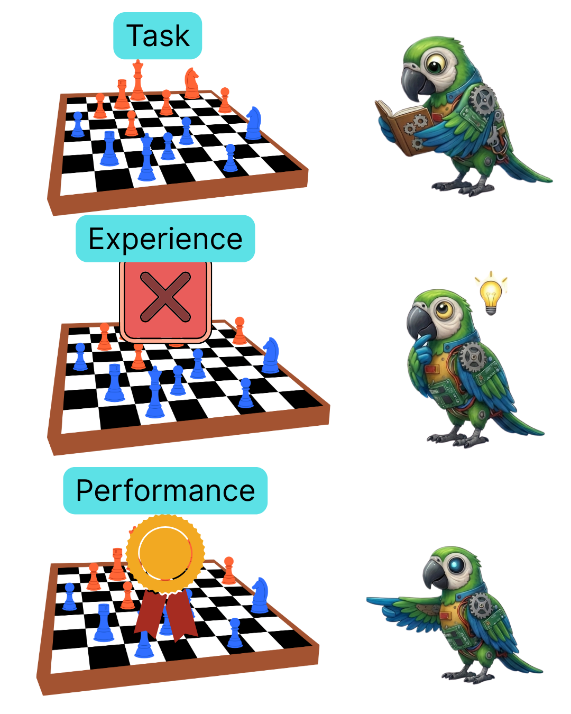

> "A computer program is said to learn from experience E
> with respect to some class of tasks T and performance measure P,
> if its performance at tasks in T, as measured by P,
> improves with experience E."
>
> — Tom Mitchell, 1997

## Chess Example

| Component           | Description              | Example (Spam Detection)             |
| ------------------- | ------------------------ | ------------------------------------ |
| **Task (T)**        | The task to be performed | Win the chess game                   |
| **Experience (E)**  | Learning data            | Playing the game over and over again |
| **Performance (P)** | Success metric           | How many games are won               |

---

# Machine Learning - Simplified

## Traditional Programming

```
Data + Rules = Output
```

Example: "If sender is not in the list AND
subject contains 'free' = SPAM"

## Machine Learning

```
Data + Output = Rules (Model)
```

Example: "Learn spam/ham patterns
from these 10,000 emails"

---

# Why Do We Need Machine Learning?

### 1. Complex Rules

Writing rules for face recognition:

```
if (eye_distance == X AND
    nose_angle == Y AND
    jaw_structure == Z AND
    ...1000 more rules...)
```

### 2. Changing Environments

- Spam techniques constantly evolve
- Updating rules is difficult
- ML models can adapt

---

# Why Do We Need Machine Learning?

### 3. Big Data

- Too much data for human analysis
  - e.g., what is the optimal move in a chess game in a given board ?
- Hard to see patterns
- ML discovers automatically

### 4. Personalization

- Separate rules for each user?
- ML adapts to each user
- Netflix, Spotify, Temu recommendations

### 5. Too Many Unknowns

- Stock price prediction
- Weather forecasting
- Traffic flow

---

# ML vs Traditional Programming

## Problem: Handwritten Digit Recognition

<div class="two-columns">
<div class="column">

### Traditional Approach

```python
def recognize_digit(image):
    if has_closed_loop_top(image):
        if has_closed_loop_bottom(image):
            return 8
        else:
            if has_tail_right(image):
                return 9
            else:
                return 6
    elif is_vertical_line(image):
        return 1
    # ... 100+ more rules
```

**Problem:** Every handwriting is different, very difficult/impossible to generalize.

</div>

<div class="column">

### ML Approach

```python
from sklearn.neural_network import MLPClassifier

# Load data
X, y = load_mnist()

# Create model
model = MLPClassifier()

# Learn!
model.fit(X, y)

# Predict
prediction = model.predict(new_image)
```

**Result:** 98%+ accuracy (magic black box a.k.a. sklearn)

</div>
</div>

---

# Practice - ML or Traditional?

Which approach is more suitable for the following problems? Why?

1. **Determining if a number is prime**
2. **Sentiment analysis from customer reviews**
3. **Playing chess**
4. **Validating required fields in a form**
5. **Face recognition from photos**

---

# Two Central Problems in ML

## What we need to solve

| Problem            | Question                                                                                                                                                                                    |
| ------------------ | ------------------------------------------------------------------------------------------------------------------------------------------------------------------------------------------- |
| **Estimation**     | We have **noisy** data about some quantity. How do we **aggregate** the data and make reliable **estimates or predictions**? How do we predict how well an estimate will do on future data? |
| **Generalization** | How do we predict well on **situations we have never seen** in our training set?                                                                                                            |

## Operational assumption

We **operationalize** generalization by assuming:

- Training data are **i.i.d.** (independent, identically distributed) from some distribution.
- **Test queries** (or future data) are drawn from the **same** distribution.

Without some such assumption, we cannot justify generalizing from **past to future**.

---

# Describing ML Problems and Solutions

## Six characteristics - three for the **problem**, three for the **solution**

| #   | Characteristic          | Meaning                                                                                                               |
| --- | ----------------------- | --------------------------------------------------------------------------------------------------------------------- |
| 1   | **Problem class**       | Nature of training data and of **queries at test time** (e.g. supervised classification, regression)                  |
| 2   | **Assumptions**         | What we assume about the **data source** or **form of the solution** (e.g. i.i.d., linear model)                      |
| 3   | **Evaluation criteria** | How we score **individual predictions** (loss) and **overall performance** (risk, test error)                         |
| 4   | **Model type**          | Will we build an **intermediate model**? How is it used to predict? (e.g. prediction rule $h(\mathbf{x}; \theta)$)    |
| 5   | **Model class**         | **Which class** of models? What **criterion** to pick one from the class? (e.g. linear, minimize training error)      |
| 6   | **Algorithm**           | **Computational process** to fit the model and/or make predictions (e.g. gradient descent, closed-form least squares) |

---

# ML Paradigms - Overview

<div class="two-columns">
<div class="column">

### 1. Supervised Learning

**Learning with a teacher**

- Training with labeled data
- Learns input-output relationship
- Classification, regression

### 2. Unsupervised Learning

**Learning without a teacher**

- Unlabeled data
- Discovers hidden structures
- Clustering, dimensionality reduction

</div>

<div class="column">

### 3. Reinforcement Learning

**Learning through trial and error**

- Learns through rewards/penalties
- Trial-and-error
- Games, robotics, language

### Other Types

- **Semi-supervised:** Few labeled + many unlabeled
- **Self-supervised:** Data generates its own labels
- **Transfer learning:** Reuse experience from related tasks
- **Density estimation:** Estimate $p(\mathbf{x})$ from unlabeled samples
- **Sequence learning:** Map input sequences to output sequences
- **Active learning:** Algorithm chooses which inputs to get labeled
</div>
</div>
</div>

---

# Supervised Learning

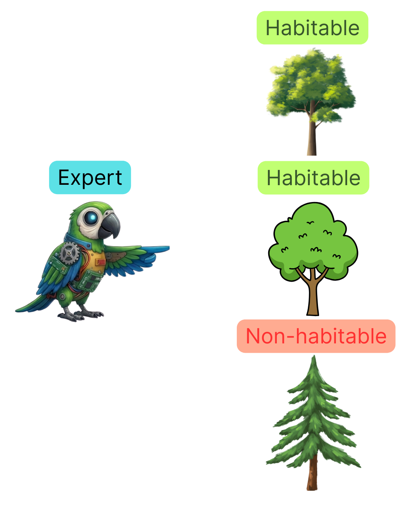

### Analogy: Student-Teacher

1. Teacher asks a question (Input)
2. Student gives an answer (Prediction)
3. Teacher gives the correct answer (Label)
4. Student learns from their mistake
5. Repeat...

### Mathematical Formulation

$$f: \mathcal{X} \rightarrow \mathcal{Y}$$

- $\mathcal{X}$: input space (e.g. $\mathbb{R}^d$); each input is a feature vector $\mathbf{x}$
- $\mathcal{Y}$: output space (e.g. $\mathbb{R}$ for regression, $\{1,\ldots,K\}$ for classification)
- $f$: unknown target function to be **approximated** from data $\mathcal{D}$

We do not know $f$; we learn an approximation from the labeled pairs in $\mathcal{D}$, so we can predict $y$ for new inputs $\mathbf{x}$.

---

# Supervised Learning

### Training Data

```
(x₁, y₁), (x₂, y₂), ..., (xₙ, yₙ)
```

| Example | Input (X)                  | Label (Y) |
| ------- | -------------------------- | --------- |
| 1       | [120m², 3 rooms, Kadikoy]  | 2.5M TL   |
| 2       | [80m², 2 rooms, Bagcilar]  | 1.2M TL   |
| 3       | [150m², 4 rooms, Besiktas] | 4.0M TL   |

### Goal

Predict $y$ for new $x$: we want the model to **generalize**—to perform well on inputs it has not seen during training.

```
[100m², 3 rooms, Uskudar] → ? TL
```

---

# Unsupervised Learning

## Learning "Without a Teacher"

### Analogy: Exploration

- No labels, only data
- System discovers structures on its own
- "What can we learn from this data?"

### Typical Questions

- How many groups does this data split into?
- Which features are important?
- Are there anomalies?
- How can we compress the data?

### Mathematical Formulation

Only inputs:
$$\{x_1, x_2, ..., x_n\}$$

**Goal:** Find the hidden structure in the data—no labels are given. We have a set of observations and want to discover groups, outliers, or a lower-dimensional representation, without a "teacher" telling us the right answer.

### Two Main Categories

1. **Clustering**: Assign data points to groups so that similar points are together and different groups are separated; no predefined labels.
2. **Dimensionality Reduction**: Represent data with fewer features while preserving as much structure as possible (e.g. for visualization or efficiency).

---

# Supervised Learning - Task Types

<div class="two-columns">
<div class="column">

## Regression

**Continuous value prediction**

### Examples

- House price prediction -> 2,450,000 TL
- Temperature prediction -> 23.5°C
- Sales volume -> 1,234 units
- Stock price -> $142.50

### Algorithms

- Linear Regression
- Polynomial Regression
- Ridge/Lasso Regression
- Random Forest Regressor
- Neural Networks

</div>

<div class="column">

## Classification

**Categorical value prediction**

### Examples

- Email -> Spam / Ham
- Disease -> Present / Absent
- Image -> Cat / Dog / Bird
- Credit -> Approved / Denied

### Algorithms

- Logistic Regression
- Decision Trees
- Random Forest Classifier
- SVM
- Neural Networks
</div>
</div>

---

# Regression in Detail

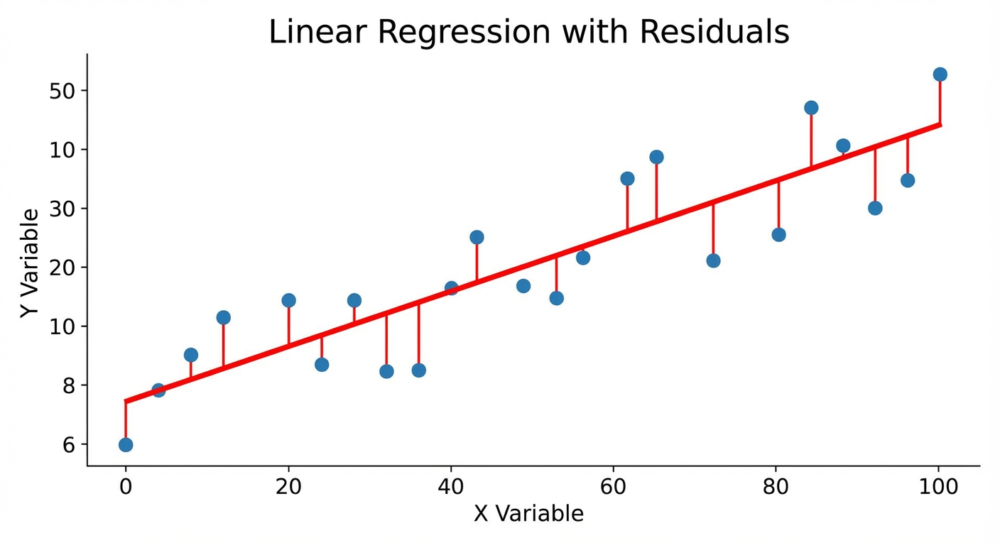

### Problem Definition

**Input**: Feature vector $\mathbf{x} = [x_1, x_2, ..., x_n]$
**Output**: Continuous value $y \in \mathbb{R}$

In **regression**, we predict a numeric value from inputs.

- Each input is described by a set of **features** (the vector $\mathbf{x}$).
- The goal is to learn a function that maps these features to a real number $y$
  - e.g., a price, a temperature, or a score.

### Simple Linear Regression

$$y = w_0 + w_1 x$$

The simplest form is **one input, one output**: we fit a straight line.

- Here $w_0$ is the **intercept** (value when $x = 0$) and $w_1$ is the **slope** (how much $y$ changes per unit change in $x$).
- Learning the model means estimating $w_0$ and $w_1$ from data so the line best fits the observed points.

---

# Regression in Detail


### Example - House Price

| m² (x) | Price TL (y) |
| ------ | ------------ |
| 100    | 1,500,000    |
| 120    | 1,800,000    |
| 150    | 2,200,000    |

### Model

$$Price = 100,000 + 15,000 \times m²$$

Here the **intercept** is 100,000 TL (base price) and the **slope** is 15,000 TL per m²: each extra square meter adds 15,000 TL to the predicted price.

**Prediction:**

- 110 m² -> 1,750,000 TL
- 130 m² -> 2,050,000 TL

---

# Practice - Simple Regression

Find the linear regression model for the following data:

| Study Hours (x) | Exam Score (y) |
| --------------- | -------------- |
| 1               | 50             |
| 2               | 60             |
| 3               | 70             |
| 4               | 80             |

**Questions:**

1. Estimate the values of $w_0$ and $w_1$ in the formula $y = w_0 + w_1 x$
2. What is the predicted score for a student who studies 5 hours?
3. Is this model realistic? What are its limitations?

---

# Classification in Detail

## Problem Definition

**Input**: Feature vector $\mathbf{x}$
**Output**: Class label $y \in \{C_1, C_2, ..., C_k\}$

In **classification**, we predict a **category** (class label) from inputs. Each input is again described by features $\mathbf{x}$. The output $y$ is one of $k$ possible classes. The model learns a decision boundary (or score per class) so we can assign new inputs to the most likely category.

---

# Classification in Detail

<div class="two-columns">
<div class="column">

## Binary Classification

**Two classes:** e.g. Positive / Negative. The model often outputs a probability for one class; we then apply a threshold (e.g. 0.5) to get a final label.

**Examples:**

- Spam / Ham
- Sick / Healthy
- Pass / Fail

**Output:**

- Probability: $P(y=1|x) = 0.87$
- Decision: "Spam" (threshold > 0.5)

</div>

<div class="column">

## Multiclass Classification

**More than two classes.** The model typically outputs a probability (or score) for each class; we predict the class with the highest probability or score.

**Examples:**

- Digit recognition: 0, 1, 2, ..., 9
- Sentiment analysis: Positive, Negative, Neutral
- Image: Cat, Dog, Bird, Fish

**Output:**

```
P(Cat) = 0.75
P(Dog) = 0.20
P(Bird) = 0.05
-----------------
Prediction: Cat
```

</div>
</div>
</div>

---

# Classification Example: Spam Detection

## Features

| Feature           | Description                 | Example Value |
| ----------------- | --------------------------- | ------------- |
| word_count        | Number of words             | 45            |
| has_free          | Contains "free" word        | 1 (yes)       |
| exclamation_count | Number of exclamation marks | 5             |
| link_count        | Number of links             | 3             |
| capital_ratio     | Ratio of capital letters    | 0.35          |
| sender_known      | Is sender known             | 0 (no)        |

## Model Decision

```python
features = [45, 1, 5, 3, 0.35, 0]
probability = model.predict_proba(features)  # [0.15, 0.85]
prediction = "SPAM" if probability[1] > 0.5 else "HAM"
# → SPAM (85% confidence)
```

---

# Unsupervised Learning

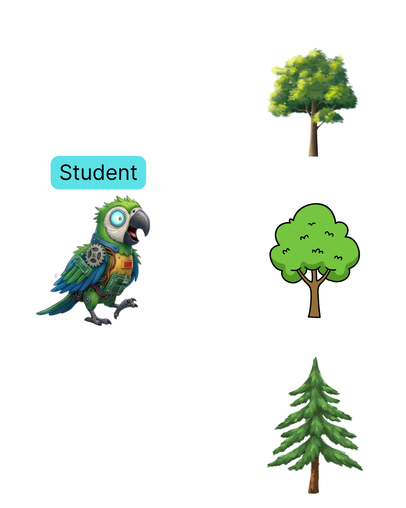

### Analogy: Exploration

1. We have data but **no labels** (no teacher to correct us)
2. We ask: "What structure is in this data?"
3. The system discovers groups, patterns, or a compact representation on its own
4. No right or wrong answer, we **explore** rather than predict a target

### Mathematical Formulation

$$\mathcal{D} = \{ \mathbf{x}_1, \mathbf{x}_2, \ldots, \mathbf{x}_n \}, \qquad \mathbf{x}_i \in \mathcal{X}$$

- $\mathcal{X}$: input space (e.g. $\mathbb{R}^d$); each $\mathbf{x}_i$ is a feature vector
- **No labels** $y_i$, we do not have a target to predict
- **Goal:** Find hidden structure: groups (clustering), low-dimensional representation (dimensionality reduction), or anomalies

We learn from the **distribution** or **geometry** of the data alone, without a performance signal tied to correct labels.

---

# Unsupervised Learning

### Data

```
x₁, x₂, ..., xₙ   (no labels yᵢ)
```

### Goal

Discover **structure** in the data—e.g. group similar customers, reduce 1000 features to 2 for visualization, or flag outliers—without using any target variable.

```
[120, 8, 2]  →  Cluster 2 (e.g. "Frequent buyers")
[1000 features]  →  [2 components] for plotting
```

### Two Main Categories

1. **Clustering**: Assign data points to groups so that similar points are together and different groups are separated; no predefined labels.
2. **Dimensionality Reduction**: Represent data with fewer features while preserving as much structure as possible (e.g. for visualization or efficiency).

---

# Clustering

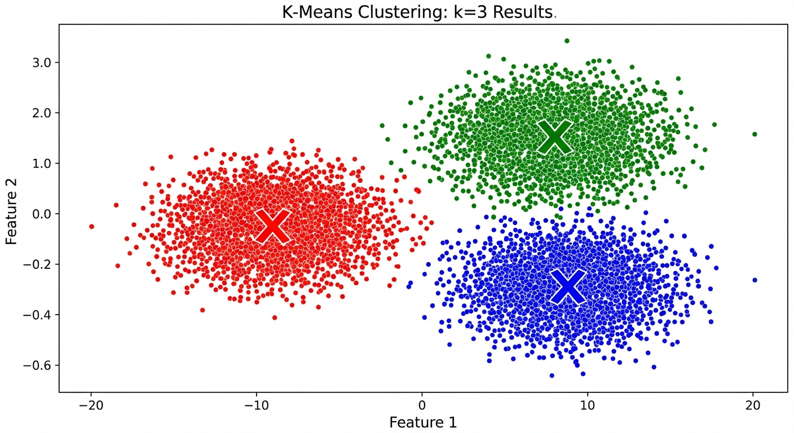

## Group Similar Examples

### K-Means Algorithm

**Idea:** Partition the data into $K$ groups by iteratively assigning each point to the nearest cluster center and then setting each center to the mean of its assigned points.

1. Choose K centers
2. Assign each point to nearest center
3. Update centers (average)
4. Repeat (stop if no change)

### Use Cases

- Customer segmentation
- Image compression
- Anomaly detection
- Gene expression analysis

---

# Clustering


### Example: Customer Segmentation

| Customer | Spending | Visits     |
| -------- | -------- | ---------- |
| A        | High     | Frequent   |
| B        | Low      | Rare       |
| C        | High     | Frequent   |
| D        | Medium   | Occasional |

**Segment 1: VIP Customers**

- High spending, frequent visits

**Segment 2: Occasional Customers**

- Medium spending, occasional

**Segment 3: Passive Customers**

- Low spending, rare

---

# Curse of Dimensionality

## Why High-Dimensional Spaces Are Tricky

<div class="two-columns">
<div class="column">

### Volume in a Thin Shell

In $D$ dimensions, fraction of **unit sphere** volume between $r = 1-\varepsilon$ and $r = 1$:

$$1 - (1-\varepsilon)^D \to 1 \quad \text{as } D \to \infty$$

- For large $D$, almost all volume is in a **thin shell** near the surface
- In 100D, ~99.99% of volume is in the outer 5% shell

### Implications

- Grid-based methods: number of cells grows **exponentially** with $D$
- "Nearest" neighbors in high-D can be far in absolute terms
- Need much more data to fill the space

</div>

<div class="column">

### Why ML Still Works

1. **Manifold hypothesis:** Real data often lies on lower-dimensional manifolds
2. **Smoothness:** Small change in input → small change in output; we don’t need to sample every cell

### Gaussian in High-D (PRML Fig. 1.23)

- Most probability mass is in a shell at radius $\approx \sqrt{D}\,\sigma$, not at the mode
- Counterintuitive; matters for sampling (Week 15)
</div>
</div>
</div>

<!-- _footer: "Bishop PRML, Section 1.4" -->

---

# Dimensionality Reduction

### Compress Data, Preserve Essence

<div class="two-columns">
<div class="column">

### Problem

With many features, data becomes sparse, computation is costly, and we cannot visualize. **Dimensionality reduction** finds a lower-dimensional representation that preserves the most important structure (and helps with the curse of dimensionality).

- Data with 1000 features
- Hard to visualize
- Slow computation
- **Curse of dimensionality**

</div>
<div class="column">

### Example: Face Recognition

**Original:** 64x64 = 4096 pixels
**After PCA:** 100 components

95% of information preserved!

### Use Cases

- Visualization (reduce to 2D/3D)
- Noise reduction
- Feature extraction
- Data compression
</div>
</div>
</div>

---

# Dimensionality Reduction

### PCA (Principal Component Analysis)

**Idea:** Find new axes (principal components) such that projecting the data onto them preserves as much variance as possible. We keep the top few components and drop the rest, so we reduce dimensions while keeping the main structure.

- Find directions that explain most variance
- Reduce dimensions but preserve information

**Why unsupervised?** We use **only the inputs** $\mathbf{x}_1, \ldots, \mathbf{x}_n$—no labels or target variable. PCA discovers structure (directions of maximum variance) from the **geometry of the data alone**, without any "correct" output to predict. That is exactly the unsupervised setting: learn from $\mathcal{D} = \{\mathbf{x}_i\}$ with no teacher.

---

# Reinforcement Learning

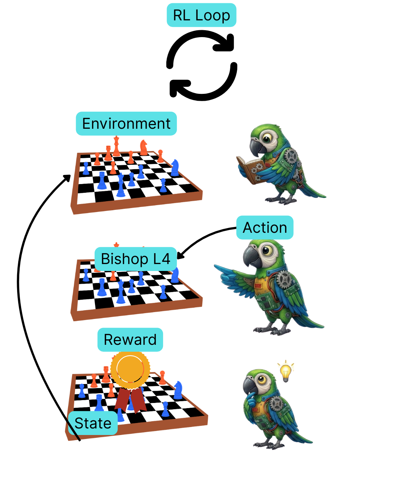

## Learning by Trial and Error

### Basic Components

The **agent** interacts with the **environment**: it observes the current **state**, chooses an **action**, and receives a **reward** (or penalty). The **policy** is the rule that maps states to actions; the goal is to learn a policy that maximizes cumulative reward over time.

| Component       | Description            |
| --------------- | ---------------------- |
| **Agent**       | Decision-making system |
| **Environment** | External world         |
| **State**       | Current situation      |
| **Action**      | Possible actions       |
| **Reward**      | Reward/penalty         |
| **Policy**      | Decision strategy      |

---

# Reinforcement Learning

### Analogy: Dog Training

1. Dog sit (action)
2. Sits -> Reward (reward +1)
3. Doesn't sit -> No reward (reward 0)
4. Dog learns to sit

### Examples

- **Games**: AlphaGo, Atari, Chess
- **Robotics**: Walking, grasping
- **Autonomous vehicles**: Driving
- **Recommendation systems**: Which content?
- **Resource management**: Energy, traffic

---

# RL Example - Playing Pac-Man

<div class="two-columns">
<div class="column">

## State

- Pac-Man position
- Ghost positions
- Pellet positions
- Remaining time

## Actions

- Up
- Down
- Left
- Right
</div>

<div class="column">

## Rewards

| Situation       | Reward |
| --------------- | ------ |
| Eat pellet      | +10    |
| Eat ghost       | +200   |
| Caught by ghost | -500   |
| Take a step     | -1     |
| Game over (won) | +1000  |

## Policy (Strategy)

Initially: Random movement
Later: "Run from ghosts, go to pellets"

</div>
</div>
</div>

---

# RL vs Supervised vs Unsupervised

## Comparison Table

| Feature       | Supervised             | Unsupervised        | Reinforcement              |
| ------------- | ---------------------- | ------------------- | -------------------------- |
| **Data**      | Labeled                | Unlabeled           | Reward signal              |
| **Goal**      | Input->Output          | Structure discovery | Maximize cumulative reward |
| **Feedback**  | Instant (each example) | None                | Delayed                    |
| **Example**   | Spam detection         | Clustering          | Game playing               |
| **Challenge** | Labeling cost          | Hard to evaluate    | Reward design              |

## When to Use Which?

- **Supervised**: Labeled data available, clear goal
- **Unsupervised**: Data available but structure unknown
- **Reinforcement**: Sequential decisions, experimentation possible

---

# Practice - Scenario Matching

Determine the most suitable ML type for each scenario:

| #   | Scenario                           | Type |
| --- | ---------------------------------- | ---- |
| 1   | Group customers by shopping habits | ?    |
| 2   | Determine if an email is spam      | ?    |
| 3   | Robot learning to navigate a room  | ?    |
| 4   | Predict house price                | ?    |
| 5   | Visualize big data in 2D           | ?    |
| 6   | Learn to play chess                | ?    |

**Options:**
Supervised (Classification / Regression), Unsupervised (Clustering / Dim. Reduction), Reinforcement

---

# Data Terms

<div class="two-columns">
<div class="column">

## Basic Terms (Formal)

| Term               | Notation / Definition                                                |
| ------------------ | -------------------------------------------------------------------- |
| **Sample**         | One pair $(\mathbf{x}_i, y_i)$ or just $\mathbf{x}_i$ (unsupervised) |
| **Feature**        | Component $x_{i,j}$ of $\mathbf{x}_i$; input dimension = $d$         |
| **Feature vector** | $\mathbf{x}_i \in \mathcal{X} \subseteq \mathbb{R}^d$                |
| **Label**          | $y_i \in \mathcal{Y}$ (target for sample $i$)                        |
| **Dataset**        | $\mathcal{D} = \{(\mathbf{x}_i, y_i)\}_{i=1}^N$; size $N$            |

## Synonyms

- Sample = instance, example, data point, observation
- Feature = attribute, variable, covariate, dimension
- Label = target, output, response, dependent variable

</div>
<div class="column">

## Example: House Dataset

$N = 2$ samples, $d = 4$ features (after encoding district):

**Sample 1:** $\mathbf{x}_1 = [120, 3, 5, \texttt{Kadikoy}]^T$, $y_1 = 2\,500\,000$

**Sample 2:** $\mathbf{x}_2 = [80, 2, 3, \texttt{Bagcilar}]^T$, $y_2 = 1\,200\,000$

Design matrix (numerical part):
$$\mathbf{X} = \begin{bmatrix} 120 & 3 & 5 \\ 80 & 2 & 3 \end{bmatrix}$$

</div>
</div>
</div>

---

# Feature Types

## Numerical (quantitative)

| Type                 | Mathematical view                               | Examples                                       |
| -------------------- | ----------------------------------------------- | ---------------------------------------------- |
| **Continuous**       | $x_j \in \mathbb{R}$ (or an interval)           | Temperature, price, distance                   |
| **Discrete / count** | $x_j \in \mathbb{Z}_{\ge 0}$ (or finite subset) | Number of rooms, age in years, count of events |

## Categorical (qualitative)

| Type        | Mathematical view                                    | Examples                              |
| ----------- | ---------------------------------------------------- | ------------------------------------- |
| **Nominal** | $x_j \in \{c_1, c_2, \ldots, c_K\}$, no order        | Color, city, ID                       |
| **Ordinal** | Same set but with order $c_1 \prec c_2 \prec \cdots$ | Education level, size (S/M/L), rating |

Many algorithms expect **numerical** inputs; categorical features are encoded

---

# Feature Transformations

## Why Transform?

Most ML algorithms expect **numerical** inputs - a feature vector $\mathbf{x} \in \mathbb{R}^d$

- Categorical values (e.g. city, color) must be turned into numbers in a way that does not introduce **false order**.
- For numerical features, **scale** matters
  - Distance-based methods (e.g. K-NN) and gradient-based optimization are sensitive to the range of each feature; putting all features on a comparable scale often speeds training and improves results.

## One-Hot Encoding

For **nominal** categories (no natural order), we represent each category $c_k$ as a **binary vector** $\mathbf{e}_k \in \{0,1\}^K$ with a 1 in position $k$ and 0 elsewhere.

- This avoids implying that one category is _larger_ than another. With $K$ categories we get $K$ binary features; only one is 1 per sample.

* **Example:** Districts Kadıköy, Başakşehir, Esenler → Kadikoy $\mapsto [1,0,0]$, Başakşehir $\mapsto [0,1,0]$, Esenler $\mapsto [0,0,1]$.

---

# Feature Transformations

## Label Encoding

For **ordinal** categories (order is meaningful), we assign consecutive integers: $c_1 \mapsto 0$, $c_2 \mapsto 1$, and so on.

- We only use this only when the order is real (e.g. education level, size S/M/L)
- For purely nominal categories, one-hot encoding is safer so the model does not treat _category 2_ as **twice** _category 1_.

## Normalization

We rescale numerical features so they lie in a common range or have similar spread. Two common choices:

- **Min-max:** $x' = \frac{x - x_{\min}}{x_{\max} - x_{\min}} \in [0, 1]$ — map the feature to $[0,1]$ using the observed min and max. Simple but sensitive to outliers.
- **Z-score:** $x' = \frac{x - \mu}{\sigma}$ — subtract the mean $\mu$ and divide by the standard deviation $\sigma$, so the transformed feature has mean 0 and variance 1. Works well when features are roughly symmetric.

---

# Hypothesis, Loss, and Risk

## Hypothesis and Hypothesis Space

- **Hypothesis** $h$: a candidate function $h : \mathcal{X} \to \mathcal{Y}$ (e.g. a specific linear model).
- **Hypothesis space** $\mathcal{H}$: set of all candidate models we consider (e.g. all linear functions).
- **Parameterized hypothesis** $h_\theta$: hypothesis determined by parameter vector $\theta$; then $\mathcal{H} = \{ h_\theta : \theta \in \Theta \}$.

## Learning algorithm

A **learning algorithm** is a **procedure** that takes a dataset $\mathcal{D}$ and (optionally) a hypothesis class $\mathcal{H}$, and **outputs** a hypothesis $h \in \mathcal{H}$:

$$\mathcal{D} \;\longrightarrow\; \text{learning algorithm}(\mathcal{H}) \;\longrightarrow\; h$$

Restricting the **size or expressiveness** of $\mathcal{H}$ is one way to improve generalization.

## Loss and Risk

- **Loss** $\ell(\hat{y}, y)$: cost of predicting $\hat{y}$ when true value is $y$.
- **Empirical risk** (training error): $\widehat{R}(\theta) = \frac{1}{N} \sum_{i=1}^{N} \ell( h_\theta(\mathbf{x}_i), y_i )$.
- **Training** = choose $\theta$ to **minimize** $\widehat{R}(\theta)$ (possibly with a regularizer).

---

# Common Loss Functions

## Classification

| Loss                | Formula                                                                                                        | Use                                                                                                                       |
| ------------------- | -------------------------------------------------------------------------------------------------------------- | ------------------------------------------------------------------------------------------------------------------------- |
| **0–1 loss**        | $\ell(g, a) = 1$ if $g \neq a$, else $0$                                                                       | Training/test **error rate** = average 0–1 loss; simple but **not smooth** (difficult to optimize for linear classifiers) |
| **Asymmetric loss** | Different cost for “predict + when −” vs “predict − when +” (e.g. medical: miss disease = 10, false alarm = 1) | When errors have different consequences; decision threshold $\neq 0.5$                                                    |

## Regression

| Loss              | Formula                   |
| ----------------- | ------------------------- |
| **Squared loss**  | $\ell(g, a) = (g - a)^2$  |
| **Absolute loss** | $\ell(g, a) = \|g - a \|$ |

**Risk** = expected loss (over data distribution). We usually **minimize** (empirical or expected) risk.

---

# Model Terms

<div class="two-columns">
<div class="column">

## Model = Parameterized Hypothesis

A **model** is a function from inputs to outputs, determined by **parameters** $\theta$:

$$h_\theta : \mathcal{X} \to \mathcal{Y}, \qquad \hat{y} = h_\theta(\mathbf{x})$$

- **Parameters** $\theta$: learned from data (e.g. weights $\mathbf{w}$, bias $w_0$).
- **Hyperparameters**: chosen before training (e.g. learning rate $\eta$, regularization $\lambda$, model complexity). **Not** optimized by the same training procedure.

## Training vs Inference

- **Training (learning):** find $\theta^* = \arg\min_\theta \widehat{R}(\theta)$ (plus optional regularization). Here **$\arg\min$** = the value of $\theta$ that minimizes the expression.
- **Inference (prediction):** for new $\mathbf{x}$, output $\hat{y} = h_{\theta^*}(\mathbf{x})$.

</div>

<div class="column">

## Example: Linear Regression

$$h_\theta(\mathbf{x}) = w_0 + w_1 x_1 + w_2 x_2, \qquad \theta = (w_0, w_1, w_2)^T$$

**Parameters (learned):** $w_0, w_1, w_2$ (e.g. 500000, 15000, 50000).

**Hyperparameters (user-set):** learning rate, max iterations, regularization $\lambda$.

**Loss (squared error):** $\ell(\hat{y}, y) = (\hat{y} - y)^2$  
**Empirical risk:** $\widehat{R}(\theta) = \frac{1}{N}\sum_{i=1}^N (h_\theta(\mathbf{x}_i) - y_i)^2$.

</div>
</div>
</div>

---

# Model Class vs Model Fitting

## Two levels of choice

| Concept                                          | Meaning                                                                                                                                              | Example                                                                               |
| ------------------------------------------------ | ---------------------------------------------------------------------------------------------------------------------------------------------------- | ------------------------------------------------------------------------------------- |
| **Model class** $\mathcal{M}$ (or $\mathcal{H}$) | **Set** of possible models (e.g. “all linear functions”, “all polynomials of degree $\le M$”)                                                        | Linear regression: $h(\mathbf{x}; \theta, \theta_0) = \theta^T \mathbf{x} + \theta_0$ |
| **Model fitting**                                | Given a class, **pick one model** — i.e. choose **parameters** $\Theta$ (e.g. $\theta$, $\theta_0$) by minimizing training error or regularized loss | Find $\theta^*, \theta_0^*$ that minimize $\widehat{R}(\theta)$                       |
| **Model selection**                              | Choosing the **model class** (or hyperparameters like $M$, $\lambda$) from several candidates; often via validation or cross-validation              | Pick $M=3$ vs $M=9$ for polynomial                                                    |

## Prediction rule

Typical flow: (1) **Fit** a model to training data (choose $\Theta$). (2) **Fix** $\Theta$ and use $h(\mathbf{x}; \Theta)$ to predict for new $\mathbf{x}$.

**Parametric** models: fixed, finite number of parameters (e.g. linear, logistic). **Non-parametric** models: complexity can grow with data (e.g. nearest neighbors, some Bayesian models).

---

# Generalization, Capacity, and Errors

## Generalization vs training

We care about how the model performs on **new** data, not just on the data we used to train. The following terms make that precise:

| Term                     | Definition                                                                                                                                       |
| ------------------------ | ------------------------------------------------------------------------------------------------------------------------------------------------ |
| **Training error**       | Empirical risk $\widehat{R}(\theta)$ on $\mathcal{D}_{\mathrm{train}}$ — what we minimize                                                        |
| **Test error**           | Error on $\mathcal{D}_{\mathrm{test}}$ — **unseen** data; what we care about                                                                     |
| **Generalization error** | **Expected risk** $R(\theta) = \mathbb{E}_{(\mathbf{x},y)}[\ell(h_\theta(\mathbf{x}), y)]$ — average loss on the true data distribution (Week 2) |
| **Generalization gap**   | Test error $-$ training error; large gap $\Rightarrow$ overfitting                                                                               |

A model that fits the training set well but does poorly on the test set has **failed to generalize**; a large generalization gap is a sign of overfitting.

---

# Generalization, Capacity, and Errors

## Model capacity and irreducible error

**Capacity** (or model complexity) is how rich the hypothesis space $\mathcal{H}$ is.

- For example, the degree $M$ of a polynomial. More capacity lets the model fit more patterns in the data, but it also increases the risk of fitting noise (overfitting).
- We try to match capacity to the amount and quality of data we have.

**Irreducible error** (Bayes error) is the part of the loss that no model can remove

- It comes from noise in the data or from unobserved factors.
- In regression it is $\mathbb{E}[\mathrm{var}[y \mid \mathbf{x}]]$
- In classification it is $1 - \max_k P(C_k \mid \mathbf{x})$.
- Our goal is to get as close as possible to this limit, not to beat it.

---

# Data Assumptions and Pitfalls

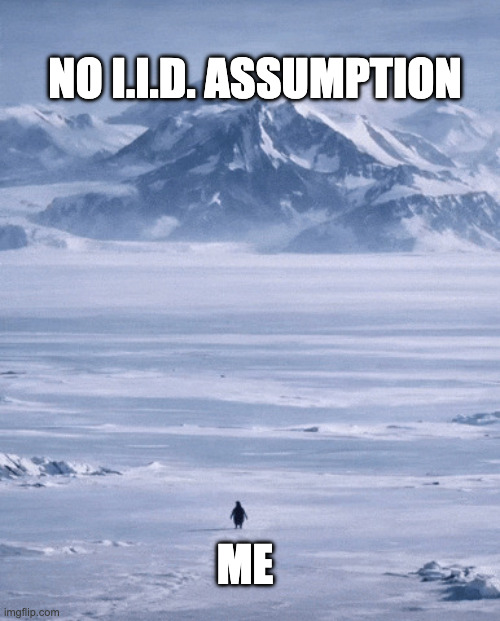

## Standard assumption: i.i.d.

Most theory and practice assumes that training pairs $(\mathbf{x}_i, y_i)$ are **independent and identically distributed** (i.i.d.) draws from a fixed (unknown) joint distribution $p(\mathbf{x}, y)$.

- **Independent** means that one sample does not depend on another

- **Identically distributed** means that every sample comes from the same $p(\mathbf{x}, y)$
  - The distribution that generates the test set should be the same as the one that generated the training set.
  - When this fails standard guarantees no longer hold and we need different methods (e.g. temporal splits, domain adaptation).

---

# Data Assumptions and Pitfalls

## Data leakage

**Data leakage** occurs when information from the **test** set influences **training** or model choice.

- The model then appears to perform better than it really will on genuinely new data.
- Common examples: normalizing features using the mean or variance of the **whole** dataset (including test), or selecting features or hyperparameters using test labels.
- The **golden rule** is that any statistic used in preprocessing or model selection must be computed only from **training** (or validation) data
- The test set must be used only once, for a final performance estimate.

---

# Training / Validation / Test Sets

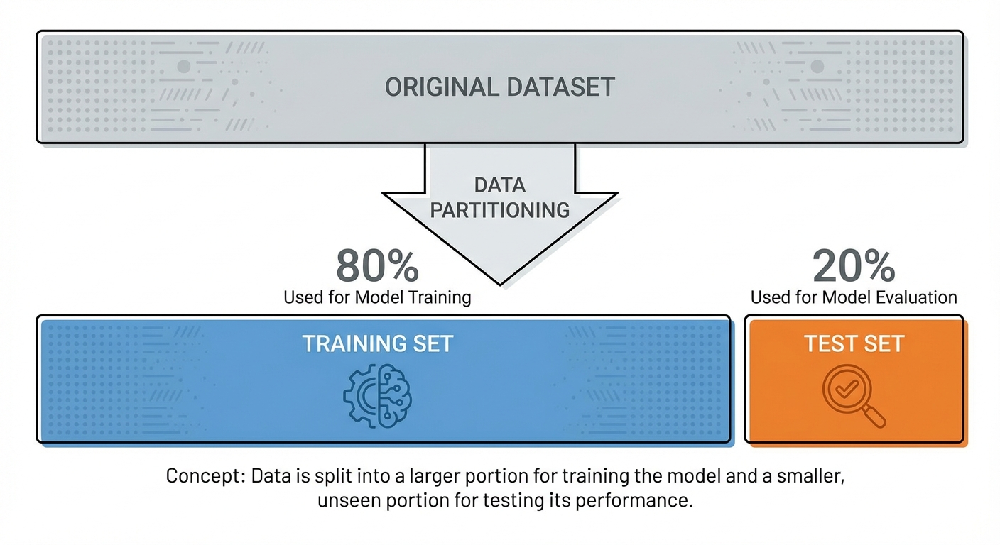

### Problem: Overfitting

If we evaluate the model only on the data it was trained on, we cannot tell whether it has **generalized** or simply **memorized**.

- A model that gets 99% accuracy on the training set but only 60% on new data has overfit; we would never see that if we did not hold out some data.

### Solution: Separate Test Set

We split the dataset and evaluate on data the model has **never seen** during training. Typically we use three disjoint sets:

$$\mathcal{D} = \mathcal{D}_{\mathrm{train}} \cup \mathcal{D}_{\mathrm{val}} \cup \mathcal{D}_{\mathrm{test}}$$

Example: 10,000 samples -> Train: 8,000 (80%), Validation: 1,000 (10%), Test: 1,000 (10%).

---

# Training / Validation / Test Sets

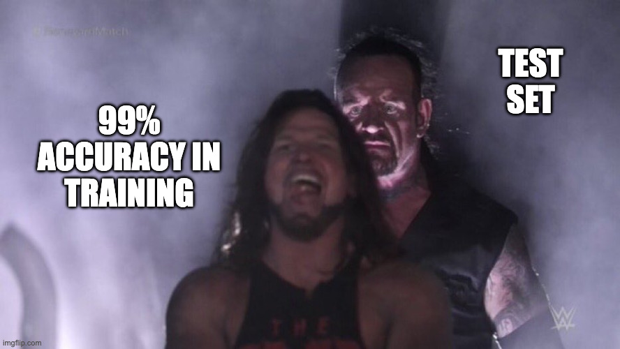

### Purpose of Each Set

| Set            | Notation                       | Purpose                                             |
| -------------- | ------------------------------ | --------------------------------------------------- |
| **Training**   | $\mathcal{D}_{\mathrm{train}}$ | Learn $\theta$ (minimize $\widehat{R}$ on this set) |
| **Validation** | $\mathcal{D}_{\mathrm{val}}$   | Choose hyperparameters, model selection             |
| **Test**       | $\mathcal{D}_{\mathrm{test}}$  | Final performance estimate — use only once          |

We **fit** the model on the training set. We use the **validation** set to choose hyperparameters (e.g. $\lambda$, model complexity) or to pick among models. The **test** set is reserved for a single, final estimate of performance; once you use it to make decisions, it is no longer an unbiased estimate.

### Important Rule

> **Never** look at the test set (or tune on it) during training or model selection. Once you do, you can no longer interpret test performance as an honest estimate of how the model will do on new data.

---

# Cross-Validation

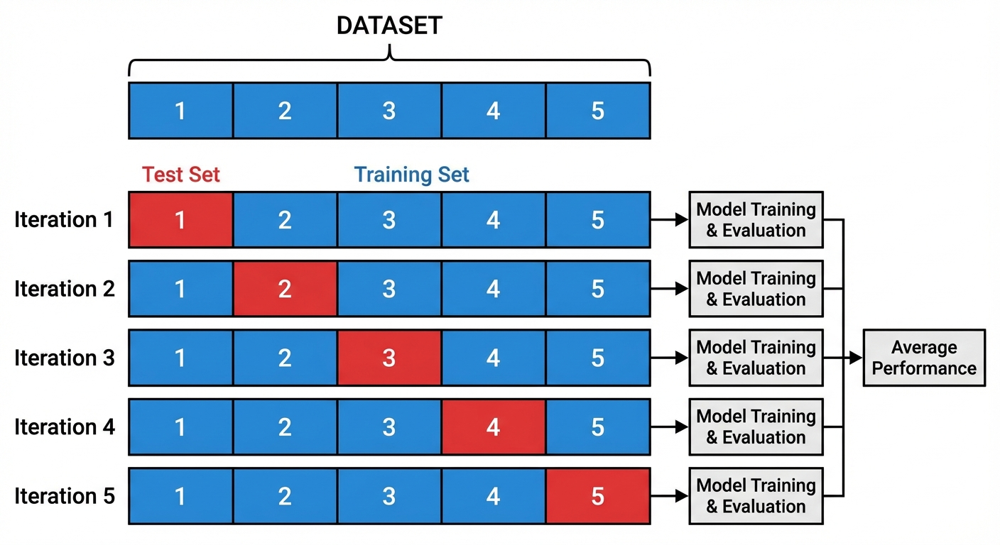

### K-Fold Cross-Validation

When data is limited, we want a **reliable estimate** of how a learning procedure will perform without burning a separate test set.

- In **K-fold cross-validation** we split the data into $K$ parts (folds) $D_1, \ldots, D_K$.
- For each $i = 1, \ldots, K$, we train on all folds except $D_i$ and compute the error $E_i$ on the withheld fold $D_i$.

* We then report the **average** $\frac{1}{K}\sum_{i=1}^K E_i$ (and optionally the standard deviation). Every sample is used for testing exactly once, so we get a stable estimate of performance.

---

# Cross-Validation


### What does CV evaluate?

Cross-validation **does not** produce a single hypothesis $h$ for deployment; it **evaluates the learning algorithm**

- How well that _procedure_ tends to do when we train on one chunk and test on another.
- Variability in the reported performance can come from which examples were in each fold and from any **randomization inside the algorithm** (e.g. random initialization)
- K-fold (or repeating train–test multiple times) helps average out that variability.

---

# Cross-Validation


### Advantages

We use **all** data for both training and testing (in different folds), so the estimate is more reliable than a single train–test split, and we can report variance (e.g. 0.85 ± 0.015) to see how stable the procedure is.

Training error alone is **not** a good guide to generalization; we use **held-out data** (validation or cross-validation) to choose among models.

---

# Evaluation Metrics — Regression

## Measuring prediction error on continuous $y$

For regression we predict a continuous $y$; we need a single number that summarizes how wrong we are on average. The **residual** for sample $i$ is $e_i = y_i - \hat{y}_i$. Common metrics:

| Metric    | Formula                                                           | Interpretation                                                       |
| --------- | ----------------------------------------------------------------- | -------------------------------------------------------------------- |
| **MSE**   | $\frac{1}{N}\sum_{i=1}^N (y_i - \hat{y}_i)^2$                     | Mean squared error; penalizes large errors more                      |
| **RMSE**  | $\sqrt{\mathrm{MSE}}$                                             | Same units as $y$; easier to interpret                               |
| **MAE**   | $\frac{1}{N}\sum_{i=1}^N \|y_i - \hat{y}_i\|$                     | Mean absolute error; robust to outliers                              |
| **$R^2$** | $1 - \frac{\sum_i (y_i - \hat{y}_i)^2}{\sum_i (y_i - \bar{y})^2}$ | Fraction of variance explained; 1 = perfect, 0 = no better than mean |

MSE is the standard loss for linear regression; RMSE is in the same units as $y$. MAE is less sensitive to outliers. $R^2$ tells us what fraction of the variance in $y$ the model explains. We often assume residuals are i.i.d. (e.g. Gaussian) when deriving estimators (Week 4).

---

# Evaluation Metrics — Classification

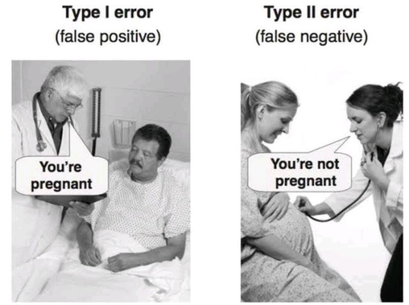

## Confusion matrix

For binary classification we count how many predictions fall into each of four cells. The **confusion matrix** summarizes this:

|              | Predicted +             | Predicted −             |
| ------------ | ----------------------- | ----------------------- |
| **Actual +** | **TP** (true positive)  | **FN** (false negative) |
| **Actual −** | **FP** (false positive) | **TN** (true negative)  |

From these we define metrics that answer different questions:

- Overall correctness (accuracy)
- Correctness among positive predictions (precision)
- Coverage of actual positives (recall)
- Balance between precision and recall (F1).

---

# Evaluation Metrics — Classification

## Derived metrics

| Metric                   | Formula                                                                                 | Meaning                                             |
| ------------------------ | --------------------------------------------------------------------------------------- | --------------------------------------------------- |
| **Accuracy**             | $\frac{\mathrm{TP}+\mathrm{TN}}{N}$                                                     | Fraction correct (misleading if classes imbalanced) |
| **Precision**            | $\frac{\mathrm{TP}}{\mathrm{TP}+\mathrm{FP}}$                                           | Of predicted +, how many are actually +             |
| **Recall (sensitivity)** | $\frac{\mathrm{TP}}{\mathrm{TP}+\mathrm{FN}}$                                           | Of actual +, how many we found                      |
| **Specificity**          | $\frac{\mathrm{TN}}{\mathrm{TN}+\mathrm{FP}}$                                           | Of actual −, how many we correctly rejected         |
| **F1 score**             | $2 \frac{\mathrm{Precision} \cdot \mathrm{Recall}}{\mathrm{Precision}+\mathrm{Recall}}$ | Harmonic mean of precision and recall               |

**Decision threshold:** Many classifiers output a probability

- We assign class + when $P(\mathrm{+}\mid\mathbf{x}) > \tau$ (e.g. $\tau=0.5$).
- Raising $\tau$ typically increases precision and lowers recall; lowering $\tau$ does the opposite

* We choose $\tau$ based on the cost of false positives vs false negatives.

---

# Overfitting vs Underfitting

<div class="two-columns">
<div class="column">

### Underfitting (High Bias)

**Problem:** Model is too simple. It does not have enough capacity to capture the true relationship in the data.

- Couldn't even learn training data
- Both train and test error high

**Symptoms:**

- Training accuracy low
- Test accuracy low

**Solutions:**

- More complex model
- More features
- Longer training

</div>

<div class="column">

### Overfitting (High Variance)

**Problem:** Model is too complex. It fits the training data (including noise) so closely that it fails on new data.

- Memorized training data
- Can't generalize to new data

**Symptoms:**

- Training accuracy very high
- Test accuracy low

**Solutions:**

- Simpler model
- More data
- Regularization
- Dropout, Early stopping
</div>
</div>
</div>

---

# Polynomial Curve Fitting

We fit a **polynomial** of order $M$ to $N$ noisy points drawn from $t = \sin(2\pi x) + \text{noise}$ (e.g. $N=10$). Changing $M$ will illustrate underfitting ($M$ too low) and overfitting ($M$ too high).

**Data:** $N$ points generated from $t = \sin(2\pi x) + \text{noise}$ (e.g. $N=10$)

### Model

$$y(x, \mathbf{w}) = w_0 + w_1 x + w_2 x^2 + \cdots + w_M x^M = \sum_{j=0}^{M} w_j x^j$$

We predict $y$ as a **polynomial in $x$** of order $M$, with weights $\mathbf{w}$. The model is **linear in $\mathbf{w}$** (so we can optimize easily) even though it is nonlinear in $x$. Higher $M$ means more flexibility (and risk of overfitting).

- **Linear in w** (linear model) even though nonlinear in $x$
- $M$ = polynomial order (model complexity)

---

# Polynomial Curve Fitting

### Error Function

$$E(\mathbf{w}) = \frac{1}{2} \sum_{n=1}^{N} \bigl\{ y(x_n, \mathbf{w}) - t_n \bigr\}^2$$

$$E_{\mathrm{RMS}} = \sqrt{2E(\mathbf{w}^*)/N}$$

We fit $\mathbf{w}$ by **minimizing** the sum of squared differences between predictions $y(x_n, \mathbf{w})$ and targets $t_n$. $E_{\mathrm{RMS}}$ is the root-mean-square error at the optimum, so we can compare across different dataset sizes $N$.

- Sum-of-squares; $E_{\mathrm{RMS}}$ comparable across different $N$

---

# Overfitting Visualization

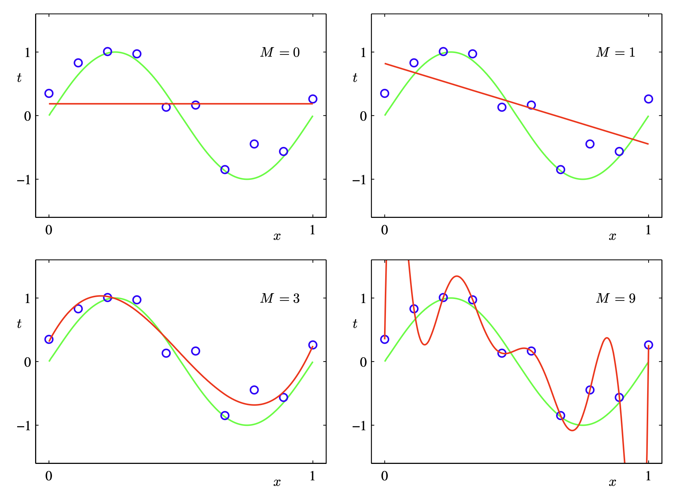

$N=10$ training points, polynomial of order $M$.

- As $M$ grows, the model fits the data more closely, **but** past a point it fits **noise** instead of the true curve.

$M = 0$ (constant)

- Underfitting and cannot capture the curve

$M = 1$ (linear)

- Still underfitting

$M = 3$

- **Good fit**, captures signal, not noise

### $M = 9$

- **Overfitting** passes through every point
- Huge oscillations between points
- **Memorized the noise**

<!-- _footer: "Bishop PRML, Figure 1.4" -->

---

# Overfitting Visualization


### Key Insight

- **Training error** decreases as $M$ increases (can always fit better)
- **Test error** has a U-shape → minimum around $M = 3\text{--}8$
- $M=9$ with 10 points: zero train error, high test error

> "The model has memorized the noise."

Use **held-out data** (test set) to choose $M$.

<!-- _footer: "Bishop PRML, Figure 1.4" -->

---

# Why Overfitting Happens

### Coefficient Explosion and Data Size

In the polynomial example, when $M$ is large and data is limited, the fitted curve passes through every point including noise.

Two things explain this: **huge coefficients** and **too few data points** for the number of parameters.

<div class="two-columns">
<div class="column">

### Coefficient Magnitudes

For high $M$, the fitted coefficients become huge (e.g. $\pm 10^6$):

- Large positive and negative values cancel to fit noise
- Small changes in $x$ → wild swings in $y$

### Heuristic

- Number of data points $\gtrsim$ (e.g. 5–10) × number of parameters
- Not a perfect rule; model complexity is subtler

</div>
<div class="column">

### More Data Helps

- **$M=9$, $N=15$:** still overfits, but less
- **$M=9$, $N=100$:** overfitting much reduced

> "The larger the data set, the more complex the model we can afford to fit."

### Takeaway

Overfitting = model too flexible for the amount of data.

- **Fixes:** use a simpler model (lower $M$), collect **more data**, or add **regularization**

</div>
</div>
</div>

---

# Regularization

Instead of lowering $M$ or waiting for more data, we can **keep** a flexible model (e.g. high $M$) and **penalize large weights** so the solution stays smooth. We add a penalty term to the error function:

$$\tilde{E}(\mathbf{w}) = \frac{1}{2} \sum_{n=1}^{N} \bigl\{ y(x_n, \mathbf{w}) - t_n \bigr\}^2 + \frac{\lambda}{2} \|\mathbf{w}\|^2$$

with $\|\mathbf{w}\|^2 = \mathbf{w}^T\mathbf{w} = w_0^2 + w_1^2 + \cdots + w_M^2$. The hyperparameter $\lambda$ controls how strongly we penalize complexity.

---

# Regularization

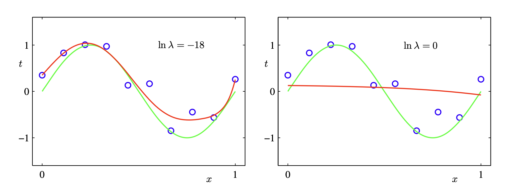

### Effect of $\lambda$

- **$\lambda$ small:** close to least squares; can still overfit
- **$\lambda$ large:** weights shrunk -> underfitting (too smooth)
- **Good $\lambda$:** balances fit and complexity (e.g. cross-validation)

### Names

- **Ridge regression** (statistics)
- **Weight decay** (neural networks)

### Intuition

"We add a penalty that says large weights are unlikely."

- Same idea will reappear as **Bayesian prior** (spoiler)
- $\lambda$ controls **effective complexity**

<!-- _footer: "Bishop PRML, Figure 1.7" -->

---

# Practice - Overfitting Analysis

Using the ideas from this section (train vs test error, underfitting vs overfitting), classify each scenario:

| #   | Train Acc | Test Acc | Status |
| --- | --------- | -------- | ------ |
| A   | 65%       | 63%      | ?      |
| B   | 99%       | 72%      | ?      |
| C   | 45%       | 43%      | ?      |
| D   | 88%       | 85%      | ?      |
| E   | 100%      | 55%      | ?      |

**Options:** Underfitting, Overfitting, Good Model

---

# Loss Functions

Training a model means **choosing parameters** so that predictions match the data as well as possible.

- We need a way to measure **how wrong** a prediction is: that is the **loss** (or error) for one example.
  - For example, in the polynomial curve-fitting example we **minimized the sum of squared differences** between predictions $y(x_n, \mathbf{w})$ and targets $t_n$—so the loss there was **squared error** per point.

* **Loss** $\ell(\hat{y}, y)$: how bad it is to predict $\hat{y}$ when the true value is $y$.
* **Training** = minimize the **average** loss over the training set (empirical risk). The choice of loss (squared, absolute, cross-entropy, etc.) defines what **best** means.

---

# Loss vs Cost

**Loss function** $L(y_i, \hat{y}_i)$ (or $\ell$): the error for a **single** example, how wrong we were on one prediction.

**Cost function** $J(\theta)$ (or empirical risk $\widehat{R}(\theta)$): the **average** loss over all training examples. We choose parameters $\theta$ to minimize $J(\theta)$:

$$J(\theta) = \frac{1}{n} \sum_{i=1}^{n} \ell(y_i, \hat{y}_i) = \frac{1}{n} \sum_{i=1}^{n} \ell\bigl(y_i,\, h_\theta(\mathbf{x}_i)\bigr)$$

**Loss** = per-example; **cost** = what we actually minimize during training. Gradient descent (and other optimizers) reduce $J(\theta)$ step by step.

---

# Common Loss Functions

## Regression (continuous $y$)

| Loss               | Formula $\ell(\hat{y}, y)$ | Notes                                                                |
| ------------------ | -------------------------- | -------------------------------------------------------------------- |
| **Squared (MSE)**  | $(\hat{y} - y)^2$          | Standard for linear regression; penalizes large errors more; smooth. |
| **Absolute (MAE)** | $\|\hat{y} - y\|$          | Robust to outliers; not differentiable at 0.                         |

## Classification (discrete $y$)

| Loss              | Idea                                                         | Use                                                                              |
| ----------------- | ------------------------------------------------------------ | -------------------------------------------------------------------------------- |
| **0–1 loss**      | 1 if $\hat{y} \neq y$, else 0                                | Error rate; not smooth, hard to optimize with gradient methods.                  |
| **Cross-entropy** | $-\sum_k y_k \log \hat{p}_k$ (for probabilities $\hat{p}_k$) | Standard for classification; smooth; used with logistic regression, neural nets. |

We will see these again when we formalize **hypothesis space**, **risk**, and **optimization** (Mathematical Foundations and later weeks).

---

# Mathematical Foundations

## Scalars, Vectors, Matrices

| Symbol                     | Meaning                                            | Example                                                          |
| -------------------------- | -------------------------------------------------- | ---------------------------------------------------------------- |
| $x$, $y$                   | **Scalars** (single numbers)                       | $x = 3$, $y = 2.5$                                               |
| $\mathbf{x}$, $\mathbf{w}$ | **Vectors** (bold lowercase)                       | $\mathbf{x} = [x_1, x_2, \ldots, x_d]^T \in \mathbb{R}^d$        |
| $\mathbf{X}$               | **Matrix** (bold uppercase)                        | $\mathbf{X} \in \mathbb{R}^{N \times d}$ — $N$ rows, $d$ columns |
| $x_i$ or $x^{(i)}$         | $i$-th component of $\mathbf{x}$, or $i$-th sample | Context-dependent                                                |

## Conventions in This Course

- **$N$** = number of samples (data points)
- **$d$** = number of features (input dimension)
- **$n$** sometimes used for sample index; **$j$** for feature index
- Vectors are **column vectors** by default: $\mathbf{x} = (x_1, \ldots, x_d)^T$

---

# Spaces and Dataset

## Input and Output Spaces

- **Input space** $\mathcal{X}$: set of all possible inputs
  - Regression: often $\mathcal{X} \subseteq \mathbb{R}^d$
  - Classification: same, but **output** is discrete
- **Output space** $\mathcal{Y}$:
  - **Regression:** $\mathcal{Y} \subseteq \mathbb{R}$ (continuous)
  - **Classification:** $\mathcal{Y} = \{1, 2, \ldots, K\}$ or class labels

## Dataset (Supervised)

**Training set** — a finite collection of input–output pairs:

$$\mathcal{D} = \bigl\{ (\mathbf{x}_1, y_1), (\mathbf{x}_2, y_2), \ldots, (\mathbf{x}_N, y_N) \bigr\}$$

- Each $\mathbf{x}_i \in \mathcal{X}$ is a **feature vector** (one sample)
- Each $y_i \in \mathcal{Y}$ is the **label** (target) for $\mathbf{x}_i$
- **Design matrix:** stack inputs as rows: $\mathbf{X} = [\mathbf{x}_1^T; \ldots; \mathbf{x}_N^T] \in \mathbb{R}^{N \times d}$

---

# Feature Map

## Real-world inputs are rarely vectors

- Inputs are often **songs, images, text, persons** - not vectors of numbers.
- We define a **feature map** $\phi$ that maps each raw input to a vector in $\mathbb{R}^d$:

$$\phi : \text{(raw input)} \to \mathbb{R}^d$$

- **Examples:** height/weight of a person; pixel intensities of an image; TF–IDF of a document; **amount of bass** in a song.
- The **model** then sees $\mathbf{x} = \phi(\text{raw input})$; we often write $h(\mathbf{x})$ and omit $\phi$, but it is almost always there in practice.
- **Feature engineering** = designing a good $\phi$ (and the set of features) for the task.

---

# Bias-Variance Tradeoff

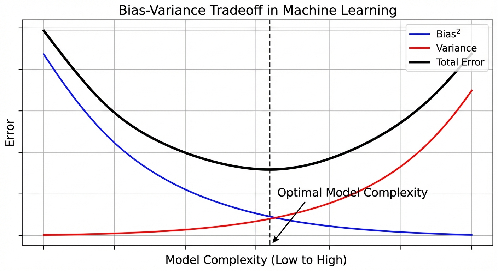

The total error of a model can be split into **bias** and **variance** (plus noise). Choosing model complexity is a tradeoff:

- Simpler models tend to have high bias and low variance
- More complex models tend to have low bias but high variance.

We want **balance**

---

# Bias-Variance Tradeoff

<div class="two-columns">
<div class="column">

### Bias

**Bias** is error due to the model **oversimplifying** reality.

- Systematically wrong because the model class cannot represent the true relationship (e.g. a straight line when the true curve is wavy).

**High bias:** The model is too simple and misses important patterns.

- Both training and test error stay high (underfitting).

**Low bias:** The model is flexible enough to capture the true structure

- We need enough capacity without overfitting.

</div>
<div class="column">

### Variance

**Variance** is error due to the model being **too sensitive** to the particular training set

- If we retrain on a different sample, we get a very different model and different predictions.

**High variance:** Different training sets give very different fits

- The model is learning noise and overfitting.

**Low variance:** The model is stable

- Small changes in the training data do not change the learned model much.

</div>
</div>

---

# Bias-Variance Tradeoff

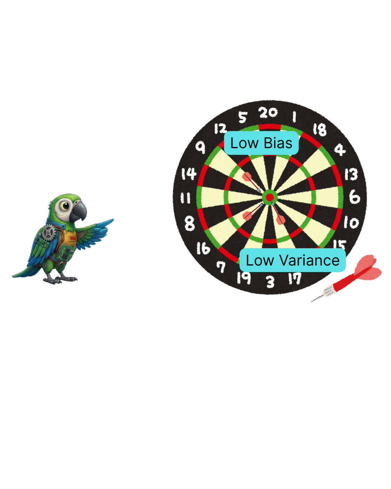

Think of the **bullseye** as the true prediction $f(x)$ and each **throw** as a model $\hat{f}$ trained on a different random sample.

- **Bias** is the average distance of the throws from the center (systematic error).

* **Variance** is how spread out the throws are (sensitivity to the training set).

We want **low bias** and **low variance**

---

# Bias-Variance Tradeoff


### Low Bias, Low Variance

**Ideal.** Predictions are centered on the truth and consistent across training sets, model has enough capacity and does not overfit.

### High Bias, Low Variance

**Consistent but wrong.** The model is stable (low variance) but systematically off (high bias). **Underfitting**.

### Low Bias, High Variance

**Right on average, but unstable.** Averaged over many training sets we would be correct (low bias), but each individual model is scattered (high variance). **Overfitting**.

### High Bias, High Variance

**Worst case.** Predictions are both off-center and highly variable (e.g. a very flexible model with too little data). We get neither stability nor accuracy.

---

# Bias-Variance Tradeoff


### Effect of Model Complexity

As we move from **simple** to **complex** models: **bias** tends to go down, while **variance** tends to go up. So we cannot simply _add more capacity_ without cost.

### Sweet Spot

The **best generalization** usually comes from a model that balances bias and variance—not too simple (high bias), not too complex (high variance). We find this **sweet spot** in practice using a validation set or cross-validation to choose complexity (e.g. $M$, $\lambda$).

---

<!-- _footer: "" -->
<!-- _header: "" -->
<!-- _paginate: false -->

<style scoped>
p { text-align: center}
h1 {text-align: center; font-size: 56px}
</style>

# Course Project

---

# Course Projects Details

## 3 Projects — 30% of Grade (One Problem, Three Aspects)

**You choose one real-world problem and one dataset**

- The **same** problem and dataset are used across all three projects

* Each project focuses on a **different aspect** of the ML pipeline.
* Together, the three deliverables form a **complete, real-world ML execution** from data understanding to modeling and evaluation.

Pick a problem you care about, use a dataset you create or adapt, or put a new twist on an existing dataset.

- Standard public datasets are allowed only if you clearly customize the problem or add a localized angle.

There will be **3 deliverables** (P1, P2, P3), each focusing on a different aspect of your chosen problem:

| #   | Project                  | Due     | Focus                                                          |
| --- | ------------------------ | ------- | -------------------------------------------------------------- |
| P1  | Problem & EDA            | Week 6  | Problem formulation, data cleaning, exploration, visualization |
| P2  | Regression               | Week 10 | Linear/polynomial regression, feature engineering, evaluation  |
| P3  | Classification or Beyond | Week 15 | Classification/Regression, model selection, report             |

---

# Course Projects Details

## Submission Format

- Jupyter Notebook (.ipynb) per project
- GitHub repository (one repo for all three)
- README.md with problem description, dataset source, and how the three projects connect
- Clean, commented code

* Working prototype in the end

---

<!-- _class: lead -->

# Thank You!

## Contact Information

- **Email:** ekrem.cetinkaya@yildiz.edu.tr
- **Office Hours:** Wednesday 13:30-15:30 - Room C-120
- **Book a slot before coming:** [Booking Link](https://calendar.app.google/fog6DPBGJH2QpHVw8)
- **Course Repository:** [GitHub](https://github.com/ekremcet/yzm2011-introduction-to-machine-learning)

## Next Week

**Week 2:** Probability Theory and Statistics Fundamentals
