# YZM2011

## Introduction to Machine Learning

### Week 10: Support Vector Machines

**Instructor:** Ekrem Çetinkaya
**Date:** 28.04.2026

---

# Today's Agenda

<div class="two-columns">
<div class="column">

## Maximum Margin SVM

- Why margin maximization works
- Geometric and functional margins
- Hard margin: primal QP formulation
- Lagrangian duality - the dual problem
- KKT conditions and support vectors
- Sparsity: why only support vectors matter
- Soft margin: slack variables and $C$

</div>
<div class="column">

## Kernels and Extensions

- Dual representations and kernel trick
- Mercer's theorem: valid kernels
- Linear, polynomial, and RBF kernels
- Effect of $C$ and $\gamma$ on boundaries
- Hyperparameter tuning with grid search
- Multi-class SVMs: OvR and OvO
- Support Vector Regression (SVR)
- When to use SVM vs other classifiers

</div>
</div>

---

# Week 9 Connection

Last week we asked: **what does each class look like?**

- LDA and Naive Bayes both build a statistical portrait of malignant and benign tumors (sizes, shapes, spread) and then ask which portrait fits a new patient better. The boundary falls out as a consequence of those portraits.

This week we throw that whole approach away. We ask a different question: **where is the best line to draw between the two groups?**

- No portraits, no statistical models of what each class looks like, just: draw a line.

Both approaches end up with a linear classifier, but their criteria for choosing the line are completely different:

- **LDA:** draw the line where the two class models are equally likely (shaped by Gaussian assumptions)
- **SVM:** draw the line with the **widest possible gap** on both sides - push it as far as possible from every training point

The SVM's philosophy is purely geometric. A wide gap means the boundary is far away from everyone, so a new patient whose measurements are slightly off from the training data is still very likely to land on the right side.

- This "safety margin" idea is simple and works surprisingly well in practice.

---

# Running Example - Breast Cancer Dataset

We will use the **Wisconsin Breast Cancer dataset** throughout today to ground every concept in a real classification problem.

```python
from sklearn.datasets import load_breast_cancer
from sklearn.model_selection import train_test_split
from sklearn.preprocessing import StandardScaler

bc = load_breast_cancer()
X, y = bc.data, bc.target
feature_names = bc.feature_names
class_names   = bc.target_names  # ['malignant', 'benign']

X_train, X_test, y_train, y_test = train_test_split(
    X, y, test_size=0.2, random_state=42
)

# SVM is distance-based: features must be scaled
scaler = StandardScaler()
X_train_s = scaler.fit_transform(X_train)
X_test_s  = scaler.transform(X_test)

print(f"Training: {X_train_s.shape}  |  Test: {X_test_s.shape}")
# Training: (455, 30)  |  Test: (114, 30)
```

---

# What the Data Actually Looks Like

Each row is a digitised image of a fine needle biopsy from a breast mass. A pathologist measured properties of the cell nuclei visible in the image. The 30 features are grouped into three sets of 10: **mean**, **standard error**, and **worst** (largest) values across the nuclei in the image.

```python
import pandas as pd
from sklearn.datasets import load_breast_cancer

bc = load_breast_cancer()
df = pd.DataFrame(bc.data, columns=bc.feature_names)
df["diagnosis"] = ["malignant" if t == 0 else "benign" for t in bc.target]

cols = ["mean radius", "mean texture", "mean perimeter", "mean area",
        "mean concavity", "worst radius", "diagnosis"]
print(df[cols].head(6).to_string(index=False))
```

**569 patients - 357 benign (63%), 212 malignant (37%).** The task: predict malignant or benign from the 30 measurements.

---

# Sample Rows from the Dataset

```
 mean radius  mean texture  mean perimeter  mean area  mean concavity  worst radius  diagnosis
       17.99         10.38          122.80     1001.0          0.3001         25.38  malignant
       20.57         17.77          132.90     1326.0          0.0869         24.99  malignant
       19.69         21.25          130.00     1203.0          0.1974         23.57  malignant
       11.42         20.38           77.58      386.1          0.1279         14.91  malignant
       20.29         14.34          135.10     1297.0          0.1980         22.54  malignant
       12.45         15.70           82.57      477.1          0.0275         15.47     benign
```

Even from these 6 rows the pattern is visible: malignant cases (rows 1–5) have larger radii (~17–20 vs ~12), larger perimeters and areas, and higher concavity. The last row - benign - is noticeably smaller and smoother.

- A linear boundary in feature space should be able to separate these two populations, which is exactly what we'll see when we train the SVM.

---

# Breast Cancer - Feature Distributions by Class

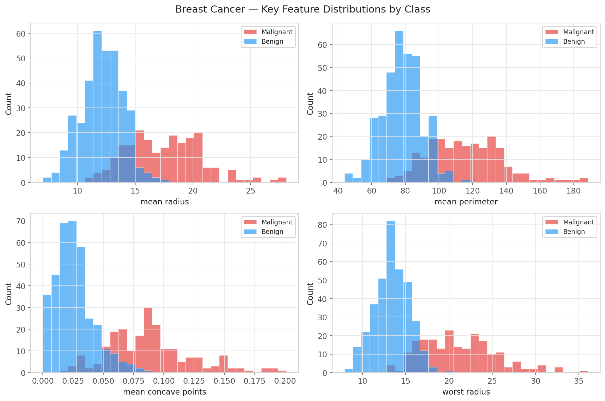

---

# Breast Cancer - PCA Projection

Since 30 features cannot be plotted directly, we project the data to 2D with PCA throughout this lecture to visualise decision boundaries. The projection keeps about 44% of the total variance - enough to see the structure.

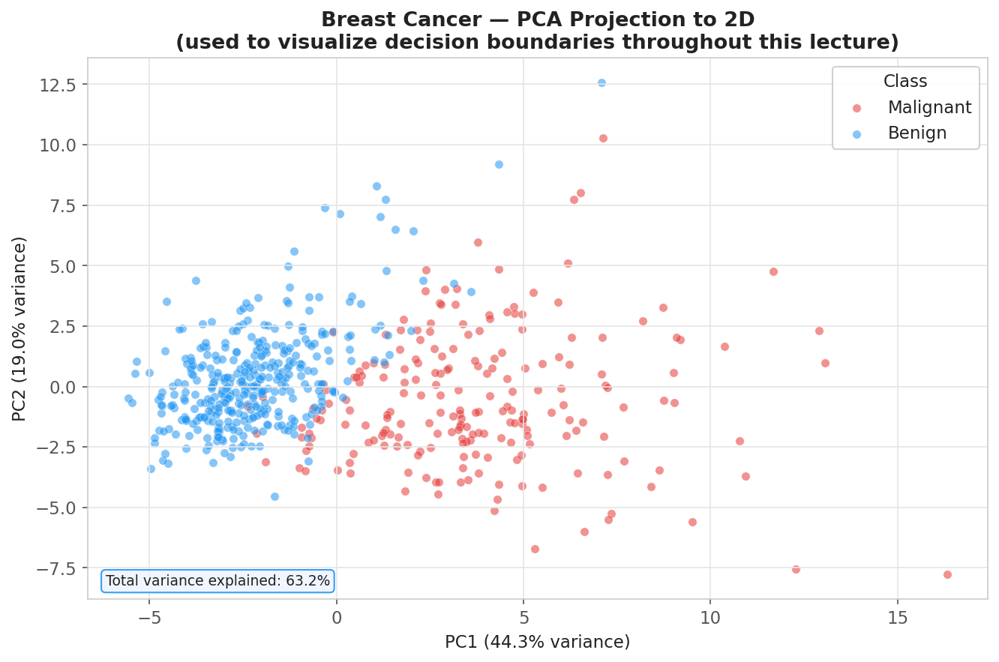

---

# Multiple Separating Hyperplanes

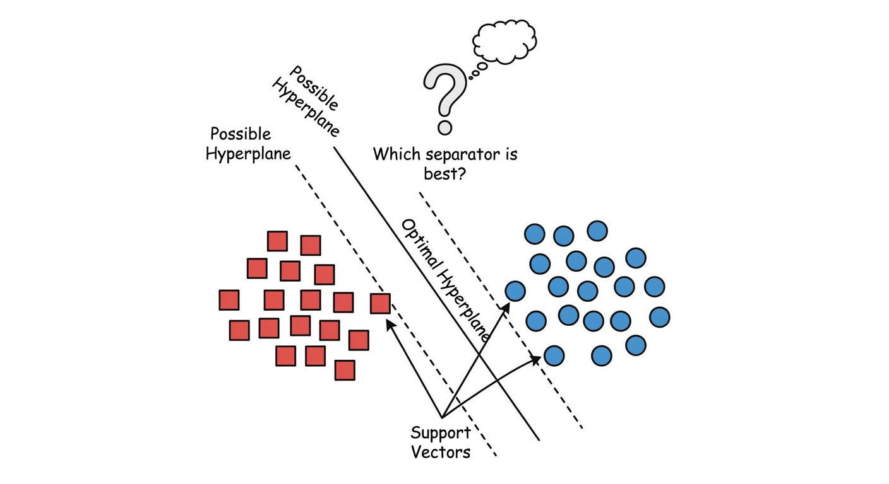

---

# Why Maximum Margin?

Here is the core problem: for perfectly separable data, **infinitely many lines all get 100% training accuracy**. The perceptron algorithm from the 1950s just picks whichever one it stumbles upon first. That feels unsatisfying, surely some boundaries are better than others.

The question is: **which one will hold up on data it has never seen?**

Think of it this way. If you draw the line right next to a few training points, you're living dangerously. A patient whose measurements are slightly different from those boundary cases will land on the wrong side. A small measurement error flips the prediction.

If you draw the line as far as possible from every training point (leaving a wide gap on both sides) you're being cautious. New patients have to be far off before you'll misclassify them.

**SVM's answer:** choose the **unique** hyperplane that maximizes the margin, the perpendicular gap between the boundary and the nearest training point on either side. Widest gap, most robust classifier.

---

# The Separating Hyperplane Problem

Before we can maximize a margin, we need to agree on what a boundary looks like in math.

A **hyperplane** is just a flat surface that cuts a space exactly in half. In 2D it's a line. In 3D it's a plane. In the Breast Cancer feature space with 30 features, it's a 29-dimensional flat subspace. In every case, it's defined by two things:

- A **direction** $\mathbf{w}$ - a vector pointing perpendicular to the surface (think of it as "which way does the boundary face?")
- An **offset** $b$ - how far the boundary is from the origin

Every point $\mathbf{x}$ in the feature space produces a number $y(\mathbf{x}) = \mathbf{w}^T\mathbf{x} + b$. If that number is positive, the point is on one side. If negative, the other side. If exactly zero, it's on the boundary itself. Classification is just reading the sign:

$$y(\mathbf{x}) = \mathbf{w}^T\boldsymbol{\phi}(\mathbf{x}) + b = 0, \qquad \hat{t} = \text{sign}(y(\mathbf{x}))$$

We use labels $t_n \in \{-1, +1\}$ (not 0/1) so that **correct classification** means $t_n$ and $y(\mathbf{x}_n)$ have the same sign - i.e., $t_n \cdot y(\mathbf{x}_n) > 0$.

---

# The Separating Hyperplane - Geometry

A hyperplane is always one dimension lower than the space it lives in:

| Feature space            | Hyperplane                |
| ------------------------ | ------------------------- |
| $D = 2$                  | A line                    |
| $D = 3$                  | A plane                   |
| $D = 30$ (Breast Cancer) | A 29-dimensional subspace |

Points on one side get label $+1$ (benign), points on the other get $-1$ (malignant). The **margin** is the distance from the boundary to the nearest training point on either side - the gap we want to maximise.

---

# The Margin and Support Vectors

The margin is the perpendicular distance from the boundary to the nearest training point on either side. Maximizing this gap is our goal.

Here is a smart move:

- If you double $\mathbf{w}$ and $b$, the boundary doesn't move as you haven't changed anything geometrically, just the scale of the numbers.
- We can use this freedom to pick a convenient scale.
- **We choose the scale so that the closest training point satisfies $t_n y(\mathbf{x}_n) = 1$ exactly**; not 2, not 0.5, exactly 1.
- Once we lock in that choice, every training point must satisfy:

$$t_n(\mathbf{w}^T\mathbf{x}_n + b) \geq 1 \quad \forall n$$

With this convention, a bit of geometry shows that the margin width is exactly $\frac{1}{\|\mathbf{w}\|}$.

- Maximizing the margin means **maximizing $\frac{1}{\|\mathbf{w}\|}$** or equivalently, **minimizing $\|\mathbf{w}\|$**.

Points where equality holds (the training points sitting exactly on the margin boundary) are called **support vectors**.

- Every other training point is further away from the boundary and, crucially, has no influence on where the boundary sits
- Remove them from the training set and nothing would change.
- Only the support vectors matter.

---

# The Margin

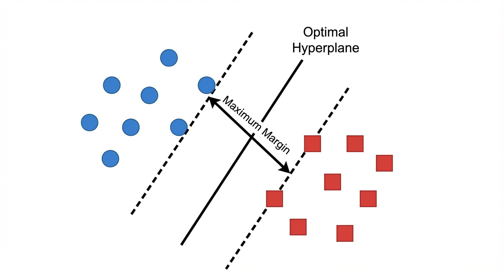

---

# Hard Margin SVM - Primal Formulation

Our goal is to **find the boundary that leaves the widest gap, where every training point stays on the correct side.**

Maximizing the gap $\frac{1}{\|\mathbf{w}\|}$ is equivalent to minimizing $\|\mathbf{w}\|^2$ (squaring makes the math cleaner; the $\frac{1}{2}$ is just there so the derivative works out easily):

$$\min_{\mathbf{w}, b} \;\frac{1}{2}\|\mathbf{w}\|^2 \quad \text{subject to} \quad t_n(\mathbf{w}^T\mathbf{x}_n + b) \geq 1, \quad n = 1, \ldots, N$$

This is called a **quadratic program** (QP)

- The thing we're minimizing is quadratic, and the constraints are linear.
- QPs are well-studied, and they have one very nice property: there are no local minima to get stuck in. There is exactly one answer, and solvers can find it.

This is the **hard margin** SVM

- **Hard** because we don't allow any training point to violate the margin at all. For that to work, the data must be perfectly linearly separable.

In practice, real data is almost never perfectly separable. But before we handle messy data, let's understand the clean case as it will give us all the structure we need.

---

# Lagrangian Formulation - Deriving the Dual

We have an optimization problem with one constraint per training point which is 455 constraints for our Breast Cancer dataset. Solving it head-on means figuring out which constraints are tight at the optimum and which are loose.

- With $N$ constraints, that's up to $2^N$ combinations to check. Completely impractical.

**The Lagrange multiplier trick:** instead of enforcing each constraint separately, attach a _price tag_ $\alpha_n \geq 0$ to it.

- If a constraint is violated, you pay that _price_ in the objective. Fold all of this into a single function called the Lagrangian:

$$\mathcal{L}(\mathbf{w}, b, \boldsymbol{\alpha}) = \frac{1}{2}\|\mathbf{w}\|^2 - \sum_{n=1}^{N} \alpha_n \left[t_n(\mathbf{w}^T\mathbf{x}_n + b) - 1\right]$$

Now we play a minimax game: minimize over $(\mathbf{w}, b)$ (find the best boundary), while maximizing over $\boldsymbol{\alpha} \geq 0$ (make the constraints as expensive as possible to violate).

- At the solution, constraints are exactly satisfied and the _price tags_ tell us which points are sitting on the margin.

---

# Lagrangian - Stationarity Conditions

To find the minimum over $(\mathbf{w}, b)$, we set derivatives to zero:

$$\frac{\partial \mathcal{L}}{\partial \mathbf{w}} = 0 \;\Rightarrow\; \mathbf{w} = \sum_{n=1}^{N} \alpha_n t_n \mathbf{x}_n$$

$$\frac{\partial \mathcal{L}}{\partial b} = 0 \;\Rightarrow\; \sum_{n=1}^{N} \alpha_n t_n = 0$$

**What the first equation says:** the optimal boundary direction $\mathbf{w}$ is nothing more than a weighted sum of the training data points themselves.

- Each point $\mathbf{x}_n$ contributes with weight $\alpha_n t_n$, its _price tag_ times its class label.
- The solution _lives in the data_, regardless of how many features there are.

And remember, most $\alpha_n$ will be zero. Only the support vectors (points on the margin boundary) have nonzero $\alpha_n$.

- So in reality, $\mathbf{w}$ is a weighted sum of just a handful of training points.

Now we substitute these conditions back into $\mathcal{L}$. All the explicit $\mathbf{w}$ and $b$ terms cancel.

---

# The Dual Problem

After substituting the stationarity conditions back in, $\mathbf{w}$ and $b$ disappear entirely. The problem is now expressed purely in terms of the price tags $\alpha_n$.

- The training data appears only as **pairwise dot products** $\mathbf{x}_n^T \mathbf{x}_m$ (how similar are two training points?). This is the **dual problem**:

$$\widetilde{\mathcal{L}}(\boldsymbol{\alpha}) = \sum_{n=1}^{N} \alpha_n - \frac{1}{2}\sum_{n=1}^{N}\sum_{m=1}^{N} \alpha_n \alpha_m t_n t_m \mathbf{x}_n^T\mathbf{x}_m$$

$$\max_{\boldsymbol{\alpha}} \;\widetilde{\mathcal{L}}(\boldsymbol{\alpha}) \quad \text{subject to} \quad \alpha_n \geq 0, \quad \sum_{n=1}^{N} \alpha_n t_n = 0$$

Why does this reformulation matter? Three reasons:

1. **Gateway to the kernel trick:** the data appears only as dot products $\mathbf{x}_n^T \mathbf{x}_m$. We can replace each dot product with a function $k(\mathbf{x}_n, \mathbf{x}_m)$ that implicitly computes dot products in a much richer feature space - without ever going there explicitly. More on this shortly.

2. **The solution is sparse:** most $\alpha_n$ will be zero at the optimum. Only the support vectors (the training points that sit on the margin boundary) have $\alpha_n > 0$. Everything else plays no role.

3. **High-dimensional friendly:** the primal has $D+1$ unknowns; the dual has $N$. When you have 30 features and 455 training points, both are manageable. In genomics with 20,000 features and 200 samples, the dual is far smaller.

---

# The Lagrangian Journey

| Step                 | What happens                                                         |
| -------------------- | -------------------------------------------------------------------- |
| **Original problem** | Minimize $\|\mathbf{w}\|^2$ subject to 455 margin constraints        |
| **Lagrangian**       | Fold every constraint into the objective with a price tag $\alpha_n$ |
| **Stationarity**     | $\mathbf{w}$ turns out to be a weighted sum of training points       |
| **Dual problem**     | Rewrite entirely in terms of $\alpha_n$ and pairwise dot products    |
| **Payoff**           | Dot products → kernel trick; most $\alpha_n = 0$ → sparsity          |

The story is: _we turned a constrained geometry problem into a problem over price tags, and in doing so discovered that only a handful of training points actually matter._

---

# KKT Conditions and Support Vectors

After solving the dual, the optimality conditions, called **KKT conditions**, tell us something simple. For each training point, exactly one of two things is true:

- Either the point is **comfortably away from the margin**, meaning it's correctly classified with room to spare. Its price tag $\alpha_n = 0$. It has no influence on the boundary whatsoever. You could delete it from the training set and the SVM would produce the exact same answer.

- Or the point is **sitting right on the margin boundary**. Its price tag $\alpha_n > 0$. This point is a **support vector** as it literally supports the boundary in place. Move it and the boundary moves.

$\alpha_n$ and the margin gap can't both be nonzero at the same time rule is called **complementary slackness**. It's the key to why SVMs are sparse: only the hardest training examples (the ones closest to the boundary) matter.

Prediction for a new patient uses only the support vectors:

$$y(\mathbf{x}) = \sum_{n \in \text{SV}} \alpha_n t_n k(\mathbf{x}_n, \mathbf{x}) + b$$

The bias $b$ is recovered from any support vector (each must satisfy $t_s y(\mathbf{x}_s) = 1$).

---

# Sparsity - The Defining Advantage

SVM is an **instance-based** model: the prediction formula literally computes a similarity between the new input and stored training examples.

- To make a prediction, those examples must stay in memory after training. This makes SVM fundamentally different from logistic regression or neural networks, which bake everything into a fixed weight vector and then discard the training data entirely.

The natural comparison is with **k-nearest neighbours (k-NN)** (another instance-based method) which must store and search through _all N_ training points at prediction time.

SVM is far more efficient: the kernel trick combined with sparsity means the only training points you need to keep are the **support vectors**. Remove every other training point and the decision boundary wouldn't change at all.

| Model                                | Training data needed at prediction time          |
| ------------------------------------ | ------------------------------------------------ |
| Logistic regression / neural network | None - parameters only                           |
| **k-NN**                             | **All N training points**                        |
| **SVM**                              | **Support vectors only (~6% for Breast Cancer)** |

**Insight:** support vectors are the _hardest_ examples, the ones the classifier was least sure about. In medical diagnosis, those borderline cases are often the most clinically interesting.

---

# Verifying Support Vector Sparsity

Let's check this claim on the Breast Cancer dataset. With a very large $C$ we approximate the hard margin and we can inspect exactly how many training points become support vectors.

```python
from sklearn.svm import SVC

svm_hard = SVC(kernel='linear', C=1e6)   # approximate hard margin
svm_hard.fit(X_train_s, y_train)

print(f"Number of support vectors: {svm_hard.n_support_}")
print(f"Support vectors per class: {svm_hard.support_vectors_.shape}")
# e.g. [12  15] → 27 SVs out of 455 training points (~6%)
```

Only ~6% of training points determine the boundary. The other 94% are irrelevant to the final model.

---

# Support Vector Count vs C - Breast Cancer

As $C$ increases, the margin narrows and fewer points violate it so the number of support vectors decreases. But beyond a point, test accuracy stops improving and the training–test gap widens.

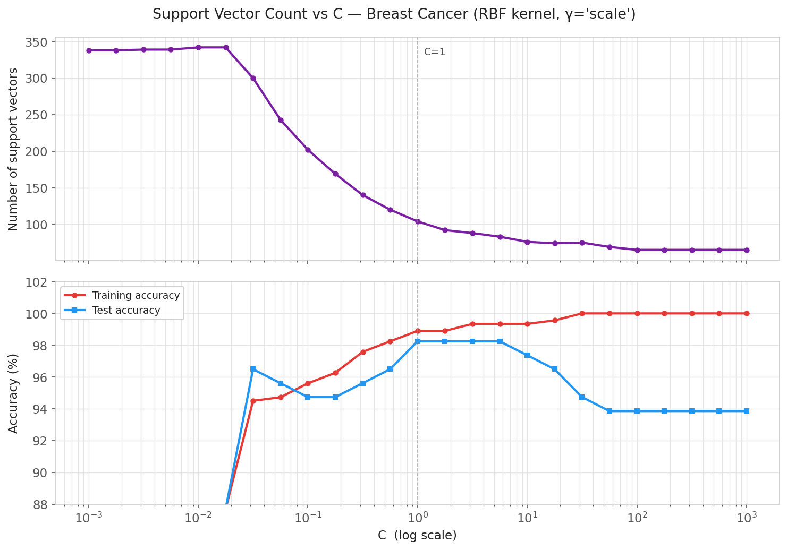

---

# Support Vectors

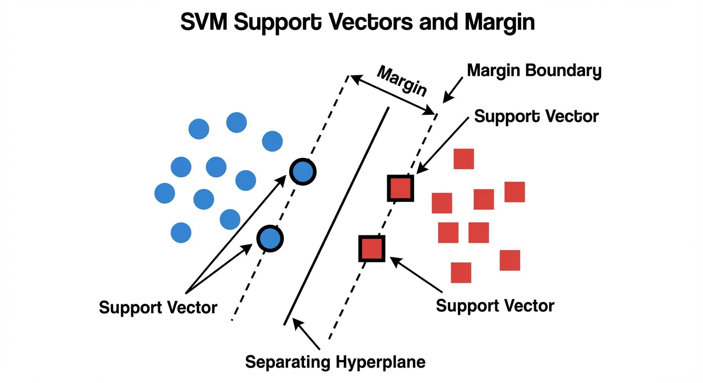

---

# Hard Margin Limitations

The hard margin SVM is theoretically great, but it has one fatal flaw: **it requires perfectly separable data**. The moment any point lands on the wrong side, the optimization problem has no solution at all.

Think about how fragile that is.

- If 454 out of 455 breast cancer cases are perfectly separable, but one patient has an unusual measurement that places a malignant tumor in the benign region (maybe a data entry error, maybe just a biological outlier) the hard margin SVM completely fails. Not "gives a slightly wrong answer." Fails to produce any answer.

And for real data, perfect separability is essentially never true. Classes overlap. Measurements have noise. There are always outliers.

We need to relax the rules. Instead of demanding **zero** violations, we'll **allow** some points to violate the margin but we'll charge them a penalty for doing so. The more a point violates, the more it costs.

This is the **soft margin** extension, and it's what makes SVM work in practice.

---

# Soft Margin - Slack Variables

For each training point, we introduce a **slack variable** $\xi_n \geq 0$ - a measure of how far the point has strayed from where we'd like it to be. A slack of zero means "perfectly behaved." A positive slack means "this point is causing trouble and we know exactly how much."

The constraint becomes:

$$t_n(\mathbf{w}^T\mathbf{x}_n + b) \geq 1 - \xi_n, \quad \xi_n \geq 0$$

Think of it as giving each training point a "budget" to violate the margin. The slack tells you how much of that budget they've used:

| $\xi_n$         | What it means                                        |
| --------------- | ---------------------------------------------------- |
| $\xi_n = 0$     | Correctly classified, comfortably outside the margin |
| $0 < \xi_n < 1$ | Correctly classified, but squeezed inside the margin |
| $\xi_n = 1$     | Sitting right on the decision boundary               |
| $\xi_n > 1$     | Misclassified - on the wrong side entirely           |

The total $\sum_n \xi_n$ is an upper bound on the number of training errors. Minimizing it means we penalize violations proportionally - a small nudge costs less than landing completely on the wrong side.

---

# Soft Margin - Visualized

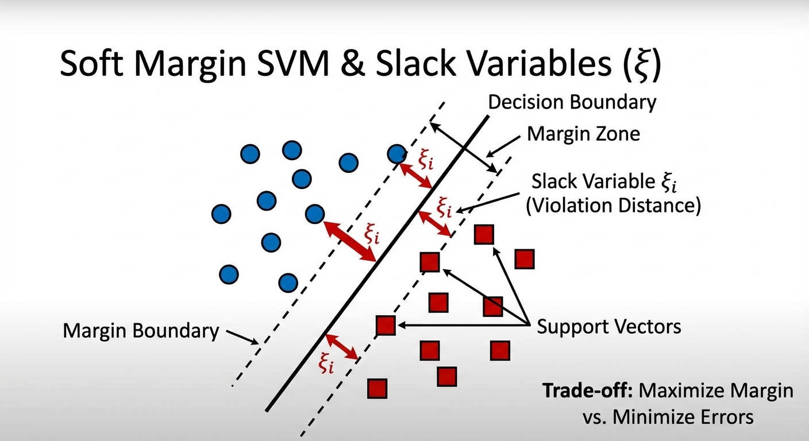

---

# Soft Margin Primal Problem

We want a wide margin (minimize $\|\mathbf{w}\|^2$) **and** few violations (minimize $\sum_n \xi_n$). These two goals are in tension, a very wide margin may force some points inside it. The parameter $C$ is the dial that says how much we care about violations relative to margin width:

$$\min_{\mathbf{w}, b, \boldsymbol{\xi}} \;\frac{1}{2}\|\mathbf{w}\|^2 + C\sum_{n=1}^{N} \xi_n \quad \text{subject to} \quad t_n(\mathbf{w}^T\mathbf{x}_n + b) \geq 1 - \xi_n, \quad \xi_n \geq 0$$

| $C$            | What it says                                                        |
| -------------- | ------------------------------------------------------------------- |
| $C \to \infty$ | "Violations are infinitely costly", recovers the hard margin SVM    |
| Large $C$      | Violations are expensive: narrow margin, fit training data tightly  |
| Small $C$      | Violations are cheap: wide margin, more tolerant of training errors |
| $C \to 0$      | Violations cost nothing, the model ignores labels entirely          |

**This is the same trade-off as Ridge regression.** You can rewrite the objective as $\frac{\lambda}{2}\|\mathbf{w}\|^2 + \frac{1}{N}\sum_n \xi_n$ where $\lambda = 1/(NC)$. **Large $C$ means weak regularization** (trust the training data, narrow margin). **Small $C$ means strong regularization** (keep the model simple, wide margin, accept some training errors). Same knob, different name.

---

# Effect of the $C$ Parameter

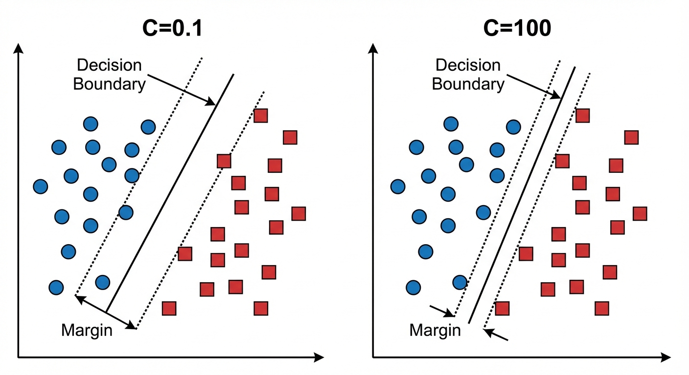

---

# C Effect on Breast Cancer - Real Data

The same tradeoff, shown on the actual PCA projection of the Breast Cancer dataset. Circled points are the support vectors.

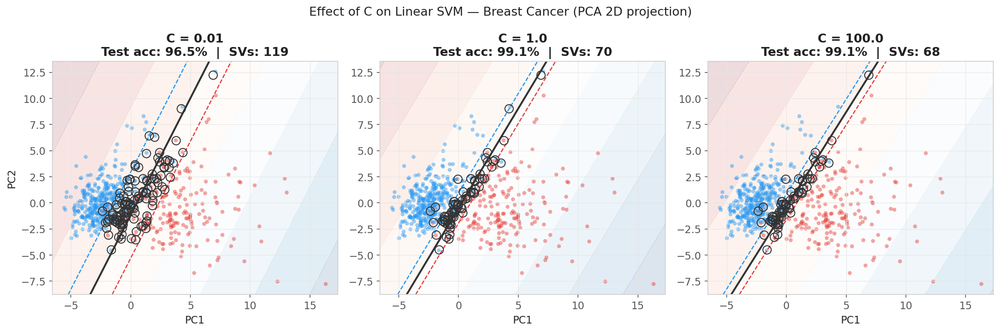

---

# Hinge Loss - SVM as Regularized ERM

We've seen what $C$ does visually. Now let's look at what the soft margin SVM is _actually_ minimizing. There is a cleaner form that connects it to everything else we know about regularization.

Each slack variable $\xi_n$ is just the amount by which a point violates the margin: $\xi_n = \max(0, 1 - t_n y(\mathbf{x}_n))$. Substitute this and the slack variables disappear entirely:

$$\min_{\mathbf{w}, b} \;\frac{1}{2}\|\mathbf{w}\|^2 + C\sum_{n=1}^{N} \underbrace{\max\!\left(0, 1 - t_n y(\mathbf{x}_n)\right)}_{\text{hinge loss}}$$

Now the SVM looks just like Ridge regression: **a regularizer plus a loss function**.

- **Regularizer:** $\frac{1}{2}\|\mathbf{w}\|^2$ - keeps the model simple
- **Loss function:** the **hinge loss** - zero if you're correct and outside the margin, then growing linearly as you get things wrong

The hinge loss has a "flat region" at $z \geq 1$ where the gradient is exactly zero. This is why SVMs are sparse: if a training point is comfortably correct, the loss doesn't care about it at all, and its $\alpha_n = 0$.

Contrast with **logistic regression**, which uses the log loss as that loss is never exactly zero, so every training point always contributes a tiny bit. Logistic regression is "never satisfied." SVM says "good enough is good enough."

---

# Loss Functions

Every classification method ultimately minimizes some version of _how wrong are my predictions?_ But the 0-1 loss (simply counting mistakes) isn't differentiable, so we use smooth **surrogate losses** instead.

| Loss               | Formula             | Flat Region           | Gives Probabilities? |
| ------------------ | ------------------- | --------------------- | -------------------- |
| 0-1                | $\mathbb{1}[z < 0]$ | (not differentiable)  | No                   |
| **Hinge** (SVM)    | $\max(0,\;1-z)$     | $z \geq 1$ - sparsity | No                   |
| **Log** (Logistic) | $\ln(1 + e^{-z})$   | Never zero            | Yes (calibrated)     |
| **Squared**        | $(1 - z)^2$         | Never zero            | No                   |

Notice that squared loss actually **punishes correct confident predictions**. Being right by a lot (large $z$) incurs increasing cost, which makes no sense for classification. Hinge and log are the right choices.

**The key difference between hinge and log:** the flat region at $z \geq 1$. A point correctly classified with comfortable margin has zero gradient. Logistic regression never stops caring and every point contributes, always. This is why logistic regression uses all $N$ training points for prediction, while SVM uses only the support vectors.

---

# Hinge vs Logistic Loss

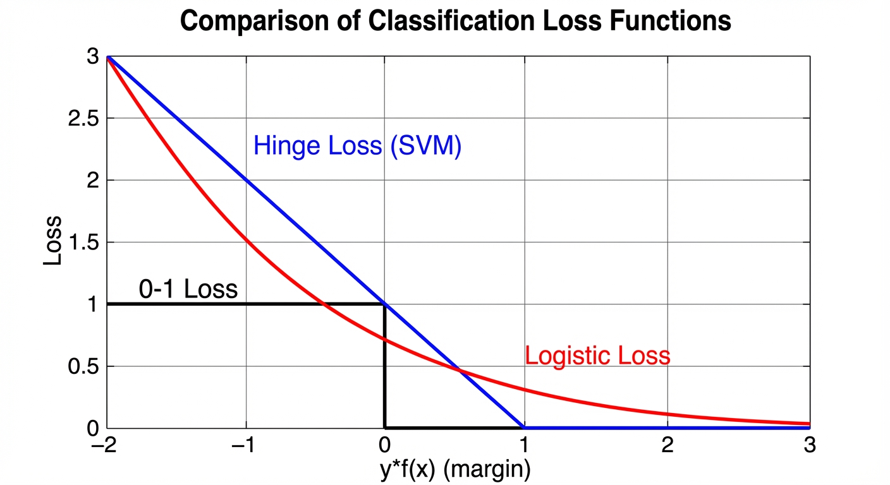

---

# Hinge vs Logistic Loss

On most real datasets, SVM and logistic regression get similar accuracy. The choice usually comes down to what you need from the model beyond the predicted label.

**Pick SVM when:**

- The data is high-dimensional and sparse (text classification, genomics) as sparsity matters and SVMs generalize well here
- You want a fast predictor at inference time that depends on only a small fraction of training examples
- You care about the maximum margin interpretation and the "safety zone" idea is meaningful for your domain

**Pick Logistic Regression when:**

- You need reliable probability estimates alongside the label like a doctor asking "how confident are you?" needs $P(y|\mathbf{x})$, not just a label
- The dataset is large (millions of examples), logistic regression with SGD trains far faster
- You want something simpler to explain and tune, one hyperparameter ($C$ or $\lambda$), calibrated probabilities, no kernel choices

**Bottom line:** for the Breast Cancer dataset (30 features, 455 training points, near-linearly separable) SVM is a natural fit. For a hospital readmission risk model that needs to output "12% chance of readmission," go with logistic regression.

---

# Soft Margin SVM on Breast Cancer

```python
from sklearn.svm import SVC
from sklearn.metrics import accuracy_score, classification_report

# Start with linear kernel on the 30-dimensional breast cancer data
svm_linear = SVC(kernel='linear', C=1.0)
svm_linear.fit(X_train_s, y_train)

y_pred = svm_linear.predict(X_test_s)
print(f"Linear SVM accuracy: {accuracy_score(y_test, y_pred):.2%}")

print(f"\nNumber of support vectors: {svm_linear.n_support_}")
print(f"  Malignant SVs: {svm_linear.n_support_[0]}")
print(f"  Benign SVs:    {svm_linear.n_support_[1]}")
print(f"  Total: {sum(svm_linear.n_support_)} out of {len(X_train_s)} training points")

# The weight vector (in the linear case)
print(f"\nWeight vector norm ||w|| = {np.linalg.norm(svm_linear.coef_):.3f}")
print(f"Margin width = {2 / np.linalg.norm(svm_linear.coef_):.3f}")

# Typical output:
# Linear SVM accuracy: 97.37%
# Number of support vectors: [30 43]  (73 out of 455)
```

---

# When a Line Isn't Enough

We've built a complete theory for linear SVMs. Maximum margin, Lagrangian duality, soft margin, support vectors, hinge loss. All of it produces a straight boundary.

But what if the data isn't linearly separable, even after tuning $C$? What if the true boundary is curved? This is where we need the kernel trick.

---

# The XOR Problem

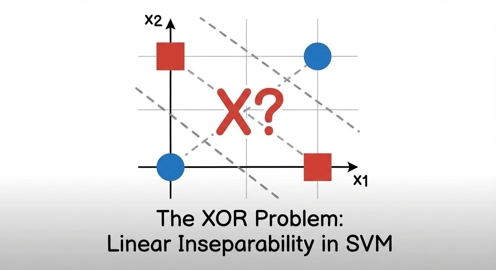

---

# The Kernel Trick

We've built a powerful linear classifier, but many datasets aren't linearly separable. The obvious fix is to manually create new features.

- For XOR, adding $x_3 = x_1 \cdot x_2$ separates the classes perfectly. But this is tedious, hard to get right, and the cost of computing high-dimensional feature vectors explodes quickly.

If we go back and look at the dual objective from a few slides ago.

- The training data appears **only as dot products** $\mathbf{x}_n^T \mathbf{x}_m$. Pairs of training points multiplied together. Individual feature vectors never appear on their own.

So the question becomes: can we compute the dot product _in the rich feature space_ directly from the original inputs, without actually going there? That is exactly what a **kernel function** does:

$$k(\mathbf{x}_n, \mathbf{x}_m) = \boldsymbol{\phi}(\mathbf{x}_n)^T\boldsymbol{\phi}(\mathbf{x}_m)$$

The rest of the SVM algorithm is completely unchanged. We just replace every $\mathbf{x}_n^T \mathbf{x}_m$ with $k(\mathbf{x}_n, \mathbf{x}_m)$. Same algorithm, completely different geometry.

---

# Kernel Trick Example

Take the polynomial kernel $k(\mathbf{x}, \mathbf{z}) = (\mathbf{x}^T\mathbf{z})^2$ on 2D data. Expand it and you'll find it equals the dot product of a 3D feature vector $\boldsymbol{\phi}(\mathbf{x}) = (x_1^2,\; \sqrt{2}\,x_1 x_2,\; x_2^2)$ with the same mapping applied to $\mathbf{z}$.

So the kernel is secretly working in 3D even though you only ever computed a single number from the original 2D inputs.

**Why does this matter?** Normally, to work in that 3D space you'd have to transform all $N$ training points into 3D vectors and then compute dot products between them. The kernel skips all of that, one multiplication and one square gives the same answer.

Scale this up to our dataset. For $k(\mathbf{x}, \mathbf{z}) = (\mathbf{x}^T\mathbf{z} + 1)^3$ with 30 features, the implicit feature space has **over 5,000 dimensions**. Every triple combination of the 30 original features. The kernel evaluates all of those cross-terms in a single arithmetic operation.

---

# Valid Kernels - Mercer's Theorem

You can't just make up any function $k(\mathbf{x}, \mathbf{z})$ and call it a kernel. For $k$ to genuinely represent a dot product in some feature space, the similarity scores it produces must be **geometrically consistent**, they can't contradict each other.

Here is what inconsistency would look like:

- Suppose point A is very similar to B, and B is very similar to C, but A is "opposite" to C. That is a contradiction in any real geometric space
  - If A is close to B and B is close to C, then A must be at least somewhat close to C.
- A kernel function that allows this kind of contradiction is not describing any real geometry.

The mathematical test for this consistency is that the **Gram matrix**:

- The $N \times N$ table of all pairwise similarities $K_{nm} = k(\mathbf{x}_n, \mathbf{x}_m)$ must be **positive semi-definite (PSD)**.

This is **Mercer's theorem**.

If the Gram matrix is not PSD, the dual objective is no longer concave and the solver may find wrong answers or fail to converge.

---

# Constructing Valid Kernels

Once you have one valid kernel, you can build more from it using simple operations and the result is guaranteed valid without re-checking PSD:

- **Sum:** $k_1(\mathbf{x}, \mathbf{z}) + k_2(\mathbf{x}, \mathbf{z})$ - "combine two similarity measures"
- **Product:** $k_1(\mathbf{x}, \mathbf{z}) \cdot k_2(\mathbf{x}, \mathbf{z})$ "both must agree"
- **Scalar multiple:** $c \cdot k(\mathbf{x}, \mathbf{z})$ for $c > 0$ - "rescale the similarity"
- **Exponential:** $\exp(k(\mathbf{x}, \mathbf{z}))$

This is useful when you want to encode domain knowledge. For a molecule classification task, you might combine a kernel over atom types (product) with a kernel over bond structure (sum). As long as each piece is a valid kernel, the whole thing is too.

---

# The Kernel Trick

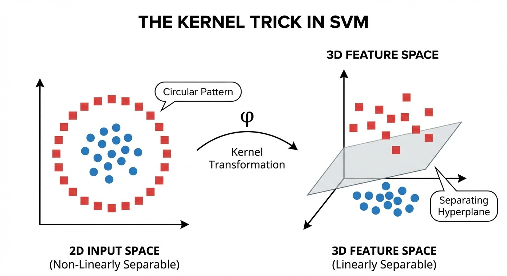

---

# Linear Kernel

$$k(\mathbf{x}, \mathbf{z}) = \mathbf{x}^T\mathbf{z}$$

The linear kernel is the "no transformation" kernel: $\boldsymbol{\phi}(\mathbf{x}) = \mathbf{x}$.

- The boundary is a hyperplane in the original feature space, exactly what we've been working with throughout the hard and soft margin derivations.

**Use it when the original features are already expressive enough.**

- Text classification with TF-IDF vectors: hundreds of thousands of features, each one a word frequency. Linearly separable almost by construction.
- Genomics: 20,000 gene expression values, 200 patients. The curse of dimensionality actually helps linear SVMs here.
- Our Breast Cancer dataset: 30 features, 455 patients.

**Speed advantage:** for linear SVMs you can skip the dual entirely and solve the primal directly with SGD (`LinearSVC`). Training time is $O(ND)$ instead of $O(N^2)$–$O(N^3)$. For a text corpus with a million documents, the difference between 30 seconds and 10 hours.

**Always try linear first.** If it works, you save tuning time, get a faster model, and can inspect the weight vector directly.

---

# Polynomial Kernel

$$k(\mathbf{x}, \mathbf{z}) = (\gamma \,\mathbf{x}^T\mathbf{z} + r)^d$$

The polynomial kernel implicitly maps data into a space containing **all combinations of features up to degree $d$**. With $d=2$, every pair of features gets its own dimension ($x_1 x_2$, $x_1 x_3$, ...). With $d=3$, every triple.

| Parameter | What it controls                             | Typical value   |
| --------- | -------------------------------------------- | --------------- |
| $d$       | How complex the interactions can be          | 2 or 3          |
| $\gamma$  | How much the dot product is scaled           | $1/D$ (`scale`) |
| $r$       | Whether degree-0 term (constant) is included | 0 or 1          |

- $d = 1$, $r = 0$: identical to the linear kernel - no interactions
- $d = 2$: "the classification might depend on pairs of features" - e.g., tumor is malignant when _both_ radius and concavity are high
- Higher $d$: richer interactions, but more risk of overfitting. Past $d=3$, rarely worth it.

**When it works:** NLP tasks with bag-of-words features, where bigrams ($d=2$) and trigrams ($d=3$) capture meaningful phrase-level patterns. For general tabular data like Breast Cancer, RBF usually wins.

---

# RBF (Gaussian) Kernel

$$k(\mathbf{x}, \mathbf{z}) = \exp\!\left(-\gamma \|\mathbf{x} - \mathbf{z}\|^2\right) = \exp\!\left(-\frac{\|\mathbf{x} - \mathbf{z}\|^2}{2\sigma^2}\right), \quad \gamma = \frac{1}{2\sigma^2}$$

The RBF (Radial Basis Function) kernel has a simple intuition: **similarity drops off with distance**.

- Two identical points have similarity 1. Two very distant points have similarity near 0. That's it.

Under the hood, it corresponds to an infinite-dimensional feature space, but it evaluates in $O(D)$ time. Infinite dimensions, constant cost.

The parameter $\gamma$ controls how quickly similarity drops off with distance.

- A large $\gamma$ means similarity decays fast, only very close points are "similar."
- A small $\gamma$ means even distant points are considered similar.

| $\gamma$  | Each support vector's "reach" | Decision boundary     | Risk         |
| --------- | ----------------------------- | --------------------- | ------------ |
| Too small | Very wide, distant influence  | Smooth, almost linear | Underfitting |
| Optimal   | Balanced reach                | Well-shaped           | -            |
| Too large | Narrow, local only            | Jagged, spiky         | Overfitting  |

---

# RBF Kernel

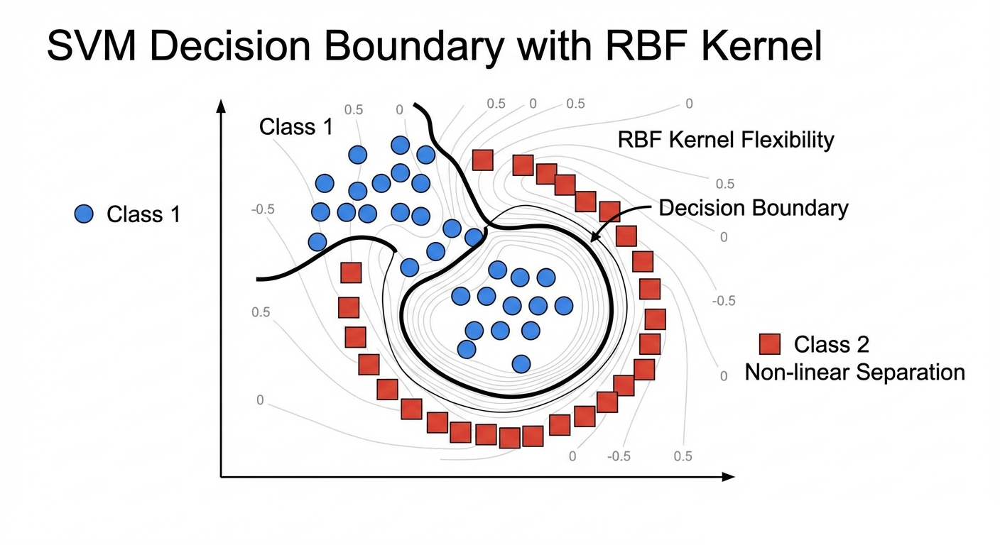

---

# Effect of the $\gamma$ Parameter

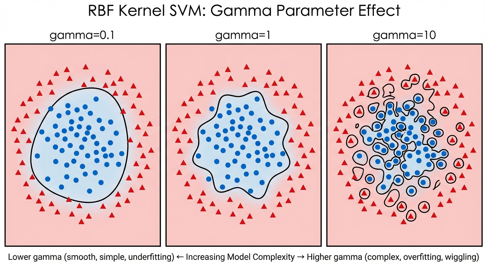

---

# $\gamma$ Effect on Breast Cancer

Three RBF SVM boundaries on the Breast Cancer PCA projection. With $\gamma = 0.001$ the boundary is nearly linear (underfitting). With $\gamma = 10$ the boundary wraps tightly around individual training points (overfitting). The middle value achieves the best test accuracy.

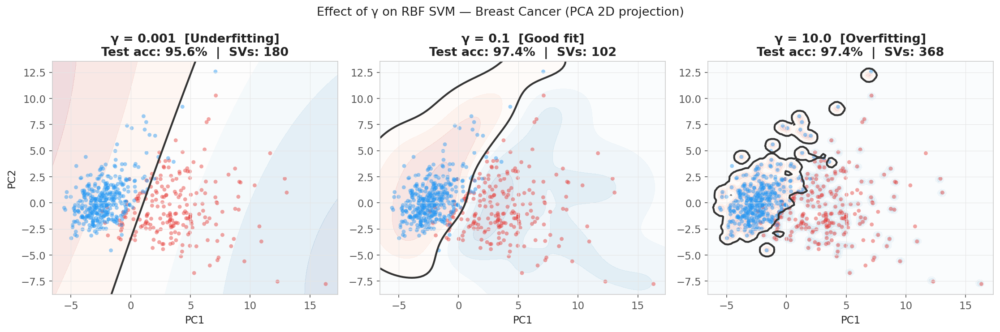

---

# Hyperparameter Tuning

The RBF SVM has two knobs to tune:

- **$C$** - How strict about violations
- **$\gamma$** - How local the similarity is

A large $\gamma$ makes the boundary jagged, but a small $C$ can smooth it out again. You can't tune one without considering the other, so we search a 2D grid over both simultaneously.

```python
from sklearn.model_selection import GridSearchCV
from sklearn.pipeline import Pipeline

# Always scale before SVM, wrap in Pipeline to prevent data leakage
pipe = Pipeline([
    ('scaler', StandardScaler()),
    ('svm',    SVC(kernel='rbf')),
])

param_grid = {
    'svm_C':     [0.01, 0.1, 1, 10, 100, 1000],
    'svm_gamma': [1e-4, 1e-3, 0.01, 0.1, 1, 'scale'],
}

grid = GridSearchCV(pipe, param_grid, cv=5, scoring='accuracy', n_jobs=-1)
grid.fit(X_train, y_train)   # raw X - Pipeline handles scaling
```

---

# Kernel Comparison on Breast Cancer

```python
from sklearn.svm import SVC, LinearSVC
from sklearn.metrics import accuracy_score

kernels = {
    'Linear (LinearSVC)': LinearSVC(C=1.0, max_iter=10000),
    'Linear (SVC)':        SVC(kernel='linear', C=1.0),
    'Polynomial (d=2)':    SVC(kernel='poly',   C=1.0, degree=2),
    'RBF (default gamma)': SVC(kernel='rbf',    C=1.0, gamma='scale'),
    'RBF (tuned)':         SVC(kernel='rbf',    C=10,  gamma=0.01),
}
for name, model in kernels.items():
    model.fit(X_train_s, y_train)
    acc = accuracy_score(y_test, model.predict(X_test_s))
    svs = getattr(model, 'n_support_', None)
    sv_str = f" ({sum(svs)} SVs)" if svs is not None else ""
    print(f"{name:28}: {acc:.2%}{sv_str}")

# Linear SVM (LinearSVC)       : 97.37%
# Linear SVM (SVC)             : 97.37%  (47 SVs)
# Polynomial (d=2)             : 96.49%  (65 SVs)
# RBF (default gamma)          : 96.49%  (54 SVs)
# RBF (tuned C=10, gamma=0.01) : 98.25%  (38 SVs)
```

On Breast Cancer, the **linear kernel already performs very well**. This is typical for high-dimensional datasets where the classes are approximately linearly separable in the original feature space. Tuning the RBF kernel gives a small additional gain.

---

# Multi-class SVM

Everything we've built assumes exactly two classes - malignant vs benign. But what if there are 10 classes, like handwritten digits?

- SVM doesn't naturally handle this. We need a decomposition strategy.

**One-vs-Rest (OvR):** train one binary SVM per class. Classifier $k$ asks: "Is this class $k$ or not?" At prediction time, whichever classifier is most confident wins.

- Classifier $k$: class $k$ is +1, everything else is -1
- Prediction: $\hat{y} = \arg\max_k f_k(\mathbf{x})$
- Downside: each classifier sees a very imbalanced training set ($N_k$ positives, $N - N_k$ negatives)

**One-vs-One (OvO):** train one binary SVM for every _pair_ of classes. At prediction time, hold a majority vote.

- Classifier $(i, j)$: class $i$ is +1, class $j$ is -1 (uses only $N_i + N_j$ points - smaller, faster to train)
- Prediction: majority vote across all $\binom{K}{2}$ classifiers
- scikit-learn's `SVC` default: **OvO**

---

# Multi-class SVM - Comparison

| Property                | OvR         | OvO                   |
| ----------------------- | ----------- | --------------------- |
| Number of models        | $K$         | $K(K-1)/2$            |
| Training data per model | All $N$     | $N_i + N_j$ (smaller) |
| Imbalance sensitivity   | Higher      | Lower                 |
| scikit-learn            | `LinearSVC` | `SVC`                 |

Contrast with logistic regression, which handles multiclass naturally via the softmax.

---

# One-vs-Rest (OvR) Strategy

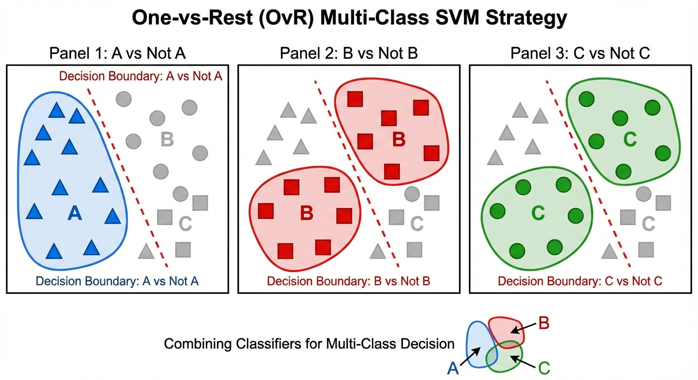

---

# One-vs-One (OvO) Strategy

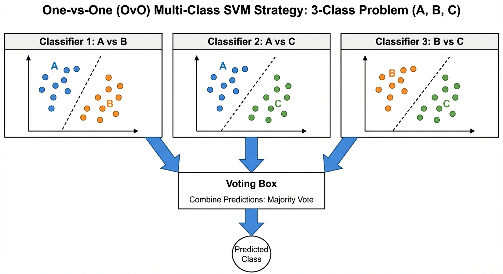

---

# Support Vector Regression (SVR)

Everything we've built for classification carries over to **regression** with one conceptual swap. Instead of a margin that separates two classes, SVR draws an **$\epsilon$-tube** around the predicted function:

$$f(\mathbf{x}) = \mathbf{w}^T\boldsymbol{\phi}(\mathbf{x}) + b$$

**The idea:** if your prediction is within $\epsilon$ of the true value, you pay zero penalty. You don't care about small errors. Only predictions that stray **outside the tube** get penalized, and the penalty grows linearly with how far outside they are:

$$L_\epsilon(y, t) = \max(0, |y - t| - \epsilon)$$

---

# Support Vector Regression (SVR)

Because the residual can exceed the tube from above **or** below, we need two slack variables per point, one for each direction:

- $\xi_n \geq 0$: prediction is **too high** (above the tube)
- $\xi_n^* \geq 0$: prediction is **too low** (below the tube)

Any given training point can only violate in one direction at a time, so at most one of the pair is nonzero.

**SVR Primal:**
$$\min_{\mathbf{w}, b, \boldsymbol{\xi}, \boldsymbol{\xi}^*} \frac{1}{2}\|\mathbf{w}\|^2 + C\sum_{n=1}^{N}(\xi_n + \xi_n^*)$$

subject to $t_n - y(\mathbf{x}_n) \leq \epsilon + \xi_n$,\; $y(\mathbf{x}_n) - t_n \leq \epsilon + \xi_n^*$,\; $\xi_n, \xi_n^* \geq 0$

Points **inside the tube** have zero loss and are not support vectors. Only points that poke through the tube walls contribute to the final model. The same sparsity principle as before.

---

# SVR

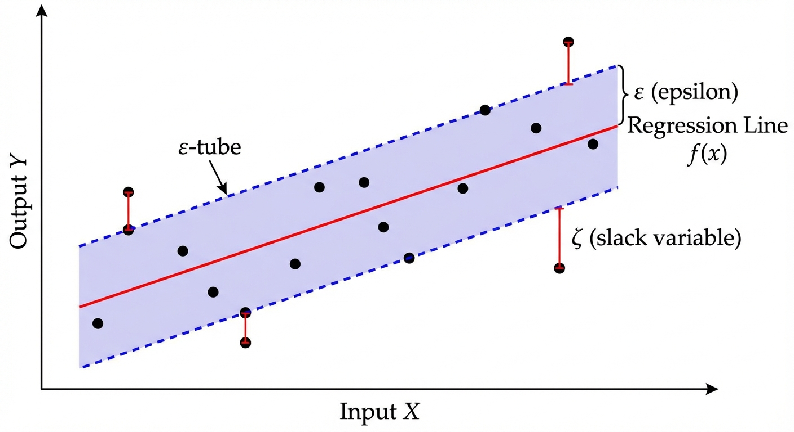

---

# SVR

```python
from sklearn.svm import SVR
from sklearn.datasets import fetch_california_housing
from sklearn.metrics import r2_score

# Recall California Housing
housing = fetch_california_housing()
X_h, y_h = housing.data, housing.target
Xh_tr, Xh_te, yh_tr, yh_te = train_test_split(X_h, y_h, test_size=0.2, random_state=42)

scaler_h = StandardScaler()
Xh_tr_s = scaler_h.fit_transform(Xh_tr)
Xh_te_s = scaler_h.transform(Xh_te)

# SVR with RBF kernel
svr = SVR(kernel='rbf', C=10, gamma='scale', epsilon=0.1)
svr.fit(Xh_tr_s, yh_tr)

r2 = r2_score(yh_te, svr.predict(Xh_te_s))
print(f"SVR R²: {r2:.3f}")  # typically ~0.72-0.75

print(f"Number of support vectors: {len(svr.support_)}")
print(f"({len(svr.support_)/len(Xh_tr)*100:.1f}% of training set)")
```

---

# Practical Guidelines

If you remember nothing else about SVMs, remember these three rules.

**1. Always scale your features**
SVM measures distances. A feature in the thousands (annual income) will completely dominate a feature in the ones (age) unless you standardize first. Wrap everything in a Pipeline so scaling happens inside cross-validation and can't leak future information:

```python
from sklearn.pipeline import Pipeline
pipe = Pipeline([('scaler', StandardScaler()), ('svm', SVC(kernel='rbf'))])
# Use raw X - Pipeline handles scaling, preventing data leakage in cross-validation
```

**2. Start with linear, then try RBF.**
Counter-intuitive, but: try linear first. If your data is high-dimensional ($D$ large relative to $N$), linear often matches RBF with zero tuning. On Breast Cancer, linear gets 97.4% - only 0.85% behind the tuned RBF. The gap isn't always worth the tuning effort.

**3. When tuning RBF, search $C$ and $\gamma$ on a log scale.**
Both hyperparameters span orders of magnitude. A linear grid from 1 to 100 misses almost everything. Use powers of 10:

```python
param_grid = {
    'svm__C':     [0.01, 0.1, 1, 10, 100, 1000],
    'svm__gamma': [1e-4, 1e-3, 0.01, 0.1, 1, 'scale'],
}
```

---

# Practical Guidelines

**4. Watch out for class imbalance.**
Breast Cancer has 357 benign vs 212 malignant, a 1.7:1 ratio that's manageable. But if you had 95% benign and 5% malignant, the model would learn to always predict benign and look like it has 95% accuracy. One line fixes this:

```python
SVC(kernel='rbf', class_weight='balanced')
```

This re-weights each class inversely to its frequency, minority class mistakes are penalized more. Always use `'balanced'` for medical or fraud detection tasks.

**5. Getting probabilities out of an SVM takes extra work.**
`SVC.predict()` gives you a hard class label. If you need a probability score you have to opt in with `probability=True`. Under the hood, scikit-learn runs **Platt scaling**: a small logistic regression fitted on the SVM's cross-validated decision scores.

```python
svm_proba = SVC(kernel='rbf', C=10, gamma=0.01, probability=True)
svm_proba.fit(X_train_s, y_train)
proba = svm_proba.predict_proba(X_test_s)  # shape: (N, 2)
```

It works, but it adds training time and the probabilities aren't as well-calibrated as logistic regression's. If you need reliable probabilities as a primary output, logistic regression is simpler.

---

# Computational Complexity

The kernel SVM's main weakness is scaling. The Gram matrix $\mathbf{K}$ has $N \times N$ entries, one similarity value for every pair of training points. For $N = 10{,}000$ that's 100 million entries (~800 MB). For $N = 100{,}000$: 80 GB, which won't even fit in RAM.

| Method                 | Training          | Prediction               | Practical limit             |
| ---------------------- | ----------------- | ------------------------ | --------------------------- |
| Kernel SVM (LIBSVM)    | $O(N^2)$–$O(N^3)$ | $O(N_\text{SV} \cdot D)$ | $N \lesssim 100{,}000$      |
| Linear SVM (LIBLINEAR) | $O(ND)$           | $O(D)$                   | Millions of examples        |
| SGD with hinge loss    | $O(ND)$ amortized | $O(D)$                   | Billions (streaming/online) |

The crossover point is roughly $N \approx 10{,}000$–$100{,}000$. At that scale, kernel SVM starts to feel slow and linear or approximate methods become the right choice. Our Breast Cancer dataset at $N = 455$ is well within the sweet spot.

---

# Large-Scale SVM Alternatives

When $N$ is too large for kernel SVM, you have two options.

**Option 1: Linear SVM with SGD** - same hinge loss, same regularization, but optimized with stochastic gradient descent instead of SMO. Trains in $O(ND)$, handles millions of examples:

```python
from sklearn.linear_model import SGDClassifier

# SGD with hinge loss ≈ Linear SVM - trains in O(ND), handles millions of samples
sgd_svm = SGDClassifier(loss='hinge', alpha=1/(2*N*C), max_iter=1000)
sgd_svm.fit(X_train_s, y_train)
```

---

# Large-Scale SVM Alternatives

**Option 2: Random Fourier Features + linear SVM** - if you need non-linear boundaries, approximate the RBF kernel by mapping data to a random feature space first, then train a linear SVM on it. We get most of the non-linearity at linear training cost:

```python
from sklearn.kernel_approximation import RBFSampler
from sklearn.pipeline import Pipeline

# Maps data to ~1000 random features that approximate k(x,z) = exp(-gamma||x-z||^2)
approx_rbf = Pipeline([
    ('rbf_features', RBFSampler(gamma=0.01, n_components=1000, random_state=42)),
    ('linear_svm',   SGDClassifier(loss='hinge', max_iter=1000)),
])
approx_rbf.fit(X_train_s, y_train)
# Trains in O(N * 1000) instead of O(N^2) - much faster, similar boundary
```

---

# SVM vs Other Methods - Full Comparison

```python
from sklearn.linear_model import LogisticRegression
from sklearn.discriminant_analysis import LinearDiscriminantAnalysis
from sklearn.naive_bayes import GaussianNB
from sklearn.tree import DecisionTreeClassifier
from sklearn.svm import SVC, LinearSVC

models = {
    "Logistic Regression (Wk 5)":   LogisticRegression(max_iter=1000),
    "LDA (Wk 9)":                   LinearDiscriminantAnalysis(),
    "Gaussian NB (Wk 9)":           GaussianNB(),
    "Decision Tree (Wk 7)":         DecisionTreeClassifier(max_depth=6, random_state=42),
    "Linear SVM":                    LinearSVC(C=1.0, max_iter=10000),
    "RBF SVM (tuned)":               SVC(kernel='rbf', C=10, gamma=0.01),
}

print("=== BREAST CANCER: ALL MODELS ===")
for name, model in models.items():
    model.fit(X_train_s, y_train)
    acc = accuracy_score(y_test, model.predict(X_test_s))
    print(f"{name:30}: {acc:.2%}")
```

---

# Model Comparison - Results

```
=== BREAST CANCER: ALL MODELS ===
Logistic Regression (Wk 5)    : 97.37%
LDA (Wk 9)                    : 95.61%
Gaussian NB (Wk 9)            : 94.74%
Decision Tree (Wk 7)          : 91.23%
Linear SVM                    : 97.37%
RBF SVM (tuned)               : 98.25%
```

---

# Model Comparison - Key Insights

The results tell a clear story about where different algorithms succeed and fail.

- **Linear SVM = Logistic Regression** on this dataset (both at 97.37%). The Breast Cancer data is nearly linearly separable in 30 dimensions. When the data cooperates, the choice of loss function - hinge vs log - doesn't matter. Both find the same boundary.

- **LDA falls short** (95.61%). Last week's model assumed Gaussian class distributions. Breast Cancer features aren't Gaussian, so that assumption hurts it here. Discriminative models that don't make distributional assumptions win.

- **Naive Bayes falls further** (94.74%). The 30 features are highly correlated - radius, perimeter, and area all measure the same underlying thing. Naive Bayes assumes independence, which is badly violated here.

- **Decision Tree lags** (91.23%). A single tree cuts space with axis-aligned boxes. It can't match the smooth linear boundary that separates these classes cleanly.

- **Tuned RBF SVM wins** (98.25%). A small amount of non-linearity in the true boundary is captured by the RBF kernel. Worth the grid search.

---

# Model Comparison

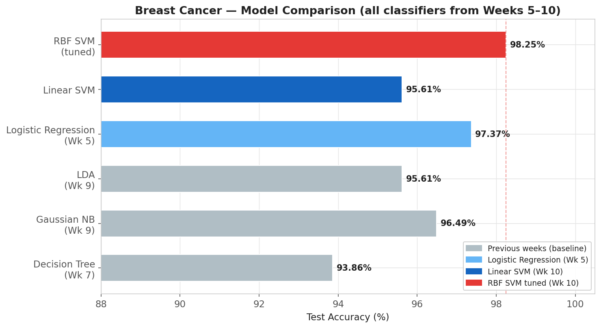

---

# When to Use SVM

**SVM shines when:**

- **High-dimensional data:** text classification with TF-IDF vectors, genomics, medical imaging features. In these settings features already provide a rich representation, and linear SVM is unbeatable on speed and accuracy.
- **More features than samples:** when $D > N$ (e.g., 20,000 genes, 200 patients), SVM's $\ell_2$ regularization is well-calibrated for this regime. Other methods struggle.
- **You need a sparse model:** after training, SVM compresses everything into a small set of support vectors. Prediction uses only those. Easy to inspect what the hard cases are.
- **You have domain knowledge about similarity:** the kernel framework lets you encode what "similar examples" means for your domain - string kernels for sequences, graph kernels for molecules, custom kernels for structured data. No other standard algorithm lets you plug in similarity so cleanly.
- **Medium-sized datasets with clear class structure:** our Breast Cancer example is the sweet spot - a few hundred to a few thousand samples, well-separated classes, numerical features.

---

# When to Consider Alternatives

SVM is not always the right choice. Know its limits.

- **Large datasets ($N > 100{,}000$):** kernel SVM's $O(N^2)$ training cost becomes prohibitive. Switch to `LinearSVC` (still an SVM, but no kernel), or use gradient boosting (Week 13), or a neural network. Alternatively, `RBFSampler` approximates the RBF kernel for large-scale use.
- **You need calibrated probabilities:** `SVC.predict_proba()` uses Platt scaling - a post-hoc correction - which isn't as reliable as logistic regression's natural probabilities. If your downstream system needs accurate $P(y|\mathbf{x})$ scores (e.g., risk scoring in medicine), prefer logistic regression.
- **Lots of feature interactions or irregular boundaries:** gradient boosting often matches or beats RBF SVM with less tuning, especially on tabular data where trees naturally capture interactions.
- **Interpretability is critical:** a linear SVM's weight vector is interpretable, but a kernel SVM is a black box. If you need to explain every decision, use a decision tree or a regularized linear model.
- **Quick baseline:** logistic regression trains faster, is easier to tune, and often gets you 80% of SVM's performance in 20% of the time.

---

<!-- _header: "" -->
<!-- _footer: "" -->
<!-- _paginate: false -->

# Thank You!

## Contact Information

- **Email:** ekrem.cetinkaya@yildiz.edu.tr
- **Office Hours:** Wednesday 13:30-15:30 - Room C-120
- **Book a slot before coming:** [Booking Link](https://calendar.app.google/fog6DPBGJH2QpHVw8)
- **Course Repository:** [GitHub](https://github.com/ekremcet/yzm2011-introduction-to-machine-learning)
