# YZM2011

## Introduction to Machine Learning

### Week 11: Clustering Algorithms

**Instructor:** Ekrem Çetinkaya
**Date:** 05.05.2026

---

# Today's Agenda

<div class="two-columns">
<div class="column">

## K-Means and Evaluation

- From supervised to **unsupervised** learning
- What clustering is and why it matters
- **K-Means**: objective, algorithm, convergence
- Image segmentation and compression with K-Means
- **K-Means++** smart initialization
- Choosing $K$: Elbow method and Silhouette analysis

</div>
<div class="column">

## Advanced Clustering and GMM

- **Hierarchical clustering** and dendrograms
- **DBSCAN**: density-based, noise-aware clustering
- **Gaussian Mixture Models**: the probabilistic view
- EM algorithm for GMM: E-step and M-step
- K-Means as a **limiting case** of GMM
- Model selection: AIC, BIC
- Evaluation metrics and practical guidelines

</div>
</div>

---

# Recap

Last week we asked: **where is the best boundary between two known classes?**

- SVMs answered that by maximizing the margin - a purely geometric argument. But crucially, we always knew which class each training point belonged to. The labels were there, handed to us, guiding every step of the optimization.

This week we throw the labels away entirely.

- No one tells us that patient A is malignant and patient B is benign. No one tells us that customer X belongs to group 1 and customer Y to group 2.
- We have raw measurements $\{x_1, x_2, \ldots, x_n\}$ and nothing else.
- Our job is to discover whether the data has **hidden structure**, natural groupings that no human annotator has drawn for us.

This is the shift from **supervised** to **unsupervised learning**, and it changes everything. There is no loss function to minimize against a ground truth label. There is no obvious right answer. The algorithm must find patterns on its own, and we need principled ways to evaluate whether what it found is real.

---

# Running Example

**Digits dataset** (`sklearn.datasets.load_digits`):

```python
from sklearn.datasets import load_digits
from sklearn.decomposition import PCA
digits = load_digits()
X = digits.data # 1797 × 64
X_2d = PCA(2).fit_transform(X)
```

- 1797 images (0–9); 64 pixel features

- **The question:** can $K=10$ clustering recover these groups with _zero labels?_
- 4 and 9 genuinely overlap, an honest stress test

---

# Running Example

Raw samples and their PCA projection

- Colour = true label, **hidden from the algorithm**

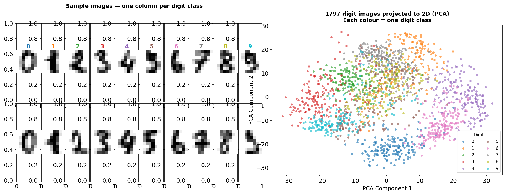

---

# From Week 1 to Week 11

We already know the big picture from Week 1. A quick recap before we go deep:

**Supervised** - labeled pairs $(x_i, y_i)$, learn $f(x) \to y$.

**Unsupervised** - only inputs $\{x_1, \ldots, x_n\}$, discover hidden structure.

The unsupervised toolkit splits into: **clustering** (find groups - today), **dimensionality reduction** (find compact representations - Week 12), and **density estimation** (model the distribution - GMM, also today).

What is _new_ starting now is the **evaluation** problem.

- In supervised learning we measure accuracy against held-out labels. In unsupervised learning there are no labels.
- So what does "_correct_" even mean? We need different criteria, and we will build them up explicitly today.

**The running question for this lecture:** given 1797 handwritten digit images with _no labels at all_, can a clustering algorithm recover the 10 digit categories on its own?

---

# What is Clustering?

**Clustering** is the task of partitioning $n$ data points into $K$ groups such that points within a cluster are more similar to each other than to points in other clusters.

$$\text{Goal: } \{x_1, \ldots, x_n\} \rightarrow \{C_1, C_2, \ldots, C_K\}$$

The formal objective is to find an assignment that minimizes within-cluster variation and maximizes between-cluster separation:

$$\min \sum_{k=1}^{K} \sum_{x_i \in C_k} d(x_i, \mu_k)$$

where $\mu_k$ is a representative of cluster $k$ (e.g. the centroid) and $d$ is a distance function.

This sounds simple.

- The complication is that the number of possible assignments of $n$ points into $K$ clusters grows as $K^n / K!$.
- For $n = 100$ and $K = 5$, there are more possible assignments than atoms in the observable universe.

We can't search exhaustively. We need smart algorithms.

---

# Distance Metrics

Before we can cluster, we need to define "_similar_." Almost everything in clustering reduces to measuring distance.

**Euclidean distance** - the straight-line distance most people intuitively mean:
$$d(x, y) = \sqrt{\sum_{i=1}^{d}(x_i - y_i)^2}$$

**Manhattan distance** - sum of absolute differences; less sensitive to large gaps in a single dimension:
$$d(x, y) = \sum_{i=1}^{d}|x_i - y_i|$$

**Cosine similarity** - angle-based, ignores magnitude; the standard in text mining where document length shouldn't affect similarity:
$$\text{sim}(x, y) = \frac{x \cdot y}{\|x\| \cdot \|y\|}$$

**The choice of distance metric changes which clusters you find.** Euclidean distance is sensitive to scale, for example. A feature measured in thousands will dominate a feature measured in units.

---

# Other Distance and Similarity Metrics

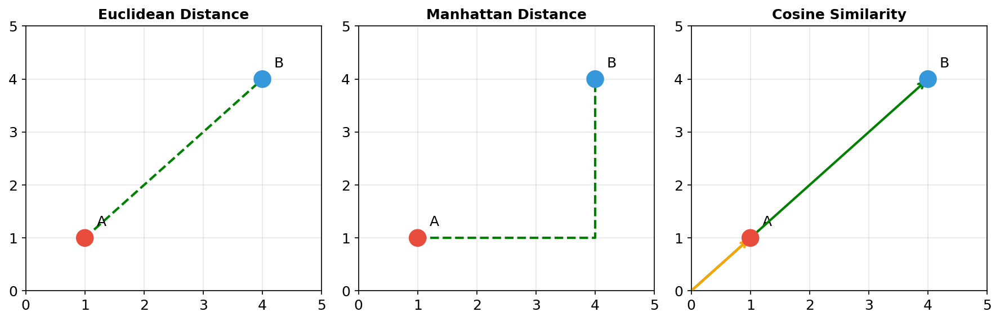

---

# Other Distance and Similarity Metrics


**Mahalanobis distance** takes the covariance structure of the data into account:
$$d(x, y) = \sqrt{(x-y)^T S^{-1} (x-y)}$$

It is scale-invariant and accounts for correlations between features. When a cluster is elongated diagonally, Euclidean distance gets the shape wrong; Mahalanobis distance gets it right. This is exactly what GMM uses internally.

**Jaccard similarity** is for set-based data:
$$J(A, B) = \frac{|A \cap B|}{|A \cup B|}$$

**Confused?**

- Euclidean for continuous, standardized features
- Cosine for text and high-dimensional sparse data
- Jaccard for binary presence-absence data
- Mahalanobis when you care about the shape of the distribution.

---

# The K-Means Objective

K-Means is introduced as a non-probabilistic approach to clustering, framing the problem as minimization of a **distortion measure**, also called WCSS (Within-Cluster Sum of Squares).

We introduce binary indicator variables $r_{nk} \in \{0, 1\}$ where $r_{nk} = 1$ means data point $x_n$ is assigned to cluster $k$. Every point belongs to exactly one cluster: $\sum_k r_{nk} = 1$.

The objective function is:

$$J = \sum_{n=1}^{N} \sum_{k=1}^{K} r_{nk} \|x_n - \mu_k\|^2$$

This is the total squared distance of every point from its assigned cluster center. Our goal is to find values of $\{r_{nk}\}$ (assignments) and $\{\mu_k\}$ (centers) that **minimize** $J$.

Notice that $J$ depends on both the assignments and the centers. Optimizing both simultaneously is hard. But optimizing each one while holding the other fixed is easy. That is exactly what the algorithm does.

---

# K-Means - The Algorithm Steps

The algorithm alternates between two steps

**Assignment step (E-step analogue):** Hold centers $\mu_k$ fixed. Assign each point to its nearest center:

$$r_{nk} = \begin{cases} 1 & \text{if } k = \arg\min_j \|x_n - \mu_j\|^2 \\ 0 & \text{otherwise} \end{cases}$$

This minimizes $J$ with respect to $\{r_{nk}\}$ - with fixed centers, assigning each point to the nearest one is trivially optimal.

**Update step (M-step analogue):** Hold assignments $r_{nk}$ fixed. Recompute each center as the mean of its assigned points:

$$\mu_k = \frac{\sum_n r_{nk}\, x_n}{\sum_n r_{nk}}$$

Setting $\partial J / \partial \mu_k = 0$ gives exactly this formula. With fixed assignments, the centroid minimizes the sum of squared distances within the cluster.

Repeat until the assignments no longer change. This is **Lloyd's algorithm**.

---

# K-Means - Example

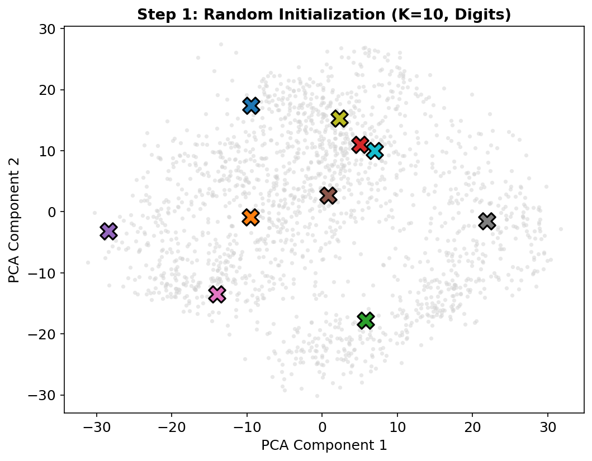

## Initialization

Here we apply K-Means to the Digits dataset

- 1797 images projected to 2D with PCA for visualization.

- 10 random centers selected (crosses), one per digit class
- Data points not yet assigned, each point is one digit image

In 2D PCA space, several digit groups are well-separated (0, 1, 6), while others (4 vs. 9, 3 vs. 8) overlap heavily.

**Parameters:**

- $K = 10$ clusters (one per digit 0–9)
- $n = 1797$ data points
- Features: 64 pixel intensities -> 2D via PCA

---

# K-Means - Convergence

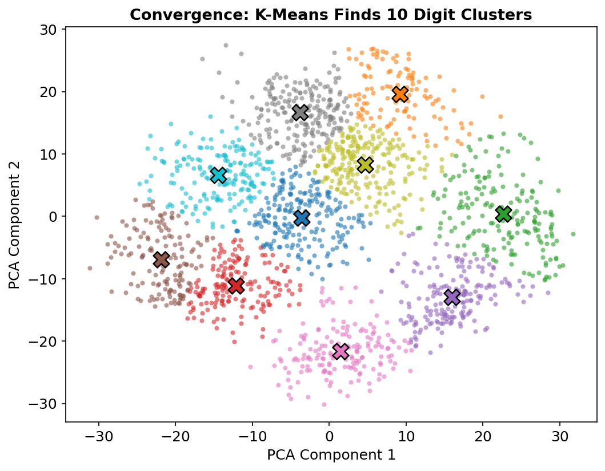

### ... After Several Iterations

After each assignment step, the colored regions show which center "_owns_" each part of the space. After each update step, the crosses move to the centroid of their region.

Both steps **provably** reduce or maintain $J$. Since $J \geq 0$ and decreases monotonically, the algorithm must terminate.

- There are only finitely many possible assignment patterns and we never revisit one.

**Convergence guarantee:** K-Means always converges. But it converges to a **local minimum** of $J$, not necessarily the global one. Different random initializations can give very different results

- A serious practical problem that motivates K-Means++

---

# K-Means - Python Implementation

```python
import numpy as np

def kmeans(X, K, max_iters=100):
 n, d = X.shape

 # 1. Random initialization
 idx = np.random.choice(n, K, replace=False)
 centroids = X[idx].copy()

 for _ in range(max_iters):
 # 2. Assignment step
 distances = np.linalg.norm(X[:, np.newaxis] - centroids, axis=2)
 labels = np.argmin(distances, axis=1)

 # 3. Update step
 new_centroids = np.array([X[labels == k].mean(axis=0) for k in range(K)])

 # 4. Convergence check
 if np.allclose(centroids, new_centroids):
 break
 centroids = new_centroids

 return labels, centroids
```

---

# K-Means with Scikit-learn

```python
from sklearn.cluster import KMeans
from sklearn.preprocessing import StandardScaler

# Always scale before K-Means
X_scaled = StandardScaler().fit_transform(X)

# Fit K-Means - k-means++ initialization is the default
kmeans = KMeans(n_clusters=3, random_state=42, n_init=10)
kmeans.fit(X_scaled)

labels = kmeans.labels_ # Cluster label for each point
centers = kmeans.cluster_centers_ # Cluster centers (in scaled space)
inertia = kmeans.inertia_ # J value - WCSS

# Predict cluster for new data
new_data = np.array([[1.0, 2.0], [-1.0, -1.0]])
predictions = kmeans.predict(new_data)
```

---

# Application - Image Segmentation and Compression

K-Means has a nice application: **image compression**.

Each pixel in a color image is a point in 3D RGB space, three numbers between 0 and 255 representing red, green, and blue. A typical photograph has millions of pixels, each potentially a unique color.

Run K-Means with $K = 16$ on all the pixel values:

1. The algorithm finds 16 representative colors that best cover the color space of the image
2. Every pixel is then replaced by its nearest representative color
3. You only need to store 16 color values (16 x 3 numbers) plus one label per pixel (4 bits instead of 24 bits)
4. Compression ratio: roughly **6x smaller**. Most color information is discarded, but the image is still recognizable

With $K = 2$, you get **image segmentation**, foreground vs. background.

- This is used in medical imaging (tumor vs. healthy tissue) and computer vision (object vs. background).

The distortion $J$ measures how much detail you've lost.

---

# K-Means - The Initialization Problem

The random initialization of cluster centers is the main problem of K-Means.

Run the same algorithm on the same data twice with different random seeds and you may get completely different clusterings.

- The bad ones are **local minima** of $J$ that the algorithm has no way to escape from once it converges.

The problem is worst when

- $K$ is large
- The true clusters are close together or have very different sizes
- The random initialization places multiple starting centers inside the same true cluster

**Three strategies:**

1. Run K-Means many times (`n_init=10` or more) and keep the best result
2. Use **K-Means++** smart initialization
3. Use domain knowledge to pick starting points

In practice, always combine 1 and 2: K-Means++ initialization with multiple restarts.

---

# K-Means - The Initialization Problem

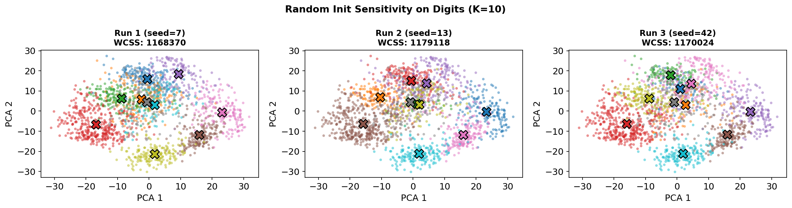

---

# K-Means++ - The Idea

Standard K-Means initializes centers uniformly at random, any point is equally likely to be a starting center.

- If two starting centers land in the same true cluster, one of them is wasted.

K-Means++ fixes this with a simple insight: **the initial centers should be spread out**.

- A new center that is far from all existing centers is more likely to belong to a different true cluster.

The algorithm selects centers **sequentially**, with each new center chosen with probability proportional to the squared distance from the nearest already-chosen center.

- Points far from existing centers have a high probability of being selected; points already near a center have low probability.

---

# K-Means++ Algorithm Steps

### Initialization Procedure

1. **First center**: Select uniformly at random from the data -> $\mu_1$

2. **For each subsequent center** ($k = 2, \ldots, K$):

a. For each point $x_i$, compute the squared distance to the nearest existing center:
$$D(x_i) = \min_{j < k} \|x_i - \mu_j\|^2$$

b. Select the next center by sampling from:
$$P(x_i \text{ selected}) = \frac{D(x_i)}{\sum_j D(x_j)}$$

Points far from all current centers get the highest probability.

3. Run standard K-Means from these $K$ starting points

We are spending our "_budget_" of $K$ centers wisely, placing them in regions that aren't yet represented.

---

# K-Means++ Python Implementation

```python
import numpy as np

def kmeans_plusplus_init(X, K):
 n, d = X.shape
 centroids = np.zeros((K, d))

 # First center chosen uniformly at random
 centroids[0] = X[np.random.randint(n)]

 for k in range(1, K):
 # Squared distance to nearest existing center for each point
 distances = np.min(
 [np.linalg.norm(X - centroids[j], axis=1)**2 for j in range(k)],
 axis=0
 )

 # Sample next center proportional to D(x)
 probs = distances / distances.sum()
 centroids[k] = X[np.random.choice(n, p=probs)]

 return centroids
```

Scikit-learn uses K-Means++ by default (`init='k-means++'`). You should never use `init='random'` in production.

---

# K-Means++ in Scikit-learn

```python
from sklearn.cluster import KMeans

# K-Means++ is the default - always use it
kmeans = KMeans(
 n_clusters=5,
 init='k-means++', # K-Means++ initialization (default)
 n_init=10, # Try 10 different initializations, keep the best
 max_iter=300, # Maximum iterations per run
 random_state=42
)

kmeans.fit(X_scaled)

# n_init=10 means 10 full K-Means runs with K-Means++ initialization each time
# The run with the lowest final inertia (J) is returned
# This is the standard production setup
```

---

# K-Means vs K-Means++

| Metric            | K-Means (random)     | K-Means++                |
| ----------------- | -------------------- | ------------------------ |
| Convergence speed | Slower               | Faster                   |
| Final WCSS        | Variable, often high | More consistent, lower   |
| Local minima risk | High                 | Much lower               |
| Theoretical bound | None                 | $O(\log K)$ from optimal |

The improvement is most dramatic for large $K$ and when clusters are not well-separated. For $K=2$ on simple data, both methods usually find the same answer. For $K=20$ on complex data, K-Means++ can be the difference between a useful and a useless result.

---

# K-Means vs K-Means++

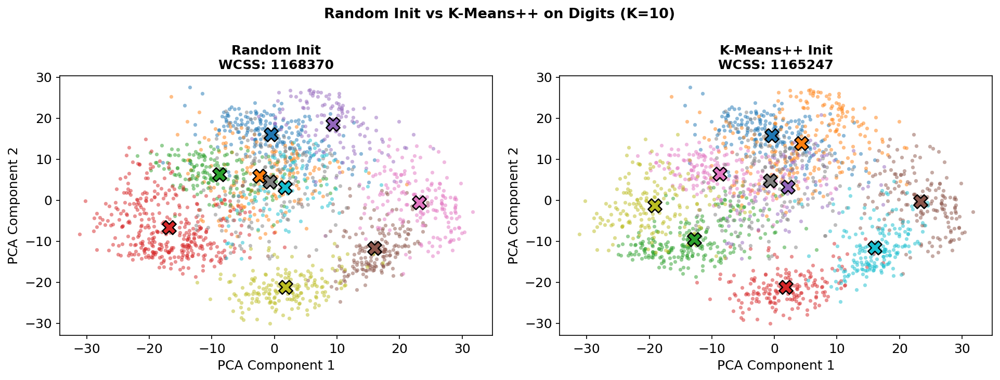

---

# Determining the Optimal Number of Clusters

Here is the truth about K-Means: **you must tell it how many clusters to find**. The algorithm accepts $K$ as a parameter and always returns exactly $K$ clusters, whether the data has 2 natural groups or 20.

This is a real problem.

- In the customer segmentation scenario, nobody hands you the number of segments.
- In image compression, you might choose $K$ based on your file size budget.
- In biology, the number of cell types in a tissue is unknown and scientifically interesting.

Several approaches exist:

1. **Domain knowledge** - biology, medicine, and business often have principled reasons to expect a certain number of groups
2. **Elbow method** - plot $J$ vs. $K$ and look for the "elbow" where improvement slows
3. **Silhouette analysis** - measure the quality of each clustering independently
4. **Gap statistic** - compare WCSS to a reference distribution (more sophisticated)
5. **BIC/AIC for GMM** - the probabilistic framework gives principled model selection

---

# The Elbow Method

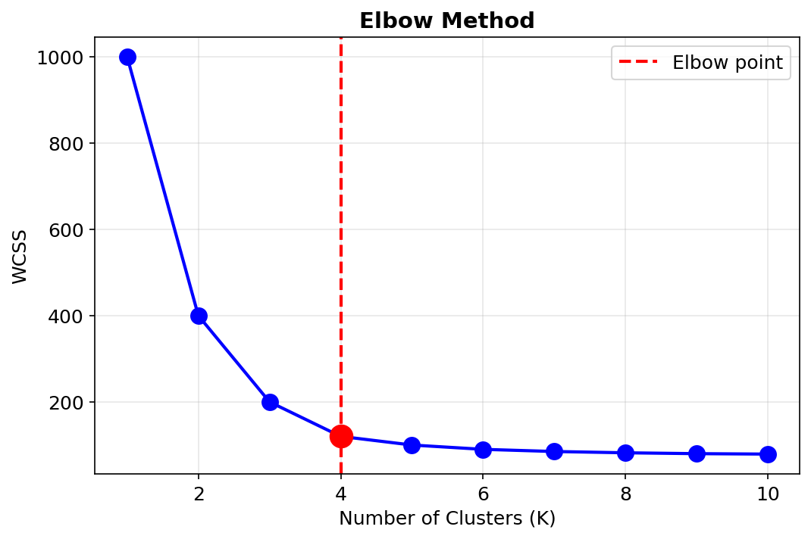

### Idea

As $K$ increases, the optimal $J$ (WCSS) must decrease - you can always achieve lower within-cluster variation by using more clusters. But the rate of improvement slows: adding the 10th cluster helps less than adding the 2nd.

The _elbow_ in the WCSS vs. $K$ plot is the point of diminishing returns. Beyond it, you're splitting real clusters to get marginal gains.

### Procedure

```python
inertias = []
for k in range(1, 11):
 km = KMeans(n_clusters=k, random_state=42, n_init=10)
 km.fit(X_scaled)
 inertias.append(km.inertia_)
# Plot inertias vs. k and look for the elbow
```

---

# Elbow Method - Interpretation

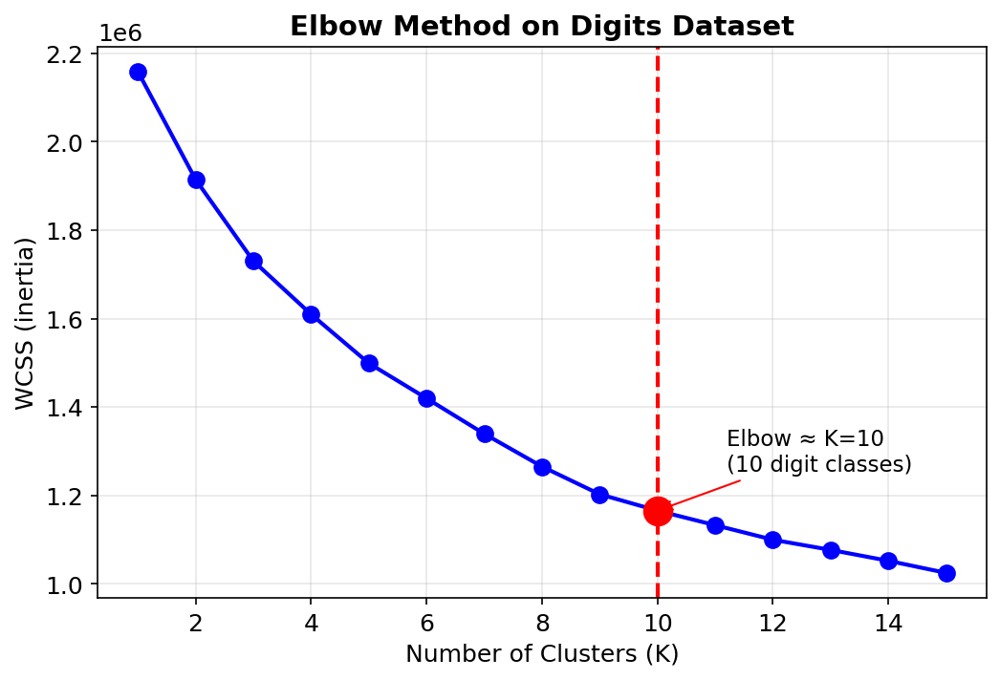

In an ideal scenario with well-separated clusters, the elbow is sharp: there is a dramatic drop up to the true $K$, and then a much gentler slope afterward. The true $K$ sits at the corner.

For the Digits data: one elbow near $K = 10$, reflecting the ten digit classes. Though, the elbow is softer than in clean synthetic data because some digits genuinely overlap in pixel space.

For many real datasets, the elbow is gradual and ambiguous. This is the method's fundamental limitation "_elbow_" involves visual judgment, and reasonable people can disagree.

When the elbow is unclear, silhouette analysis provides a more objective alternative.

---

# Limitations of the Elbow Method

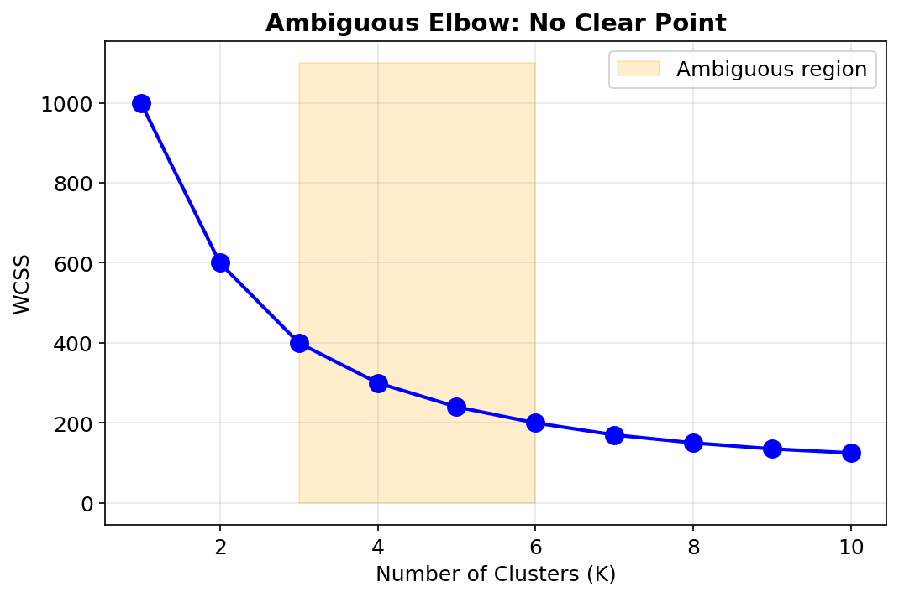

### Problems

1. **Unclear elbow**: sometimes no sharp corner exists - WCSS decreases steadily with no obvious kink

2. **Subjective interpretation**: two people looking at the same plot can choose different $K$

3. **High-dimensional data**: the elbow becomes less pronounced as dimensionality increases, making the method unreliable without prior dimensionality reduction

### Solution

Use the elbow to identify a **range of candidate $K$ values**, then use Silhouette analysis to choose between them objectively. Never rely on the elbow alone.

---

# Silhouette Analysis

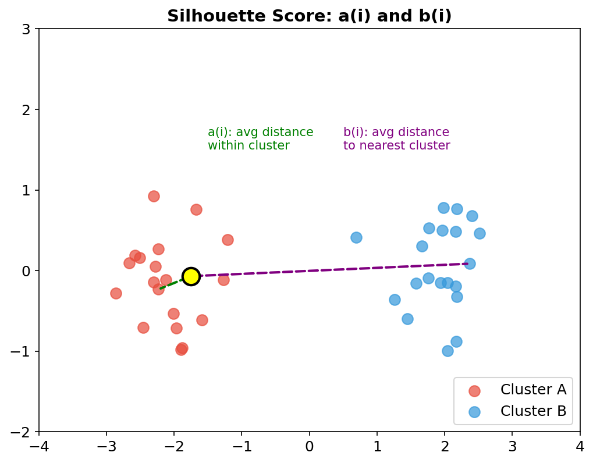

Silhouette analysis gives each data point a score from $-1$ to $+1$ measuring how well it fits its assigned cluster relative to the alternatives.

For data point $i$, define:

- $a(i)$: average distance to all other points **in the same cluster** (cohesion - smaller is better)
- $b(i)$: average distance to all points in the **nearest other cluster** (separation - larger is better)

---

# Silhouette Analysis


The **silhouette coefficient** for point $i$:

$$s(i) = \frac{b(i) - a(i)}{\max(a(i), b(i))}$$

Range: $-1 \leq s(i) \leq 1$

- $s(i) \approx 1$: point is well inside its cluster, far from neighbors -> correct assignment
- $s(i) \approx 0$: point is on the boundary between two clusters
- $s(i) < 0$: point is closer to another cluster -> probably misassigned

---

# Silhouette Scores in Practice

```python
from sklearn.metrics import silhouette_score
from sklearn.cluster import KMeans

silhouette_scores = []
for k in range(2, 11): # Silhouette undefined for k=1
 km = KMeans(n_clusters=k, random_state=42, n_init=10)
 labels = km.fit_predict(X_scaled)
 score = silhouette_score(X_scaled, labels)
 silhouette_scores.append(score)
 print(f"K={k}: avg silhouette = {score:.4f}")

# Choose K that maximizes the average silhouette score
optimal_k = silhouette_scores.index(max(silhouette_scores)) + 2
```

| Average $\bar{s}$ | Interpretation                        |
| ----------------- | ------------------------------------- |
| $> 0.70$          | Strong structure found                |
| $0.50 - 0.70$     | Reasonable structure                  |
| $0.25 - 0.50$     | Weak structure (proceed with caution) |
| $< 0.25$          | No substantial structure found        |

---

# Silhouette Plot

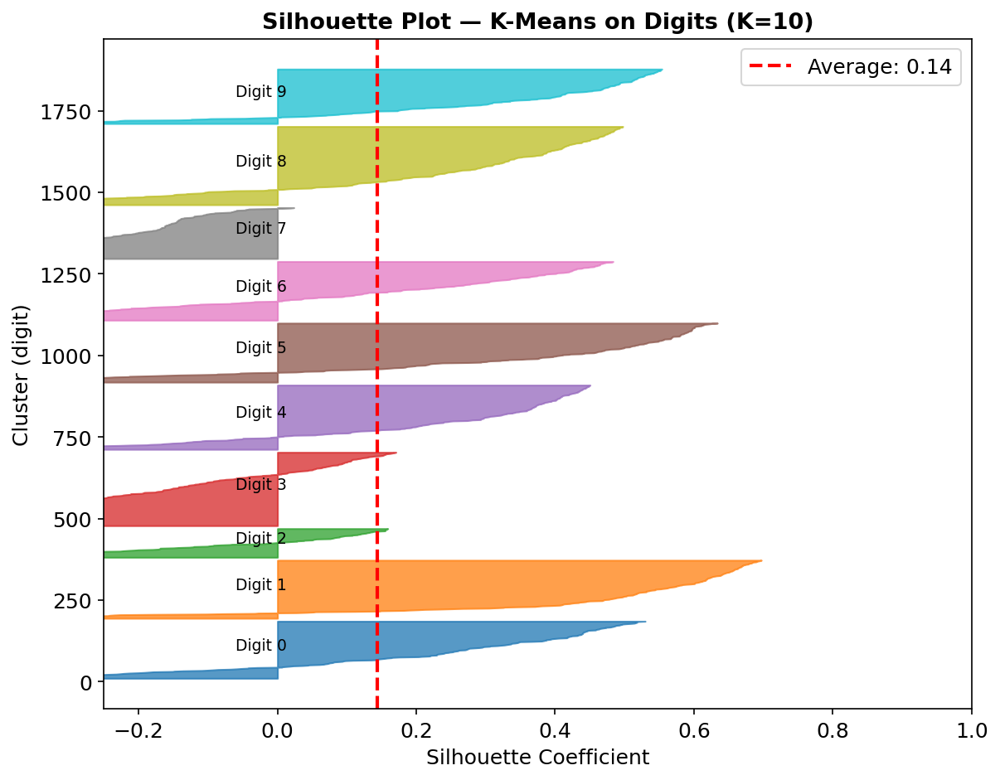

The silhouette plot shows per-cluster and per-point silhouette values.

For each cluster, horizontal bars represent individual silhouette values. The red dashed line is the average. A good clustering shows:

- Bars that extend well beyond the average line
- Similar bar lengths across clusters (balanced quality)
- Few or no negative values
- Roughly similar bar widths (balanced cluster sizes)

When a particular $K$ produces one very long bar and several thin ones, it may be splitting real clusters. When every bar is roughly the same, the clustering is consistent.

**Bottom line:** use the elbow to narrow down candidates; use silhouette to choose between them.

---

# Beyond K-Means - The Need for Hierarchy

K-Means produces a **flat** partition, $K$ clusters, end of story. It tells you nothing about the relationship between clusters.

- Are two clusters similar to each other? Does one cluster naturally split into sub-clusters at a finer resolution?

**Hierarchical clustering** answers these questions by building a full tree of nested partitions. You don't commit to a specific $K$ in advance. Instead, you get a complete picture of how the data organizes itself at every granularity simultaneously.

This is particularly useful in:

- **Biology**: gene expression analysis where genes cluster at coarse and fine scales (gene families and sub-families)
- **Customer analytics**: national segments may contain regional sub-segments
- **Document organization**: topics contain sub-topics

The trade-off: hierarchical clustering is computationally expensive ($O(N^2)$ to $O(N^3)$), making it impractical for large datasets. K-Means scales to millions of points; hierarchical clustering typically tops out around tens of thousands.

---

# Agglomerative Clustering (Bottom-Up)

The more common approach is **agglomerative** (bottom-up):

1. Start with $N$ clusters - one per data point
2. At each step, merge the two **closest** clusters into one
3. Repeat until a single cluster remains

The result is a **dendrogram**, a binary tree where the leaves are individual data points and each internal node records when two clusters were merged.

**Why is this useful?** You can cut the dendrogram at any height to get any number of clusters. Run the algorithm once; read off $K = 2$, $K = 3$, or $K = 10$ by choosing the cut point. This is fundamentally different from K-Means where each $K$ requires a separate run.

**Complexity:**

- Time: $O(N^3)$ naively, $O(N^2 \log N)$ with optimized data structures
- Memory: $O(N^2)$ for the pairwise distance matrix

This is why hierarchical clustering is reserved for smaller datasets. For $N > 10{,}000$, K-Means is usually the only practical option.

---

# Linkage Methods - Defining Inter-Cluster Distance

To decide which two clusters to merge, we need a measure of **inter-cluster distance**. Different choices lead to very different dendrograms.

**Single linkage (minimum distance):**
$$d(A, B) = \min_{a \in A, b \in B} d(a, b)$$
Tends to produce long, chain-like clusters ("chaining effect"). Good for elongated clusters; bad at finding compact ones.

**Complete linkage (maximum distance):**
$$d(A, B) = \max_{a \in A, b \in B} d(a, b)$$
Tends to produce compact, roughly spherical clusters. Sensitive to outliers.

**Average linkage:**
$$d(A, B) = \frac{1}{|A||B|} \sum_{a \in A} \sum_{b \in B} d(a, b)$$
A compromise between single and complete. Generally robust.

---

# Linkage Methods - Defining Inter-Cluster Distance

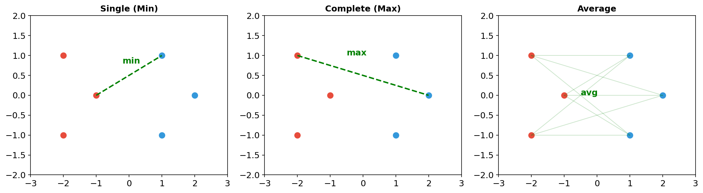

---

# Ward Linkage - The Standard Choice

Ward's method is the most widely used linkage criterion because it tends to produce compact, balanced clusters that look most like what K-Means would produce.

At each step, Ward chooses the merge that **minimizes the increase in total WCSS**:

$$d(A, B) = \sqrt{\frac{2|A||B|}{|A|+|B|}} \|\mu_A - \mu_B\|$$

where $\mu_A$ and $\mu_B$ are the centroids of clusters $A$ and $B$.

This is directly analogous to K-Means: both methods minimize within-cluster variance. Ward linkage agglomerative clustering often gives very similar results to K-Means on the same data, with the added benefit of the dendrogram.

**Practical rule:** start with Ward linkage. If your clusters are known to be elongated or non-compact, try single or average linkage instead.

---

# Reading a Dendrogram

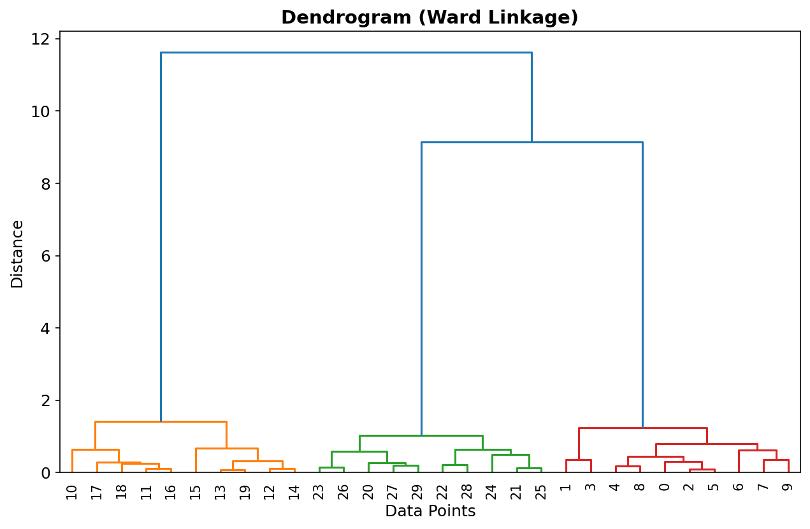

The dendrogram is read from bottom (leaves) to top (root):

- **Leaves**: individual data points
- **Height of each join**: the distance at which two clusters were merged
- **Horizontal cut at height $h$**: gives all clusters that existed at that threshold

To extract $K$ clusters: draw a horizontal line through the dendrogram and count the vertical lines it crosses. Each crossing is one cluster.

To choose $K$: find the **longest vertical gap**, the largest height interval with no merges.

- A long gap means the algorithm was reluctant to make that merge, suggesting a natural boundary between the groups below and above it.

---

# Hierarchical Clustering in Python

```python
from scipy.cluster.hierarchy import dendrogram, linkage
import matplotlib.pyplot as plt

# Compute the linkage matrix - Ward is the best default
Z = linkage(X_scaled, method='ward')

# Draw the dendrogram
plt.figure(figsize=(12, 6))
dendrogram(
 Z,
 truncate_mode='level', # Show only the last p merge levels
 p=5,
 leaf_rotation=90,
 leaf_font_size=10,
)
plt.axhline(y=10, color='r', linestyle='--', label='Cut at h=10')
plt.xlabel('Data Points')
plt.ylabel('Merge Distance')
plt.title('Ward Linkage Dendrogram')
plt.show()
```

---

# Extracting Clusters from the Dendrogram

```python
from scipy.cluster.hierarchy import fcluster
from sklearn.cluster import AgglomerativeClustering

# Option 1: cut by number of desired clusters
labels_by_k = fcluster(Z, t=3, criterion='maxclust')

# Option 2: cut by distance threshold
labels_by_d = fcluster(Z, t=10, criterion='distance')

# Option 3: scikit-learn (no dendrogram, but familiar API)
model = AgglomerativeClustering(n_clusters=3, linkage='ward')
labels = model.fit_predict(X_scaled)
```

The advantage of scipy `fcluster` over sklearn: you compute `Z` once and then try any number of $K$ values instantly - no rerunning the $O(N^2)$ algorithm each time.

---

# The Shape Problem with K-Means

K-Means and hierarchical clustering both struggle with one fundamental limitation: they assume clusters are **roughly convex** (spherical or at least compact).

- Show either algorithm a ring-shaped cluster or two interleaved crescent shapes, and they will cut right through the true clusters.

The reason is structural as both algorithms use Euclidean distance to centroid, and centroid-based methods naturally find convex shapes.

**DBSCAN** (Density-Based Spatial Clustering of Applications with Noise) takes a completely different approach. Instead of asking "_how far is this point from a center?_", it asks "_how many other points are near this point?_"

A **dense region** is a cluster. A **sparse region** separates clusters. Points in the gaps between dense regions are labeled as **noise**, an explicit "_this point doesn't belong to any cluster_" category that K-Means simply doesn't have.

This makes DBSCAN the natural choice for geospatial data (crime hotspot detection, disease outbreak mapping), anomaly detection, and any domain where clusters can take arbitrary shapes.

---

# DBSCAN - Core Concepts

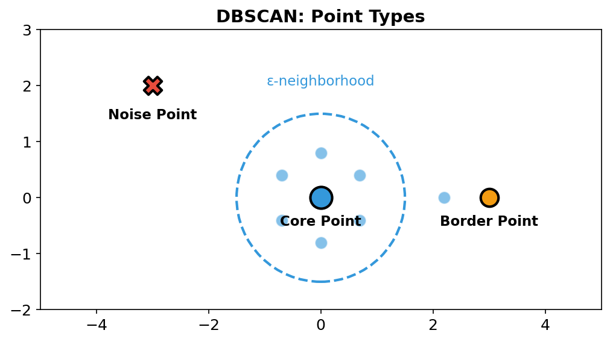

DBSCAN has two parameters:

- **$\varepsilon$ (epsilon)**: the neighborhood radius - how far we look
- **MinPts**: minimum number of points required to define a dense region

The $\varepsilon$-neighborhood of a point $p$:
$$N_\varepsilon(p) = \{q \in D : d(p, q) \leq \varepsilon\}$$

Every point is classified into exactly one of three types:

**Core point:** $|N_\varepsilon(p)| \geq \text{MinPts}$ - has enough neighbors to anchor a cluster

**Border point:** fewer than MinPts neighbors, but is within $\varepsilon$ of a core point, on the edge of a cluster

**Noise point:** neither core nor border, in a sparse region, belongs to no cluster

---

# DBSCAN Algorithm

1. Pick any unvisited point $p$
2. Compute $N_\varepsilon(p)$
3. If $|N_\varepsilon(p)| < \text{MinPts}$: mark $p$ as noise (may be reclassified later as border)
4. If $|N_\varepsilon(p)| \geq \text{MinPts}$: $p$ is a core point - start a new cluster and recursively expand by adding all density-reachable points
5. Mark $p$ as visited; move to the next unvisited point

**Key concept - density reachability:**

- $q$ is **directly density-reachable** from core point $p$ if $q \in N_\varepsilon(p)$
- $q$ is **density-reachable** from $p$ if there is a chain of directly reachable steps
- Two points are **density-connected** if both are reachable from a common core point

A cluster is a maximal set of mutually density-connected points.

---

# DBSCAN with Scikit-learn

```python
from sklearn.cluster import DBSCAN

dbscan = DBSCAN(
 eps=0.5, # ε - neighborhood radius
 min_samples=5, # MinPts
 metric='euclidean'
)

labels = dbscan.fit_predict(X_scaled)

# DBSCAN labels: -1 means noise
n_clusters = len(set(labels)) - (1 if -1 in labels else 0)
n_noise = (labels == -1).sum()

print(f"Clusters found: {n_clusters}")
print(f"Noise points: {n_noise} ({100*n_noise/len(labels):.1f}%)")
```

The `-1` label is DBSCAN's unique feature, explicit noise detection that K-Means cannot provide. In fraud detection, those `-1` points are often the most interesting ones.

---

# Choosing $\varepsilon$ - The k-Distance Graph

The hardest part of DBSCAN is setting $\varepsilon$.

- Too small: everything is noise.
- Too large: everything merges into one cluster.

The **k-distance graph** provides a principled approach:

```python
from sklearn.neighbors import NearestNeighbors

k = 5 # typically equal to MinPts
nbrs = NearestNeighbors(n_neighbors=k).fit(X_scaled)
distances, _ = nbrs.kneighbors(X_scaled)

# Sort the k-th nearest neighbor distances
k_distances = np.sort(distances[:, k-1])[::-1]

plt.plot(k_distances)
```

The elbow in this plot is the natural threshold: below it, points are densely packed; above it, they are in sparse regions. The distance at the elbow is your $\varepsilon$.

**Rule for MinPts:** $\text{MinPts} \geq d + 1$. For 2D data: MinPts = 4 or 5. For high dimensions: MinPts = $2d$.

---

# DBSCAN Example

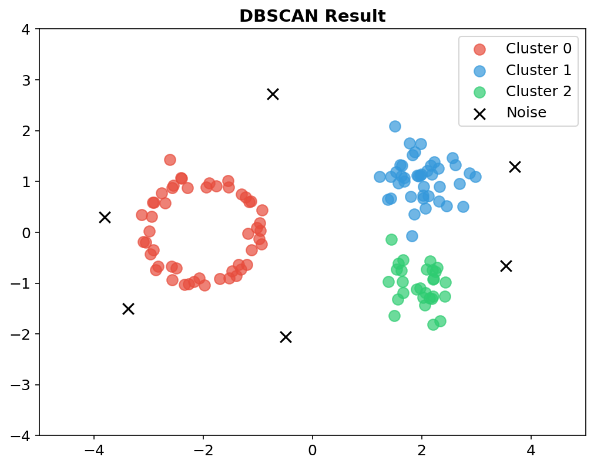

With $\varepsilon = 0.3$, $\text{MinPts} = 5$:

- **3 clusters** correctly identified, including ring and crescent shapes that would defeat K-Means
- **Noise points** (black) explicitly labeled - not forced into any cluster
- The dense inner ring and sparse outer region are correctly distinguished

K-Means on the same data would have split every cluster along a straight line, producing meaningless results.

**When to use DBSCAN:**

- You don't know $K$ in advance
- Clusters have irregular shapes
- There is noise or outliers in the data
- The data is 2D or 3D (parameter tuning gets harder in high dimensions)

---

# The Probabilistic Turn

K-Means has a fundamental limitation beyond just cluster shapes: every point is assigned to **exactly one cluster**, with complete certainty.

- A point at the boundary between two clusters gets assigned to one of them with no acknowledgment that it might plausibly belong to either.

This is **hard assignment**: $r_{nk} \in \{0, 1\}$.

In reality, uncertainty is meaningful information. A tumor measurement that falls between two cluster centers really is ambiguous. A customer whose behavior spans two segments genuinely belongs to both to some degree. Forcing a binary answer discards information.

**Gaussian Mixture Models (GMM)** provide the probabilistic alternative. Instead of assigning each point to one cluster, GMM assigns each point a probability distribution over all clusters. A boundary point might be 60% cluster A, 40% cluster B - and those probabilities are interpretable, meaningful quantities.

This shift from hard to soft assignment is the central conceptual leap of today's lecture. Everything else - the EM algorithm, the equations, the model selection - follows from it.

---

# The Gaussian Mixture Model

A GMM models the data as a **mixture of $K$ Gaussian distributions**. The density of a single observation is:

$$p(x) = \sum_{k=1}^{K} \pi_k \mathcal{N}(x \mid \mu_k, \Sigma_k)$$

Each component $\mathcal{N}(x \mid \mu_k, \Sigma_k)$ is a multivariate Gaussian - an elliptical "bump" in feature space. The **mixing coefficients** $\pi_k$ say how much of the overall density comes from each component:

$$0 \leq \pi_k \leq 1, \qquad \sum_{k=1}^K \pi_k = 1$$

**Parameters to learn:** $\pi_k$, $\mu_k$, and $\Sigma_k$ for each of the $K$ components - from data alone.

Why Gaussians? Because the multivariate Gaussian is the most mathematically tractable distribution for continuous data, and because the covariance matrix $\Sigma_k$ allows each cluster to have its own shape, size, and orientation - none of K-Means' spherical restriction.

---

# Latent Variables - Where Did This Point Come From?

The generative story behind GMM introduces a **latent variable** $z_n$ for each data point, a hidden indicator of which component generated that point.

$$p(z_k = 1) = \pi_k$$

Given the component assignment $z_k = 1$, the point is generated from:

$$p(x \mid z_k = 1) = \mathcal{N}(x \mid \mu_k, \Sigma_k)$$

Marginalizing over all possible $z$ recovers the mixture density:

$$p(x) = \sum_z p(z)\,p(x \mid z) = \sum_k \pi_k \mathcal{N}(x \mid \mu_k, \Sigma_k)$$

The problem: we observe $x$ but **never observe $z$**. This is what "latent" means - hidden. We need to estimate the parameters $\{\pi_k, \mu_k, \Sigma_k\}$ even though the component assignments are unknown. This is exactly what the EM algorithm handles.

---

# Responsibility: Soft Assignment

Given current parameters $\{\pi_k, \mu_k, \Sigma_k\}$, we can compute the **posterior probability** that component $k$ is responsible for data point $x_n$. This is called the **responsibility**:

$$\gamma(z_{nk}) = p(z_k = 1 \mid x_n)$$

Applying Bayes' theorem:

$$\gamma(z_{nk}) = \frac{\pi_k \mathcal{N}(x_n \mid \mu_k, \Sigma_k)}{\sum_{j=1}^{K} \pi_j \mathcal{N}(x_n \mid \mu_j, \Sigma_j)}$$

This is the **soft assignment**: every data point $x_n$ has a responsibility vector $(\gamma(z_{n1}), \ldots, \gamma(z_{nK}))$ that sums to 1. Compare with K-Means where this vector is $(0, \ldots, 0, 1, 0, \ldots, 0)$ - exactly one 1 and the rest 0.

**Example:** if a point sits exactly between two Gaussian components of equal weight, its responsibilities are $(0.5, 0.5)$. K-Means would have flipped a coin and given you $(0, 1)$ or $(1, 0)$. GMM tells the truth.

---

# Maximum Likelihood for GMM

We want to find parameters that maximize the probability of the observed data. The log-likelihood is:

$$\ln p(X \mid \pi, \mu, \Sigma) = \sum_{n=1}^{N} \ln \left\{ \sum_{k=1}^{K} \pi_k \mathcal{N}(x_n \mid \mu_k, \Sigma_k) \right\}$$

The summation **inside** the logarithm prevents a closed-form solution. Setting the derivative with respect to $\mu_k$ to zero gives an equation that still contains $\mu_k$ on both sides through the responsibilities $\gamma(z_{nk})$.

This is why we need the EM algorithm: responsibilities and parameters are coupled. We must alternate between computing responsibilities (E-step) and updating parameters (M-step).

---

# GMM M-Step Updates

Let $N_k = \sum_{n=1}^{N} \gamma(z_{nk})$ be the **effective number of points** assigned to component $k$. Then the M-step updates are:

**Means:** responsibility-weighted average of all data points
$$\mu_k^{\text{new}} = \frac{1}{N_k} \sum_{n=1}^{N} \gamma(z_{nk})\, x_n$$

**Covariances:** responsibility-weighted scatter around the new mean
$$\Sigma_k^{\text{new}} = \frac{1}{N_k} \sum_{n=1}^{N} \gamma(z_{nk})(x_n - \mu_k^{\text{new}})(x_n - \mu_k^{\text{new}})^T$$

**Mixing coefficients:** fraction of points effectively belonging to each component
$$\pi_k^{\text{new}} = \frac{N_k}{N}$$

Compare this with K-Means: in K-Means, $\gamma(z_{nk}) \in \{0,1\}$ so only assigned points contribute. In GMM, every point contributes, weighted by its responsibility.

---

# The EM Algorithm for GMM

The structure of the GMM updates suggests an iterative strategy: compute responsibilities using current parameters, then update parameters using those responsibilities. This is the **Expectation-Maximization (EM)** algorithm.

**E-step** - Evaluate responsibilities using current parameters:

$$\gamma(z_{nk}) = \frac{\pi_k \mathcal{N}(x_n \mid \mu_k, \Sigma_k)}{\sum_{j=1}^{K} \pi_j \mathcal{N}(x_n \mid \mu_j, \Sigma_j)}$$

**M-step** - Re-estimate parameters using the responsibilities computed above

**Convergence:** evaluate the log-likelihood after each M-step. It **never decreases**, EM is guaranteed to improve or maintain the log-likelihood at every iteration. Converge when the improvement falls below a threshold.

EM converges to a **local maximum** of the log-likelihood, not necessarily the global one.

- We can run K-Means first, use its cluster assignments as starting responsibilities.

---

# GMM with Scikit-learn

```python
from sklearn.mixture import GaussianMixture

gmm = GaussianMixture(
 n_components=3, # Number of Gaussian components
 covariance_type='full', # Full covariance matrices (most flexible)
 max_iter=100,
 n_init=10, # Multiple initializations (same logic as K-Means)
 reg_covar=1e-6, # Regularization to prevent singularity - keep this!
 random_state=42
)
gmm.fit(X_scaled)

labels = gmm.predict(X_scaled) # Hard assignment (argmax of responsibility)
probs = gmm.predict_proba(X_scaled) # Soft assignment - the responsibilities γ(z_nk)

# Inspect learned parameters
print("Mixing coefficients π_k:", gmm.weights_) # (K,)
print("Means μ_k:", gmm.means_) # (K, d)
print("Log-likelihood:", gmm.score(X_scaled))

# Model selection
print("AIC:", gmm.aic(X_scaled))
print("BIC:", gmm.bic(X_scaled))
```

---

# K-Means as a Limiting Case of GMM

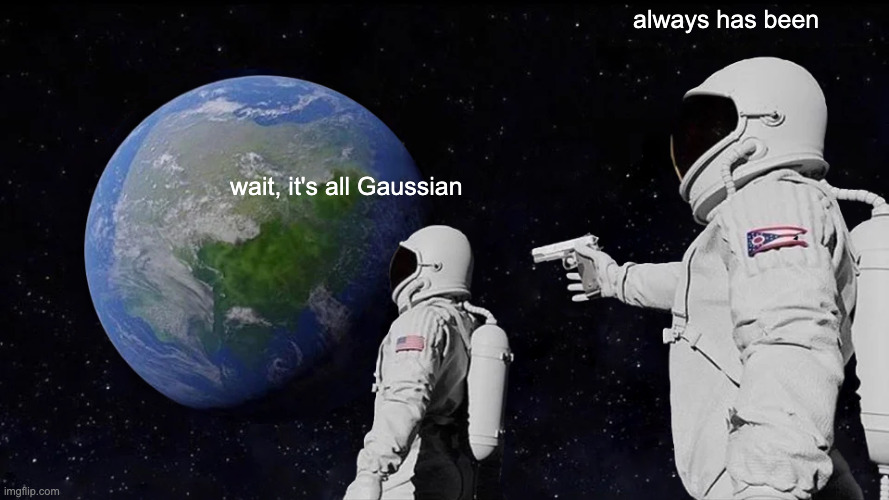

Consider a GMM with **shared, spherical covariances** $\Sigma_k = \varepsilon I$ and **equal mixing coefficients** $\pi_k = 1/K$. Now let $\varepsilon \to 0$.

The Gaussian density for component $k$ at point $x_n$ is proportional to $\exp\!\left(-\frac{\|x_n - \mu_k\|^2}{2\varepsilon}\right)$. As $\varepsilon \to 0$, the exponential with the **smallest argument** (the nearest center) completely dominates. All other terms vanish:

$$\gamma(z_{nk}) \to r_{nk} = \begin{cases} 1 & \text{if } k = \arg\min_j \|x_n - \mu_j\|^2 \\ 0 & \text{otherwise} \end{cases}$$

- The **E-step** becomes K-Means hard assignment
- The **M-step** (weighted mean with weights -> 0 or 1) becomes K-Means center update
- The EM log-likelihood becomes the negative of the K-Means distortion $J$

**K-Means is EM in the limit $\varepsilon \to 0$.** Hard assignment is a drastic approximation of soft assignment. The parameter $\varepsilon$ controls how "soft" the assignments are: large $\varepsilon$ = very soft (nearly uniform responsibilities), $\varepsilon \to 0$ = completely hard (K-Means).

---

# Model Selection for GMM - BIC and AIC

Since GMM has a proper likelihood, we can use information criteria to choose $K$.

**AIC (Akaike Information Criterion):**
$$\text{AIC} = -2 \ln L + 2p$$

**BIC (Bayesian Information Criterion):**
$$\text{BIC} = -2 \ln L + p \ln N$$

where $L$ is the maximized log-likelihood, $p$ is the number of free parameters, and $N$ is the number of data points. **Lower is better.** BIC penalizes model complexity more heavily and tends to prefer simpler models.

```python
bics = [GaussianMixture(n_components=k, random_state=42).fit(X_scaled).bic(X_scaled)
 for k in range(1, 11)]

optimal_k = bics.index(min(bics)) + 1
print(f"BIC-optimal K = {optimal_k}")
```

Unlike the elbow method, BIC gives an unambiguous answer: pick the $K$ that minimizes it.

---

# GMM Visualization

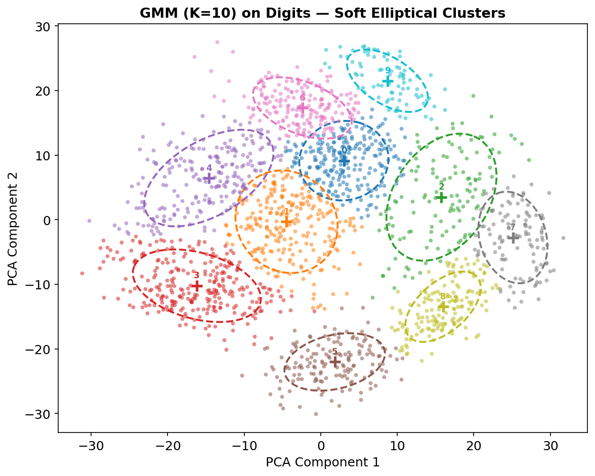

## Elliptical Clusters

Each Gaussian component is represented as an ellipse. The ellipse axes and orientations come from the eigenvectors and eigenvalues of $\Sigma_k$ - exactly the covariance geometry from Week 3.

- Large eigenvalue = wide axis = high variance in that direction
- The eigenvector gives the direction of maximum/minimum spread

Colors show the responsibility $\gamma(z_{nk})$ - points near the boundary between two ellipses get intermediate colors, not a hard cutoff.

**Compare with K-Means:** K-Means would draw straight-line boundaries wherever two circles are equidistant. GMM draws boundaries that respect the actual shapes and sizes of the clusters.

---

# Internal vs. External Evaluation

Evaluating a clustering is tricky because there is no ground truth $y$ to compare against. We distinguish two regimes:

**Internal metrics** - no labels required. Measure whether the clustering is geometrically clean based only on the data and the cluster assignments. Used whenever labels aren't available (the typical unsupervised case).

**External metrics** - true labels are available. Measure agreement between the discovered clusters and the known categories. Used when you have a labeled dataset and want to verify that your clustering recovers the known structure.

A clustering with high silhouette score is not automatically "_correct_" as it may have found a partition that is geometrically clean but doesn't match any meaningful real-world categories.

**Always validate with domain knowledge.**

---

# Internal Metrics

**Silhouette Score** (higher is better, range $[-1, 1]$):
$$\bar{s} = \frac{1}{N}\sum_{i=1}^{N} \frac{b(i) - a(i)}{\max(a(i), b(i))}$$

**Davies-Bouldin Index** (lower is better):
$$\text{DB} = \frac{1}{K}\sum_{i=1}^{K} \max_{j \neq i} \frac{\sigma_i + \sigma_j}{d(\mu_i, \mu_j)}$$
Average of the worst-case ratio of within-cluster scatter to between-cluster separation.

**Calinski-Harabász Index** (higher is better):
$$\text{CH} = \frac{\text{Between-cluster variance} / (K-1)}{\text{Within-cluster variance} / (N-K)}$$

An F-ratio measuring cluster separation over cluster compactness.

---

# External Metrics

**Adjusted Rand Index (ARI):** measures agreement between two partitions, corrected for chance.
$$\text{ARI} = \frac{\text{RI} - \mathbb{E}[\text{RI}]}{\max(\text{RI}) - \mathbb{E}[\text{RI}]}$$
Range: $[-1, 1]$. Score 1 = perfect agreement. Score 0 = random. Score $< 0$ = worse than random.

**Normalized Mutual Information (NMI):** entropy-based agreement measure.
$$\text{NMI} = \frac{2 \cdot I(Y; C)}{H(Y) + H(C)}$$
Range: $[0, 1]$. Score 1 = perfect recovery of true classes. Symmetric and invariant to label permutation.

Both metrics require knowing the true labels - they are for **benchmarking** algorithms on labeled datasets, not for production use on unlabeled data.

---

# Evaluation with Scikit-learn

```python
from sklearn.metrics import (
 silhouette_score,
 davies_bouldin_score,
 calinski_harabasz_score,
 adjusted_rand_score,
 normalized_mutual_info_score,
)

# Internal metrics - no ground truth needed
print("Silhouette: ", silhouette_score(X_scaled, labels))
print("Davies-Bouldin: ", davies_bouldin_score(X_scaled, labels))
print("Calinski-Harabász: ", calinski_harabasz_score(X_scaled, labels))

# External metrics - requires true labels
print("ARI: ", adjusted_rand_score(true_labels, labels))
print("NMI: ", normalized_mutual_info_score(true_labels, labels))
```

**Quick reference:** for Silhouette and Calinski-Harabász, higher is better. For Davies-Bouldin, lower is better.

---

# Practical Guidelines and Algorithm Selection

Before running any clustering algorithm, preprocessing is essential.

**Scaling is critical.** K-Means and DBSCAN use Euclidean distance. If one feature (say, annual salary in dollars) is measured in thousands and another (years of experience) in single digits, the salary feature will dominate the distance computation entirely. The clustering will essentially ignore experience and segment purely on salary.

```python
from sklearn.preprocessing import StandardScaler, RobustScaler

# StandardScaler: zero mean, unit variance
# Good default for most clustering tasks
X_scaled = StandardScaler().fit_transform(X)

# RobustScaler: uses median and IQR, less sensitive to outliers
# Better when your data has heavy tails or extreme values
X_scaled = RobustScaler().fit_transform(X)
```

**Dimensionality reduction as preprocessing.** In high dimensions ($d > 50$), all pairwise distances tend to become similar, the "curse of dimensionality." Running PCA first to reduce to 10–20 dimensions often dramatically improves clustering quality.

---

# Which Algorithm to Choose?

| Situation                                           | Best choice                            |
| --------------------------------------------------- | -------------------------------------- |
| Large dataset ($N > 10^4$), spherical clusters      | K-Means or Mini-Batch K-Means          |
| Elliptical clusters of different sizes/orientations | GMM                                    |
| Arbitrary-shaped clusters or known noise present    | DBSCAN or HDBSCAN                      |
| Need to see structure at multiple resolutions       | Hierarchical (Ward linkage)            |
| Need $K$ automatically determined                   | DBSCAN, HDBSCAN, or GMM with BIC       |
| Need probability estimates per point                | GMM                                    |
| Unknown cluster structure - exploratory             | Start with K-Means + PCA visualization |

When in doubt: **start with K-Means**, visualize with PCA or t-SNE, then decide if a more sophisticated algorithm is warranted. Complexity for its own sake is not a virtue.

---

# Summary - Clustering Algorithms

<div class="two-columns">
<div class="column">

## The Algorithms

**K-Means**

- Minimizes WCSS $J$ via Lloyd's algorithm
- Hard assignment: $r_{nk} \in \{0,1\}$
- Assumes spherical, equal-size clusters
- Always use K-Means++ + `n_init=10`

**Hierarchical (Ward)**

- Full dendrogram - read off any $K$
- Deterministic; best for small $N$

**DBSCAN**

- Density-based, finds arbitrary shapes
- Explicit noise detection ($-1$ label)
- No $K$ needed; tune $\varepsilon$ via k-distance graph

</div>
<div class="column">

## The Probabilistic View

**GMM**

- Soft assignment: $\gamma(z_{nk}) \in [0,1]$
- Elliptical clusters via $\Sigma_k$
- Trained by EM: E-step + M-step
- Watch for singularity; use `reg_covar`

**K-Means = GMM limit**

- $\Sigma_k = \varepsilon I$, $\varepsilon \to 0$ -> hard assignment
- Probabilistic justification for K-Means

**Model Selection**

- Elbow + Silhouette for K-Means
- BIC/AIC for GMM (objective, no eyeballing)

</div>
</div>

---

<!-- _header: "" -->
<!-- _footer: "" -->
<!-- _paginate: false -->

# Thank You!

## Contact Information

- **Email:** ekrem.cetinkaya@yildiz.edu.tr
- **Office Hours:** Wednesday 13:30-15:30 - Room C-120
- **Book a slot before coming:** [Booking Link](https://calendar.app.google/fog6DPBGJH2QpHVw8)
- **Course Repository:** [GitHub](https://github.com/ekremcet/yzm2011-introduction-to-machine-learning)
