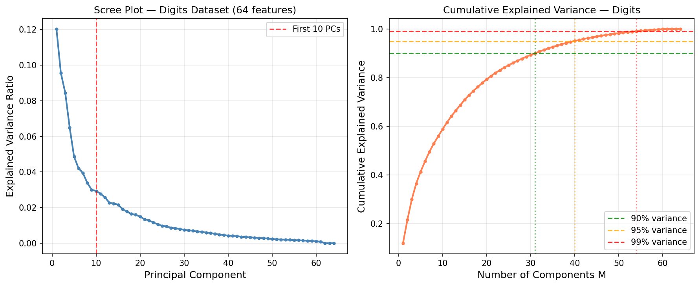
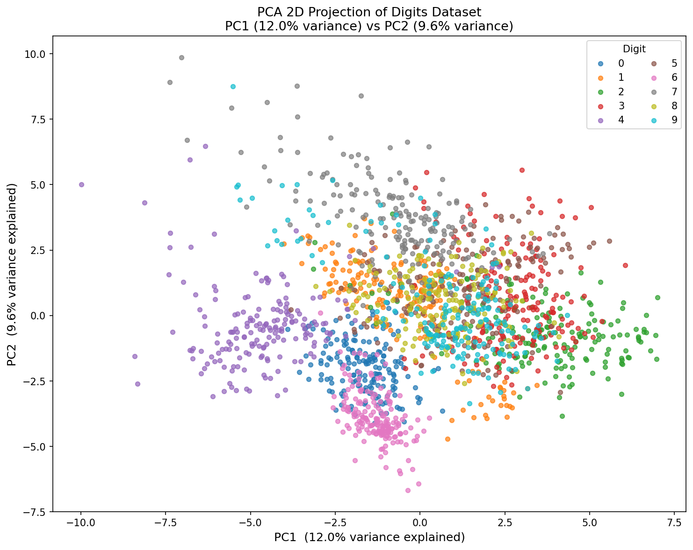
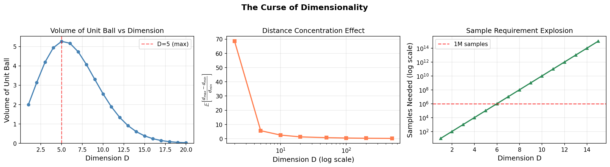
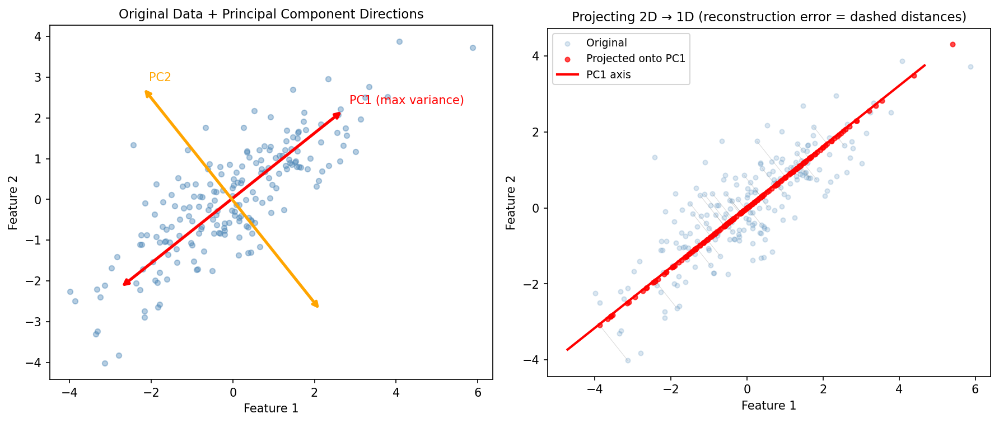
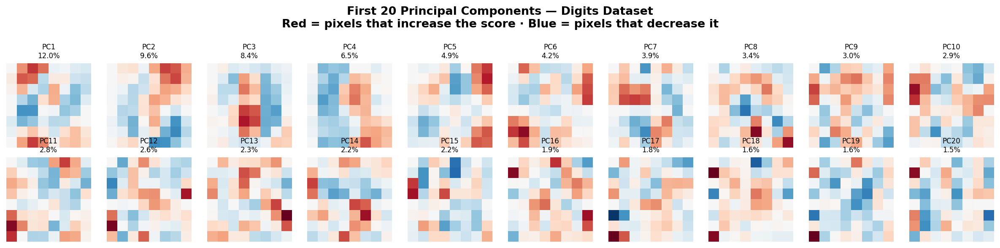
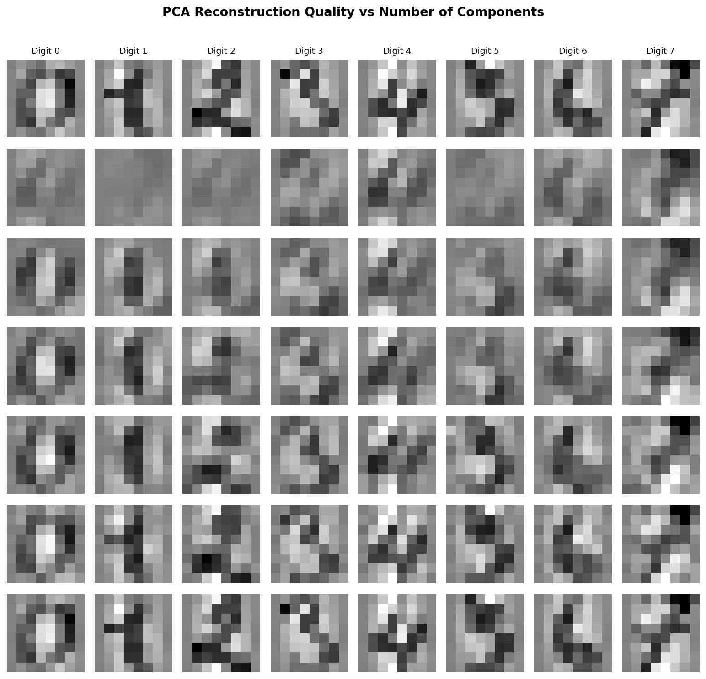
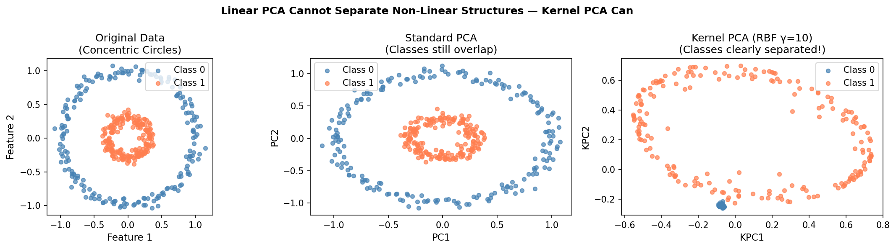
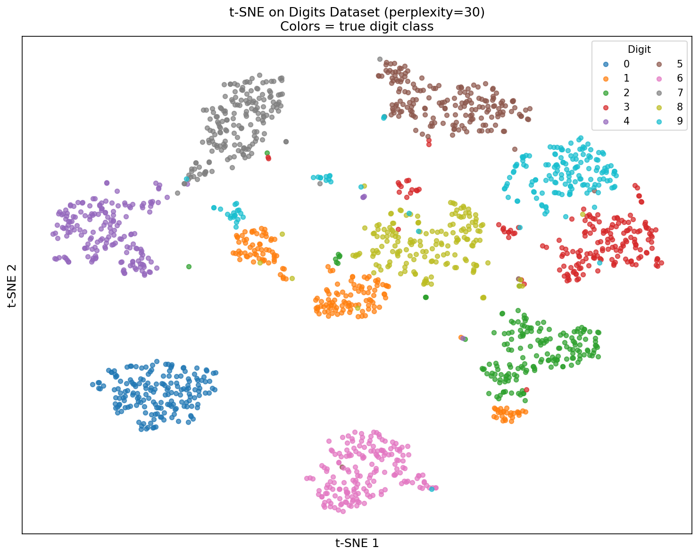
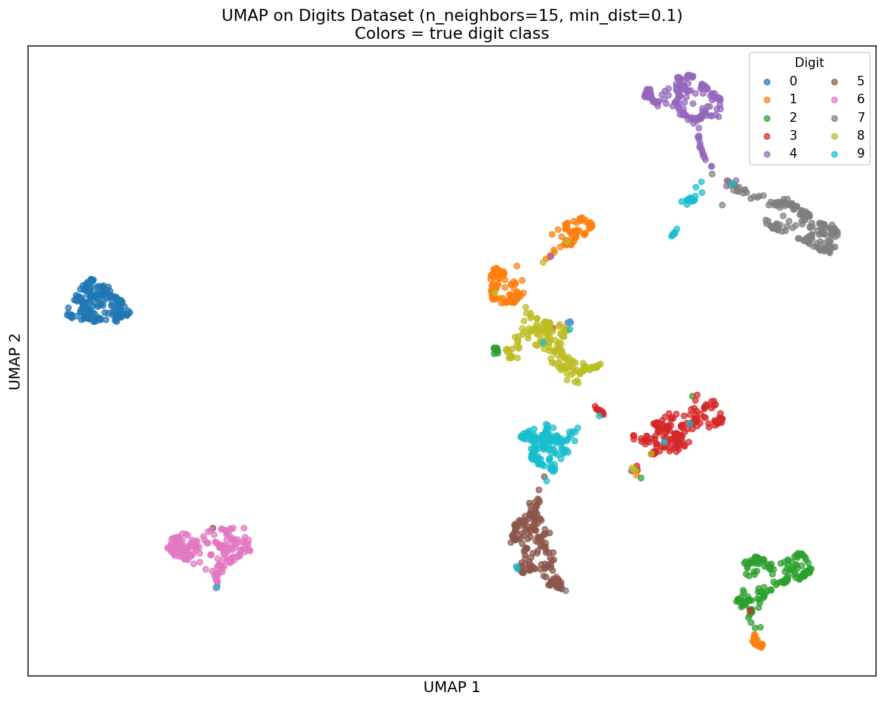
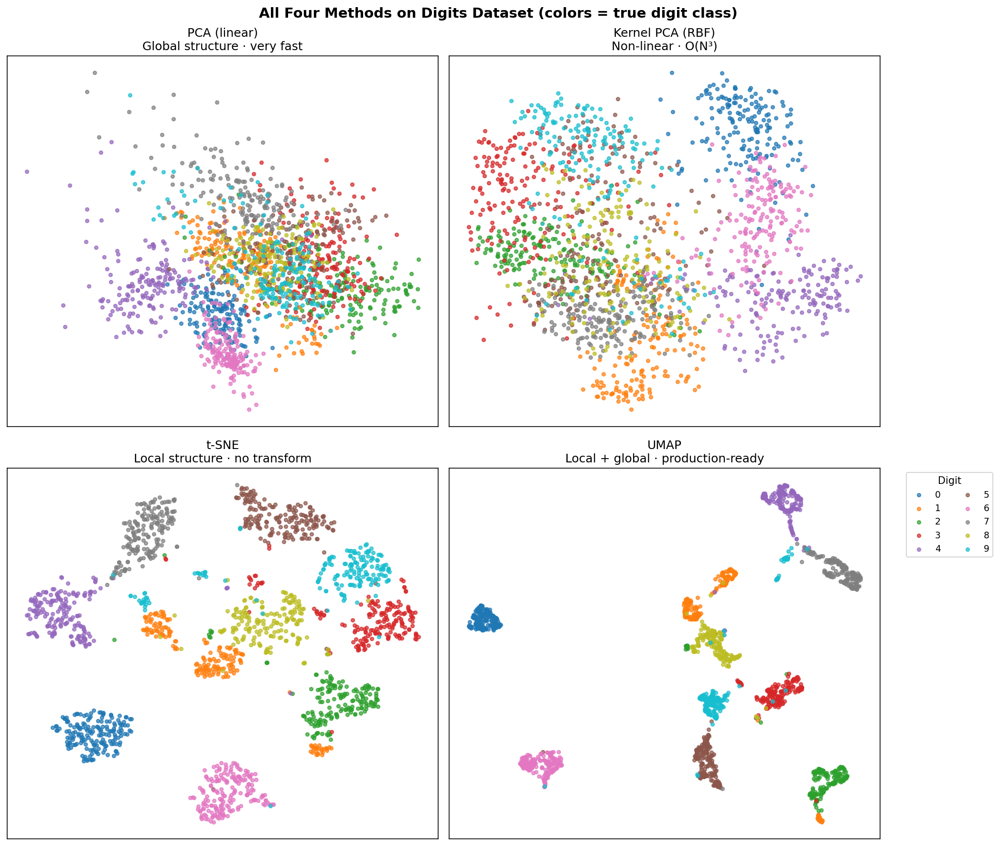

# YZM2011

## Introduction to Machine Learning

### Week 12: Dimensionality Reduction

**Instructor:** Ekrem Çetinkaya
**Date:** 12.05.2026

---

# Today's Agenda

<div class="two-columns">
<div class="column">

## Motivation and PCA

- **Curse of Dimensionality**
- Feature selection vs. feature **extraction**
- **PCA**: geometric intuition, Lagrange formulation, reconstruction
- Eigendigits: what principal components actually look like
- Explained variance, scree plot, choosing $M$
- High-dim trick and **Probabilistic PCA**

</div>
<div class="column">

## Nonlinear Methods and Practice

- **Kernel PCA**: the kernel trick for nonlinear structures
- **t-SNE**: visualizing clusters with local neighborhood preservation
- **UMAP**: fast, scalable, pipeline-friendly
- Side-by-side comparison of all four methods on Digits
- Which method for which situation?
- Best practices, common pitfalls, exercises

</div>
</div>

---

# Recap

Last week we built five clustering algorithms and tested them all on the same 1797 handwritten digit images - K-Means, K-Means++, hierarchical clustering, DBSCAN, and GMM.

Every single time we wanted to **visualize** what was happening, we quietly called `PCA(n_components=2).fit_transform(X)` without explaining why.

- The scatters suddenly made sense: the 64-dimensional points collapsed into a 2D picture where digit groups were visible, overlapping digits were close, and the K-Means boundaries could be read off directly.
- We also noted that "_in high dimensions ($d > 50$), all pairwise distances tend to become similar - running PCA first to reduce to 10–20 dimensions often dramatically improves clustering quality._"

This week we open that black box.

- PCA is not magic. It is a precise linear transformation that answers the question: **which direction in feature space carries the most information?**
- Understanding it properly - the eigendecomposition, the reconstruction error, the scree plot, what the components actually look like - gives you the vocabulary to make principled decisions every time you need to reduce dimensions, whether for visualization, preprocessing, noise removal, or building production pipelines.

And at the end we will ask: what happens when the structure is not linear? When the "natural" coordinates of your data live on a curved surface, not a flat subspace? That is where Kernel PCA, t-SNE, and UMAP come in.

---

# Running Example

**Same 1797 digit images from last week.** New question: what does dimensionality reduction reveal about their structure?

```python
from sklearn.datasets import load_digits
from sklearn.preprocessing import StandardScaler
from sklearn.decomposition import PCA

digits = load_digits()
X = StandardScaler().fit_transform(digits.data)  # 1797 × 64
pca = PCA(random_state=42).fit(X)
```

- **64 features** (pixel intensities in an 8×8 grid) - the same feature space K-Means searched for cluster centers
- **2 principal components** already explain ~28% of variance - enough to produce the scatter plots we used last week
- **30 components** capture ~90% - the digits genuinely live in a much lower-dimensional space than 64

The running question for this lecture: **how many dimensions do we actually need, and what do we lose by dropping the rest?**

---

# Running Example - Scree Plot



The left panel shows each component's individual contribution; the right shows cumulative variance.

- The steep drop in the first few components is the signature of real structure - the data doesn't spread uniformly across all 64 dimensions. Most of the digit variation lives in the first 10–15 directions.

* Beyond component ~40, each additional one adds less than 1% of variance: pure noise.

---

# PCA on Digits - The 2D Projection We Used Last Week



The horizontal axis (PC1) captures the direction of **maximum variance** across all 1797 images. The vertical axis (PC2) captures the next-best direction, perpendicular to PC1.

Notice that digits 0, 1, and 6 are already well-separated even in this minimal 2D projection as their visual structure is distinctive enough to show up in the top two variance directions.

- Digits 4 and 9 overlap heavily, which is why they were the hardest cluster pair.

The **28% total variance** these two components explain sounds modest, but it was enough to make the structure visible. The remaining 72% variance contains finer stroke details, not the coarse digit identity.

---

# What is Dimensionality Reduction?

Every dataset lives in some feature space $\mathbb{R}^D$. Dimensionality reduction is the task of finding a faithful lower-dimensional representation in $\mathbb{R}^d$ where $d \ll D$.

$$f: \mathbb{R}^D \rightarrow \mathbb{R}^d \quad \text{where } d \ll D$$

The word "_faithful_" is doing a lot of work here.

- Different methods have different opinions about what to preserve - global variance, local neighborhoods, topological structure, reconstruction accuracy.

* The choice of method therefore depends entirely on why you are reducing dimensions in the first place.

**Typical motivations:**

- **Computational efficiency** - training time and memory scale with $D$; reducing to $d$ makes every downstream model faster
- **Noise filtering** - real signals tend to occupy a low-dimensional subspace; the remaining dimensions are mostly noise that hurts generalization
- **Visualization** - humans can only see 2D or 3D; projecting to $d=2$ lets us explore the data structure visually
- **Preventing overfitting** - fewer features mean fewer parameters, shifting the variance-bias tradeoff toward lower variance
- **Better clustering** - clustering in the full 64D space can be worse than clustering in a clean 20D PCA projection

---

# High-Dimensional Data Examples

| Domain              | Typical Dimensions | Example                     |
| ------------------- | ------------------ | --------------------------- |
| Image Processing    | $10^4 - 10^6$      | 1000×1000 pixel image       |
| Text Mining         | $10^4 - 10^5$      | Bag-of-words representation |
| Genomics            | $10^4 - 10^6$      | Gene expression microarrays |
| Sensor Data         | $10^2 - 10^4$      | IoT sensor networks         |
| Finance             | $10^2 - 10^3$      | Economic indicators         |
| Our Running Example | $64$               | 8×8 digit images            |

The human brain cannot visualize more than 3 dimensions. But the deeper problem is not visualization - it is the **curse of dimensionality**, which makes algorithms fundamentally unreliable in high-dimensional spaces regardless of whether we can picture the data.

---

# Two Main Approaches

There are two distinct strategies for reducing dimensionality:

**Feature selection** keeps a subset of the original $D$ features and discards the rest. The selected features retain their original meaning

- If you selected "_age_" and "_income_" from a 100-feature dataset, you can still interpret them directly.
- The trade-off is that selection is inherently limited: you can only achieve as low a dimension as the number of individually useful features.

$$\text{Selection: } \mathbf{x}' = [x_{i_1}, x_{i_2}, \ldots, x_{i_d}]$$

**Feature extraction** creates new features as combinations of the originals. PCA, for instance, creates each new feature as a weighted linear combination of all 64 pixels.

- The new features don't correspond to individual pixels, they are abstract directions in the original space but they can capture variance that no single pixel could capture alone.

$$\text{Extraction: } \mathbf{x}' = f(\mathbf{x}) = \mathbf{W}^T\mathbf{x}$$

For our digits dataset, feature extraction vastly outperforms selection:

- No single pixel is informative on its own (every pixel is sometimes dark, sometimes light depending on the digit), but a combination of many pixels in a carefully chosen direction captures digit identity beautifully.
- This is why PCA, not feature selection, is the go-to solution for image and text processing.

---

# The Curse of Dimensionality

Richard Bellman coined the phrase in 1961 to describe a collection of related phenomena that all make high-dimensional data pathological.

> "As dimensionality increases, data points become increasingly sparse in the space and distance measures lose their meaning."

The core problem is that **volume grows exponentially with dimension**.

- A unit cube in 1D has volume 1 and contains 100 uniformly distributed points with density 100.
- The same cube in 10D with the same 100 points has density $10^{-8}$ per unit volume.

Your data is almost certainly sitting in a nearly empty high-dimensional space.

Four consequences:

1. **Data sparsity** - no two training points are close to each other, so local algorithms (k-NN, DBSCAN, K-Means) become unreliable.
2. **Distance concentration** - the ratio $(d_{max} - d_{min}) / d_{min}$ approaches zero as $D \to \infty$; all points appear equally far from each other, making any distance-based algorithm meaningless
3. **Exponential sample requirement** - covering the space requires $O(k^D)$ points; this grows faster than any dataset you will ever collect
4. **Computational explosion** - covariance matrices are $D \times D$; eigendecomposition costs $O(D^3)$

---

# The Curse of Dimensionality



**Left**: the volume of a unit ball **decreases toward zero** past a few dimensions.

- In high dimensions, a sphere barely occupies its bounding cube, and all the volume concentrates in the corners.

**Center**: distance concentration measured empirically on random data

- The ratio $(d_{max} - d_{min})/d_{min}$ collapses rapidly.

**Right**: the number of samples you would need to maintain even a rough coverage of the space

- It explodes exponentially.

---

# Escaping the Curse

The curse is real, but it can be managed with simple strategies:

**Dimensionality reduction** - project to the intrinsic low-dimensional space of the data.

- The digits dataset has 64 dimensions, but digit images actually vary along far fewer independent directions: stroke width, angle, loop size, slant.
- PCA, t-SNE, and UMAP find those directions and discard the rest.

**Regularization** - L1/L2 penalties and dropout implicitly restrict the effective dimension of a model's parameter space, preventing it from fitting spurious high-dimensional correlations that exist only in the training data.

**Feature selection** - identify and keep only features that carry real signal; discard the dimensions that are noise or near-duplicates. This is useful in tabular data where individual features are interpretable.

**Manifold assumption** - most real data doesn't actually fill $\mathbb{R}^D$ uniformly; it lives on a low-dimensional manifold embedded in the high-dimensional space.

- A face image lives in $\mathbb{R}^{10^6}$ but the set of all human faces is a tiny curved surface in that space.
- Discovering that manifold is exactly what nonlinear methods like Kernel PCA and UMAP do.

---

# Feature Selection

**Feature selection** finds the most informative subset of the original features. It is the right tool when interpretability is crucial.

- For example, a doctor needs to know which specific biomarkers a model used; a regulator needs to audit a credit scoring model feature by feature.

$$\text{Possible subsets} = 2^D \quad \text{(exhaustive search is infeasible for any reasonable } D\text{)}$$

Three approaches:

**Filter methods** score each feature independently using a statistical criterion.

- Correlation with the target, mutual information, chi-square test, or variance threshold; and keep the top $k$.
- Fast and model-agnostic, but blind to interactions between features.

**Wrapper methods** use _model performance_ itself as the scoring criterion. Forward selection adds the best feature at each step; backward elimination removes the weakest one.

- More accurate than filters because it accounts for interactions, but computationally expensive at $O(2^D)$ in the worst case.

**Embedded methods** perform selection during training. L1 regularization drives some weights exactly to zero; Random Forest importance scores rank features by their cumulative contribution to split quality.

- Fast, interaction-aware, and do not require a separate selection phase.

---

# Feature Selection in Python

**Filter and variance-based methods** score features independently, no model required:

```python
from sklearn.feature_selection import (
    SelectKBest, f_classif,
    SelectFromModel, VarianceThreshold, RFE
)
from sklearn.ensemble import RandomForestClassifier

# Remove near-constant features (zero variance = zero information)
selector = VarianceThreshold(threshold=0.1)
X_filtered = selector.fit_transform(X)

# Filter: keep the K best features by ANOVA F-test (classification)
selector = SelectKBest(f_classif, k=20)
X_best = selector.fit_transform(X, y)
```

Both methods are fast and model-agnostic as they score each feature independently without fitting a downstream model, which makes them a good first pass before trying the more expensive methods on the next slide.

---

# Feature Selection in Python

**Embedded and wrapper methods** use model performance as the selection criterion:

```python
# Embedded: Random Forest importance scores (interaction-aware)
rf = RandomForestClassifier(n_estimators=100, random_state=42)
selector = SelectFromModel(rf, threshold='mean')
X_rf = selector.fit_transform(X, y)

# Wrapper: Recursive Feature Elimination
rfe = RFE(rf, n_features_to_select=20)
X_rfe = rfe.fit_transform(X, y)
```

Feature selection makes most sense for tabular data with meaningful individual features. For image, text, or sensor data (where no single feature is interpretable in isolation) feature **extraction** (PCA and friends) is almost always the better choice.

---

# What is PCA?

**Principal Component Analysis** finds the directions in feature space along which the data varies the most, then projects the data onto those directions to create a compact, lower-dimensional representation.

The core insight is that **variance = information**.

- If all 1797 digit images had exactly the same brightness in pixel (3, 3), that pixel carries zero information and you can drop it without losing anything.
- Conversely, a direction that captures 15% of total variance like the direction that separates "_strokes going up-left_" from "_strokes going up-right_" is carrying a significant portion of the signal.

Starting from centered data, PCA finds an orthogonal basis $\{\mathbf{u}_1, \mathbf{u}_2, \ldots, \mathbf{u}_D\}$ ordered so that projecting the data onto $\mathbf{u}_1$ gives the highest possible variance, $\mathbf{u}_2$ gives the highest variance in the remaining direction perpendicular to $\mathbf{u}_1$, and so on.

- These are the **principal components**.

The first $M$ of these directions form the best possible $M$-dimensional linear subspace for representing the data in the least-squares sense.

---

# PCA



Left: the principal component directions align with the axes of the data's ellipsoidal cloud - PC1 runs along the long axis (maximum spread), PC2 runs along the short axis (remaining spread), and they are perpendicular by construction.

Right: projecting onto PC1 collapses 2D data to 1D. The gray lines show the **reconstruction error** - the perpendicular distance between each original point and its projection onto the PC1 axis. PCA chooses PC1 to minimize the total squared length of those gray lines, which is mathematically identical to maximizing the variance of the projected points along the line.

---

# PCA

For centered data matrix $\mathbf{X} \in \mathbb{R}^{N \times D}$ (rows are samples, columns are features), the **sample covariance matrix** encodes how features co-vary:

$$\mathbf{S} = \frac{1}{N-1} \mathbf{X}^T \mathbf{X}$$

PCA solves two equivalent optimization problems:

**Maximum variance formulation** - find the unit vector $\mathbf{u}_1$ that maximizes the variance of the projected data $\mathbf{X}\mathbf{u}_1$:

$$\max_{\mathbf{u}_1} \; \mathbf{u}_1^T \mathbf{S} \mathbf{u}_1 \quad \text{subject to} \quad \|\mathbf{u}_1\| = 1$$

**Minimum reconstruction error formulation** - find the $M$-dimensional subspace that minimizes the average squared distance between each point and its projection:

$$\min_{\mathbf{U}_M} \; \frac{1}{N} \sum_{n=1}^{N} \|\mathbf{x}_n - \tilde{\mathbf{x}}_n\|^2$$

Both problems have the **same solution**: the eigenvectors of $\mathbf{S}$.

---

# PCA for High-Dimensional Data

### The problem when $D \gg N$

If $D \gg N$ (e.g., genomics: 20,000 genes, 200 patients; face recognition: 65,536 pixels, 1,000 images) the $D \times D$ covariance matrix $\mathbf{S}$ is enormous and its eigendecomposition costs $O(D^3)$. This is completely impractical.

### The dual trick

Instead of the $D \times D$ covariance, compute the $N \times N$ Gram matrix:

$$\mathbf{K} = \frac{1}{N}\mathbf{X}\mathbf{X}^T$$

Eigendecompose $\mathbf{K}$ to get eigenvectors $\mathbf{v}_i$, then recover the PCA eigenvectors:

$$\mathbf{u}_i = \frac{1}{\sqrt{N\lambda_i}} \mathbf{X}^T \mathbf{v}_i$$

**Complexity drops from $O(D^3)$ to $O(N^3)$.** For our digits dataset ($D = 64$, $N = 1797$), the standard covariance approach is actually cheaper. But for genomics or face images, this trick makes PCA tractable - and it is the same Gram-matrix insight that underlies the kernel trick for Kernel PCA.

---

# PCA Algorithm - Step by Step

1. **Center the data:** $\mathbf{X} \leftarrow \mathbf{X} - \bar{\mathbf{x}}$ (subtract the column means; each feature now has mean 0)
2. **Compute covariance:** $\mathbf{S} = \frac{1}{N-1}\mathbf{X}^T\mathbf{X}$ (a $D \times D$ symmetric positive semi-definite matrix)
3. **Eigendecompose:** $\mathbf{S} = \mathbf{U}\mathbf{\Lambda}\mathbf{U}^T$ (guaranteed real eigenvalues because $\mathbf{S}$ is symmetric)
4. **Sort:** order eigenvectors by descending eigenvalue - $\lambda_1 \geq \lambda_2 \geq \ldots \geq \lambda_D \geq 0$
5. **Select:** take the first $M$ eigenvectors into $\mathbf{U}_M$
6. **Project:** $\mathbf{Z} = \mathbf{X}\mathbf{U}_M$

---

# What Do Principal Components Look Like?



Each panel is one principal component reshaped into an 8×8 image - an **"eigendigit"**. Red pixels have a large positive weight; blue pixels have a large negative weight.

- PC1 (~15% variance) captures the broadest contrast: high-on-top vs high-on-bottom strokes.
- PC2 (~13%) captures left vs right pixel mass.
- By PC5–10 the patterns become increasingly fine-grained - distinguishing curved vs angular strokes, loop presence, etc. \* By PC20, the patterns look like fine texture and noise.

**The key insight:** each principal component is a _direction_ in pixel space, not a prototype digit. When you project digit "4" onto PC1, you get a scalar that says "how much does this digit resemble the top/bottom contrast pattern?" The collection of 64 such scalars reconstructs the full image; keeping only the first $M$ is equivalent to keeping only the $M$ most globally informative patterns.

---

# Explained Variance Ratio

The **explained variance ratio** tells you what fraction of the total variance in the data each component captures.

**Per-component**

$$\text{EVR}_i = \frac{\lambda_i}{\sum_{j=1}^{D} \lambda_j}$$

**Cumulative**

$$\text{EVR}^{(M)} = \frac{\sum_{i=1}^{M} \lambda_i}{\sum_{j=1}^{D} \lambda_j}$$

**Reading the numbers for our Digits dataset:**

- EVR₁ ≈ 0.148 -> PC1 alone explains 14.8% of all pixel variation across 1797 images
- EVR₁ + EVR₂ ≈ 0.281 -> the 2D scatter we used throughout Week 11 captures 28.1%
- Cumulative EVR at $M=21$ ≈ 0.90 -> 21 components are sufficient for 90% fidelity
- Cumulative EVR at $M=41$ ≈ 0.99 -> 41 of 64 components carry 99% of variance

The remaining components (42–64) explain only 1% collectively.

---

# Selecting the Number of Components

There is no universally correct number of components - the right $M$ depends on your downstream goal.

Three approaches you can follow:

**Variance threshold** is the most reproducible choice in production. Pick the smallest $M$ such that cumulative explained variance exceeds a target.

```python
pca = PCA(n_components=0.95)   # keep exactly enough components for 95% variance
X_reduced = pca.fit_transform(X_scaled)
print(f"Selected M = {pca.n_components_} components")
```

**Scree plot (elbow method)** - plot the eigenvalues and look for the "_elbow_" where the curve flattens.

- For the Digits dataset there is a noticeable bend around $M = 10$–$15$, matching the intuition that 10 digit classes drive most of the variation.
- The scree plot is indispensable for exploration and communication with non-technical stakeholders.

**Kaiser criterion** is for standardized data (as produced by `StandardScaler`), keep components with $\lambda > 1$.

- A component explaining less variance than a single original standardized feature is not improving your representation.
- This criterion is common in social sciences but less used in ML.

---

# Scree Plot

Fit PCA without a component limit to obtain all 64 explained variance ratios, then compute the cumulative sum:

```python
import matplotlib.pyplot as plt
import numpy as np
from sklearn.decomposition import PCA

# Fit with no n_components - compute all 64 components
pca = PCA()
pca.fit(X_scaled)

evr = pca.explained_variance_ratio_   # array of 64 values summing to 1.0
cumulative = np.cumsum(evr)           # monotone from 0 to 1.0

fig, axes = plt.subplots(1, 2, figsize=(12, 4))
```

The `explained_variance_ratio_` attribute contains the fraction of total variance each component explains, already sorted descending. The cumulative sum directly gives the answer to "_how many components do I need for X% variance?_"

---

# Scree Plot

Plot the individual and cumulative explained variance:

```python
# Left: individual contributions - the classic "scree" shape
axes[0].plot(range(1, len(evr)+1), evr, 'o-', color='steelblue', markersize=3)
axes[0].set_xlabel('Principal Component')
axes[0].set_ylabel('Explained Variance Ratio')
axes[0].set_title('Scree Plot - Digits (64 features)')

# Right: cumulative with threshold lines at 90 / 95 / 99 %
axes[1].plot(range(1, len(evr)+1), cumulative, 'o-', color='coral', markersize=3)
for t, c, l in [(0.90, 'green', '90%'), (0.95, 'orange', '95%'), (0.99, 'red', '99%')]:
    axes[1].axhline(y=t, color=c, linestyle='--', label=f'{l} variance')
axes[1].set_xlabel('Number of Components M')
axes[1].set_ylabel('Cumulative Explained Variance')
axes[1].legend()
```

---

# Scree Plot


---

# PCA in Python

Always standardize before fitting - PCA is sensitive to scale. Then choose between a fixed component count or a variance threshold:

```python
from sklearn.preprocessing import StandardScaler
from sklearn.decomposition import PCA

# ALWAYS standardize - a feature in thousands dominates the covariance matrix
scaler = StandardScaler()
X_scaled     = scaler.fit_transform(X_train)  # fit+transform on train only
X_test_scaled = scaler.transform(X_test)       # transform only - no refitting

# Two common ways to specify the number of components
pca = PCA(n_components=2)      # fixed: always return exactly 2 components
pca = PCA(n_components=0.95)   # adaptive: keep enough for 95% total variance

X_pca = pca.fit_transform(X_scaled)
print(f"Selected M = {pca.n_components_} components")
```

---

# PCA in Python

After fitting, inspect what you got and verify reconstruction quality:

```python
# Inspect the decomposition
print(f"Output shape:      {X_pca.shape}")                       # (N, M)
print(f"Per-component EVR: {pca.explained_variance_ratio_}")
print(f"Total variance:    {pca.explained_variance_ratio_.sum():.2%}")
print(f"Components shape:  {pca.components_.shape}")             # (M, D)

# Reconstruct - compare to originals to measure information loss
X_reconstructed = pca.inverse_transform(X_pca)
mse = ((X_scaled - X_reconstructed)**2).mean()
print(f"Reconstruction MSE: {mse:.4f}")    # = sum of discarded eigenvalues / D
```

`pca.components_` is an $(M \times D)$ matrix - each row is one principal component direction in the original feature space. For our digits data, these rows reshape into the 8×8 eigendigit images we saw earlier.

---

# PCA Reconstruction - Digits



Each row shows 8 digit images reconstructed from $M$ principal components.

- Row 0 is the original (standardized). With $M=2$ (28% variance), the overall shape is a blurry as you can barely tell a "0" from a "6".
- At $M=8$ (55%) the digits become recognizable.
- By $M=16$ (72%) they are clearly readable. At $M=64$ (100%) reconstruction is perfect.

This grid is the scree plot made visual: the percentages in the row labels are the cumulative explained variances from that plot, and you can literally see what information each additional batch of components adds.

- The jump from $M=2$ to $M=4$ is dramatic; from $M=32$ to $M=64$ is almost imperceptible - consistent with the scree plot's rapid flattening past component 30.

---

# PCA Assumptions and Limitations

### What PCA assumes

**Linearity** - principal components are linear combinations of features. If the meaningful variation in your data lives along a curved manifold, PCA can only approximate it with a flat hyperplane, projecting away information that curvature encodes.

**Variance equals information** - PCA maximizes variance, which is a proxy for information content. If the most variable direction is actually noise (e.g., lighting variation dominates face images), PCA will faithfully capture that noise and push the signal to later components.

**Orthogonality** - components are constrained to be perpendicular. Real latent factors are often correlated - "age" and "experience" are not orthogonal in a hiring dataset - and forcing orthogonality can distort the low-dimensional picture.

### When PCA falls short

- **Non-linear manifolds** - a spiral, a sphere: PCA projects these onto flat subspaces and collapses the structure. -> Kernel PCA, t-SNE, or UMAP
- **Class separation matters** - PCA ignores labels entirely. Linear Discriminant Analysis (LDA) maximizes between-class variance and is the right choice when you want class-discriminative projections
- **Local structure matters** - PCA preserves global variance but distorts local neighborhoods. For exploring cluster sub-structure: -> t-SNE

---

# Probabilistic PCA

Classical PCA is a geometric algorithm, it finds directions and projects. **Probabilistic PCA** reinterprets the exact same solution as a **generative latent variable model**, which opens three new capabilities: EM training, principled Bayesian model selection, and a natural connection to GMM.

Each observation $\mathbf{x}$ is produced by a low-dimensional latent code $\mathbf{z} \in \mathbb{R}^M$ passed through a linear decoder and corrupted by isotropic Gaussian noise:

$$\mathbf{z} \sim \mathcal{N}(\mathbf{0}, \mathbf{I}), \qquad \mathbf{x} = \mathbf{W}\mathbf{z} + \boldsymbol{\mu} + \boldsymbol{\epsilon}, \qquad \boldsymbol{\epsilon} \sim \mathcal{N}(\mathbf{0}, \sigma^2\mathbf{I})$$

Marginalizing over the latent code gives a Gaussian over observations:

$$p(\mathbf{x}) = \mathcal{N}(\mathbf{x} \mid \boldsymbol{\mu}, \mathbf{C}), \qquad \mathbf{C} = \mathbf{W}\mathbf{W}^T + \sigma^2\mathbf{I}$$

GMM models data as a mixture of Gaussians fitted by EM, with **discrete** latent variables $z \in \{1,\ldots,K\}$. Probabilistic PCA also uses EM, but with **continuous** latent variables $\mathbf{z} \in \mathbb{R}^M$ - it compresses rather than clusters. A **mixture of Probabilistic PCAs** would do both simultaneously: cluster the data into $K$ groups and reduce dimensionality within each group.

---

# Kernel PCA - The Limitation of Standard PCA

PCA can only find **linear** structure. If the meaningful variation in your data lies along a curved surface a linear projection crushes that structure. The best flat plane through a ring collapses both circles onto overlapping intervals.

The fix is to map the data into a **higher-dimensional feature space** $\phi(\mathbf{x})$ where the structure becomes linear, then apply PCA there. In feature space, the covariance is:

$$\mathbf{C}_\phi = \frac{1}{N} \sum_{n=1}^{N} \phi(\mathbf{x}_n) \phi(\mathbf{x}_n)^T$$

The problem: $\phi$ might map into infinite-dimensional space as the RBF kernel implicitly corresponds to an infinite-dimensional feature map. We can never compute or store $\phi(\mathbf{x})$ explicitly.

The solution: we never need to. PCA in feature space only requires computing **inner products** $\phi(\mathbf{x}_i)^T \phi(\mathbf{x}_j)$, and those can be evaluated cheaply by a kernel function $k(\mathbf{x}_i, \mathbf{x}_j)$ without ever constructing $\phi$ - the same kernel trick that powers SVMs.

---

# Kernel PCA Algorithm

### Step 1 - Build the Gram (kernel) matrix

$$\mathbf{K}_{ij} = k(\mathbf{x}_i, \mathbf{x}_j), \quad \mathbf{K} \in \mathbb{R}^{N \times N}$$

### Step 2 - Center in feature space

$$\tilde{\mathbf{K}} = \mathbf{K} - \mathbf{1}_n\mathbf{K} - \mathbf{K}\mathbf{1}_n + \mathbf{1}_n\mathbf{K}\mathbf{1}_n, \quad \mathbf{1}_n = \frac{1}{n}\mathbf{1}\mathbf{1}^T$$

### Step 3 - Solve the eigenvalue problem

$$\tilde{\mathbf{K}} \boldsymbol{\alpha} = \lambda n \boldsymbol{\alpha}$$

### Step 4 - Project new points

$$z_k(\mathbf{x}) = \sum_{i=1}^{n} \alpha_i^{(k)}\, k(\mathbf{x}, \mathbf{x}_i)$$

Complexity is $O(N^3)$ for the eigendecomposition and $O(N)$ per new point for projection. This is fine for moderate $N$ but Kernel PCA does not scale to very large datasets - for $N > 10{,}000$, t-SNE or UMAP are usually faster and more practical.

---

# Kernel PCA



Left: the original concentric circles - a classic non-linear structure.

Center: standard PCA projects onto the best linear subspace, which cuts right through both circles and overlaps the two classes completely.

Right: Kernel PCA with an RBF kernel ($\gamma = 10$) implicitly maps the circles to a feature space where they are linearly separable, then applies PCA there. The result is a 2D embedding where both classes are cleanly separated.

This example demonstrates the fundamental limitation of linearity: no rotation, scaling, or projection of the raw features can separate these rings. You must use a nonlinear transformation first.

---

# Kernel PCA in Python

```python
from sklearn.decomposition import KernelPCA
from sklearn.pipeline import Pipeline
from sklearn.svm import SVC

kpca = KernelPCA(n_components=2, kernel='rbf', gamma=0.1)
X_kpca = kpca.fit_transform(X)
# gamma: small (0.001) = broad/global structure, large (10) = tight local neighborhoods

# In production: select gamma via downstream task accuracy, not visual inspection
pipe = Pipeline([
    ('kpca', KernelPCA(n_components=10, kernel='rbf', gamma=0.1)),
    ('clf',  SVC(random_state=42))
])
pipe.fit(X_train, y_train)
print(f"Accuracy: {pipe.score(X_test, y_test):.3f}")
```

Other kernels - `kernel='poly'` for polynomial interactions, `kernel='sigmoid'` for neural-network-like behavior - follow the same API. The RBF kernel is almost always the right starting point.

---

# Standard PCA vs Kernel PCA

| Feature           | Standard PCA                     | Kernel PCA                      |
| ----------------- | -------------------------------- | ------------------------------- |
| Transformation    | Linear                           | Non-linear                      |
| Complexity        | $O(D^3)$ eigen + $O(ND)$ project | $O(N^3)$ eigen + $O(N)$ project |
| Scales well for   | Large $D$, moderate $N$          | Moderate $N$ only               |
| Inverse transform | Exact analytic                   | Difficult / approximate         |
| Hyperparameters   | None                             | Kernel type + kernel params     |
| Interpretability  | Good (component loadings)        | Low                             |
| Missing data      | No                               | No                              |

**Rule of thumb:**

- Use standard PCA for preprocessing, noise removal, and visualization when data is approximately linear.
- Use Kernel PCA when you have evidence of non-linear structure and $N$ is manageable ($N < 10{,}000$).
- For larger $N$ with non-linear structure, t-SNE and UMAP are almost always the better choice.

---

# t-SNE - t-Distributed Stochastic Neighbor Embedding

Van der Maaten and Hinton (2008) designed t-SNE for one specific purpose: **visualizing high-dimensional data in 2D or 3D**.

- It preserves local neighborhood structure exceptionally well, producing the beautiful separated-cluster plots.

The core idea has two steps:

1. In the high-dimensional space, model pairwise similarity as a Gaussian probability: nearby points get high probability, distant points get near-zero probability.
2. In the 2D embedding, model similarity with a **Student's t-distribution** (heavier tails than Gaussian). Adjust the 2D positions iteratively via gradient descent to make the two probability distributions as similar as possible.

The heavy tails of the t-distribution solve the **crowding problem**: when collapsing from 64D to 2D, there is simply less room.

- Without heavier tails, all points would be forced toward the center in a dense undifferentiated mass.
- The t-distribution's heavier tails push moderately-far points further apart in 2D, creating the distinct separated islands that t-SNE is known for.

* Linear methods like PCA have no mechanism to do this as they treat every direction as equally important and compress everything proportionally.

---

# t-SNE - Perplexity Parameter

**Perplexity** is the most important t-SNE hyperparameter. It controls how many neighbors each point effectively considers - equivalently, the bandwidth $\sigma_i$ of the per-point Gaussian.

$$\text{Perplexity} = 2^{H(P_i)}, \quad H(P_i) = -\sum_j p_{j|i} \log_2 p_{j|i}$$

$\sigma_i$ is set by binary search until this entropy matches the target perplexity for each point.

| Perplexity | Effect                                                                        |
| ---------- | ----------------------------------------------------------------------------- |
| 5–10       | Focuses on tight local neighborhoods; clusters may fragment into sub-clusters |
| 30         | Good balance for most datasets with $N \sim 1000$–$10000$                     |
| 50–200     | Emphasizes global structure; nearby clusters may merge                        |

**Practical rule:** perplexity must be less than $N/3$. Typical range: 20–50.

- Always run with at least 3 different perplexity values and check that the cluster topology is stable

* If the structure changes dramatically between perplexity=10 and perplexity=50, the result is sensitive to the parameter and should not be over-interpreted.

---

# t-SNE in Python

Try to PCA-preprocess before t-SNE: it reduces noise in high-dimensional distances, speeds up computation, and enables the stable `init='pca'` option.

```python
from sklearn.manifold import TSNE
from sklearn.decomposition import PCA

# PCA pre-reduction - fewer dimensions, less noise, faster t-SNE
pca = PCA(n_components=30, random_state=42)
X_pca = pca.fit_transform(X_scaled)    # 1797 × 30

tsne = TSNE(
    n_components=2,
    perplexity=30,
    learning_rate='auto',  # sklearn ≥1.2 sets this optimally
    init='pca',            # PCA init is more stable than random
    random_state=42
)
X_tsne = tsne.fit_transform(X_pca)     # 1797 × 2
```

---

# t-SNE in Python

```python
import matplotlib.pyplot as plt

fig, ax = plt.subplots(figsize=(10, 8))
scatter = ax.scatter(
    X_tsne[:, 0], X_tsne[:, 1],
    c=y, cmap='tab10', alpha=0.7, s=15
)
plt.colorbar(scatter, label='Digit class')
ax.set_title('t-SNE on Digits (perplexity=30)')
ax.set_xticks([]); ax.set_yticks([])   # axes are arbitrary coordinates
plt.tight_layout()
plt.show()
```

The axes carry no interpretable unit as the only meaningful structure is which points cluster together and which do not.

---

# t-SNE on Digits



With `perplexity=30`, t-SNE produces separated digit clusters.

- If we compare this to the PCA 2D projection we saw earlier, where digits 4/9 and 3/8 were completely overlapping.

* t-SNE found genuinely non-linear structure that linear PCA cannot reveal. Each of the 10 digit classes forms a distinct island.

Notice that digit 1 sits in a long thin stripe

- Consistent with the fact that "1" images vary mainly in one dimension (slant angle), producing an intrinsically 1D cluster.
- Digits 4 and 9 are still close, but now separated as there is enough non-linear structure to pull them apart once we go beyond variance maximization.

---

# Important Notes on t-SNE

Three commong errors when interpreting t-SNE plots.

**Cluster sizes are artifacts.** t-SNE adaptively scales neighborhoods using a per-point bandwidth $\sigma_i$. Dense regions get a small $\sigma_i$ and sparse regions get a large one to equalize the effective neighborhood count. All clusters end up appearing at similar visual scale regardless of their true density

- A large island in the plot does not mean a large cluster in the original space.

**Distances between clusters mean nothing.** The KL divergence only constrains local neighborhood probabilities. Two clusters that appear close together in the t-SNE plot might be far apart in the original space or they might be close.

- There is no way to tell from the plot alone. t-SNE does not preserve global distances.

**Multiple runs look different.** The gradient descent has many local minima. Different random seeds or perplexity values can produce visually different plots even on identical data.

---

# Important Notes on t-SNE

Despite those caveats, t-SNE is an extremely valuable tool when used for what it was designed for.

**Confirming cluster reality.** After running K-Means or GMM you can ask: are these clusters genuine high-dimensional structure, or are they an artifact of the algorithm and initial conditions?

- If the clusters appear as separate islands in a t-SNE plot, the separation is real even if you cannot measure the inter-cluster distance from the plot.

**Detecting sub-structure.** t-SNE's focus on local neighborhoods can reveal sub-clusters within what K-Means labeled as a single group.

- If you see two sub-islands inside one cluster boundary, that is a genuine signal worth investigating.

**Sanity-checking embeddings.** Before trusting any high-dimensional representation (word vectors, image features from a neural network, gene expression profiles) a quick t-SNE plot shows whether semantically similar items cluster together. If they don't, your feature space needs work before modeling.

---

# UMAP - Uniform Manifold Approximation and Projection

McInnes, Healy & Melville (2018) built UMAP on a different theoretical foundation but it addresses the same problem as t-SNE, with four practical advantages.

**Preserves global structure better.** t-SNE's KL divergence is asymmetric and strongly penalizes mapping nearby high-dim points to distant low-dim positions, but barely penalizes the reverse.

- UMAP uses a symmetric cross-entropy-like loss, so inter-cluster distances in the embedding are more meaningful than in t-SNE.

**Much faster.** Complexity is $O(N^{1.14})$ versus t-SNE's $O(N^2)$. On 100K points, t-SNE takes hours; UMAP takes minutes.

**Supports `transform`** - t-SNE computes an entirely new embedding from scratch for every new dataset and cannot generalize to unseen points. UMAP learns a function and can apply it to new data, making it usable as a pipeline stage:

```python
reducer = umap.UMAP(n_components=2, random_state=42)
reducer.fit(X_train)                        # learn the embedding function
X_train_2d = reducer.transform(X_train)     # apply to train
X_test_2d  = reducer.transform(X_test)      # apply to new, unseen data
```

**Handles different metrics natively** - cosine, Manhattan, Hamming, or custom distance functions without any kernel engineering.

---

# UMAP - Key Hyperparameters

```python
import umap

reducer = umap.UMAP(
    n_neighbors=15,       # how many neighbors define "local structure"
    min_dist=0.1,         # how tightly points are packed in the embedding
    n_components=2,       # output dimensionality
    metric='euclidean',   # distance metric in the original space
    random_state=42
)
X_umap = reducer.fit_transform(X_scaled)
```

| Parameter             | Low value                            | High value                               |
| --------------------- | ------------------------------------ | ---------------------------------------- |
| `n_neighbors` (5–200) | Local structure only, ignores global | Global structure, smoother layout        |
| `min_dist` (0.0–1.0)  | Tight clusters, good for analysis    | Spread-out, better shows global topology |

A good starting point is `n_neighbors=15, min_dist=0.1` - the UMAP defaults. Increase `n_neighbors` if local clusters seem fragmented; decrease `min_dist` if you want more compact, distinct islands.

---

# UMAP - Supervised and Semi-Supervised Mode

UMAP also supports **supervised** mode: pass `y` to `fit_transform` and UMAP incorporates label information to additionally separate known groups.

```python
# Fully supervised: labels for all training points
X_umap_sup = reducer.fit_transform(X_scaled, y=y_train)

# Semi-supervised: use -1 to mark unlabeled points
y_partial = y_train.copy()
y_partial[unlabeled_indices] = -1
X_umap_semi = reducer.fit_transform(X_scaled, y=y_partial)
```

This makes UMAP useful not just for exploration but as a **metric-learning step before a classifier**: the supervised embedding pulls same-class points together and pushes different-class points apart, making the representation more discriminative than raw PCA while still being much faster than t-SNE.

---

# UMAP on Digits



Compared to the t-SNE, both methods produce well-separated digit islands, but notice the differences:

- **Inter-cluster distances are more meaningful** in UMAP - digits 4 and 9 are close (similar shapes), while 0 and 1 are far apart (very different strokes). In t-SNE, those distances were arbitrary.

- **Clusters are more compact** with `min_dist=0.1` - UMAP allows tighter packing within each island, making the within-cluster variation visible.

- The **overall layout preserves more global structure** - similar digits are in the same neighborhood of the embedding space, not scattered randomly.

If you need to inspect the embedding once and never reuse it, t-SNE is fine. If you need to add new digit images to the same plot, train a classifier on the embedding, or run this nightly, use UMAP.

---

# t-SNE vs UMAP

| Feature                   | t-SNE                                      | UMAP                                 |
| ------------------------- | ------------------------------------------ | ------------------------------------ |
| Speed                     | Slow $O(N^2)$                              | Fast $O(N^{1.14})$                   |
| Global structure          | Weak - inter-cluster distances meaningless | Good - distances partially preserved |
| Local structure           | Excellent                                  | Very good                            |
| Transform new data        | ✗ No - re-run from scratch                 | ✓ Yes - `fit` + `transform`          |
| Theoretical basis         | Probabilistic (KL divergence)              | Topological (fuzzy simplicial sets)  |
| Reproducibility           | Low (many local minima)                    | Higher (more stable)                 |
| Distance interpretability | Very low                                   | Moderate                             |
| Package                   | `sklearn.manifold.TSNE` built-in           | `pip install umap-learn`             |
| Use in pipeline           | ✗ Cannot generalize                        | ✓ Pipeline-friendly                  |

**Practical rule:** use t-SNE for exploratory visualization, use UMAP whenever the embedding needs to generalize to new data, be used in a training pipeline, or when the dataset exceeds 50K points.

---

# All Four Methods on Digits



**PCA** (top-left): fast linear projection - partial separation, many overlapping classes.

**Kernel PCA** (top-right): non-linear RBF mapping - some improvement, but very sensitive to $\gamma$.

**t-SNE** (bottom-left): clean separated islands at the cost of meaningless inter-cluster distances and no ability to embed new points.

**UMAP** (bottom-right): clean separation, meaningful distances, and `transform` support - the best all-round choice for both visualization and production use.

Each successive method trades computational cost and interpretability for more expressive structure preservation.

---

# Which Method for Which Situation?

| Situation                                    | Best choice                | Why                                           |
| -------------------------------------------- | -------------------------- | --------------------------------------------- |
| Preprocessing before classifier/clustering   | PCA                        | Fast, invertible, no hyperparameters          |
| Noise removal from high-dim data             | PCA                        | Keeps maximum-variance directions             |
| High $D$, low $N$ (genomics, face images)    | PCA with dual trick        | $O(N^3)$ instead of $O(D^3)$                  |
| Non-linear structure, moderate $N$           | Kernel PCA (RBF)           | Kernel trick handles curved manifolds         |
| Exploratory cluster visualization (one-shot) | t-SNE                      | Best local structure preservation             |
| Visualization + must embed new data          | UMAP                       | Supports `transform`; better global structure |
| Large dataset ($N > 50K$)                    | UMAP (or PCA -> UMAP)      | $O(N^{1.14})$ vs $O(N^2)$                     |
| Need interpretable features                  | PCA                        | Component loadings have meaning               |
| Production pipeline preprocessing            | UMAP or PCA                | Both support `fit` + `transform`              |
| Unknown structure                            | PCA -> scree plot -> t-SNE | Low cost, high information                    |

---

# Best Practices - Standardize First

Before applying any dimensionality reduction method, **always standardize** your features. PCA is sensitive to scale: a feature measured in thousands (e.g., annual salary) will dominate the covariance matrix and the first principal component will point almost entirely in its direction, ignoring all other features.

```python
from sklearn.preprocessing import StandardScaler

scaler = StandardScaler()
X_scaled      = scaler.fit_transform(X_train)  # fit+transform on train only
X_test_scaled = scaler.transform(X_test)        # transform only - no refitting
```

Fit the scaler only on training data as fitting on the test set leaks test distribution statistics into training and inflates performance metrics.

---

# Best Practices - Chain Methods for Large Data

**For large datasets, chain PCA -> t-SNE or UMAP.** Computing t-SNE directly on 50K × 1000 raw features is both slow and unreliable: high-dimensional Euclidean distances are noisy (curse of dimensionality again), and t-SNE's $O(N^2)$ complexity becomes prohibitive. Reduce to 30–50 dimensions with PCA first, keeping most of the signal, then apply the nonlinear method on the compact representation.

```python
from sklearn.decomposition import PCA
from sklearn.manifold import TSNE

# Step 1: fast linear pre-reduction
pca = PCA(n_components=50, random_state=42)
X_pca = pca.fit_transform(X_scaled)       # e.g. 50K × 1000 -> 50K × 50

# Step 2: nonlinear visualization on the compact representation
tsne = TSNE(n_components=2, init='pca', random_state=42)
X_tsne = tsne.fit_transform(X_pca)        # 50K × 2
```

---

# Evaluation

Evaluating dimensionality reduction requires matching the metric to the goal.

**Reconstruction error (PCA)** - quantifies how much information is lost. The relationship to eigenvalues makes this computable without running inverse transform:
$$\text{MSE} = \frac{1}{N}\sum_{i=1}^{N}\|\mathbf{x}_i - \hat{\mathbf{x}}_i\|^2 = \frac{1}{D}\sum_{i=M+1}^{D} \lambda_i$$

**Trustworthiness (t-SNE / UMAP)** - measures local neighborhood preservation. For each point, what fraction of its $k$ nearest neighbors in the low-dim embedding were also among its $k$ nearest neighbors in the original space?

**Downstream task performance** - Reduce to $M$ dimensions, train a classifier, measure accuracy on the test set. If accuracy is preserved (or improved) relative to the full $D$-dimensional space, the reduction is justified.

---

# Evaluation

Downstream task performance in Python:

```python
from sklearn.manifold import trustworthiness
trust = trustworthiness(X_scaled, X_tsne, n_neighbors=10)
print(f"Trustworthiness: {trust:.3f}")    # 1.0 = perfect local preservation

# Compare full-dim vs reduced-dim classification
from sklearn.neighbors import KNeighborsClassifier
knn_full = KNeighborsClassifier(5).fit(X_train_scaled, y_train)
knn_pca  = KNeighborsClassifier(5).fit(X_train_pca, y_train)
print(f"Full-dim accuracy:  {knn_full.score(X_test_scaled, y_test):.3f}")
print(f"PCA(30) accuracy:   {knn_pca.score(X_test_pca, y_test):.3f}")
```

---

# Summary - Dimensionality Reduction

<div class="two-columns">
<div class="column">

**Curse of Dimensionality**

- Volume concentrates in corners; distance metrics lose meaning
- Sample requirement grows as $O(k^D)$ - exponential in dimension
- Affects every distance-based algorithm

**PCA - the workhorse**

- Eigenvectors of covariance = principal component directions
- Maximizes variance ≡ minimizes reconstruction error (proved via Lagrange)
- Eigendigits: components are interpretable visual patterns
- Scree plot + cumulative EVR guide the choice of $M$
- Always standardize; always fit only on training data

**Probabilistic PCA**

- Latent variable model; EM training; handles missing data

</div>
<div class="column">

**Kernel PCA**

- Kernel trick: inner products in feature space via $k(\mathbf{x}_i, \mathbf{x}_j)$
- Handles curved manifolds; $O(N^3)$ - moderate datasets only

**t-SNE**

- KL divergence between Gaussian (high-dim) and t-dist (low-dim) neighborhoods
- Cluster sizes and inter-cluster distances are **not** interpretable
- Cannot embed new data - exploration only

**UMAP**

- Faster $O(N^{1.14})$; preserves global structure better than t-SNE
- Supports `fit` + `transform` -> production-ready pipeline step

</div>
</div>

---

<!-- _header: "" -->
<!-- _footer: "" -->
<!-- _paginate: false -->

# Thank You!

## Contact Information

- **Email:** ekrem.cetinkaya@yildiz.edu.tr
- **Office Hours:** Wednesday 13:30–15:30 - Room C-120
- **Book a slot before coming:** [Booking Link](https://calendar.app.google/fog6DPBGJH2QpHVw8)
- **Course Repository:** [GitHub](https://github.com/ekremcet/yzm2011-introduction-to-machine-learning)
