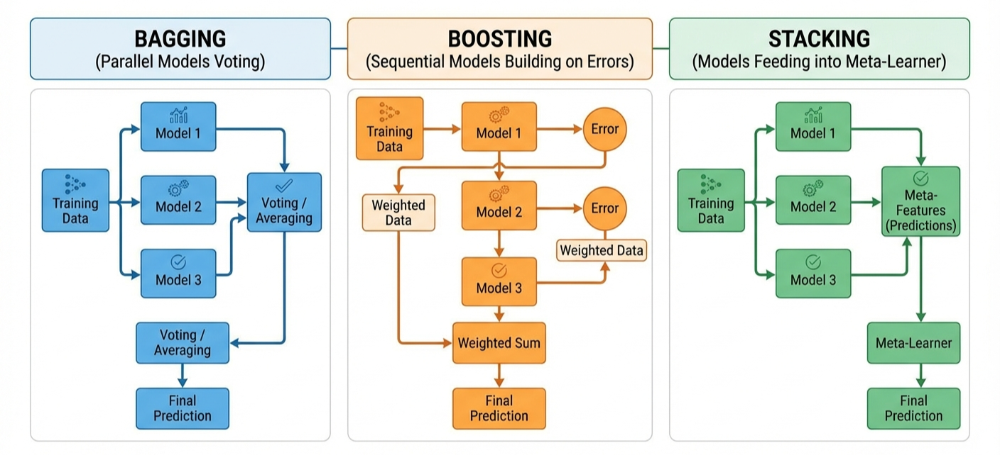
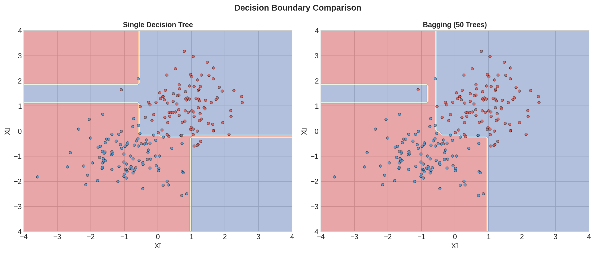
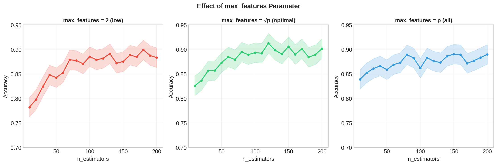
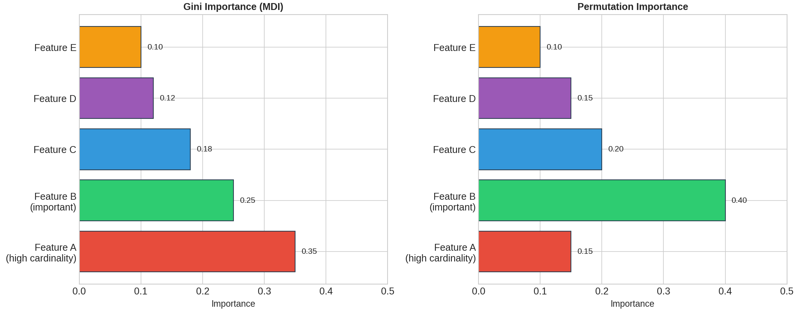
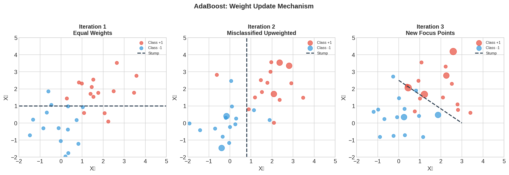
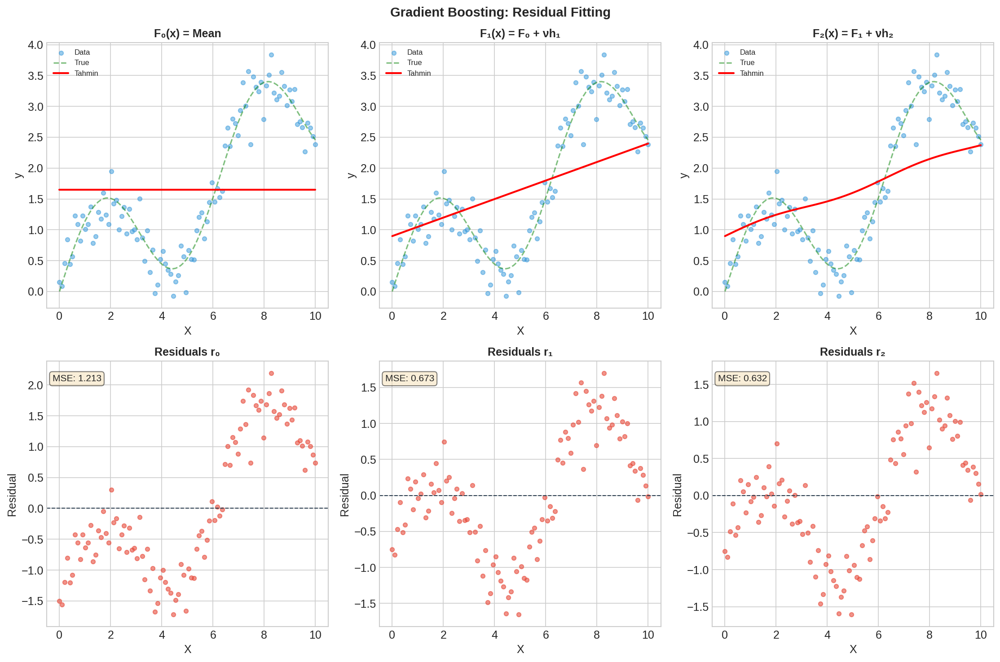
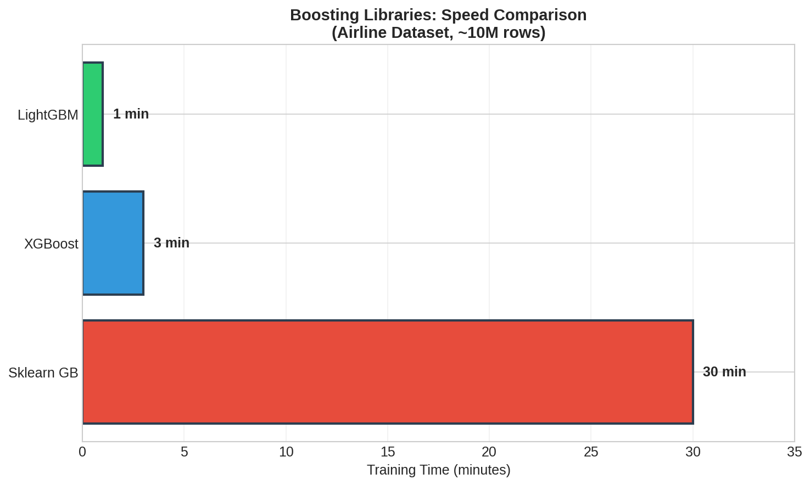

# YZM2011

## Introduction to Machine Learning

### Week 13: Ensemble Learning

**Instructor:** Ekrem Çetinkaya
**Date:** 02.06.2026

---

# Today's Agenda

<div class="two-columns">
<div class="column">

### Bagging and Random Forests

- Why combining models beats any single model, the **variance reduction** argument
- **Bagging**: bootstrap sampling and OOB error
- **Random Forest**: feature randomness kills inter-tree correlation
- Feature importance: **MDI** vs **Permutation** vs **SHAP**

</div>
<div class="column">

### Boosting and Combination Methods

- **AdaBoost**: adaptive sample reweighting
- **Gradient Boosting**: gradient descent in function space
- **XGBoost**, **LightGBM**, **CatBoost**: why modern libraries dominate
- **Stacking** and **Voting**: learned vs fixed combination
- Best practices, common mistakes, exercises

</div>
</div>

---

# Recap

Last week we asked: what do you do when your data has too many dimensions?

PCA distilled the 1797 digit images (64 pixels each) down to 2 principal components for visualization and 30 components to capture 90% of the variance.

t-SNE and UMAP revealed the non-linear cluster structure that linear PCA misses: distinct digit islands whose inter-cluster topology survives even after collapsing from 64 to 2 dimensions.

This week we approach the same Digits dataset from a completely different direction.

Instead of reducing the 64 features downward, we multiply the number of models upward, building 100 or 200 simple decision trees, each one imperfect on its own, and combining their votes into a prediction that decisively beats any single tree.

The insight is that **diversity in errors beats accuracy in individuals**.

A crowd of diverse guessers outperforms a single expert, as long as their mistakes are uncorrelated. The rest of this lecture is about how to engineer that diversity (through bootstrap sampling, random feature subsets, sequential error correction, and learned combination) and exactly why each design choice produces measurable accuracy gains.

---

# Running Example

**Same 1797 digit images.** New question:

- _Which ensemble gives the best digit classifier, and how much better than a single tree?_

```python
from sklearn.datasets import load_digits
from sklearn.model_selection import train_test_split

digits = load_digits()
X, y = digits.data, digits.target        # 1797 x 64, labels 0–9
X_train, X_test, y_train, y_test = train_test_split(
    X, y, test_size=0.2, random_state=42
)
```

---

# What is Ensemble Learning?

Consider a jury trial. Twelve independent jurors each reach a verdict and the majority rules.

- Individual jurors may be wrong, but they tend to be wrong about different cases as their errors are uncorrelated.
- So the majority vote cancels most individual mistakes.

**Ensemble learning applies this principle to prediction models.**

- An ensemble is a collection of base models whose predictions are combined
  - By majority vote, by averaging, or by a learned meta-model
- A final prediction that is more accurate and more stable than any individual base model.

Three conditions must hold for the combination to help:

- Base models must be reasonably accurate (better than random)
- Their errors must be diverse (not all correlated)
- The aggregation mechanism must be appropriate to the task.

All of ensemble theory is an elaboration of these three conditions.

---

# What is Ensemble Learning?



---

# Why Ensemble Works?

**The statistical reason.** Learning is underdetermined.

- With finite training data, many hypotheses fit the training set roughly equally well. Averaging over many plausible hypotheses reduces the risk of choosing the wrong one
  - This is the variance reduction that **Bagging** exploits.

**The computational reason.** Most optimization algorithms can only guarantee local optima.

- Different runs from different starting points can find different local optima; combining them explores the hypothesis space more thoroughly than any single run.
  - Random Forest's random feature subsets at each node improve accuracy over a single well-tuned tree.

**The representational reason.** Some functions cannot be exactly represented by any single model in a limited hypothesis class, but can be approximated arbitrarily well by a weighted combination.

- A single depth-limited decision tree cannot reliably separate digit 4 from digit 9 in 64-dimensional space; 200 trees with random feature subsets can.

---

# Bias-Variance Trade-off and Ensembles

$$E\left[(y - \hat{f}(x))^2\right] = \text{Bias}^2 + \text{Variance} + \text{Noise}$$

Different ensemble strategies target different components of this decomposition:

| Method       | Error Reduced | Mechanism                   |
| ------------ | ------------- | --------------------------- |
| **Bagging**  | Variance      | Bootstrap diversity         |
| **Boosting** | Bias          | Sequential error correction |
| **Stacking** | Both          | Meta-model learning         |

A single deep decision tree has low bias but high variance

- It fits the training data well but is sensitive to which training examples it saw.

Bagging addresses variance by averaging many trees.
Boosting starts with shallow, high-bias trees and removes bias by iterative refinement.

Which direction to pursue depends on where your current model's error is concentrated.

---

# Variance Reduction - The Mathematics

Let there be $N$ independent models, each with mean-zero errors $\epsilon_i$ and variance $\sigma^2$.

$$\hat{f}_{ens}(x) = \frac{1}{N} \sum_{i=1}^{N} \hat{f}_i(x), \qquad \text{Var}(\hat{f}_{ens}) = \frac{\sigma^2}{N}$$

Ensemble variance shrinks as $1/N$ - double the number of trees and halve the variance. In the limit of infinitely many independent trees, ensemble variance goes to zero and only irreducible bias and noise remain.

**This is the ideal case.** Real models trained on bootstrap samples of the same dataset are not independent.

- They share training data and therefore have correlated errors. The correlation $\rho$ limits improvement:

$$\text{Var}(\hat{f}_{ens}) = \rho\sigma^2 + \frac{1-\rho}{N}\sigma^2$$

When $\rho = 0$: variance collapses to $\sigma^2/N$. When $\rho = 1$: variance stays at $\sigma^2$ regardless of $N$.

**The key to better ensembles is not just more trees, it is less correlated trees.**

---

# Ensemble Taxonomy

Three architectural families cover all ensemble methods.

**Parallel ensembles** train base models independently and combine their predictions afterward.

- Models can be trained simultaneously and computationally efficient and easy to scale.
  - The combination rule is **Majority vote for classification, average for regression**.
- Bagging and Random Forest belong here as they reduce variance by averaging partially uncorrelated predictions.

**Sequential ensembles** train each base model specifically to correct the errors of the previous one.

- The sequence of models is not interchangeable, model $m$ was trained to fix model $m-1$'s specific mistakes.
- Training cannot be parallelized, but the sequential refinement reduces bias.
- AdaBoost, Gradient Boosting, XGBoost, and LightGBM all belong here.

**Meta-learning ensembles (stacking)** use a separate learned model to combine base model outputs.

- Rather than fixing the combination rule, stacking trains a meta-learner to discover which base models to trust for which parts of the input space.
- This is the most flexible approach and consistently achieves the highest accuracy usually at the cost of substantial complexity.

---

# Bagging (Bootstrap Aggregating)

Breiman (1996): **Bagging = Bootstrap Aggregating**.

1. From the training set $D$, draw $B$ bootstrap samples (with replacement, $N$ points each).

2. Train one base model $h_b$ on each sample $D_b$.

3. Aggregate predictions by majority vote (classification) or average (regression):

$$\hat{y} = \underset{c}{\text{argmax}} \sum_{b=1}^{B} \mathbb{1}[h_b(x) = c] \quad \text{(classification)}$$

$$\hat{y} = \frac{1}{B} \sum_{b=1}^{B} h_b(x) \quad \text{(regression)}$$

Each bootstrap sample contains ~63.2% of the original training points.

- Because models train on overlapping but distinct subsets, their errors are partially uncorrelated.
- Averaging over $B$ models averages out those uncorrelated errors, reducing ensemble variance without increasing bias.
- On Digits, a single tree varies ±3 points across seeds; 200 bagged trees vary less than 0.5 points.

---

# Bootstrap Sampling - Why 63.2%?

For a dataset of $N$ samples, each bootstrap sample draws $N$ examples **with replacement**.

$$P(\text{a specific point is not selected in one draw}) = 1 - \frac{1}{N}$$

$$P(\text{never selected in } N \text{ draws}) = \left(1 - \frac{1}{N}\right)^N \xrightarrow{N \to \infty} e^{-1} \approx 0.368$$

Each bootstrap sample contains, on average, **63.2% unique training examples**.

### Out-of-Bag (OOB) Samples

The remaining ~36.8% (points that happened not to be drawn) are the **OOB set** for that particular model.

- Every training point is OOB for roughly 37% of the $B$ trees.
- We can evaluate each point on exactly those trees and obtain a nearly unbiased estimate of generalization error with no holdout set required:

$$\hat{y}_i^{OOB} = \frac{1}{|S_i|} \sum_{b \in S_i} h_b(x_i), \quad S_i = \{b : x_i \notin D_b\}, \quad \text{OOB Error} = \frac{1}{N} \sum_{i=1}^{N} L(y_i, \hat{y}_i^{OOB})$$

---

# Bagging Algorithm

```
Input: Training data D = {(x₁, y₁), ..., (xₙ, yₙ)}, number of models B

1. For b = 1 to B:
   a. Draw bootstrap sample Dᵦ (N points with replacement from D)
   b. Train base model hᵦ on Dᵦ

2. Aggregate:
   - Classification: ŷ = argmax_c Σᵦ 𝟙[hᵦ(x) = c]  (majority vote)
   - Regression:     ŷ = (1/B) Σᵦ hᵦ(x)             (average)

Output: Ensemble {h₁, h₂, ..., hB}
```

The base model $h_b$ is typically a **fully-grown decision tree** (no pruning, no depth limit).

- A single deep tree has low bias but high variance, the conditions where averaging helps most.
- Pruned or shallow trees are less effective base models for Bagging because their variance is already low; you would need to address bias instead, which Boosting does better.

---

# Bagging in Python

```python
from sklearn.ensemble import BaggingClassifier
from sklearn.tree import DecisionTreeClassifier

bag = BaggingClassifier(
    estimator=DecisionTreeClassifier(),
    n_estimators=200,   # B: number of trees
    max_samples=1.0,    # bootstrap sample size (fraction of N)
    bootstrap=True,     # with-replacement sampling
    oob_score=True,     # compute OOB accuracy for free
    random_state=42,
    n_jobs=-1           # parallel training
)
bag.fit(X_train, y_train)
print(f"OOB Score:     {bag.oob_score_:.4f}")
print(f"Test Accuracy: {bag.score(X_test, y_test):.4f}")
```

Setting `oob_score=True` costs essentially nothing - OOB predictions are computed from trees that have already been trained. The resulting `oob_score_` is a reliable, cross-validated performance estimate without any data having been withheld.

---

# Bagging - Decision Boundary Effect

A single decision tree draws sharp, jagged boundaries that perfectly fit the training data but generalize poorly. Every corner and bump in the boundary is a memorized noise pattern.

Bagging with 200 trees smooths those boundaries dramatically.

- The ensemble boundary passes through regions where a majority of trees agree on a class change. Splits that only a few trees learned are smoothed away by the majority vote.

This smoothing is the geometric effect of variance reduction

- _The ensemble boundary is stable across different training sets, while any single tree's boundary would look quite different if the training data changed by even a few points_.

---

# Bagging - Decision Boundary Effect



---

# Bagging - Strengths and Limitations

**What Bagging fixes well.** Variance is its primary target.

- A single deep tree varies by ±3 percentage points depending on the random seed; 200 bagged trees are stable to ±0.5 points. - The improvement requires no hyperparameter tuning beyond the number of trees, training is fully parallelizable, and OOB error provides a reliable performance estimate for free.

**What Bagging cannot fix.** Bias is unchanged.

- If every tree systematically misclassifies certain digit-4 images because the tree family lacks the representational power to learn the right features, averaging 200 copies of that error faithfully reproduces the bias. _Boosting_ addresses this.

**The correlation problem.** When one or two features are vastly more informative than the rest, all trees will use those features at their roots, producing nearly identical tree structures despite bootstrap diversity.

- High correlation $\rho$ means $\text{Var}(\hat{f}_{ens}) \approx \rho\sigma^2$ regardless of how many trees you add.

---

# Random Forest

Breiman (2001): **Random Forest = Bagging + Random Feature Subsets**.

At each node of each tree, instead of searching over all $p$ features for the best split, Random Forest selects a random subset of $m \ll p$ features and searches only within that subset.

- The full feature set is never evaluated at any single node.

**Why does restricting the feature set help?** Even if one feature is vastly more informative than the rest, it will not appear at every node of every tree.

- Each tree is forced to find different pathways to the correct prediction using different feature subsets.
- Trees become more diverse, errors less correlated, and the $\rho\sigma^2$ floor in the variance formula drops.

For Digits: $p = 64$ pixels, $m = \sqrt{64} = 8$ per node.

- Each split decision uses 12.5% of the available pixels, enough to capture local stroke structure without any single pixel dominating every tree.

---

# Random Forest vs Bagging - The Correlation Problem

In plain Bagging, the most informative features appear near the **root of every tree**.

- When all $p$ features are evaluated at each node, strong features consistently produce the best splits and dominate every bootstrap sample.
- **The result:** all trees look structurally similar, and their errors are highly correlated.

The variance formula $\text{Var}(\hat{f}_{ens}) = \rho\sigma^2 + (1-\rho)\sigma^2/N$ shows the consequence:

- With $\rho$ close to 1, adding more trees barely helps. Bagging plateaus early.

**Random feature selection directly targets $\rho$.**

- By preventing the best feature from being evaluated at most nodes, the algorithm forces each tree to build a unique prediction pathway.
- **The cost:** each individual tree is slightly weaker because it sometimes misses the best split.
- **The benefit:** inter-tree correlation drops dramatically.

On Digits dataset when we apply this we can see clear improvement.

- Bagging (200 trees) achieves ~95%
- Random Forest (200 trees, $m=\sqrt{p}$) achieves ~97%.

The improvement comes entirely from reduced correlation, the trees are individually slightly weaker but collectively far more diverse.

---

# Random Forest - Choosing $m$

| `max_features` | Correlation | Individual tree | Typical use                |
| -------------- | ----------- | --------------- | -------------------------- |
| $m = 1$        | Very low    | Very weak       | Rarely useful              |
| $m = \sqrt{p}$ | Low         | Moderate        | **Classification default** |
| $m = p/3$      | Moderate    | Good            | **Regression default**     |
| $m = p$        | High        | Strong          | Equivalent to Bagging      |

The right value of $m$ balances individual tree strength against inter-tree diversity.

- As $m$ decreases toward 1, trees become more diverse but also weake
- As $m$ increases toward $p$, trees become stronger but also more correlated.

The defaults ($\sqrt{p}$ for classification, $p/3$ for regression) are well-validated empirical choices that work well across a wide range of datasets.

- In practice, varying $m$ by a factor of 2 in either direction usually changes accuracy by less than 1 percentage point.

---

# Random Forest Algorithm (1/2) - Growing Trees

```
Input: Training data D, number of trees B, features per node m

For b = 1 to B:
   a. Draw bootstrap sample Dᵦ from D (63.2% unique points)
   b. Grow tree Tᵦ:
      - At each node:
        i.   Sample m features from all p (without replacement)
        ii.  Find the best split among those m features
        iii. Split the node
      - Grow fully (no pruning)
```

Steps a–b repeat $B$ times in parallel.

- Each tree sees different data and different features at each node.

---

# Random Forest Algorithm (2/2) - Aggregation

```
Output: Random Forest {T₁, ..., TB}

Predict for new input x:

   Classification: ŷ = mode { T₁(x), T₂(x), ..., TB(x) }
                       (majority vote across all trees)

   Regression:     ŷ = (1/B) Σᵦ Tᵦ(x)
                       (average of all tree predictions)
```

Step i (random feature sampling) is the **only** difference from plain Bagging.

- By decorrelating trees, it breaks the correlation floor and allows variance to drop further.

---

# Random Forest in Python

```python
from sklearn.ensemble import RandomForestClassifier

rf = RandomForestClassifier(
    n_estimators=200,       # number of trees
    max_features='sqrt',    # m = √p features per node
    max_depth=None,         # fully grown trees (no pruning)
    min_samples_split=2,
    bootstrap=True,
    oob_score=True,
    random_state=42,
    n_jobs=-1
)
rf.fit(X_train, y_train)
print(f"OOB Score:     {rf.oob_score_:.4f}")
print(f"Test Accuracy: {rf.score(X_test, y_test):.4f}")
```

---

# Random Forest - max_features Effect

**Low max_features (left):** Trees are highly diverse but individually weak. Accuracy climbs slowly and plateaus at a lower level - diversity without individual quality is insufficient.

**Optimal max_features = √p (center):** The best of both worlds: trees are diverse enough to be uncorrelated but individually strong enough to be informative. Accuracy climbs quickly and plateaus at the highest level.

**High max_features ≈ p (right):** Individual trees are as strong as possible but highly correlated. Adding trees beyond ~50 produces diminishing returns because the correlation floor prevents further variance reduction.



---

# Feature Importance - Two Ways to Measure

Random Forest provides the ranking of which input features most influenced the predictions.

**Gini Importance (Mean Decrease in Impurity, MDI)** accumulates, across all trees and all splits, the weighted reduction in Gini impurity attributable to each feature.

- It is computed as a byproduct of training, essentially free, but is biased:
  - Features with many distinct values get more opportunities to reduce impurity by chance, so high-cardinality features appear artificially important.

**Permutation Importance (Mean Decrease in Accuracy, MDA)** measures the drop in model accuracy when a feature's values are randomly shuffled on the validation set.

- Shuffling destroys the information a feature carries without changing anything else.
- A large accuracy drop signals genuine importance.
- It is slower to compute but unbiased and works on any model regardless of how it was trained.

---

# Gini Importance - Formula

Importance of feature $j$ in a single tree $T$:

$$\text{Importance}_j(T) = \sum_{t \in T_j} \frac{N_t}{N} \cdot \Delta I_t$$

where $T_j$ = nodes using feature $j$, $N_t$ = samples at node $t$, $\Delta I_t$ = impurity decrease at node $t$.

### Aggregated over the Random Forest

$$\text{Importance}_j^{RF} = \frac{1}{B} \sum_{b=1}^{B} \text{Importance}_j^{(b)}$$

Averaging over $B$ trees reduces the variance in the importance estimate.

- A single tree's importance scores are noisy; the forest average is stable.

The final scores are normalized to sum to 1, making them interpretable as fractions of total impurity reduction attributable to each feature.

- Features that never appear in any split receive an importance of 0.

---

# Permutation Importance - Algorithm

Permutation Importance does not care about the model's internal structure, it only needs the model's predictions.

1. Evaluate the model on the validation set to get baseline accuracy $S_0$
2. For each feature $j$:
   - Randomly shuffle the values of feature $j$ in the validation set
   - Evaluate the model on the shuffled data: accuracy $S_j$
   - Importance: $\text{Importance}_j = S_0 - S_j$
3. Repeat multiple times and average (to reduce shuffle randomness)

- Features with high importance show a large accuracy drop when shuffled meaning the model genuinely relied on them.
- Features with near-zero importance were not being used effectively, even though they were available.

**The key advantage over MDI:** permutation importance is not inflated by high cardinality, works correctly for correlated features, and can be computed on a held-out test set to measure generalization importance rather than training importance.

---

# Feature Importance in Python - MDI

```python
import pandas as pd

mdi_imp = pd.Series(
    rf.feature_importances_,
    index=[f'pixel_{i}' for i in range(64)]
).sort_values(ascending=False)

print("Top 5 MDI pixels:")
print(mdi_imp.head(5))
```

---

# Feature Importance in Python - Permutation

```python
from sklearn.inspection import permutation_importance

perm = permutation_importance(
    rf, X_test, y_test,
    n_repeats=10, random_state=42, n_jobs=-1
)
perm_imp = pd.Series(
    perm.importances_mean,
    index=[f'pixel_{i}' for i in range(64)]
).sort_values(ascending=False)

print("Top 5 Permutation pixels:")
print(perm_imp.head(5))
```

---

# MDI vs Permutation Importance

Feature A has high cardinality, many unique values, which gives the algorithm many opportunities to split on it and reduce impurity by chance.

- MDI ranks it first; Permutation correctly identifies it as only moderately important.

Feature B is the most predictive feature.

- Permutation Importance ranks it first by a wide margin. MDI underestimates its importance because it must compete with Feature A's spurious splits.



---

# Feature Importance Problems

**Correlated features split importance between them.**

- If two pixels always co-vary in digit images (because human handwriting produces correlated pixel patterns), Random Forest may use whichever it encounters first at each node.
- Remove one, and the other's importance increases not because it became more important, but because it is now doing the work of both.
- Always check pairwise correlations before interpreting importance rankings.

**MDI is biased toward high-cardinality features.**

- A feature with many distinct values offers more potential split points, giving the algorithm more chances to find an impurity reduction by luck rather than signal.
- Continuous features with high cardinality consistently appear artificially important in MDI rankings.

**Importance is global, not local.**

- A feature with 0.01 MDI importance might be critically important for a specific subset of predictions. For example, a particular pixel that disambiguates digit 1 from digit 7 but is uninformative for all other classes.
- Global importance scores can mask local effects that matter for individual predictions.

---

# SHAP Values

**SHAP (SHapley Additive exPlanations)** applies Shapley values from cooperative game theory to machine learning.

- For each prediction, SHAP computes the marginal contribution of each feature: _how much does including feature $j$ change the predicted output, averaged across all possible subsets of the other features?_

```python
import shap

explainer = shap.TreeExplainer(rf)
shap_values = explainer.shap_values(X_test)

# Global: which pixels matter across all digit predictions?
shap.summary_plot(shap_values, X_test, plot_type="bar")

# Local: why did the model predict class 4 for this one image?
shap.force_plot(explainer.expected_value[4],
                shap_values[4][0], X_test[0])
```

SHAP satisfies local accuracy, missingness, and consistency axioms that MDI and Permutation Importance do not.

---

# Boosting

Boosting trains base models **sequentially**, with each new model specifically targeting the mistakes of the current ensemble.

- If the first model correctly classifies digits 0, 1, 2, and 3 but consistently confuses 4 with 9, the second model focuses almost exclusively on those confusions.

This is different from Bagging as Bagging creates diversity through randomness, independently.

- Boosting creates diversity through directed sequential refinement.

| Feature     | Bagging            | Boosting       |
| ----------- | ------------------ | -------------- |
| Training    | Parallel           | Sequential     |
| Focus       | Variance reduction | Bias reduction |
| Sampling    | Bootstrap          | Weighted       |
| Base models | Independent        | Dependent      |

The mathematical representation is an **additive model**: $F_M(x) = \sum_{m=1}^{M} \alpha_m h_m(x)$.

---

# Additive Models and Sequential Refinement

Boosting constructs its ensemble by adding components one at a time:

$$F_m(x) = F_{m-1}(x) + \alpha_m h_m(x)$$

At each step, we find the weak learner $h_m$ and weight $\alpha_m$ that most reduce the total loss on the current residuals.

- **Previous components are never modified** and we only add new ones.
- This makes boosting a **greedy** forward-stagewise algorithm. Locally optimal at each step but globally suboptimal.

The choice of which error to correct is the the difference between algorithms.

- _AdaBoost_ reweights training examples to force the next learner onto the hard cases.
- _Gradient Boosting_ computes the gradient of the loss and fits the next tree to that gradient.

Both formulations produce the same sequential structure but lead to different practical properties, especially robustness to outliers and support for different loss functions.

---

# Weak Learners

A **weak learner** is any model that performs better than random guessing.

- The weak learner for boosting is the **decision stump**: a depth-1 decision tree that makes a single binary split on a single feature.

Decision stumps are individually nearly useless as a single threshold on a single pixel cannot reliably identify any digit class.

- But Schapire (1990) proved that any sequence of weak learners can be combined into an arbitrarily accurate strong ensemble, as long as each learner performs slightly better than random on the current weighted distribution of training examples.

In practice, shallow trees of depth 3–6 are often preferred over true stumps for Gradient Boosting.

- They have enough capacity to capture feature interactions while remaining weak enough to benefit from sequential correction.
- XGBoost and LightGBM default to depth-6 trees; AdaBoost defaults to stumps.

---

# AdaBoost

Freund and Schapire (1995) formalized the first practical boosting algorithm.

1. Maintain a weight $w_i$ for each training sample, initially uniform.
2. After each round, increase the weights of misclassified samples and decrease those of correctly classified ones.
3. The next weak learner, trained on this re-weighted distribution, concentrates on the cases the current ensemble handles poorly.

The weight $\alpha_t$ assigned to each learner reflects how accurate it was:

$$\alpha_t = \frac{1}{2} \ln\frac{1 - \epsilon_t}{\epsilon_t}$$

- A nearly perfect learner ($\epsilon_t \to 0$) gets a large $\alpha_t$
- A learner performing at chance ($\epsilon_t = 0.5$) gets $\alpha_t = 0$ and is effectively ignored
- A learner performing worse than random gets a negative weight (its predictions are inverted).

---

# AdaBoost



---

# AdaBoost Algorithm

```
Input: D = {(x₁, y₁), ..., (xₙ, yₙ)} with y ∈ {-1, +1}, T iterations

1. Initialize weights: wᵢ = 1/N  for i = 1, ..., N

2. For t = 1 to T:
   a. Train weak learner hₜ using sample weights w
   b. Weighted error: εₜ = Σᵢ wᵢ · 𝟙[hₜ(xᵢ) ≠ yᵢ] / Σᵢ wᵢ
   c. Learner weight:  αₜ = ½ ln((1 - εₜ) / εₜ)
   d. Update sample weights:
      wᵢ ← wᵢ · exp(-αₜ · yᵢ · hₜ(xᵢ))
   e. Normalize: wᵢ ← wᵢ / Σⱼ wⱼ

3. Final prediction: H(x) = sign(Σₜ αₜ · hₜ(x))
```

The normalization in step 2e ensures weights always form a valid probability distribution over training examples, making the weighted training problem well-defined for any base learner that supports sample weights.

---

# AdaBoost - Weight Update in Detail

When $y_i \cdot h_t(x_i) = +1$ (correct classification): the exponent is $-\alpha_t < 0$, so $w_i$ **decreases** - this example is already handled well.

When $y_i \cdot h_t(x_i) = -1$ (misclassification): the exponent is $+\alpha_t > 0$, so $w_i$ **increases** - this example is hard and needs more attention.

$$w_i^{(t+1)} \propto \begin{cases} w_i^{(t)} \cdot e^{-\alpha_t} & \text{if correctly classified} \\ w_i^{(t)} \cdot e^{+\alpha_t} & \text{if misclassified} \end{cases}$$

After $T$ rounds, the weight distribution concentrates on the hardest training examples.

- The points near the decision boundary that no individual learner has managed to classify correctly.
- The ensemble's final prediction is a confidence-weighted vote: learners that performed well ($\alpha_t$ large) have more influence on the outcome.

---

# AdaBoost in Python - Setup and Fit

```python
from sklearn.ensemble import AdaBoostClassifier
from sklearn.tree import DecisionTreeClassifier

ada = AdaBoostClassifier(
    estimator=DecisionTreeClassifier(max_depth=1),  # stumps
    n_estimators=200,
    learning_rate=1.0,       # shrinkage ν
    algorithm='SAMME.R',     # real-valued probability-based AdaBoost
    random_state=42
)
ada.fit(X_train, y_train)
print(f"Train: {ada.score(X_train, y_train):.4f}")
print(f"Test:  {ada.score(X_test, y_test):.4f}")
```

`SAMME.R` uses probability estimates rather than discrete votes, more stable for multi-class problems.
`max_depth=1` stumps are the standard weak learner choice.

---

# AdaBoost in Python - Tracking Rounds

```python
# Find the best boosting round before overfitting begins
staged = list(ada.staged_score(X_test, y_test))
best_round = max(range(len(staged)), key=lambda i: staged[i]) + 1
print(f"Best round: {best_round}")
print(f"Accuracy:   {staged[best_round-1]:.4f}")

# Plot the learning curve
import matplotlib.pyplot as plt
plt.plot(range(1, len(staged)+1), staged)
plt.axvline(best_round, color='red', linestyle='--')
plt.xlabel('Boosting round'); plt.ylabel('Test accuracy')
plt.title('AdaBoost - accuracy by round'); plt.show()
```

`staged_score()` re-evaluates the ensemble at every round without retraining.

---

# AdaBoost - Learning Rate

Adding a learning rate $\nu$ scales the contribution of each weak learner:

$$F_m(x) = F_{m-1}(x) + \nu \cdot \alpha_m h_m(x), \quad \nu \in (0, 1]$$

| Learning rate $\nu$ | Effect                                                          |
| ------------------- | --------------------------------------------------------------- |
| $\nu = 1.0$         | Original AdaBoost - fast convergence, overfitting risk          |
| $\nu = 0.1$         | Slower convergence - requires more trees, better generalization |
| $\nu = 0.01$        | Very slow - requires many more trees but most regularized       |

The trade-off here is, smaller $\nu$ requires more estimators to reach the same training accuracy, but the resulting ensemble generalizes better.

---

# Gradient Boosting

Friedman (1999) reframed boosting as gradient descent in function space.

- Instead of reweighting training examples (AdaBoost's mechanism), Gradient Boosting fits each new tree to the **negative gradient of the loss function** which is the direction of steepest decrease in total loss.

| Problem           | Loss function          | Negative gradient               |
| ----------------- | ---------------------- | ------------------------------- |
| Regression        | $\frac{1}{2}(y - F)^2$ | $y_i - F_{m-1}(x_i)$ (residual) |
| Classification    | $\log(1 + e^{-2yF})$   | Probability-weighted error      |
| Robust regression | Huber loss             | Clipped residual                |

For squared-error regression, the negative gradient is the residual and Gradient Boosting fits each tree to the remaining prediction error.

- Any differentiable loss gives a valid gradient, so the same algorithm handles regression, classification, ranking, and custom objectives by simply swapping the loss function.

---

# Gradient Boosting - Pseudo-Residuals

The quantity each new tree is trained to predict:

$$r_{im} = -\left[\frac{\partial L(y_i, F(x_i))}{\partial F(x_i)}\right]_{F = F_{m-1}}$$

For squared error: $r_{im} = y_i - F_{m-1}(x_i)$ - the literal residual.

### Sequential Update

1. Initialize: $F_0(x) = \arg\min_\gamma \sum_i L(y_i, \gamma)$ (e.g., training mean for regression)
2. Compute pseudo-residuals $r_{im}$ from the current model
3. Fit a new tree $h_m$ to $\{(x_i, r_{im})\}$
4. Find optimal step: $\gamma_m = \arg\min_\gamma \sum_i L(y_i, F_{m-1}(x_i) + \gamma h_m(x_i))$
5. Update: $F_m(x) = F_{m-1}(x) + \nu \cdot \gamma_m \cdot h_m(x)$

At each step the residuals shrink and the model corrects its remaining errors round by round.

---

# Gradient Boosting



Each row pair shows the current prediction and its residuals at boosting rounds 0, 1, and 2.

$F_0$ (top-left) is the training mean and residuals $r_0$ (bottom-left) are the raw deviations from that mean. A tree fit to $r_0$ captures the dominant trend; $F_1$ already substantially tracks the data shape.

By $r_1$ (bottom-center) the gross trend has been removed; only finer-scale variation remains.

By $r_2$, residuals no longer contain systematic structure and the model has converged on the signal and is only seeing noise.

Each boosting round reduces the remaining error, and the rate of improvement slows as easy-to-learn structure is exhausted.

---

# Gradient Boosting in Python - Setup and Fit

```python
from sklearn.ensemble import GradientBoostingClassifier

gb = GradientBoostingClassifier(
    n_estimators=200, learning_rate=0.1,
    max_depth=3, subsample=0.8,    # stochastic GB
    max_features='sqrt', random_state=42
)
gb.fit(X_train, y_train)
print(f"Test Accuracy: {gb.score(X_test, y_test):.4f}")
```

`subsample=0.8` + `max_features='sqrt'` enables Stochastic GB. Each tree is trained on 80% of rows and evaluates only $\sqrt{p}$ features per split.

---

# Gradient Boosting in Python - Round Tracking

```python
from sklearn.metrics import accuracy_score

# Evaluate accuracy at every 50th boosting round
staged = list(gb.staged_predict(X_test))
for i, pred in enumerate(staged):
    if (i + 1) % 50 == 0:
        print(f"Round {i+1:3d}: {accuracy_score(y_test, pred):.4f}")
```

On Digits, you typically see rapid improvement in rounds 1–50, then a plateau. If accuracy starts declining after a peak, the model is overfitting and `n_estimators` should be reduced or early stopping applied.

---

# Early Stopping for Gradient Boosting

Gradient Boosting tends to overfit when the number of trees is too large.

```python
gb_es = GradientBoostingClassifier(
    n_estimators=1000,
    learning_rate=0.05,
    max_depth=3,
    validation_fraction=0.15,   # held-out portion of training set
    n_iter_no_change=15,        # stop after 15 rounds without improvement
    tol=1e-4,
    random_state=42
)
gb_es.fit(X_train, y_train)
print(f"Stopped at round:  {gb_es.n_estimators_}")
print(f"Test Accuracy:     {gb_es.score(X_test, y_test):.4f}")
```

---

# Stochastic Gradient Boosting

Adding randomness to Gradient Boosting improves both accuracy and speed.

**`subsample < 1.0`** trains each tree on a random fraction of the training data. This introduces bootstrap-like variance reduction, speeds up training proportionally, and reduces overfitting.

**`max_features='sqrt'`** applies Random Forest's per-node feature randomness inside each boosting round, increasing tree diversity while keeping individual trees reasonably strong.

_Sequential residual fitting plus bootstrap subsampling plus feature randomness_ is called Stochastic Gradient Boosting.

- It brings the best of Bagging (diversity through randomness) and Boosting (bias reduction through sequential correction) into a single algorithm.
- XGBoost and LightGBM implement this by default.

---

# AdaBoost vs Gradient Boosting

| Feature             | AdaBoost            | Gradient Boosting            |
| ------------------- | ------------------- | ---------------------------- |
| Error correction    | Sample reweighting  | Pseudo-residual fitting      |
| Loss function       | Exponential (fixed) | Any differentiable loss      |
| Flexibility         | Limited             | High                         |
| Outlier sensitivity | High                | Moderate (Huber loss option) |
| Base model depth    | Depth-1 stumps      | Depth 3–8 trees              |

Gradient Boosting superseded AdaBoost primarily because of the flexible loss function.

- By choosing Huber loss instead of exponential loss, you get the same sequential correction with far less sensitivity to outliers and mislabeled examples.

---

# XGBoost

**XGBoost** (eXtreme Gradient Boosting) is not a new algorithm, it is an _engineered implementation_ of gradient boosting that changes the objective function and the tree-building procedure to be faster, more regularized, and more scalable.

Standard gradient boosting fits each new tree to **negative gradients** (first-order information only).

$$\tilde{r}_i = -\left[\frac{\partial L(y_i, \hat{y}_i)}{\partial \hat{y}_i}\right]$$

XGBoost takes a second-order Taylor expansion of the loss around the current prediction, using both the gradient $g_i$ and the Hessian $h_i$:

$$\mathcal{L}^{(t)} \approx \sum_{i=1}^{N} \left[ g_i f_t(x_i) + \frac{1}{2} h_i f_t(x_i)^2 \right] + \Omega(f_t)$$

- $g_i = \partial_{\hat{y}} L(y_i, \hat{y}_i)$ - first derivative (gradient)
- $h_i = \partial^2_{\hat{y}} L(y_i, \hat{y}_i)$ - second derivative (Hessian, curvature)
- $\Omega(f_t)$ - explicit regularization term (unique to XGBoost)

The Hessian carries curvature information and it tells the model _how confident_ the gradient signal is, leading to better-calibrated step sizes than first-order methods.

---

# XGBoost

XGBoost (2014) had won 17 of 29 tracked Kaggle competitions and has been the default tabular ML tool ever since.

Three system-level improvements explain its dominance.

**1. Regularization built in.**

- The objective explicitly penalizes tree complexity with $\gamma T + \frac{1}{2}\lambda\|w\|^2$, preventing overfitting even with many deep trees.

**2. Parallel computation.**

- Finding the best split at each node is parallelized across all candidate split points using a histogram-based approximation, reducing training time by an order of magnitude.

**3. Native missing value handling.**

- XGBoost learns the optimal default direction for missing values at each split, eliminating the need for imputation.

---

# XGBoost - Regularized Objective

$$\mathcal{L} = \sum_{i=1}^{N} L(y_i, \hat{y}_i) + \sum_{k=1}^{K} \Omega(f_k), \qquad \Omega(f) = \gamma T + \frac{1}{2}\lambda \|w\|^2$$

- $T$: number of leaves - penalizes tree complexity
- $\gamma$: minimum loss reduction required for a split (pre-pruning)
- $\lambda$: L2 regularization on leaf weights - prevents extreme predictions
- $\alpha$ (additional): L1 regularization - induces leaf weight sparsity

These penalties prevent overfitting by making tree complexity explicitly costly.

- Without regularization, a tree with enough leaves can perfectly fit any training set.
  - The $\gamma T$ term forces each split to justify its complexity
  - $\lambda\|w\|^2$ prevents individual leaf predictions from overcommitting to noisy training signals.
- Column subsampling (`colsample_bytree`, `colsample_bylevel`, `colsample_bynode`) adds Random Forest's feature diversity at up to three levels of granularity.

---

# XGBoost in Python

```python
import xgboost as xgb

xgb_clf = xgb.XGBClassifier(
    n_estimators=300, learning_rate=0.05,
    max_depth=6, min_child_weight=1,
    gamma=0, subsample=0.8,
    colsample_bytree=0.8,
    reg_alpha=0, reg_lambda=1,
    objective='multi:softprob',
    eval_metric='mlogloss',
    random_state=42, n_jobs=-1
)
```

`colsample_bytree=0.8` uses 80% of features per tree; `reg_lambda=1` applies L2 regularization on leaf weights.

---

# XGBoost in Python

```python
xgb_clf.fit(
    X_train, y_train,
    eval_set=[(X_test, y_test)],
    early_stopping_rounds=20,
    verbose=False
)
print(f"Best round:    {xgb_clf.best_iteration}")
print(f"Test accuracy: {xgb_clf.score(X_test, y_test):.4f}")
```

`early_stopping_rounds=20` halts training if `mlogloss` on the eval set does not improve for 20 consecutive rounds. The model reverts to the best checkpoint automatically.

---

# XGBoost Hyperparameters

| Parameter             | Description                | Typical range |
| --------------------- | -------------------------- | ------------- |
| `n_estimators`        | Number of trees            | 100–2000      |
| `learning_rate` (eta) | Shrinkage per tree         | 0.01–0.3      |
| `max_depth`           | Tree depth                 | 3–10          |
| `min_child_weight`    | Min weight in a leaf       | 1–10          |
| `gamma`               | Min gain to create a split | 0–5           |
| `subsample`           | Row sampling per tree      | 0.5–1.0       |
| `colsample_bytree`    | Column sampling per tree   | 0.5–1.0       |
| `reg_alpha`           | L1 leaf weight penalty     | 0–1           |
| `reg_lambda`          | L2 leaf weight penalty     | 0–3           |

**Tuning order:** fix `learning_rate=0.1`, tune tree structure -> tune sampling -> tune regularization -> lower learning rate and proportionally increase `n_estimators`.

---

# LightGBM - Speed at Scale

Microsoft (2017) introduced LightGBM which improves on XGBoost primarily in speed and memory efficiency for large datasets.

**Gradient-based One-Side Sampling (GOSS):**

- Training examples with small gradients (already well-fitted) are discarded. Only high-gradient examples where the model is still making large errors receive full attention.
- This reduces the effective dataset size without losing the informative examples.

**Exclusive Feature Bundling (EFB):**

- Sparse features that rarely take nonzero values simultaneously can be packed together into a single feature with reduced cardinality, reducing the effective number of features without information loss.

**Histogram-based algorithm:**

- Continuous feature values are binned and splits are evaluated over those bins rather than all unique values, replacing $O(n \cdot p)$ search with $O(\text{bins} \cdot p)$.

LightGBM is 5–10 x faster than XGBoost on large datasets while achieving similar or better accuracy.

---

# LightGBM - Leaf-wise vs Level-wise Growth

**Level-wise growth (XGBoost default):** split all leaves at each depth level simultaneously. The resulting tree is balanced, all branches reach the same depth.

- Resistant to overfitting, but grows nodes that may not be informative.

**Leaf-wise growth (LightGBM default):** always split the single leaf with the highest gain, regardless of depth. The tree is unbalanced, some branches deep, others shallow.

- Reaches the same training error with fewer total nodes and is therefore faster.

The leaf-wise approach produces lower training loss more quickly, but risks overfitting on small datasets with deep trees.

---

# Boosting Speed Comparison



---

# XGBoost vs LightGBM

| Feature              | XGBoost         | LightGBM        |
| -------------------- | --------------- | --------------- |
| Speed                | Fast            | Very fast       |
| Memory               | Moderate        | Low             |
| Categorical features | Manual encoding | Manual encoding |
| Default accuracy     | Excellent       | Excellent       |
| Tree growth          | Level-wise      | Leaf-wise       |
| GPU support          | Yes             | Yes             |
| Popularity           | Very high       | High            |

**Practical guide:** start with XGBoost as a reliable baseline. Switch to LightGBM if training speed is the bottleneck.

---

# Stacking

Wolpert (1992) proposed instead of combining base models with a fixed rule (vote, average), **learn the combination**.

**Level 0 (base learners)** train on the original features: Random Forest, Gradient Boosting, SVM, KNN, etc. Diverse algorithms that will each be strong in different parts of the input space.

**Level 1 (meta-learner)** takes the base model predictions as its input features and learns when to trust which model. A Logistic Regression meta-learner is a standart approach here as it adds minimal extra complexity while learning the combination weights.

The meta-learner answers: "_given that RF predicts class 4 and SVM predicts class 9 for this particular image, which model should I trust?_".

- Diversity between base models is critical as stacking copies of the same model produces one vote repeated, not a meaningful combination.

---

# Stacking - Avoiding Data Leakage

If base models train on the training set and generate predictions on the same data for the meta-learner, the meta-learner sees overfit predictions and learns a false picture of each model's reliability.

The fix is **out-of-fold (OOF) predictions**:

1. Split the training data into $K$ folds
2. For each fold $k$: train each base model on the other $K-1$ folds; predict on fold $k$
3. Stack all fold predictions into a meta-feature matrix - same shape as training data, no leakage
4. Train the meta-learner on this matrix against the true labels
5. Retrain all base models on the full training set for deployment

Every training example is predicted by base models that never saw it. The meta-learner learns from predictions that are as honest as held-out test predictions.

---

# Stacking in Python - Define Base Learners

```python
from sklearn.ensemble import (StackingClassifier,
    RandomForestClassifier, GradientBoostingClassifier)
from sklearn.linear_model import LogisticRegression
from sklearn.svm import SVC
from sklearn.neighbors import KNeighborsClassifier

base_learners = [
    ('rf',  RandomForestClassifier(n_estimators=100, random_state=42)),
    ('gb',  GradientBoostingClassifier(n_estimators=100, random_state=42)),
    ('svc', SVC(probability=True, random_state=42)),
    ('knn', KNeighborsClassifier(n_neighbors=5))
]
```

Four diverse algorithms: tree-based (RF, GB), kernel (SVC), and instance-based (KNN). Different inductive biases ensure they make errors in different regions.

---

# Stacking in Python - Meta-Learner and Fit

```python
stack = StackingClassifier(
    estimators=base_learners,
    final_estimator=LogisticRegression(),
    cv=5,              # 5-fold OOF to avoid leakage
    stack_method='auto',
    n_jobs=-1
)
stack.fit(X_train, y_train)
print(f"Stacking accuracy: {stack.score(X_test, y_test):.4f}")
```

---

# Stacking - Strengths and Limitations

Stacking consistently delivers the highest accuracy of any ensemble method when the base models are genuinely diverse.

- After careful feature engineering and hyperparameter tuning, stacking a diverse set of well-tuned models typically adds 0.5–1.5 percentage points over the best individual model.

The cost is the problem here as training requires $K \times M$ base model fits (for $K$-fold OOF generation) plus the meta-learner.

Data leakage must be managed carefully as any preprocessing that uses the full training set (scaling, encoding) must be applied per-fold, not globally.

Deployment requires maintaining and serving all base models plus the meta-learner.

---

# Voting Classifier

Each base model votes for a class, and the class with the most votes wins.

**Hard voting** takes the mode of individual predictions which results in a strict majority vote.

**Soft voting** averages the predicted probabilities across all models and picks the class with the highest average probability.

$$\text{Hard: } \hat{y} = \text{mode}\{h_1(x), \ldots, h_M(x)\}$$

$$\text{Soft: } P(y{=}c|x) = \frac{1}{M}\sum_{m=1}^M P_m(y{=}c|x), \quad \hat{y} = \underset{c}{\text{argmax}} \, P(y{=}c|x)$$

Soft voting is almost always better as it uses the full probability distribution rather than just the argmax.

- A model that predicts "class A with 90% confidence" carries more information than one that simply says "class A," and soft voting exploits that nuance.

---

# Voting in Python - Setup

```python
from sklearn.ensemble import (VotingClassifier,
                              RandomForestClassifier)
from sklearn.linear_model import LogisticRegression
from sklearn.svm import SVC

estimators = [
    ('lr',  LogisticRegression(max_iter=1000, random_state=42)),
    ('rf',  RandomForestClassifier(n_estimators=100, random_state=42)),
    ('svc', SVC(probability=True, random_state=42))
]
```

`SVC` requires `probability=True` for soft voting. This enables Platt scaling, which calibrates the SVM's margin into valid probabilities.

---

# Voting in Python - Hard vs Soft

```python
hard_vote = VotingClassifier(estimators=estimators, voting='hard')
soft_vote = VotingClassifier(estimators=estimators, voting='soft')

for clf, label in [(hard_vote, 'Hard'), (soft_vote, 'Soft')]:
    clf.fit(X_train, y_train)
    print(f"{label} Voting: {clf.score(X_test, y_test):.4f}")
```

On Digits: soft voting typically outperforms hard voting by 0.5–1 percentage point. The probability averaging captures model confidence that discrete class labels discard.

---

# Voting vs Stacking

| Feature               | Voting               | Stacking             |
| --------------------- | -------------------- | -------------------- |
| Combination rule      | Fixed (average/mode) | Learned (meta-model) |
| Implementation        | Simple               | Complex              |
| Overfitting risk      | Low                  | Higher               |
| Performance           | Good                 | Generally better     |
| Interpretability      | Medium               | Low                  |
| Production complexity | Low                  | High                 |

Typically, we use Voting for a quick, robust baseline that is easy to explain and maintain

Use Stacking when maximum accuracy is the goal and you have the time and infrastructure to do it correctly.

---

# Which Method for Which Situation?

| Situation                             | Best choice            | Why                                      |
| ------------------------------------- | ---------------------- | ---------------------------------------- |
| High variance (single model overfits) | Random Forest          | Bootstrap diversity + feature randomness |
| High bias (single model underfits)    | Gradient Boosting      | Sequential error correction              |
| Large dataset ($N > 1\text{M}$)       | LightGBM               | Fastest training at scale                |
| Reliable starting point               | XGBoost                | Well-documented, robust defaults         |
| Maximum performance                   | Stacking               | Learns optimal combination               |
| Simple, explainable baseline          | Soft Voting            | Minimal complexity                       |
| Feature importance matters            | Random Forest, XGBoost | Both provide reliable rankings           |
| Production pipeline (simple)          | XGBoost or LightGBM    | Single model, well-maintained APIs       |
| Competition / research                | XGBoost -> Stacking    | Standard competition pipeline            |

---

# Common Mistakes

| Mistake                                       | Consequence                             | Fix                                       |
| --------------------------------------------- | --------------------------------------- | ----------------------------------------- |
| Standardizing features for tree models        | Unnecessary - trees are scale-invariant | Skip `StandardScaler` for RF/XGBoost      |
| No early stopping in gradient boosting        | Overfitting, poor test accuracy         | Always use `n_iter_no_change` or eval set |
| Homogeneous base models in stacking           | No diversity, no gain                   | Combine different algorithm families      |
| Fitting meta-learner on train set predictions | Data leakage - overfit meta-learner     | Always use OOF predictions                |
| Trusting OOB error with too few trees         | High-variance OOB estimate              | Use ≥ 200 trees before trusting OOB       |
| Tuning hyperparameters on test set            | Optimistic test metrics                 | Use cross-validation for tuning           |
| Running XGBoost without `n_jobs=-1`           | Very slow on modern hardware            | Enable parallelism                        |
| One perplexity value for t-SNE (Week 12)      | May be a local minimum                  | Run with 3+ perplexity values             |

---

# Summary - Ensemble Learning

### Bagging and Random Forests

**Variance reduction** - the core mechanism

- Independent models: $\sigma^2/N$ variance; correlation $\rho$ sets a practical floor
- Ensemble accuracy improves as inter-model correlation decreases

**Bagging** - bootstrap + aggregate

- OOB error: free cross-validated estimate, no holdout set needed
- Best for high-variance base models (deep, unpruned trees)

**Random Forest** - bagging + random features

- $m = \sqrt{p}$ features per node kills inter-tree correlation
- Stable, parallelizable, production workhorse

**Feature Importance**

- MDI: fast but biased toward high cardinality
- Permutation: unbiased, model-agnostic, slower
- SHAP: principled local + global explanation

---

# Summary - Ensemble Learning

### Boosting and Combination Methods

**AdaBoost** - sequential sample reweighting

- Exponential loss; sensitive to outliers
- Historical importance; largely superseded in practice

**Gradient Boosting** - gradient descent in function space

- Any differentiable loss; pseudo-residual fitting
- Stochastic GB combines boosting with bootstrap diversity

**Modern libraries**

- XGBoost: regularized objective, parallel, handles missing values
- LightGBM: leaf-wise growth, fastest at scale
- CatBoost: native categorical; symmetric trees

**Voting and Stacking**

- Soft voting: simple, robust, easy to deploy
- Stacking: best accuracy; complex and expensive

</div>
</div>

---

<!-- _header: "" -->
<!-- _footer: "" -->
<!-- _paginate: false -->

# Thank You!

## Contact Information

- **Email:** ekrem.cetinkaya@yildiz.edu.tr
- **Office Hours:** Wednesday 13:30–15:30 - Room C-120
- **Book a slot before coming:** [Booking Link](https://calendar.app.google/fog6DPBGJH2QpHVw8)
- **Course Repository:** [GitHub](https://github.com/ekremcet/yzm2011-introduction-to-machine-learning)
