# YZM2011

## Introduction to Machine Learning

### Week 2: Probability Theory and Statistics Fundamentals

**Instructor:** Ekrem Çetinkaya
**Date:** 03.03.2026

---

# What Will We Cover Today?

## Fundamentals

- Introduction to probability theory
- Basic probability rules (Sum & Product)
- Conditional probability

## Bayes' Theorem

- Bayes' theorem derivation
- Prior, Likelihood, Posterior
- Bayesian inference

## Distributions

- Gaussian (Univariate & Multivariate)
- Bernoulli, Binomial, Categorical

## Statistics

- Expectations and Covariances
- MLE vs. Bayesian Inference

---

# Why Probability Theory?

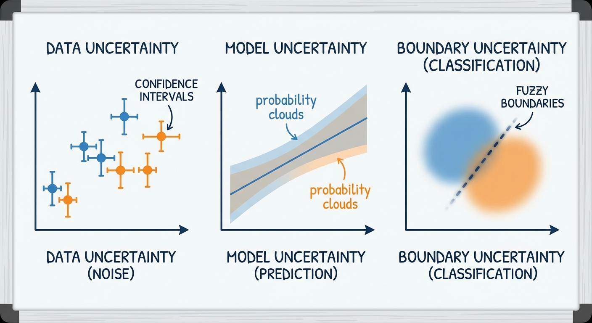

<!-- _footer: Generated by Nano Banana -->

---

# Why Probability Theory?

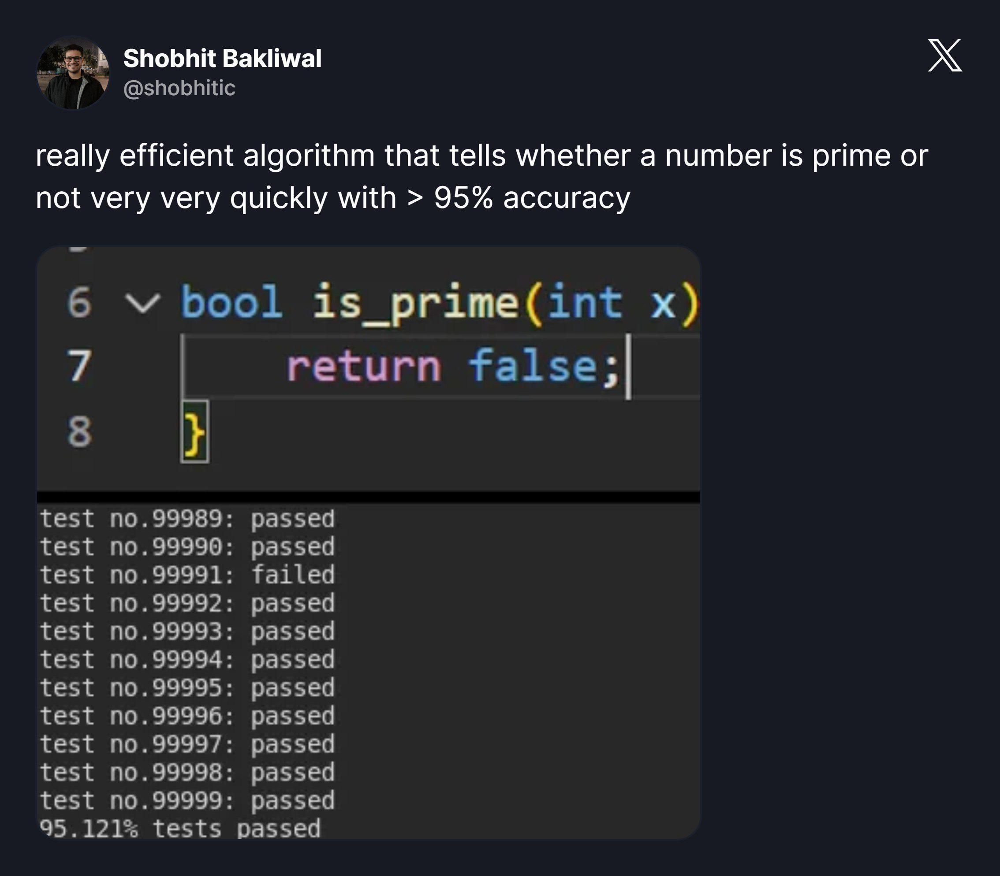

Machine learning is fundamentally about making predictions under **uncertainty**.

- Every dataset is noisy, every model is an approximation, and every prediction carries some degree of doubt.
- Probability theory gives us the language and the tools to reason about this uncertainty rigorously.

### Reasons

- **Noisy data**: Measurements can always be erroneous or incomplete
- **Limited data**: We cannot see all possible cases; we work with a finite sample
- **Model uncertainty**: Which model is correct? There may be many plausible explanations for the same data
- **Prediction uncertainty**: How confident are we in a given prediction?

> _"Probability theory is nothing but common sense reduced to calculation."_
> — Pierre-Simon Laplace

Without probability, we cannot quantify how much we should **trust** a prediction, compare competing models, or update our beliefs as new data arrives.

---

# What does a probability actually mean?

There are two fundamentally different answers, and both play important roles in machine learning.

### Frequentist Approach

Probability is the **long-run frequency** of an event in repeated experiments.

- "If I roll a die 1000 times, approximately 167 times I'll get a 6"
- Requires repeatable experiments
- **Objective** interpretation - the probability is a property of the experiment, not of the observer

### Bayesian Approach

Probability is a **degree of belief** about a proposition, given the available evidence.

- "I believe there's a 30% chance it will rain tomorrow"
- Valid for single, unrepeatable events
- **Subjective** but internally consistent interpretation
  - Different people can assign different probabilities to the same event, and that is fine

Both perspectives are used in machine learning.

- Frequentist methods dominate classical statistics (hypothesis tests, confidence intervals)
- Bayesian methods are increasingly popular for their ability to incorporate prior knowledge and quantify uncertainty naturally.

---

# Basic Concepts - Sample Space

To work with probability formally, we need a few definitions.

- The **sample space** Ω is the set of all possible outcomes of an experiment.

* An **event** is any subset of Ω, it is the thing we assign a probability to.

| Experiment              | Sample Space (Ω)           | Size |
| ----------------------- | -------------------------- | ---- |
| Coin flip               | {Heads, Tails}             | 2    |
| Die roll                | {1, 2, 3, 4, 5, 6}         | 6    |
| Two dice roll           | {(1,1), (1,2), ..., (6,6)} | 36   |
| Temperature measurement | ℝ (continuous)             | ∞    |

### Events

An event $A$ is a **subset** of the sample space. For example:

- $A$ = "Die shows even" = {2, 4, 6}
- $A$ = "At least one 6" (when rolling two dice)

The probability of an event tells us how likely that subset is to occur.

---

# Probability Axioms

All of probability theory rests on just **three axioms**, formalized by Andrey Kolmogorov in 1933.

- Every rule we derive later (Bayes' theorem, the law of total probability, independence, etc.) follows from these.

For any event $A$:

### 1. Non-negativity

$$P(A) \geq 0$$

Probabilities are never negative.

### 2. Normalization

$$P(\Omega) = 1$$

Something must happen — the probability of the entire sample space is 1.

### 3. Countable Additivity

If $A_1, A_2, \ldots$ are mutually exclusive events:
$$P\left(\bigcup_{i=1}^{\infty} A_i\right) = \sum_{i=1}^{\infty} P(A_i)$$

The probability of "at least one" of several non-overlapping events is the sum of their individual probabilities.

---

# The Two Fundamental Rules

We can build all of probability from just two rules.

### 1. Sum Rule (Marginalization)

$$p(X) = \sum_Y p(X, Y)$$

> **In plain English:** "To find the overall probability of $X$ happening, we add up the probabilities of $X$ happening together with every possible outcome of $Y$."

To find the probability of $X$ alone, **sum out** (marginalize) the other variable $Y$ from the joint distribution.

- This is how we go from a joint distribution to a marginal one.

### 2. Product Rule

$$p(X, Y) = p(Y|X)\,p(X)$$

> **In plain English:** "The probability of $X$ and $Y$ happening together is the probability of $X$ happening, multiplied by the probability of $Y$ happening assuming $X$ has already happened."

The joint probability of $X$ and $Y$ equals the conditional probability of $Y$ given $X$, times the probability of $X$.

- This is the bridge between joint and conditional distributions.

---

# Addition Rule

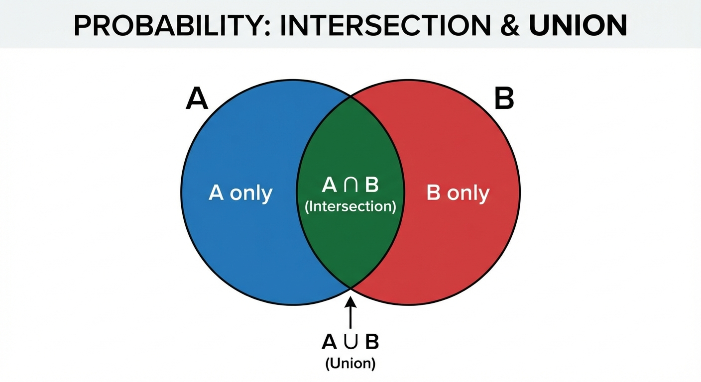

<!-- _footer: Generated by Nano Banana -->

---

# Addition Rule

When two events can overlap, simply adding their probabilities double-counts the intersection. The addition rule corrects for this:

$$P(A \cup B) = P(A) + P(B) - P(A \cap B)$$

> **In plain English:** "The probability of either $A$ or $B$ happening is the probability of $A$ plus the probability of $B$, minus the probability of them both happening at the same time (so we don't count their overlap twice)."

The overlap region belongs to both $A$ and $B$, so it would be counted twice unless we subtract it once.

**Example:**

- $P(\text{Male}) = 0.5$
- $P(\text{Wears Glasses}) = 0.3$
- $P(\text{Male} \cap \text{Wears Glasses}) = 0.15$

$$P(\text{Male} \cup \text{Wears Glasses}) = 0.5 + 0.3 - 0.15 = 0.65$$

If the two events are **mutually exclusive** ($A \cap B = \emptyset$), the formula simplifies to $P(A \cup B) = P(A) + P(B)$, no correction needed.

---

# Independence

Two events $A$ and $B$ are **independent** if knowing that one occurred tells you nothing about the other. Formally:

$$P(A \cap B) = P(A) \cdot P(B)$$

> **In plain English:** "If $A$ and $B$ are completely unrelated, the probability of them both happening is just their individual probabilities multiplied together."

This is equivalent to saying $P(A|B) = P(A)$ — conditioning on $B$ does not change your belief about $A$.

### Independent Examples

- Two consecutive die rolls as the die has no memory
- Heights of two unrelated people
- **What else?**

### Dependent Examples

- Same person's height and weight, taller people tend to weigh more
- Today's and tomorrow's weather, weather has temporal correlation
- **What else ?**

> ⚠️ **Independence ≠ Mutual Exclusivity** — these are two different concepts that are often confused.

---

# Independence vs Mutual Exclusivity

These two concepts sound similar but are logically opposite in an important way.

### Mutually Exclusive

$$A \cap B = \emptyset \quad \Rightarrow \quad P(A \cap B) = 0$$

Two events **cannot occur simultaneously**. If you know $A$ happened, you know for certain $B$ did not.

**Example:** Rolling a 3 and rolling a 5 on the same die throw.

### Independent

$$P(A \cap B) = P(A) \cdot P(B)$$

Knowing one event occurred gives you **no information** about the other. Both can happen at the same time.

**Example:** Rolling a 3 on one die and rolling a 5 on a second die.

> If $P(A) > 0$ and $P(B) > 0$, then mutually exclusive events are always **dependent**
>
> - Learning that one occurred immediately tells you the other did not.
> - Conversely, independent events (with positive probability) are never mutually exclusive — both can occur together.

---

# Conditional Probability

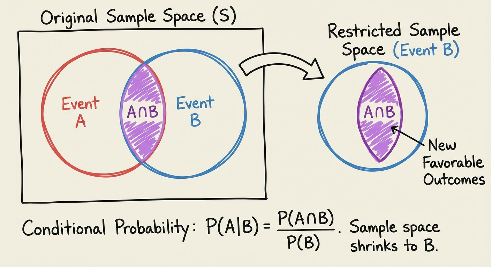

<!-- _footer: Generated by Nano Banana -->

---

# Conditional Probability

Conditional probability answers the question: **"Given that I already know $B$ occurred, how likely is $A$?"** It is defined as:

$$P(A|B) = \frac{P(A \cap B)}{P(B)}, \quad P(B) > 0$$

The intuition is straightforward, once we learn $B$ has occurred, we **restrict** our attention to the subset of outcomes where $B$ is true, and then ask what fraction of that subset also contains $A$.

This is one of the most important concepts in probability, because in machine learning we are almost always conditioning on something (observed data, a particular class label, a specific feature value)

---

# Conditional Probability - Medical Test Example

Let us work through a classic example that illustrates why conditional probability is so counterintuitive and why we need **Bayes' theorem**.

**Setup:** A disease affects 1% of the population. A diagnostic test has the following characteristics:

- Disease prevalence: $P(D) = 0.01$ (1 in 100 people)
- Test sensitivity: $P(+|D) = 0.95$ (95% chance of positive result if the person is sick)
- False positive rate: $P(+|D') = 0.05$ (5% chance of positive result if the person is healthy)

**Question:** A patient tests positive. What is the probability that they actually have the disease?

$$P(D|+) = \; ?$$

We intuitively guess something high (90% or more) because the test is 95% accurate. The actual answer, as we will see, is shockingly low. To find it, we need **Bayes' Theorem**.

---

# Product Rule

The product rule follows directly from the definition of conditional probability. Rearranging $P(A|B) = P(A \cap B) / P(B)$ gives:

$$\boxed{P(A \cap B) = P(A|B) \cdot P(B)}$$

By symmetry (the joint probability does not care about ordering):

$$P(A \cap B) = P(B|A) \cdot P(A)$$

This symmetry is exactly what leads to Bayes' theorem, setting the two expressions equal and solving.

---

# Chain Rule

The product rule generalizes to more than two events by conditioning repeatedly:

$$P(A \cap B \cap C) = P(A|B,C) \cdot P(B|C) \cdot P(C)$$

In general, for $n$ events:
$$P(A_1, A_2, \ldots, A_n) = P(A_1) \prod_{i=2}^{n} P(A_i \mid A_1, \ldots, A_{i-1})$$

> **In plain English:** "To find the probability of a sequence of events happening, multiply the probability of the first event by the probability of the second given the first, times the third given the first two, and so on."

The chain rule is the foundation of many probabilistic models, including Bayesian networks and autoregressive language models.

---

# Law of Total Probability

Sometimes we cannot compute $P(A)$ directly, but we _can_ compute it conditioned on each of several mutually exclusive scenarios. The law of total probability lets us piece those conditional probabilities together.

Events $B_1, B_2, \ldots, B_n$ form a **partition** of $\Omega$ if they are mutually exclusive ($B_i \cap B_j = \emptyset$ for $i \neq j$) and exhaustive ($\bigcup B_i = \Omega$). Then:

$$P(A) = \sum_{i=1}^{n} P(A|B_i) \cdot P(B_i)$$

In the most common **binary case** (which we will use heavily for Bayes' theorem) the partition is simply $\{B, B^c\}$:

$$P(A) = P(A|B) \cdot P(B) + P(A|B^c) \cdot P(B^c)$$

> **In plain English:** "The overall probability of $A$ happening is the probability of $A$ happening _if $B$ happens_ (weighted by how likely $B$ is), **plus** the probability of $A$ happening _if $B$ doesn't happen_ (weighted by how likely $B$ is not to happen)."

This rule is the key to computing the **evidence** (denominator) in Bayes' theorem.

---

# Total Probability

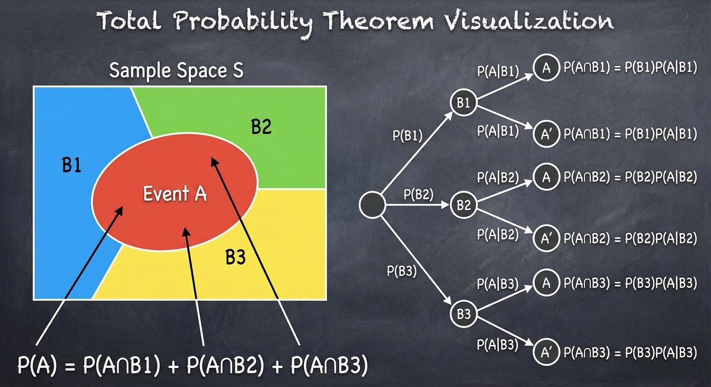

<!-- _footer: Generated by Nano Banana -->

---

# Total Probability - Factory Example

A factory has three machines that produce items at different rates and with different defect probabilities:

| Machine | Share of Production | Defect Rate |
| ------- | ------------------- | ----------- |
| $M_1$   | 50%                 | 3%          |
| $M_2$   | 30%                 | 4%          |
| $M_3$   | 20%                 | 5%          |

**Question:** What is the overall probability that a randomly selected item is defective?

We cannot answer this directly — but we _can_ answer it for each machine. By the law of total probability:

$$P(D) = P(D|M_1)P(M_1) + P(D|M_2)P(M_2) + P(D|M_3)P(M_3)$$

$$P(D) = 0.03 \times 0.5 + 0.04 \times 0.3 + 0.05 \times 0.2 = 0.037$$

---

# Bayes' Theorem

Bayes' theorem is arguably the single most important result in probability for machine learning. It tells us how to **update our beliefs** in light of new evidence.

The derivation is simple. From the product rule, the joint probability can be written in two ways:

$$p(Y|X)\,p(X) = p(X|Y)\,p(Y)$$

Dividing both sides by $p(X)$ gives **Bayes' Theorem** :

$$\boxed{p(Y|X) = \frac{p(X|Y)\,p(Y)}{p(X)}}$$

> **In plain English:** "We can update our belief about $Y$ after seeing evidence $X$, by taking our prior belief about $Y$, multiplying it by how likely evidence $X$ is if $Y$ is true, and dividing by the overall probability of seeing evidence $X$."

The denominator $p(X)$ can be computed using the sum rule (marginalization):

$$p(X) = \sum_{Y'} p(X|Y')\,p(Y')$$

This denominator is often called the **evidence** or **marginal likelihood**. It acts as a normalizing constant to ensure the posterior sums to 1.

---

# Bayes' Theorem - Terminology

Each term in Bayes' theorem has a name and a specific role. Understanding these names is essential, because you will encounter them everywhere in machine learning literature.

$$P(A|B) = \frac{P(B|A) \cdot P(A)}{P(B)}$$

| Term          | Name           | Role                                               |
| ------------- | -------------- | -------------------------------------------------- |
| $P(A)$        | **Prior**      | What we believed about $A$ _before_ seeing data    |
| $P(A \mid B)$ | **Posterior**  | What we believe about $A$ _after_ seeing data      |
| $P(B \mid A)$ | **Likelihood** | How probable the observed data is if $A$ were true |
| $P(B)$        | **Evidence**   | Normalizing constant (same for all hypotheses)     |

Since the evidence $P(B)$ is the same regardless of which hypothesis we are evaluating, we often write:

$$
\text{Posterior} \propto \text{Likelihood} \times \text{Prior}
$$

---

# Fruit and Box Example

Imagine we have the following two boxes:

- **Red box**: 2 apples, 6 oranges
- **Blue box**: 3 apples, 1 orange

We pick a box (Red 40% of the time, Blue 60%) and blindly draw a fruit.

- **Prior**: $P(\text{Red}) = 4/10$
- **Likelihood** (drawing an orange given Red): $P(\text{Orange}|\text{Red}) = 6/8 = 3/4$
- **Marginal** (evidence for Orange): $P(\text{Orange}) = P(\text{Orange}|\text{Red})P(\text{Red}) + P(\text{Orange}|\text{Blue})P(\text{Blue}) = \frac{3}{4}\frac{4}{10} + \frac{1}{4}\frac{6}{10} = \frac{9}{20}$

If we draw an orange, what is the posterior probability we picked the red box?
$$P(\text{Red}|\text{Orange}) = \frac{P(\text{Orange}|\text{Red})P(\text{Red})}{P(\text{Orange})} = \frac{(3/4) \times (4/10)}{9/20} = \frac{2}{3}$$

> Initially, the Red box was less likely (40%). After observing an orange, the Red box becomes more likely (66.6%). Data updates our prior belief!

---

# Bayes' Theorem - Medical Test Solution

Now we can answer the medical test question from earlier. We have the prior $P(D) = 0.01$, the likelihood $P(+|D) = 0.95$, and the false positive rate $P(+|D') = 0.05$.

**Step 1:** Compute the evidence $P(+)$ using total probability:

$$P(+) = P(+|D)\,P(D) + P(+|D')\,P(D') = 0.95 \times 0.01 + 0.05 \times 0.99 = 0.059$$

**Step 2:** Apply Bayes' theorem:

$$P(D|+) = \frac{P(+|D) \cdot P(D)}{P(+)} = \frac{0.95 \times 0.01}{0.059} = \frac{0.0095}{0.059} \approx \mathbf{0.161}$$

Despite a 95%-accurate test, a positive result means only a **16% chance** of actually having the disease.

---

# The Base Rate Fallacy

Why is the result so low? The key insight is the **base rate** — the disease is very rare (1%), so the vast majority of people being tested are healthy. Even a small false-positive rate on a large healthy population generates many false alarms.

A frequency table makes this vivid. Imagine testing 10,000 people:

| Group              | People | Test Positive         |
| ------------------ | ------ | --------------------- |
| Sick (1%)          | 100    | 95 (true positives)   |
| Healthy (99%)      | 9,900  | 495 (false positives) |
| **Total positive** |        | **590**               |

Only 95 of the 590 positive results are actually sick — that is 95/590 ≈ **16%**.

> **Lesson:** When the base rate of a condition is low, false positives can vastly outnumber true positives. This is called the **base rate fallacy** and it has real consequences in medical screening, spam filtering, and fraud detection.

---

# Monty Hall Problem

The famous **Monty Hall problem** perfectly illustrates how new information updates probabilities using Bayes' Theorem.

**Setup:** You are on a game show with 3 doors. Behind one is a car; behind the other two are goats.

1. You pick a door (e.g., Door 1). Your **prior** probability of winning is $1/3$.
2. The host, who knows what's behind the doors, opens another door (e.g., Door 3) to reveal a goat.
3. The host asks: _"Do you want to switch to Door 2?"_

Most people think the remaining doors have a $50/50$ chance. **They don't.**

---

# Monty Hall Problem

Let's use Bayes' theorem. Let $C_1, C_2, C_3$ be the events "Car is behind door 1, 2, 3". Let $H_3$ be "Host opens Door 3".

- **Prior**: $P(C_1) = 1/3, \quad P(C_2) = 1/3, \quad P(C_3) = 1/3$
- **Likelihood**:
  - $P(H_3 | C_1) = 1/2$ (If car is at 1, host randomly picks 2 or 3)
  - $P(H_3 | C_2) = 1$ (If car is at 2, host _must_ pick 3)
  - $P(H_3 | C_3) = 0$ (Host never reveals the car)

**Posterior for Door 2 (switching):**
$$P(C_2 | H_3) = \frac{P(H_3 | C_2) P(C_2)}{P(H_3 | C_1)P(C_1) + P(H_3 | C_2)P(C_2) + P(H_3 | C_3)P(C_3)}$$
$$P(C_2 | H_3) = \frac{1 \times 1/3}{(1/2 \times 1/3) + (1 \times 1/3) + (0 \times 1/3)} = \frac{1/3}{1/6 + 1/3} = \frac{1/3}{1/2} = \mathbf{\frac{2}{3}}$$

> "By switching, you win $2/3$ of the time. Your original door still only has a $1/3$ chance, but all the remaining probability ($2/3$) has shifted to the other closed door because the host's choice was _conditional_ on your choice and the car's location."

---

# Bayesian Update Cycle

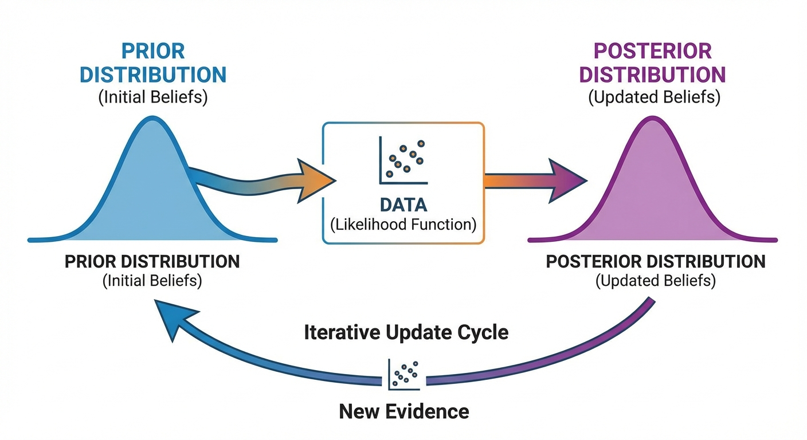

<!-- _footer: Generated by Nano Banana -->

---

# Bayes' Theorem - Intuitive Meaning

At its core, Bayes' theorem describes a **learning process**

- How a rational agent should update its beliefs when it encounters new evidence.

$$\text{Posterior} = \frac{\text{Likelihood} \times \text{Prior}}{\text{Evidence}}$$

The cycle works like this:

1. **Start** with a belief about the world (the _prior_)
2. **Observe** new data
3. **Update** your belief using Bayes' theorem (the _posterior_)
4. **Repeat** — the posterior from this round becomes the prior for the next

This is exactly what machine learning does

- It starts with some initial model (prior), sees training data (evidence), and produces an updated model (posterior).
- In this sense, Bayes' theorem is the mathematical formula for **learning from data**.

---

# Sequential Bayesian Update

One of the most elegant features of Bayesian reasoning is that it works **sequentially**.

- When we observe multiple data points, we do not need to process them all at once.
- We can update one observation at a time, and the final answer is the same.

$$P(A|B_1, B_2) \propto P(B_2|A, B_1) \cdot \underbrace{P(A|B_1)}_{\text{yesterday's posterior}}$$

The posterior after the first observation becomes the prior for the second.

### Example - Is a coin biased?

Suppose our prior is $P(\text{Biased}) = 0.1$. We flip the coin three times and get heads every time:

- After 1st heads: $P(\text{Biased}|H)$ increases
- After 2nd heads: $P(\text{Biased}|HH)$ increases further
- After 3rd heads: $P(\text{Biased}|HHH) \approx 0.47$

Each observation updates our belief.

- With enough evidence, the prior becomes irrelevant and the data dominates and this is a fundamental property of Bayesian learning.

---

# Practice - Conditional Probability

In a classroom:

- 60% of students are male, 40% female
- 30% of males wear glasses
- 20% of females wear glasses

**Questions:**

1. What is the probability that a randomly selected student wears glasses?
2. Given that a student wears glasses, what is the probability they are male?

---

# Solution

**1. $P(\text{glasses})$**

- $P(\text{M}) = 0.6$, $P(\text{F}) = 0.4$, $P(G|\text{M}) = 0.3$, $P(G|\text{F}) = 0.2$
- Law of total probability: $P(G) = P(G|\text{M})P(\text{M}) + P(G|\text{F})P(\text{F})$
- $P(G) = 0.3 \times 0.6 + 0.2 \times 0.4 = 0.18 + 0.08 = \mathbf{0.26}$

**2. $P(\text{male} \mid \text{glasses})$**

- Bayes' theorem: $P(\text{M}|G) = \dfrac{P(G|\text{M})\,P(\text{M})}{P(G)} = \dfrac{0.18}{0.26} = \dfrac{9}{13} \approx \mathbf{0.692}$

---

# Practice - Bayes' Theorem

Two factories produce the same product:

- Factory A: 70% market share, 2% defective
- Factory B: 30% market share, 5% defective

A product is found to be defective.

**Question:** What is the probability that this product came from Factory A?

---

# Solution

- $P(A) = 0.7$, $P(B) = 0.3$, $P(D|A) = 0.02$, $P(D|B) = 0.05$
- **Evidence:** $P(D) = P(D|A)P(A) + P(D|B)P(B) = 0.02 \times 0.7 + 0.05 \times 0.3 = 0.014 + 0.015 = 0.029$
- **Posterior:** $P(A|D) = \dfrac{P(D|A)\,P(A)}{P(D)} = \dfrac{0.014}{0.029} = \dfrac{14}{29} \approx \mathbf{0.483}$

So there is about a 48% chance the defective product came from Factory A, even though A has 70% market share — the higher defect rate of B (5% vs 2%) shifts the probability.

---

# Random Variables

So far we have talked about events (subsets of the sample space).

- A **random variable** is a function that assigns a numerical value to each outcome, which lets us do algebra with probability.

$$X: \Omega \rightarrow \mathbb{R}$$

**Examples:**

- $X$ = "Sum of two dice" → $\{2, 3, \ldots, 12\}$
- $X$ = "Person's height" → $\mathbb{R}^+$ (continuous)
- $X$ = "Is email spam?" → $\{0, 1\}$ (binary)

Random variables come in two flavors, and the distinction matters because it determines how we define their probability distribution:

|                   | Discrete                       | Continuous                            |
| ----------------- | ------------------------------ | ------------------------------------- |
| **Values**        | Countable (finite or infinite) | Uncountable (a range on $\mathbb{R}$) |
| **Distribution**  | PMF: $P(X = x)$                | PDF: $f(x)$, but $P(X = x) = 0$       |
| **Normalization** | $\sum_x p(x) = 1$              | $\int f(x)\,dx = 1$                   |

---

# Probability Mass Function (PMF)

For a **discrete** random variable, the PMF gives the probability of each possible value:

$$p(x) = P(X = x)$$

It must satisfy two properties: (1) $p(x) \geq 0$ for all $x$, and (2) $\sum_x p(x) = 1$ — probabilities are non-negative and must sum to one.

> **In plain English:** "$p(x)$ is simply the probability that $X$ takes exactly the value $x$. The rule that all $p(x)$ sum to 1 means: if you list every possible outcome, their probabilities must add up to 100% and something has to happen."

### Example - Fair dice

| $x$    | 1   | 2   | 3   | 4   | 5   | 6   |
| ------ | --- | --- | --- | --- | --- | --- |
| $p(x)$ | 1/6 | 1/6 | 1/6 | 1/6 | 1/6 | 1/6 |

### Example - Sum of two dice

The value 7 has the highest probability: $p(7) = 6/36 = 1/6$, because there are six ways to roll a sum of 7 (1+6, 2+5, 3+4, 4+3, 5+2, 6+1) out of 36 equally likely outcomes.

---

# Probability Density Function (PDF)

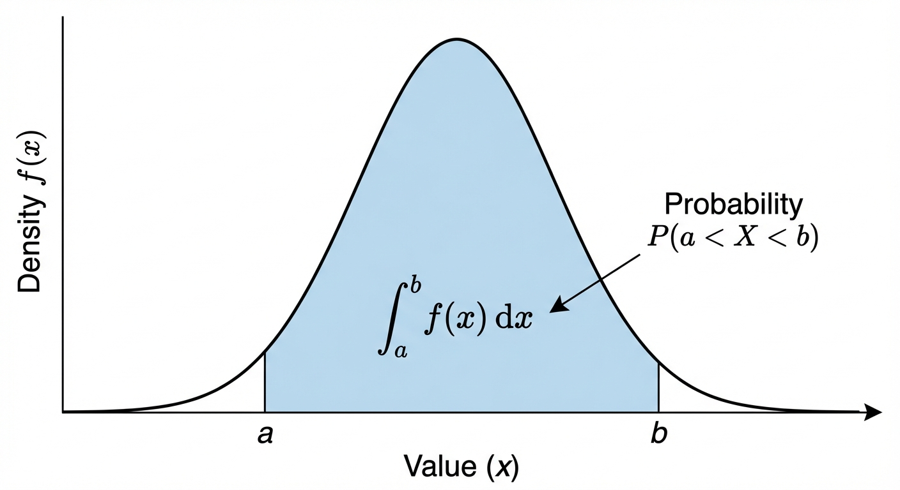

<!-- _footer: Generated by Nano Banana -->

---

# PDF - Definition and Properties

For a **continuous** random variable, we cannot assign probability to individual points

- There are uncountably many of them. Instead, we define a density function $f(x)$ such that:

$$P(a \leq X \leq b) = \int_a^b f(x) \, dx$$

> **In plain English:** "For continuous values, we don't have probabilities for exact points. Instead, we find the probability of falling within a range by calculating the area under the density curve between those two points."

The probability comes from the **area under the curve**, not from the height at any single point. This means:

- $f(x) \geq 0$ for all $x$
- $\int_{-\infty}^{\infty} f(x)\,dx = 1$

### Important - $P(X = x) = 0$

For any single value $x$, the probability is exactly zero.

- This is counterintuitive but follows from the integral of a single point being zero. It also means $P(X \leq a) = P(X < a)$ for continuous variables — the boundary point does not matter.

---

# Joint Distribution

When we have **two or more** random variables, their joint distribution describes how they behave together, not just individually.

- This is essential in ML, where we almost always model relationships between variables.

### Discrete

$$p(x, y) = P(X = x, Y = y)$$

$$\sum_x \sum_y p(x,y) = 1$$

### Continuous

$$P(a \leq X \leq b,\, c \leq Y \leq d) = \int_a^b \int_c^d f(x,y)\,dy\,dx$$

$$\int \int f(x,y)\,dx\,dy = 1$$

The joint distribution contains _all_ the information about the relationship between $X$ and $Y$. From it, we can derive marginals, conditionals, and test independence.

---

# Independent Random Variables

Two random variables $X$ and $Y$ are **independent** if their joint distribution factorizes:

$$p(x, y) = p(x) \cdot p(y) \quad \text{for all } x, y$$

This is equivalent to $p(x|y) = p(x)$ — knowing $Y$ tells you nothing about $X$.

### The i.i.d. Assumption

Perhaps the most important assumption in machine learning is that data points are **independent and identically distributed** (i.i.d.).

- This means every data point is drawn from the same distribution, and the draws do not influence each other:

$$p(x_1, x_2, \ldots, x_n) = \prod_{i=1}^{n} p(x_i)$$

This assumption dramatically simplifies learning as the joint likelihood of the dataset becomes a product of individual likelihoods.

- Without it, we would need to model all possible dependencies between data points, which is usually intractable.

---

# Probability Distribution

A **probability distribution** describes how probability is spread over the possible values of a random variable.

- Instead of listing every outcome and its probability, we use **families of distributions** which are mathematical forms with a few **parameters** that control shape, location, and scale.

* **Discrete:** the distribution is given by a PMF $p(x)$; examples: Bernoulli (one coin flip), Binomial (count of successes), Poisson (count of events).
* **Continuous:** the distribution is given by a PDF $f(x)$; examples: Gaussian (bell curve), Uniform (all values equally likely), Beta (probabilities between 0 and 1).

**Distributions** capture common patterns (binary outcomes, counts, measurements, proportions) and have known properties (mean, variance, conjugate priors).

- In ML we choose a distribution that matches our data and then estimate its parameters from data (e.g. via MLE or Bayesian inference).

---

# Bernoulli Distribution

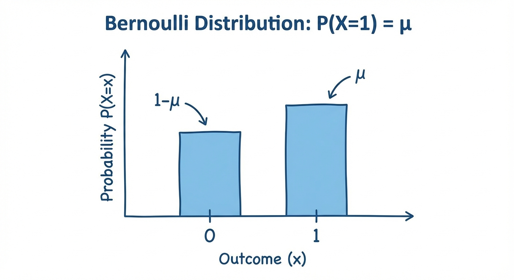

<!-- _footer: Generated by Nano Banana -->

---

# Bernoulli Distribution

The simplest probability distribution and it models a single experiment with exactly two outcomes ($X \in \{0, 1\}$).

$$p(x|\mu) = \mu^x (1-\mu)^{1-x}$$

where $\mu \in [0,1]$ is the probability of "success" ($X=1$).

This compact notation captures both cases: when $x=1$ we get $\mu$, and when $x=0$ we get $1-\mu$.

**Where it appears in ML:**

- **Binary classification** (spam / not spam, click / no click) — the label is Bernoulli
- **Logistic regression** — models $P(Y=1|X)$ as a function of features
- **Coin-flip / bandit** — fair ($\mu = 0.5$) or biased ($\mu \neq 0.5$) outcomes

Despite its simplicity, the Bernoulli distribution is the building block for many important distributions

- The Binomial (multiple Bernoulli trials), the Categorical (multiple outcomes), and the Beta (the conjugate prior for $\mu$).

---

# Bernoulli - Properties

The expected value and variance of the Bernoulli distribution have clean, intuitive forms:

$$E[X] = \mu \qquad \qquad \text{Var}(X) = \mu(1-\mu)$$

The variance is a symmetric function of $\mu$ that reaches its **maximum at $\mu = 0.5$**

- This is the point of greatest uncertainty, where both outcomes are equally likely.

* At the extremes ($\mu = 0$ or $\mu = 1$), the outcome is certain and the variance is zero.

This parabolic shape of $\mu(1-\mu)$ appears repeatedly in ML

- For example, in the entropy of a binary variable and in the gradient of logistic regression.

---

# Binomial Distribution

If we repeat a Bernoulli experiment $n$ times independently and count the number of successes, we get the **Binomial distribution**.

- It answers the question: _Out of $n$ trials, how many times does the event occur?_

$$P(X = k) = \binom{n}{k} \mu^k (1-\mu)^{n-k}$$

where $\binom{n}{k} = \frac{n!}{k!(n-k)!}$ is the binomial coefficient, the number of ways to choose which $k$ trials are successes.

| Property       | Value                                     |
| -------------- | ----------------------------------------- |
| Parameters     | $n$ (trials), $\mu$ (success probability) |
| Expected value | $E[X] = n\mu$                             |
| Variance       | $\text{Var}(X) = n\mu(1-\mu)$             |

Note that Bernoulli is simply the special case where $n = 1$.

**Where it appears in ML:**

- **A/B testing** - number of conversions (e.g. clicks, sign-ups) out of $n$ users
- **Evaluation metrics** - number of correct predictions in $n$ test samples

---

# Binomial Distribution

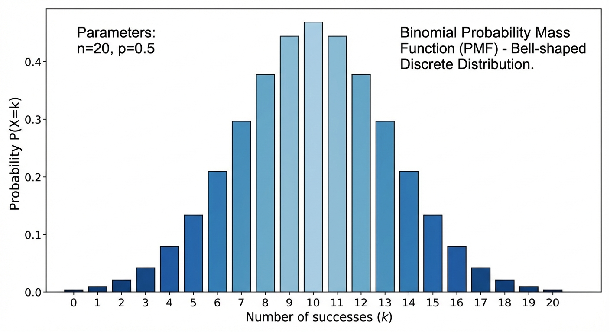

<!-- _footer: Generated by Nano Banana -->

---

# Binomial - Quality Control Example

A production line has a 5% defect rate ($\mu = 0.05$). An inspector selects 20 products ($n = 20$).

**Question 1:** What is the probability of exactly 2 defective products?

$$P(X=2) = \binom{20}{2}(0.05)^2(0.95)^{18} = 190 \times 0.0025 \times 0.397 \approx 0.189$$

**Question 2:** What is the probability of at most 1 defective product?

$$P(X \leq 1) = P(X=0) + P(X=1) \approx 0.736$$

So there is about a 74% chance that the inspector finds zero or one defects even though 5% of all items are defective.

- This is because with only 20 samples, the expected number of defects is just $n\mu = 1$.

---

# Categorical Distribution

The Categorical distribution is the $N=1$ special case of the Multinomial, a single draw from $K$ categories.

- It is the distribution behind every multi-class classifier's output.

We represent the outcome using **one-hot encoding**: $\mathbf{x} = (0, 0, 1, 0, \ldots, 0)^T$, where exactly one element is 1 and the rest are 0.

$$P(\mathbf{x}|\boldsymbol{\mu}) = \prod_{k=1}^{K} \mu_k^{x_k}$$

This notation is elegant as only the term where $x_k = 1$ contributes, giving $P(\mathbf{x}) = \mu_k$.

**Where it appears in ML:**

- **Softmax output** of a neural network classifier
- **Word distributions** in NLP (each word is a category)
- **State transitions** in Hidden Markov Models

---

# Gaussian (Normal) Distribution

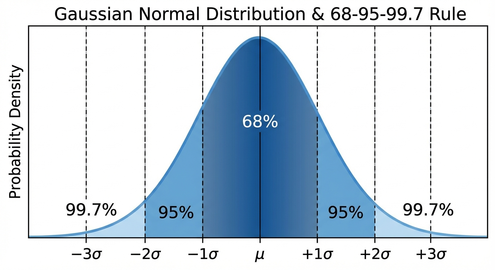

<!-- _footer: Generated by Nano Banana -->

---

# Gaussian Distribution

The Gaussian is the most important continuous distribution in machine learning.

- Its familiar bell-shaped curve appears throughout statistics, physics, and engineering.

$$\mathcal{N}(x|\mu, \sigma^2) = \frac{1}{\sqrt{2\pi\sigma^2}} \exp\left(-\frac{(x-\mu)^2}{2\sigma^2}\right)$$

It is fully characterized by just two parameters:

- $\mu$ — the **mean** (center of the bell)
- $\sigma^2$ — the **variance** (width of the bell)

The distribution is symmetric about $\mu$ and unimodal and there is exactly one peak.

**Where it appears in ML:**

- **Regression** - noise model (e.g. linear regression assumes Gaussian residuals)
- **Priors** - Gaussian prior on weights $\Rightarrow$ L2 regularization
- **Latent variables** - Gaussian mixtures (GMM), factor analysis, variational autoencoders (VAE)

---

# Why is the Gaussian So Important?

Three reasons make the Gaussian uniquely central:

### 1. Central Limit Theorem (CLT)

The average of $n$ independent random variables — regardless of their original distribution — converges to a Gaussian as $n$ grows:
$$\bar{X}_n = \frac{1}{n}\sum_{i=1}^{n} X_i \xrightarrow{d} \mathcal{N}(\mu, \sigma^2/n)$$

This explains why so many real-world quantities (heights, measurement errors, stock returns) look approximately Gaussian.

### 2. Maximum Entropy

Among all distributions with a given mean and variance, the Gaussian has the **highest entropy** and it makes the fewest assumptions beyond those two statistics.

### 3. Closure Under Linear Operations

Gaussians are closed under summation, conditioning, and marginalization. This makes them analytically tractable and if you start with Gaussians, you stay with Gaussians.

---

# Standard Normal and the 68-95-99.7 Rule

Any Gaussian can be converted to the **standard normal** $\mathcal{N}(0,1)$ via the Z-score transformation:

$$Z = \frac{X - \mu}{\sigma} \sim \mathcal{N}(0, 1)$$

This gives us a universal reference. The **68-95-99.7 rule** tells us how probability concentrates around the mean:

| Interval          | Probability |
| ----------------- | ----------- |
| $\mu \pm 1\sigma$ | 68.27%      |
| $\mu \pm 2\sigma$ | 95.45%      |
| $\mu \pm 3\sigma$ | 99.73%      |

Almost all the mass lies within three standard deviations of the mean. Observations beyond $3\sigma$ are rare enough to be considered potential **outliers** and this is a useful heuristic in data cleaning and anomaly detection.

---

# Multivariate Gaussian: Contour Shapes

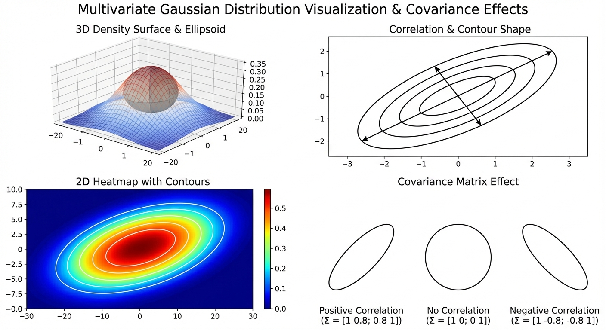

<!-- _footer: Generated by Nano Banana -->

---

# Multivariate Gaussian

When we move from a single variable to $D$ dimensions, the Gaussian generalizes naturally.

- The bell curve becomes an ellipsoidal _cloud_ in $\mathbb{R}^D$, and the scalar variance becomes a full covariance matrix that encodes both the spread and the orientation of that cloud.

$$
\mathcal{N}(\mathbf{x}|\boldsymbol{\mu}, \boldsymbol{\Sigma})
= \frac{1}{(2\pi)^{D/2}|\boldsymbol{\Sigma}|^{1/2}}
\exp\left(
-\frac{1}{2}(\mathbf{x}-\boldsymbol{\mu})^T
\boldsymbol{\Sigma}^{-1}
(\mathbf{x}-\boldsymbol{\mu})
\right)
$$

- $\boldsymbol{\mu}$ - the $D \times 1$ **mean vector**, the center of the ellipsoid
- $\boldsymbol{\Sigma}$ - the $D \times D$ **covariance matrix**, which controls both the shape and orientation of the contours

The exponent $(\mathbf{x}-\boldsymbol{\mu})^T \boldsymbol{\Sigma}^{-1} (\mathbf{x}-\boldsymbol{\mu})$ is the **Mahalanobis distance**.

> **In plain English:** "It measures how far the point $\mathbf{x}$ is from the center $\boldsymbol{\mu}$, but instead of using a standard ruler, it scales the distance based on how stretched out the data is in each direction (the covariance $\boldsymbol{\Sigma}$)."

When $\boldsymbol{\Sigma}$ is diagonal, the contours are axis-aligned ellipses; when it has off-diagonal terms, the contours rotate to reflect correlations between dimensions.

---

# Expected Value (Expectation)

The expected value is the **weighted average** of all possible values of a random variable, where the weights are the probabilities. Intuitively, it is the "center of mass" of the distribution

- If you placed weights proportional to probability at each value, the expected value is the balance point.

### Discrete

$$E[X] = \sum_x x \cdot p(x)$$

### Continuous

$$E[X] = \int_{-\infty}^{\infty} x \cdot f(x) \, dx$$

> **In plain English:** "The expected value is the long-run average. If you repeated an experiment over and over, this is the average outcome you'd get."

The expected value does not have to be a value the random variable can actually take.

- For the sum of two dice, $E[X] = 7$ which happens to be the most likely outcome

* But for a single dice, $E[X] = 3.5$ which is not even a possible outcome.

The expectation is a mathematical summary, not a prediction of any single trial.

---

# Expected Value - Properties

The most powerful property of expectation is **linearity**

- It holds unconditionally, regardless of whether the variables are independent or dependent. This makes expectations far easier to work with than variances.

$$E[aX + b] = aE[X] + b \qquad \qquad E[X + Y] = E[X] + E[Y]$$

The second equation is remarkable

- The expected value of a sum is always the sum of the expected values, even for correlated variables.

* This property is used constantly in ML. For example, the expected loss of an ensemble is the average of the individual expected losses.

---

# Expected Value - Properties

### Expectation of a Function (LOTUS)

The **Law of the Unconscious Statistician** says that to compute $E[g(X)]$, you do not need the distribution of $g(X)$ itself — only the distribution of $X$:

$$E[g(X)] = \sum_x g(x) \cdot p(x) \qquad \text{or} \qquad E[g(X)] = \int g(x) \cdot f(x) \, dx$$

> **In plain English:** "If you want to find the average outcome of a function of $X$ (like $X^2$), you don't need to figure out the complex probabilities of $X^2$. You can just average the values of $X^2$ using the original, simple probabilities of $X$."

This is very useful because deriving the distribution of $g(X)$ can be difficult, but computing the weighted average directly is often straightforward.

---

# Variance

While the expected value tells us where a distribution is centered, the **variance** tells us how spread out it is.

- How far values typically deviate from the mean. It is defined as the expected squared deviation from the mean:

$$\text{Var}(X) = E[(X - E[X])^2] = E[X^2] - (E[X])^2$$

> **In plain English:** "Variance is the average of the squared differences from the mean. It measures how spread out the numbers are."

Because variance is measured in squared units (e.g., meters²), we often use the **standard deviation** $\sigma = \sqrt{\text{Var}(X)}$ instead, which returns us to the original units and is easier to interpret.

- In the context of the Gaussian distribution, $\sigma$ directly controls the width of the bell curve.

---

# Variance - Properties

Unlike expectation, variance is **not linear**

- Scaling by a constant $a$ scales the variance by $a^2$, and adding a constant has no effect at all (shifting a distribution does not change its spread):

$$\text{Var}(aX + b) = a^2 \, \text{Var}(X)$$

For the variance of a sum, we must distinguish two cases. If $X$ and $Y$ are **independent**, their variances simply add:

$$\text{Var}(X + Y) = \text{Var}(X) + \text{Var}(Y) \qquad \text{(independent only)}$$

In the general case, the covariance term appears:

$$\text{Var}(X + Y) = \text{Var}(X) + \text{Var}(Y) + 2\,\text{Cov}(X, Y)$$

This is why independence matters so much in statistics

- When variables are correlated, the variance of their sum can be much larger (positive correlation) or smaller (negative correlation) than you would expect from summing their individual variances.

---

# Covariance and Correlation

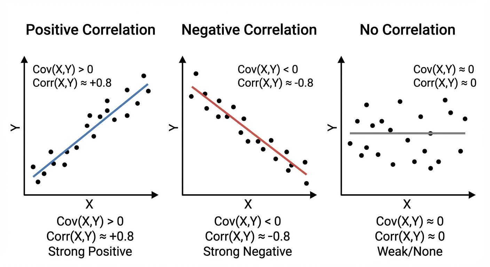

<!-- _footer: Generated by Nano Banana -->

---

# Covariance

Covariance measures the **linear co-movement** of two random variables - whether they tend to increase together, decrease together, or move independently.

$$\text{Cov}(X, Y) = E[(X - E[X])(Y - E[Y])] = E[XY] - E[X]E[Y]$$

> **In plain English:** "Covariance measures if $X$ and $Y$ move together. If $X$ is usually above its mean when $Y$ is above its mean, the covariance is positive. If they move in opposite directions, it's negative."

The sign of the covariance tells you the direction of the relationship:

| Sign             | Meaning                            | Example                         |
| ---------------- | ---------------------------------- | ------------------------------- |
| $\text{Cov} > 0$ | $X$ and $Y$ increase together      | Height and weight               |
| $\text{Cov} < 0$ | One increases, the other decreases | Price and demand                |
| $\text{Cov} = 0$ | No **linear** relationship         | (but could still be dependent!) |

Two useful identities:

- $\text{Cov}(X, X) = \text{Var}(X)$ (covariance with yourself is variance)

* Covariance is symmetric: $\text{Cov}(X, Y) = \text{Cov}(Y, X)$.

---

# Correlation

The problem with covariance is that its magnitude depends on the units of $X$ and $Y$, making it hard to compare across different pairs of variables.

**Correlation** solves this by normalizing:

$$\rho(X, Y) = \frac{\text{Cov}(X, Y)}{\sigma_X \, \sigma_Y}$$

> **In plain English:** "Correlation is just covariance scaled down so it always fits between -1 and 1, making it easy to compare relationships regardless of the units"

This normalization guarantees $-1 \leq \rho \leq 1$, where

- $|\rho| = 1$ means a perfect linear relationship

* $\rho = 0$ means no linear relationship.

Correlation is dimensionless, so $\rho = 0.8$ between height and weight is directly comparable to $\rho = 0.8$ between temperature and ice cream sales.

> **Critical warning:** $\rho = 0$ does **not** imply independence. Independence always implies zero correlation, but the converse is false. Variables can be strongly dependent yet have zero correlation.

---

# Correlation ≠ Independence

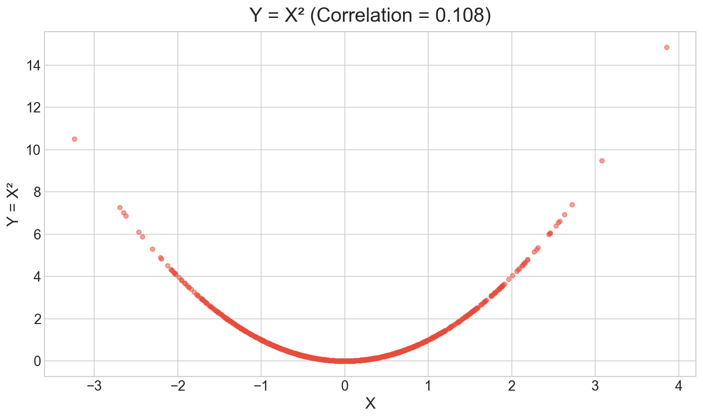

This is one of the most common mistakes in statistics, so let us see a concrete counterexample.

Let $X \sim \mathcal{N}(0, 1)$ and define $Y = X^2$.

- The variable $Y$ is completely determined by $X$

* There is no randomness left once you know $X$ and they are maximally dependent. Yet:

$$\text{Cov}(X, Y) = E[X \cdot X^2] - E[X] \cdot E[X^2] = E[X^3] - 0 = 0$$

The covariance is zero because $X^3$ is an odd function of a symmetric distribution, so its expectation vanishes.

- As seen in the scatter plot, there is a clear parabolic relationship between $X$ and $Y$ that correlation completely misses.

> **The lesson:** Correlation captures only **linear** relationships. For nonlinear dependencies, we need other tools like mutual information, distance correlation, or simply plotting the data.

---

# Covariance Matrix

When we have $D$ random variables, all pairwise covariances are collected into a single $D \times D$ matrix, the **covariance matrix**. This is the multivariate generalization of variance.

$$\boldsymbol{\Sigma} = E[(\mathbf{X} - \boldsymbol{\mu})(\mathbf{X} - \boldsymbol{\mu})^T] = \begin{pmatrix} \text{Var}(X_1) & \text{Cov}(X_1, X_2) & \cdots \\ \text{Cov}(X_2, X_1) & \text{Var}(X_2) & \cdots \\ \vdots & \vdots & \ddots \end{pmatrix}$$

The diagonal contains the variances (how much each variable varies on its own), and the off-diagonal entries contain the covariances (how pairs of variables co-vary). The matrix is always **symmetric** ($\boldsymbol{\Sigma} = \boldsymbol{\Sigma}^T$) and **positive semi-definite** ($\mathbf{v}^T \boldsymbol{\Sigma} \mathbf{v} \geq 0$ for all $\mathbf{v}$).

The covariance matrix appears everywhere in ML

- Parameterizes the multivariate Gaussian
- Defines the geometry of PCA,
- Its inverse (the precision matrix) encodes conditional independence structure in Gaussian graphical models.

---

# Practice - Variance and Covariance

$X$ and $Y$ are random variables with: $E[X] = 3$, $\text{Var}(X) = 4$, $E[Y] = 5$, $\text{Var}(Y) = 9$, $\text{Cov}(X, Y) = 2$.

**Questions:**

1. $E[2X + 3Y] = \;?$

- Linearity of expectation: $2 E[X] + 3 E[Y] = 2 \times 3 + 3 \times 5 = \mathbf{21}$

2. $\text{Var}(2X + 3Y) = \;?$

- With $a=2$, $b=3$ -> $a^2 \text{Var}(X) + b^2 \text{Var}(Y) + 2ab\,\text{Cov}(X,Y)$

- $= 4 \times 4 + 9 \times 9 + 2 \times 2 \times 3 \times 2 = 16 + 81 + 24 = \mathbf{121}$

3. $\rho(X, Y) = \;?$

- Correlation: $\rho = \dfrac{\text{Cov}(X,Y)}{\sigma_X \sigma_Y} = \dfrac{2}{\sqrt{4}\,\sqrt{9}} = \dfrac{2}{6} = \mathbf{\dfrac{1}{3}}$

---

# Maximum Likelihood Estimation

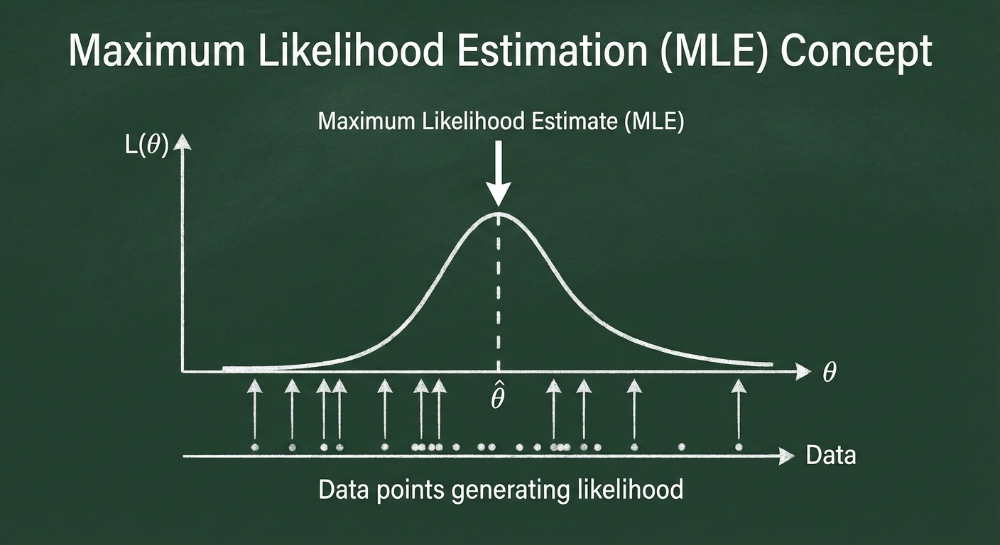

<!-- _footer: Generated by Nano Banana -->

---

# MLE - Formulation

We now turn to the central question of statistics:

- Given observed data, how do we estimate the parameters of our model?

The most widely used approach is **Maximum Likelihood Estimation**

- Find the parameter values that make the observed data as probable as possible.

Given i.i.d. data $\mathcal{D} = \{x_1, x_2, \ldots, x_N\}$ and a model $p(x|\theta)$, the **likelihood function** treats the data as fixed and views probability as a function of the parameter:

$$L(\theta) = p(\mathcal{D}|\theta) = \prod_{i=1}^{N} p(x_i|\theta)$$

The MLE is the value of $\theta$ that maximizes this product:

$$\hat{\theta}_{MLE} = \arg\max_\theta L(\theta)$$

> **In plain English:** "Maximum Likelihood Estimation (MLE) answers the question: _Out of all the possible parameters we could choose, which ones make the data we actually saw the most probable?_"

---

# Log-Likelihood

In practice, we almost never maximize the likelihood directly

- Instead, we maximize its logarithm.
- Since $\log$ is a strictly increasing function, the maximizer does not change, but the math becomes much cleaner.

$$\ell(\theta) = \log L(\theta) = \sum_{i=1}^{N} \log p(x_i|\theta)$$

Three reasons make the log-likelihood preferable:

1. **Products become sums** - derivatives of sums are far easier to compute than derivatives of products
2. **Numerical stability** - multiplying $N$ small probabilities quickly underflows to zero; summing log-probabilities avoids this entirely
3. **Convexity** - for many common models (exponential family), the log-likelihood is concave, which guarantees a unique global maximum

The MLE is equivalently:

$$\hat{\theta}_{MLE} = \arg\max_\theta \ell(\theta)$$

In deep learning, we minimize the **negative** log-likelihood as a loss function and this is exactly the same optimization, just flipped.

---

# MLE Example - Bernoulli

We have $N$ independent coin flips $x_1, \ldots, x_N \in \{0, 1\}$ and want to estimate the probability of heads $\mu$ under the Bernoulli model $p(x|\mu) = \mu^x(1-\mu)^{1-x}$.

**Log-likelihood:**
$$\ell(\mu) = \sum_{i=1}^{N} \left[ x_i \log \mu + (1-x_i) \log(1-\mu) \right]$$

**Setting the derivative to zero:**
$$\frac{d\ell}{d\mu} = \frac{\sum x_i}{\mu} - \frac{N - \sum x_i}{1-\mu} = 0$$

**Result:**
$$\hat{\mu}_{MLE} = \frac{1}{N}\sum_{i=1}^{N} x_i = \bar{x}$$

The MLE is simply the **sample proportion** - the fraction of ones in the data.

- This is intuitive as if you see 7 heads in 10 flips, the maximum likelihood estimate is $\hat{\mu} = 0.7$.

---

# MLE - The Small Sample Problem

The Bernoulli MLE reveals a fundamental weakness. Suppose you flip a coin 3 times and get 3 heads.

- The MLE says $\hat{\mu} = 3/3 = 1.0$ and it is absolutely certain that the coin always lands heads.
- After just three observations, MLE has committed to the most extreme possible estimate.

The problem is that MLE has no mechanism to express uncertainty or incorporate prior knowledge, it simply picks the parameter that maximizes the likelihood of what it has seen, no matter how little data there is.

**This is the core motivation for Bayesian methods**

- By introducing a prior distribution over $\mu$, we can tackle these extreme estimates.
- The prior _pulls back_ the estimate toward more reasonable values, especially when data is scarce.
- As we collect more data, the prior's influence fades and the Bayesian estimate converges to the MLE.

---

# Practice - MLE — Bernoulli

7 out of 10 emails are classified as spam. Estimate the probability of spam ($\mu$) using the Bernoulli model.

**Questions:**

1. What is the MLE estimate?
2. Would the MLE change if there were 100 emails with 70 spam? Why or why not?

---

# Solution: MLE — Bernoulli

**1. MLE estimate:** $\hat{\mu}_{MLE} = \dfrac{1}{N}\sum x_i = \dfrac{7}{10} = \mathbf{0.7}$

**2. 100 emails, 70 spam:** The MLE would still be $\hat{\mu} = 70/100 = 0.7$, the **same proportion**. The point estimate does not change; only our confidence in it increases (narrower posterior or smaller standard error with more data).

---

# Properties of MLE

Despite the bias issue, MLE has excellent theoretical properties that make it the default choice when data is plentiful.

### Advantages

- **Consistency** - converges to the true value as $N \to \infty$
- **Asymptotic efficiency** - achieves the lowest possible variance among all unbiased estimators
- **Asymptotic normality** - the sampling distribution of $\hat{\theta}_{MLE}$ approaches a Gaussian, enabling confidence intervals
- **Invariance** - the MLE of $g(\theta)$ is $g(\hat{\theta}_{MLE})$

### Disadvantages

- **Overfitting** - overconfident with small samples
- **No prior information** - cannot incorporate domain knowledge
- **Point estimate only** - gives no measure of uncertainty about $\theta$

> The asymptotic properties are powerful but require "enough" data. When you have small-data (common in medicine, robotics, and scientific experiments) Bayesian methods often outperform MLE precisely because they can leverage prior knowledge.

---

# Bayesian Approach

The Bayesian approach represents a fundamentally different philosophy of inference.

- Instead of treating the parameter $\theta$ as a fixed unknown number and producing a single point estimate, the Bayesian treats $\theta$ as a **random variable** and computes an entire **probability distribution** over it.

|                     | Frequentist (MLE)                      | Bayesian                                    |
| ------------------- | -------------------------------------- | ------------------------------------------- |
| **Parameter**       | Fixed, unknown constant                | Random variable with a distribution         |
| **Data**            | Random (imagined repeated experiments) | Fixed (the data we actually observed)       |
| **Output**          | Point estimate $\hat{\theta}$          | Full posterior $p(\theta \mid \mathcal{D})$ |
| **Prior knowledge** | Not incorporated                       | Encoded via the prior $p(\theta)$           |

The Bayesian update rule is simply Bayes' theorem applied to parameters:

$$\text{Posterior} \propto \text{Likelihood} \times \text{Prior}$$

> **In plain English:** Start with what you believed before seeing data (prior), multiply by how well each parameter value explains the observed data (likelihood), and normalize to get your updated belief (posterior).

---

# Prior to Posterior

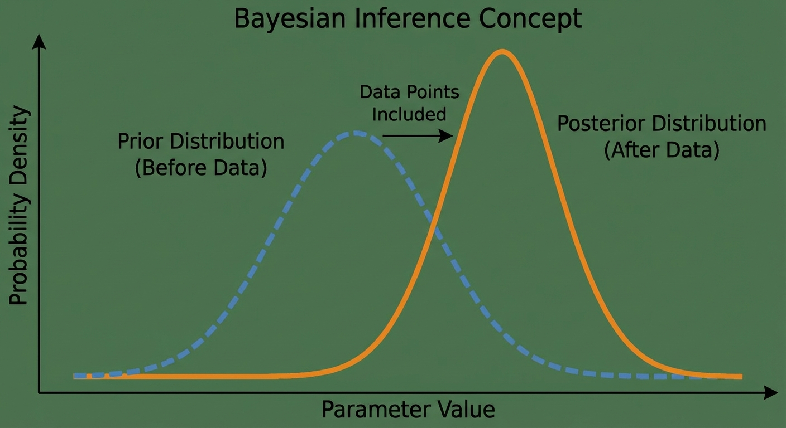

<!-- _footer: Generated by Nano Banana -->

---

# Prior Distribution

Choosing the prior is both the most powerful and most controversial aspect of Bayesian inference.

- The prior encodes what we know (or assume) about $\theta$ before seeing any data.

**Informative priors** incorporate genuine domain knowledge

- For example, a physicist might know that a physical constant is positive, or a clinician might have data from previous studies.
- These priors help most when data is scarce.

**Non-informative (vague) priors** try to _let the data speak_ by being as broad as possible, a Uniform or a very wide Gaussian.

- The goal is to add minimal bias, though truly non-informative priors can be surprisingly tricky to define rigorously.

**Conjugate priors** are chosen for mathematical convenience.

- When paired with a specific likelihood, the posterior stays in the same distributional family.
- This makes the posterior available in closed form, avoiding expensive numerical integration.

---

# Bayesian Update

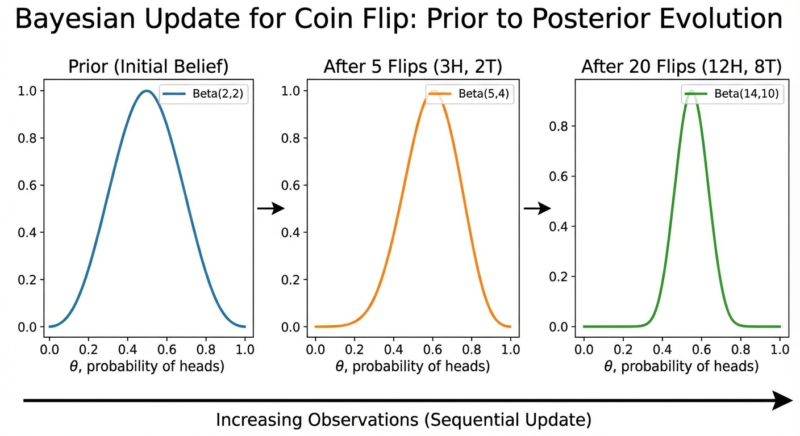

<!-- _footer: Generated by Nano Banana -->

---

# Bayesian Update

### Prior to Posterior Evolution

**Start:** Beta(2, 2) = uncertain (If I throw 4 coins, it would be 2 heads and 2 tails)

**10 flips, 7 heads:**

- Posterior: Beta(9, 5)
- E[μ] = 9/14 ≈ 0.64

**100 flips, 70 heads:**

- Posterior: Beta(72, 32)
- E[μ] ≈ 0.69

**Observation:**

- More data -£ Narrower posterior
- Prior's effect diminishes
- Approaches MLE

---

# Maximum A Posteriori (MAP)

Computing the full posterior is ideal but often expensive.

- A simpler alternative is **MAP estimation**

$$\hat{\theta}_{MAP} = \arg\max_\theta \, p(\theta|\mathcal{D}) = \arg\max_\theta \left[ \log p(\mathcal{D}|\theta) + \log p(\theta) \right]$$

> **In plain English:** "Maximum A Posteriori (MAP) is like MLE, but it also considers our initial beliefs (the prior). It picks the parameters that are most likely given BOTH the data we saw AND what we believed before we saw the data."

The evidence $p(\mathcal{D})$ drops out because it does not depend on $\theta$. Comparing with MLE:

$$\hat{\theta}_{MLE} = \arg\max_\theta \log p(\mathcal{D}|\theta) \qquad \hat{\theta}_{MAP} = \arg\max_\theta \left[\log p(\mathcal{D}|\theta) + \log p(\theta)\right]$$

The only difference is the additional $\log p(\theta)$ term

- The prior acts as a **penalty** that discourages extreme parameter values.
- As $N \to \infty$, the likelihood dominates and MAP converges to MLE.

---

# MAP - Bernoulli Example

With a $\text{Beta}(a, b)$ prior and $m$ successes in $N$ trials, the MAP estimate has a clean closed form:

$$\hat{\mu}_{MAP} = \frac{m + a - 1}{N + a + b - 2}$$

Let us revisit the problematic small-sample case (3 flips, 3 heads) and compare:

| Estimate      | Formula       | 3 flips, 3 heads | 100 flips, 70 heads |
| ------------- | ------------- | ---------------- | ------------------- |
| MLE           | $m/N$         | **1.0**          | 0.70                |
| MAP ($a=b=2$) | $(m+1)/(N+2)$ | **0.8**          | 0.70                |

- With small data, the prior pulls the MAP away from the extreme MLE estimate.
- With large data, both converge to the same value as the data overwhelms the prior.

> MAP is effectively MLE with a **regularization penalty** from the prior.

---

# Practice - MAP and Prior Effect

Same spam problem (10 emails, 7 spam). Prior: $\text{Beta}(2, 8)$ as we believe spam is rare.

Formula: $\hat{\mu}_{MAP} = \dfrac{m+a-1}{N+a+b-2}$.

**Questions:**

1. What is the MAP estimate?

- $\text{Beta}(2, 8)$: $\hat{\mu}_{MAP} = \dfrac{7+2-1}{10+2+8-2} = \dfrac{8}{18} = \mathbf{\dfrac{4}{9} \approx 0.444}$

2. How does the MAP change if we use $\text{Beta}(5, 5)$ as prior instead?

- $\text{Beta}(5, 5)$: $\hat{\mu}_{MAP} = \dfrac{7+5-1}{10+5+5-2} = \dfrac{11}{18} \approx \mathbf{0.611}$
- A symmetric prior pulls less strongly; we get closer to the data proportion.

3. What does the MAP converge to as $N \to \infty$?

- As $N \to \infty$: MAP (and the posterior) converge to the **MLE**: $\hat{\mu} \to m/N = 7/10$.
- With enough data, the prior becomes negligible.

---

# MAP vs Full Bayesian

MAP is convenient, but it is still a **point estimate** as it discards all information about the shape of the posterior.

- Two posteriors can have the same mode but very different spreads, and MAP cannot distinguish between them.

The full Bayesian approach uses the **entire posterior distribution** for both prediction and decision-making:

$$p(x_{new}|\mathcal{D}) = \int p(x_{new}|\theta) \, p(\theta|\mathcal{D}) \, d\theta$$

This is the **posterior predictive distribution**

- Instead of plugging in a single $\hat{\theta}$, we average over all possible parameter values, weighted by how plausible each one is given the data.
- The result naturally accounts for parameter uncertainty: when we are unsure about $\theta$, our predictions are appropriately more spread out.

The challenge here is **computational** as the integral is often analytically intractable.

- This is where modern approximate methods (**MCMC** (Markov Chain Monte Carlo) and **Variational Inference**) come in, which we will study later in the course.

---

# MLE vs MAP vs Bayesian

These three approaches form a spectrum from simplest to most complete.

- Choosing among them is a practical trade-off between computational cost and the quality of uncertainty estimates.

| Property                   | MLE            | MAP            | Full Bayesian     |
| -------------------------- | -------------- | -------------- | ----------------- |
| **Output**                 | Point estimate | Point estimate | Full distribution |
| **Uses prior**             | ❌             | ✅             | ✅                |
| **Quantifies uncertainty** | ❌             | ❌             | ✅                |
| **Computational cost**     | Low            | Low            | High              |
| **Overfitting risk**       | High           | Medium         | Low               |
| **Small-data performance** | Poor           | Good           | Best              |

- In practice, most production ML systems use MLE (or equivalently, minimizing a loss function) because it scales cheap.
- MAP appears whenever you add regularization.
- Full Bayesian methods are reserved for settings where uncertainty quantification is critical (e.g., medical diagnosis, autonomous driving, active learning) and the model is small enough for the computation to be feasible.

---

<!-- _class: lead -->

# Thank You!

## Contact Information

- **Email:** ekrem.cetinkaya@yildiz.edu.tr
- **Office Hours:** Wednesday 13:30-15:30 - Room C-120
- **Book a slot before coming:** [Booking Link](https://calendar.app.google/fog6DPBGJH2QpHVw8)
- **Course Repository:** [GitHub](https://github.com/ekremcet/yzm2011-introduction-to-machine-learning)
