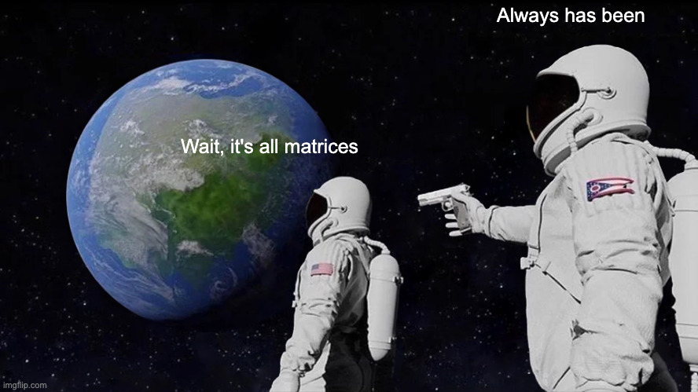
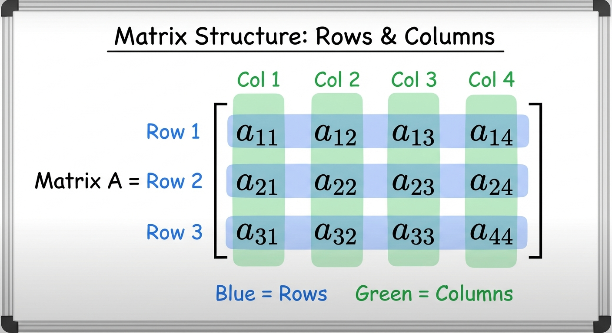
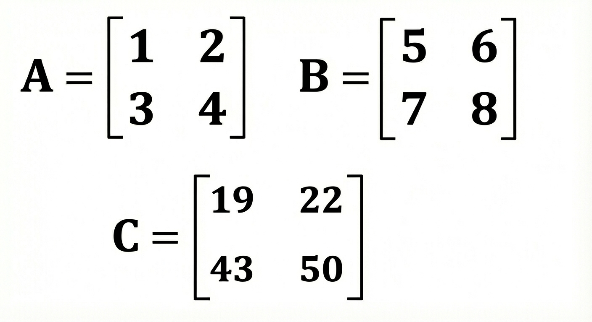
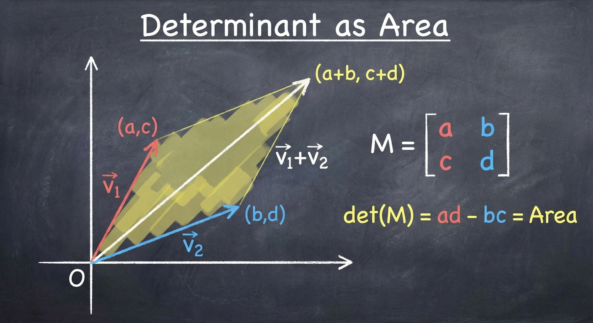
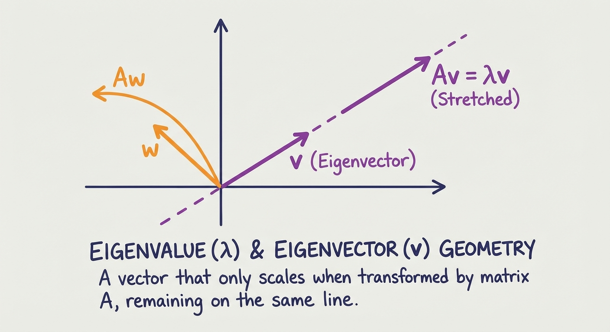
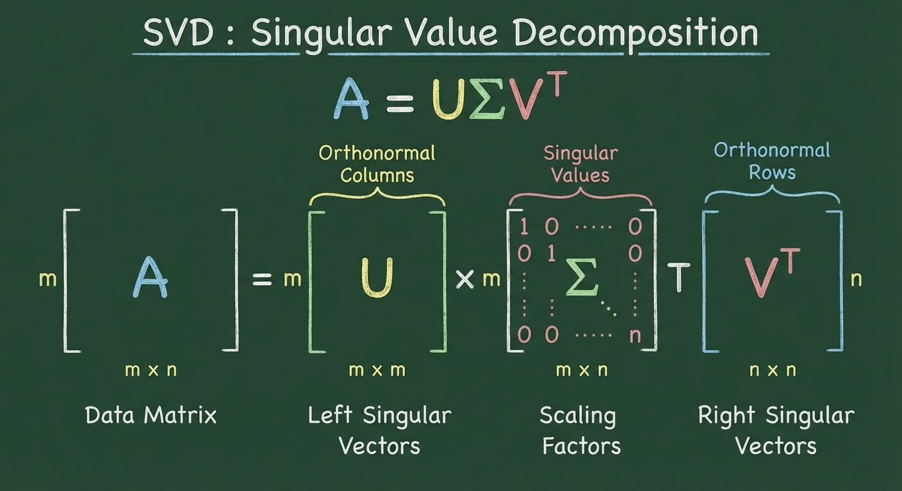
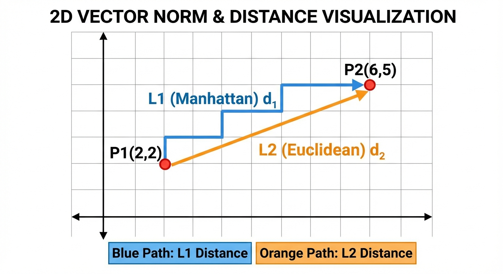
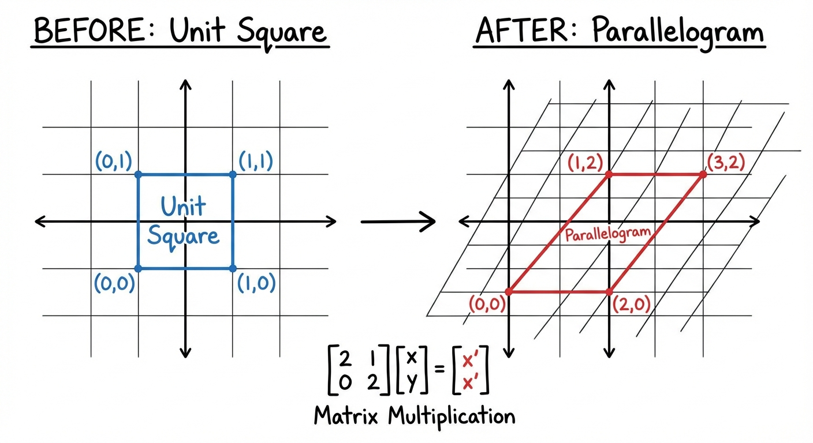
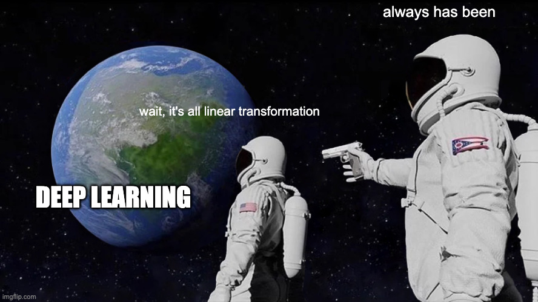

# YZM2011

## Introduction to Machine Learning

### Week 3: Linear Algebra for Machine Learning

**Instructor:** Ekrem Çetinkaya
**Date:** 10.03.2026

---

# Today's Agenda

## Fundamentals

- Vectors and vector operations
- Matrices and matrix operations
- Transpose, determinant, inverse

## Spectral Methods

- Eigenvalues and eigenvectors
- Eigendecomposition (spectral theorem)
- Singular Value Decomposition (SVD)

## Norms and Distances

- $L_1$, $L_2$, $L_\infty$ norms
- Cosine similarity
- Matrix norms

## Optimization Foundations

- Matrix derivatives (the "essential five")
- Linear transformations
- Lagrange multipliers and KKT conditions

---

# The Language of Machine Learning

Machine learning is, at its core, about manipulating large collections of numbers and linear algebra is the language for doing so efficiently.

- Every dataset is a matrix
- Every model parameter is a vector
- Every prediction is a matrix-vector product.

Without linear algebra, we cannot even _write down_ the algorithms, let alone analyze or optimize them.

---

# The Language of Machine Learning

- **Data representation** — Every data point is a vector of features; the entire dataset is a matrix $\mathbf{X} \in \mathbb{R}^{N \times D}$
- **Model parameters** — Weights in linear regression, neural networks, and SVMs are all vectors or matrices
- **Computational efficiency** — Matrix operations can be parallelized on GPUs, making them orders of magnitude faster than element-wise loops
- **Dimensionality reduction** — Techniques like PCA and SVD compress data by exploiting the structure of matrices
- **Optimization** — Every gradient calculation in ML is a matrix derivative

> _"Linear algebra is the mathematics of the 21st century."_ — Gilbert Strang

Understanding linear algebra is not just helpful for machine learning, it is absolutely essential.

---

# Where Linear Algebra Appears in ML

| Future Week | Topic               | Linear Algebra Connection                                                           |
| ----------- | ------------------- | ----------------------------------------------------------------------------------- |
| Week 4      | Linear Regression   | Normal equations $\mathbf{w} = (\mathbf{X}^T\mathbf{X})^{-1}\mathbf{X}^T\mathbf{y}$ |
| Week 5      | Logistic Regression | Gradient $\nabla_\mathbf{w} L$ via matrix derivatives                               |
| Week 6      | Regularization      | Ridge adds $\lambda\mathbf{I}$ to ensure invertibility                              |
| Week 9      | LDA                 | Generalized eigenvalue problem on scatter matrices                                  |
| Week 10     | SVM                 | Lagrange multipliers, kernel matrix positive semi-definiteness                      |
| Week 11     | Clustering (GMM)    | Covariance matrices, Mahalanobis distance                                           |
| Week 12     | PCA                 | Eigendecomposition of covariance matrix                                             |

Every algorithm we will study is built on the tools from this week.

---

# What Is a Vector?

A **vector** is an ordered list of numbers.

- In machine learning, vectors represent everything
  - data points, model parameters, predictions, gradients.
- Getting comfortable with vectors is the first step toward fluency in ML.

$$\mathbf{v} = \begin{bmatrix} v_1 \\ v_2 \\ \vdots \\ v_n \end{bmatrix} \in \mathbb{R}^n$$

A vector has three complementary interpretations:

- **Geometric** - An arrow in $n$-dimensional space with a direction and a magnitude
- **Algebraic** - A point (or coordinate) in $\mathbb{R}^n$
- **In ML** - The feature representation of a single data sample

---

# Vectors in ML

### Feature Vector

A house might be represented as a 4-dimensional feature vector:

$$\mathbf{x} = \begin{bmatrix} 120 \\ 3 \\ 2 \\ 15 \end{bmatrix} = \begin{bmatrix} \text{square meters} \\ \text{number of rooms} \\ \text{number of bathrooms} \\ \text{age (years)} \end{bmatrix}$$

### Word Embedding

In NLP, every word is mapped to a dense vector a.k.a the famous _word embedding._

- The word **king** might be represented as:

$$\mathbf{w}_{\text{king}} = \begin{bmatrix} 0.8 \\ -0.2 \\ 0.6 \\ \vdots \end{bmatrix} \in \mathbb{R}^{300}$$

These 300 numbers encode the word's meaning in a way that captures semantic relationships

---

# Special Vectors

Several vectors appear so frequently that they have their own names and notation.

### Zero Vector

$$\mathbf{0} = \begin{bmatrix} 0 \\ 0 \\ \vdots \\ 0 \end{bmatrix}$$

The additive identity, adding $\mathbf{0}$ to any vector leaves it unchanged.

### Ones Vector

$$\mathbf{1} = \begin{bmatrix} 1 \\ 1 \\ \vdots \\ 1 \end{bmatrix}$$

Used for computing sums: $\mathbf{1}^T\mathbf{x} = \sum_i x_i$.

### Standard Basis Vectors (Unit Vectors)

$$\mathbf{e}_1 = \begin{bmatrix} 1 \\ 0 \\ 0 \end{bmatrix}, \quad \mathbf{e}_2 = \begin{bmatrix} 0 \\ 1 \\ 0 \end{bmatrix}, \quad \mathbf{e}_3 = \begin{bmatrix} 0 \\ 0 \\ 1 \end{bmatrix}$$

Any vector can be written as a combination of basis vectors: $\mathbf{v} = v_1\mathbf{e}_1 + v_2\mathbf{e}_2 + v_3\mathbf{e}_3$. In ML, these are used as **one-hot encodings** — representing a category as a vector with a single 1 and all other entries 0.

---

# Vector Operations - Addition and Scalar Multiplication

### Vector Addition

$$\mathbf{u} + \mathbf{v} = \begin{bmatrix} u_1 + v_1 \\ u_2 + v_2 \\ \vdots \\ u_n + v_n \end{bmatrix}$$

Properties: commutative ($\mathbf{u} + \mathbf{v} = \mathbf{v} + \mathbf{u}$), associative, with $\mathbf{0}$ as identity.

### Scalar Multiplication

$$c \cdot \mathbf{v} = \begin{bmatrix} cv_1 \\ cv_2 \\ \vdots \\ cv_n \end{bmatrix}$$

If $c > 1$: stretches. If $0 < c < 1$: shrinks. If $c < 0$: reverses direction.

---

# Linear Combinations

A **linear combination** of vectors $\mathbf{v}_1, \ldots, \mathbf{v}_k$ with scalars $c_1, \ldots, c_k$ is:

$$\mathbf{w} = c_1\mathbf{v}_1 + c_2\mathbf{v}_2 + \cdots + c_k\mathbf{v}_k = \sum_{i=1}^{k} c_i\mathbf{v}_i$$

This seemingly simple concept is the backbone of machine learning. A linear model's prediction is nothing more than a linear combination of features:

$$\hat{y} = w_1 x_1 + w_2 x_2 + \cdots + w_n x_n = \mathbf{w}^T\mathbf{x}$$

The **span** of a set of vectors is the set of all points reachable through their linear combinations.

- If the vectors are **linearly independent** (none can be written as a linear combination of the others), they form a **basis** for that span
  - The minimal set of "building blocks" needed to reach every point.

> The number of linearly independent vectors needed to span a space is the **dimension** of that space. This concept directly connects to dimensionality reduction (e.g., PCA finds a lower-dimensional subspace that captures most of the data's variance).

---

# Dot Product (Inner Product)

The dot product is arguably the single most important operation in machine learning.

- It takes two vectors of the same dimension and returns a single number, a measure of how much the two vectors **agree** in direction.

$$\mathbf{u} \cdot \mathbf{v} = \mathbf{u}^T\mathbf{v} = \sum_{i=1}^{n} u_i v_i$$

The geometric interpretation connects the algebraic formula to angles:

$$\mathbf{u} \cdot \mathbf{v} = \|\mathbf{u}\| \, \|\mathbf{v}\| \cos\theta$$

| Angle $\theta$ | $\cos\theta$ | $\mathbf{u} \cdot \mathbf{v}$ | Meaning                    |
| -------------- | ------------ | ----------------------------- | -------------------------- |
| 0°             | 1            | Maximum positive              | Same direction             |
| 90°            | 0            | 0                             | Perpendicular (orthogonal) |
| 180°           | −1           | Maximum negative              | Opposite direction         |

> When two vectors are **orthogonal** ($\mathbf{u}^T\mathbf{v} = 0$), they carry completely independent information as knowing one tells you nothing about the other. This is why orthogonal bases are so desirable in ML.

---

# Dot Product in Machine Learning

### 1. Similarity Measure (Cosine Similarity)

$$\text{sim}(\mathbf{u}, \mathbf{v}) = \frac{\mathbf{u}^T\mathbf{v}}{\|\mathbf{u}\| \, \|\mathbf{v}\|}$$

This normalizes the dot product to the range $[-1, 1]$, measuring the angle between vectors regardless of their magnitudes. It is the standard similarity metric for word embeddings, document retrieval, and recommender systems.

### 2. Projection

$$\text{proj}_{\mathbf{u}}(\mathbf{v}) = \frac{\mathbf{u}^T\mathbf{v}}{\mathbf{u}^T\mathbf{u}} \, \mathbf{u}$$

Projects $\mathbf{v}$ onto the direction of $\mathbf{u}$, extracting the component of $\mathbf{v}$ that lies along $\mathbf{u}$. Core operation behind PCA, least-squares regression.

### 3. Neuron Activation

$$z = \mathbf{w}^T\mathbf{x} + b = \sum_{i=1}^{n} w_i x_i + b$$

Every neuron in a neural network computes a dot product of weights and inputs, followed by a bias and a nonlinear activation. The entire forward pass is a sequence of dot products organized as matrix multiplications.

---

# What Is a Matrix?

<!-- _footer: Generated by Nano Banana -->

---

# Matrix

A **matrix** is a rectangular array of numbers, organized into rows and columns.

- If a vector is a single data point, a matrix is an entire dataset or, equivalently, a linear transformation that maps one vector space to another.

$$\mathbf{A} = \begin{bmatrix} a_{11} & a_{12} & \cdots & a_{1n} \\ a_{21} & a_{22} & \cdots & a_{2n} \\ \vdots & \vdots & \ddots & \vdots \\ a_{m1} & a_{m2} & \cdots & a_{mn} \end{bmatrix} \in \mathbb{R}^{m \times n}$$

where $m$ is the number of rows, $n$ is the number of columns, and $a_{ij}$ denotes the element in row $i$, column $j$.

- Matrices are denoted by bold uppercase letters ($\mathbf{A}$, $\mathbf{X}$, $\mathbf{W}$).

---

# Matrix

### The Data Matrix Convention

In ML, the **data matrix** $\mathbf{X} \in \mathbb{R}^{N \times D}$ stores $N$ observations of $D$-dimensional vectors.

- Each **row** is a data sample
- Each **column** is a feature.
- The $(n, i)$ element of $\mathbf{X}$ is the $i$-th feature of the $n$-th observation.

This convention is standard in most ML libraries (NumPy, scikit-learn, PyTorch).

---

# Matrices in ML

### Data Matrix

$$\mathbf{X} = \begin{bmatrix} x_{11} & x_{12} & \cdots & x_{1D} \\ x_{21} & x_{22} & \cdots & x_{2D} \\ \vdots & \vdots & \ddots & \vdots \\ x_{N1} & x_{N2} & \cdots & x_{ND} \end{bmatrix}$$

$N$ samples, $D$ features. This is the starting point of every ML pipeline.

### Image as a Matrix

A grayscale image is a matrix $\mathbf{I} \in \mathbb{R}^{H \times W}$ where each entry is a pixel intensity (0–255). A color image adds a third dimension: $\mathbb{R}^{H \times W \times 3}$.

### Weight Matrix (Neural Network)

$$\mathbf{W} = \begin{bmatrix} w_{11} & w_{12} & w_{13} \\ w_{21} & w_{22} & w_{23} \\ w_{31} & w_{32} & w_{33} \\ w_{41} & w_{42} & w_{43} \end{bmatrix} \in \mathbb{R}^{4 \times 3}$$

Maps a 3-dimensional input to a 4-dimensional output. Each row encodes one output neuron's weights.

### Kernel Matrix

$$K_{ij} = k(\mathbf{x}_i, \mathbf{x}_j)$$

A symmetric matrix of pairwise similarities, central to SVMs and Gaussian processes.

---

# Special Matrices

Several matrix types appear so frequently in ML that recognizing them on sight saves significant time and effort.

### Identity Matrix

$$\mathbf{I} = \begin{bmatrix} 1 & 0 & 0 \\ 0 & 1 & 0 \\ 0 & 0 & 1 \end{bmatrix}$$

The multiplicative identity: $\mathbf{AI} = \mathbf{IA} = \mathbf{A}$.

### Diagonal Matrix

$$\mathbf{D} = \text{diag}(d_1, d_2, d_3) = \begin{bmatrix} d_1 & 0 & 0 \\ 0 & d_2 & 0 \\ 0 & 0 & d_3 \end{bmatrix}$$

Scales each dimension independently. Inversion is trivial: $\mathbf{D}^{-1} = \text{diag}(1/d_1, 1/d_2, 1/d_3)$.

### Symmetric Matrix

$\mathbf{A} = \mathbf{A}^T$ — equal to its own transpose.

Examples - covariance matrices $\boldsymbol{\Sigma}$, Gram matrices $\mathbf{X}^T\mathbf{X}$, kernel matrices $\mathbf{K}$.

### Triangular Matrices

$$\mathbf{U} = \begin{bmatrix} u_{11} & u_{12} & u_{13} \\ 0 & u_{22} & u_{23} \\ 0 & 0 & u_{33} \end{bmatrix}$$

Upper (or lower) triangular. Arise in Cholesky decomposition, used for efficient sampling from multivariate Gaussians.

---

# Matrix Operations

Matrix addition and scalar multiplication work element-wise, just like their vector counterparts. They are used constantly in gradient-based optimization.

### Matrix Addition

$$\mathbf{A} + \mathbf{B} = \begin{bmatrix} a_{11} + b_{11} & a_{12} + b_{12} \\ a_{21} + b_{21} & a_{22} + b_{22} \end{bmatrix}$$

Both matrices must have the same dimensions.

- Properties: commutative, associative, with the zero matrix $\mathbf{0}$ as identity.

### Scalar-Matrix Multiplication

$$c \cdot \mathbf{A} = \begin{bmatrix} ca_{11} & ca_{12} \\ ca_{21} & ca_{22} \end{bmatrix}$$

This appears in the **gradient descent update rule**: $\mathbf{W} \leftarrow \mathbf{W} - \alpha \nabla_\mathbf{W} L$, where $\alpha$ is the learning rate.

- It also appears in regularization: adding $\lambda\mathbf{W}$ penalizes large weights.

---

# Matrix Multiplication

<!-- _footer: Generated by Nano Banana -->

---

# Matrix Multiplication

Matrix multiplication is the engine of machine learning computation. For $\mathbf{A} \in \mathbb{R}^{m \times n}$ and $\mathbf{B} \in \mathbb{R}^{n \times p}$, the product $\mathbf{C} = \mathbf{AB} \in \mathbb{R}^{m \times p}$ is defined by:

$$C_{ij} = \sum_{k=1}^{n} A_{ik} B_{kj}$$

The inner dimensions must match: $(m \times \boxed{n}) \cdot (\boxed{n} \times p) = (m \times p)$.

Each element $C_{ij}$ is the **dot product** of the $i$-th row of $\mathbf{A}$ with the $j$-th column of $\mathbf{B}$.

### Example

$$\begin{bmatrix} 1 & 2 \\ 3 & 4 \end{bmatrix} \begin{bmatrix} 5 & 6 \\ 7 & 8 \end{bmatrix} = \begin{bmatrix} 1 \cdot 5 + 2 \cdot 7 & 1 \cdot 6 + 2 \cdot 8 \\ 3 \cdot 5 + 4 \cdot 7 & 3 \cdot 6 + 4 \cdot 8 \end{bmatrix} = \begin{bmatrix} 19 & 22 \\ 43 & 50 \end{bmatrix}$$

---

# Matrix Multiplication

### Properties That Hold

- **Associative:** $(\mathbf{AB})\mathbf{C} = \mathbf{A}(\mathbf{BC})$ - order of grouping does not matter
- **Distributive:** $\mathbf{A}(\mathbf{B} + \mathbf{C}) = \mathbf{AB} + \mathbf{AC}$ - multiplication distributes over addition
- **Identity:** $\mathbf{AI} = \mathbf{IA} = \mathbf{A}$

### The Critical Property That Does Not Hold

$$\mathbf{AB} \neq \mathbf{BA} \quad \text{in general!}$$

Matrix multiplication is **not commutative**.

- Even when both products exist (for square matrices), they typically give different results.
- This has real consequence as in ML derivations, the order of multiplication matters everywhere.

* From the chain rule in backpropagation to the formulation of normal equations.

> **Example:** A neural network layer computes $\mathbf{z} = \mathbf{Wx} + \mathbf{b}$, and batch processing computes $\mathbf{Z} = \mathbf{XW}^T + \mathbf{b}^T$ for all samples simultaneously. The entire forward pass is a chain of matrix multiplications and this is why GPUs (designed for parallel matrix operations) are crucial in deep learning.

---

# Hadamard (Element-wise) Product

Not all multiplications between matrices follow the standard matrix product.

- The **Hadamard product** multiplies corresponding elements directly:

$$(\mathbf{A} \odot \mathbf{B})_{ij} = A_{ij} \cdot B_{ij}$$

Both matrices must have the same dimensions. Unlike standard matrix multiplication, the Hadamard product is commutative.

### Example

$$\begin{bmatrix} 1 & 2 \\ 3 & 4 \end{bmatrix} \odot \begin{bmatrix} 5 & 6 \\ 7 & 8 \end{bmatrix} = \begin{bmatrix} 5 & 12 \\ 21 & 32 \end{bmatrix}$$

### Where It Appears in ML

- **Dropout:** $\mathbf{h} \odot \mathbf{m}$, where $\mathbf{m}$ is a binary mask that randomly zeros out neurons during training
- **Gating mechanisms:** LSTM and GRU gates use element-wise products to control information flow
- **Attention:** Element-wise weighting of value vectors by attention scores

---

# Transpose

The **transpose** of a matrix swaps its rows and columns: $(\mathbf{A}^T)_{ij} = A_{ji}$.

$$\mathbf{A} = \begin{bmatrix} 1 & 2 & 3 \\ 4 & 5 & 6 \end{bmatrix} \implies \mathbf{A}^T = \begin{bmatrix} 1 & 4 \\ 2 & 5 \\ 3 & 6 \end{bmatrix}$$

### Properties

1. $(\mathbf{A}^T)^T = \mathbf{A}$ - transposing twice returns to the original
2. $(\mathbf{A} + \mathbf{B})^T = \mathbf{A}^T + \mathbf{B}^T$ - transpose distributes over addition
3. $(c\mathbf{A})^T = c\mathbf{A}^T$ - scalars pass through the transpose
4. $(\mathbf{AB})^T = \mathbf{B}^T\mathbf{A}^T$ - **order reverses!**
5. $(\mathbf{ABC})^T = \mathbf{C}^T\mathbf{B}^T\mathbf{A}^T$ - extends to any number of factors

Property 4 is critical as forgetting to reverse the order is one of the most common mistakes in ML derivations.

- It applies everywhere: the gradient of linear regression involves $\nabla_\mathbf{W} L = \mathbf{X}^T(\hat{\mathbf{y}} - \mathbf{y})$, and the Gram matrix $\mathbf{X}^T\mathbf{X}$ is the starting point for computing covariance.

---

# Determinant

The determinant reduces a square matrix to a single number that encodes crucial information about the matrix

- Whether it is invertible, how it scales volumes, and the product of its eigenvalues.

### 2×2 Case

$$\det\begin{bmatrix} a & b \\ c & d \end{bmatrix} = ad - bc$$

### 3×3 Case (Sarrus' Rule)

$$\det\begin{bmatrix} a & b & c \\ d & e & f \\ g & h & i \end{bmatrix} = aei + bfg + cdh - ceg - bdi - afh$$

### Key Properties

| Property  | Formula                                                            |
| --------- | ------------------------------------------------------------------ |
| Identity  | $\det(\mathbf{I}) = 1$                                             |
| Transpose | $\det(\mathbf{A}^T) = \det(\mathbf{A})$                            |
| Product   | $\det(\mathbf{AB}) = \det(\mathbf{A}) \cdot \det(\mathbf{B})$      |
| Scalar    | $\det(c\mathbf{A}) = c^n \det(\mathbf{A})$ for $n \times n$ matrix |
| Inverse   | $\det(\mathbf{A}^{-1}) = 1/\det(\mathbf{A})$                       |

---

# Determinant - Geometric Interpretation

<!-- _footer: Generated by Nano Banana -->

---

# Determinant

The determinant has an important geometric meaning:

- It tells you how much the matrix stretches or shrinks volume when it transforms space.
- For example, if you start with a unit cube and apply the transformation $\mathbf{A}$, the absolute value of $\det(\mathbf{A})$ is the volume of the resulting, possibly skewed, shape (like a slanted box).
  - In 2D, this is the area of the transformed unit square
  - In 3D, it's the volume of the transformed unit cube.

This geometric view immediately explains the most important property:

$$\det(\mathbf{A}) = 0 \quad \Leftrightarrow \quad \mathbf{A} \text{ is singular (not invertible)}$$

A zero determinant means the transformation collapses at least one dimension and the parallelepiped has zero volume.

- In this case, the transformation loses information and cannot be reversed.

---

# Determinant

### In Machine Learning

The determinant appears in two critical places:

1. **Gaussian distribution:** The normalization constant of the multivariate Gaussian involves $|\boldsymbol{\Sigma}|^{-1/2}$.

- When computing log-likelihoods, we work with $\log|\boldsymbol{\Sigma}|$ which is why the log-determinant derivative is so important.

2. **Checking invertibility:** Before computing $(\mathbf{X}^T\mathbf{X})^{-1}$ in linear regression, we need $\det(\mathbf{X}^T\mathbf{X}) \neq 0$.

- If it is zero (or near zero), the system is ill-conditioned and regularization is needed.

---

# Inverse Matrix

The **inverse** $\mathbf{A}^{-1}$ of a square matrix $\mathbf{A}$ is the unique matrix satisfying:

$$\mathbf{A}\mathbf{A}^{-1} = \mathbf{A}^{-1}\mathbf{A} = \mathbf{I}$$

It exists if and only if $\det(\mathbf{A}) \neq 0$ (the matrix is non-singular).

### 2×2 Inverse Formula

$$\mathbf{A}^{-1} = \frac{1}{\det(\mathbf{A})} \begin{bmatrix} d & -b \\ -c & a \end{bmatrix} \qquad \text{for } \mathbf{A} = \begin{bmatrix} a & b \\ c & d \end{bmatrix}$$

### Properties

1. $(\mathbf{A}^{-1})^{-1} = \mathbf{A}$ - inverting twice returns to original
2. $(\mathbf{AB})^{-1} = \mathbf{B}^{-1}\mathbf{A}^{-1}$ - **order reverses**, just like transpose
3. $(\mathbf{A}^T)^{-1} = (\mathbf{A}^{-1})^T$ - transpose and inverse commute
4. $(c\mathbf{A})^{-1} = \frac{1}{c}\mathbf{A}^{-1}$

> The order-reversal pattern appears in both transpose and inverse and this is not a coincidence as it reflects the fundamental way that composed operations must be unwound in reverse order.

---

# Inverse Matrix - Example

$$\mathbf{A} = \begin{bmatrix} 4 & 7 \\ 2 & 6 \end{bmatrix}$$

**Step 1:** Compute the determinant.

$$\det(\mathbf{A}) = 4 \cdot 6 - 7 \cdot 2 = 24 - 14 = 10$$

Since $\det(\mathbf{A}) = 10 \neq 0$, the matrix is invertible.

**Step 2:** Apply the 2×2 inverse formula.

$$\mathbf{A}^{-1} = \frac{1}{10} \begin{bmatrix} 6 & -7 \\ -2 & 4 \end{bmatrix} = \begin{bmatrix} 0.6 & -0.7 \\ -0.2 & 0.4 \end{bmatrix}$$

**Verification:** $\mathbf{A}\mathbf{A}^{-1} = \mathbf{I}$

$$\begin{bmatrix} 4 & 7 \\ 2 & 6 \end{bmatrix}\begin{bmatrix} 0.6 & -0.7 \\ -0.2 & 0.4 \end{bmatrix} = \begin{bmatrix} 2.4 - 1.4 & -2.8 + 2.8 \\ 1.2 - 1.2 & -1.4 + 2.4 \end{bmatrix} = \begin{bmatrix} 1 & 0 \\ 0 & 1 \end{bmatrix} \checkmark$$

---

# Solving Linear Systems

One of the most important applications of matrix inverse is solving systems of linear equations.

- The system $\mathbf{Ax} = \mathbf{b}$ has the solution $\mathbf{x} = \mathbf{A}^{-1}\mathbf{b}$ (when $\mathbf{A}$ is invertible).

### Example

$$\begin{cases} 2x + 3y = 8 \\ 4x + 5y = 14 \end{cases} \quad \Rightarrow \quad \begin{bmatrix} 2 & 3 \\ 4 & 5 \end{bmatrix}\begin{bmatrix} x \\ y \end{bmatrix} = \begin{bmatrix} 8 \\ 14 \end{bmatrix}$$

$$\det(\mathbf{A}) = 10 - 12 = -2, \quad \mathbf{A}^{-1} = \frac{1}{-2}\begin{bmatrix} 5 & -3 \\ -4 & 2 \end{bmatrix}$$

$$\mathbf{x} = \mathbf{A}^{-1}\mathbf{b} = \begin{bmatrix} -2.5 & 1.5 \\ 2 & -1 \end{bmatrix}\begin{bmatrix} 8 \\ 14 \end{bmatrix} = \begin{bmatrix} 1 \\ 2 \end{bmatrix}$$

### The Normal Equations

In linear regression, finding the optimal weights is exactly a linear system. Minimizing the squared error $\|\mathbf{y} - \mathbf{Xw}\|^2$ yields:

$$\hat{\mathbf{w}} = (\mathbf{X}^T\mathbf{X})^{-1}\mathbf{X}^T\mathbf{y}$$

This is the **closed-form solution** and no iterative optimization needed. Understanding matrix inverse is what makes this formula work.

---

# The Woodbury Identity

When matrices are large, computing the inverse directly is expensive ($O(n^3)$).

- The **Woodbury identity** provides a shortcut when the matrix can be decomposed as a sum of an easily invertible part and a low-rank update:

$$(\mathbf{A} + \mathbf{BD}^{-1}\mathbf{C})^{-1} = \mathbf{A}^{-1} - \mathbf{A}^{-1}\mathbf{B}(\mathbf{D} + \mathbf{CA}^{-1}\mathbf{B})^{-1}\mathbf{CA}^{-1}$$

### Why does this matter?

Suppose $\mathbf{A}$ is $N \times N$ (large) and diagonal (easy to invert), while $\mathbf{B}$ is $N \times M$ with $M \ll N$. The left side requires inverting an $N \times N$ matrix (expensive).

- The right side only requires inverting the much smaller $M \times M$ matrix $(\mathbf{D} + \mathbf{CA}^{-1}\mathbf{B})$.

### Where It Appears

- **Bayesian linear regression**: The posterior covariance $\mathbf{S}_N = (\mathbf{S}_0^{-1} + \beta\boldsymbol{\Phi}^T\boldsymbol{\Phi})^{-1}$ can be computed efficiently using Woodbury
- **Gaussian processes**: Avoid $O(N^3)$ inversion by exploiting structure
- **Online learning**: Updating the inverse incrementally when new data arrives

> You do not need to memorize this formula but you should know it exists and what problem it solves.

---

# Pseudo-Inverse (Moore-Penrose)

The matrix inverse only exists for square, non-singular matrices. But in ML, we frequently encounter non-square or singular matrices as the data matrix $\mathbf{X}$ is rarely square, and $\mathbf{X}^T\mathbf{X}$ can be singular when features are linearly dependent.

- The **pseudo-inverse** generalizes the concept of inverse to handle these cases.

For a matrix $\mathbf{A} \in \mathbb{R}^{m \times n}$, the Moore-Penrose pseudo-inverse $\mathbf{A}^+$ is defined via the SVD:

$$\mathbf{A}^+ = \mathbf{V}\boldsymbol{\Sigma}^+\mathbf{U}^T$$

where $\boldsymbol{\Sigma}^+$ is obtained by taking the reciprocal of each non-zero singular value and transposing the resulting matrix.

When $\mathbf{A}$ has full column rank, the pseudo-inverse simplifies to the familiar formula:

$$\mathbf{A}^+ = (\mathbf{A}^T\mathbf{A})^{-1}\mathbf{A}^T$$

The pseudo-inverse gives the **least-squares solution** to $\mathbf{Ax} = \mathbf{b}$ even when no exact solution exists — it finds the $\mathbf{x}$ that minimizes $\|\mathbf{Ax} - \mathbf{b}\|^2$.

---

# Practice - Matrix Operations

Given:

$$\mathbf{A} = \begin{bmatrix} 1 & 2 \\ 3 & 4 \end{bmatrix}, \quad \mathbf{B} = \begin{bmatrix} 5 & 6 \\ 7 & 8 \end{bmatrix}$$

**Questions:**

1. Compute $\mathbf{AB}$ and $\mathbf{BA}$. Are they equal?
2. Compute $\det(\mathbf{A})$ and $\det(\mathbf{B})$. Verify that $\det(\mathbf{AB}) = \det(\mathbf{A}) \cdot \det(\mathbf{B})$.
3. Compute $\mathbf{A}^{-1}$ using the 2×2 formula.
4. Verify that $(\mathbf{AB})^T = \mathbf{B}^T\mathbf{A}^T$ by computing both sides.

---

# Solution - Matrix Operations

**1.** $\mathbf{AB} = \begin{bmatrix} 19 & 22 \\ 43 & 50 \end{bmatrix}$, $\quad\mathbf{BA} = \begin{bmatrix} 23 & 34 \\ 31 & 46 \end{bmatrix}$ $\implies \mathbf{AB} \neq \mathbf{BA}$

**2.** $\det(\mathbf{A}) = 1\cdot4 - 2\cdot3 = -2$, $\quad \det(\mathbf{B}) = 5\cdot8 - 6\cdot7 = -2$

$$\det(\mathbf{AB}) = 19 \cdot 50 - 22 \cdot 43 = 4 = (-2)(-2) = \det(\mathbf{A})\cdot\det(\mathbf{B}) \checkmark$$

**3.** Using $\mathbf{A}^{-1} = \frac{1}{ad-bc}\begin{bmatrix} d & -b \\ -c & a \end{bmatrix}$:

$$\mathbf{A}^{-1} = \frac{1}{-2} \begin{bmatrix} 4 & -2 \\ -3 & 1 \end{bmatrix} = \begin{bmatrix} -2 & 1 \\ 1.5 & -0.5 \end{bmatrix}$$

**4.**

$$(\mathbf{AB})^T = \begin{bmatrix} 19 & 22 \\ 43 & 50 \end{bmatrix}^T = \begin{bmatrix} 19 & 43 \\ 22 & 50 \end{bmatrix}$$

$$\mathbf{B}^T\mathbf{A}^T = \begin{bmatrix} 5 & 7 \\ 6 & 8 \end{bmatrix}\begin{bmatrix} 1 & 3 \\ 2 & 4 \end{bmatrix} = \begin{bmatrix} 19 & 43 \\ 22 & 50 \end{bmatrix} \checkmark$$

---

# Eigenvalues and Eigenvectors

<!-- _footer: Generated by Nano Banana -->

---

# What Are Eigenvalues and Eigenvectors?

For most vectors $\mathbf{v}$, multiplying by a matrix $\mathbf{A}$ changes both the direction and the magnitude of $\mathbf{v}$.

- But certain special vectors, the **eigenvectors**, only get scaled, not rotated.

* For a square matrix $\mathbf{A}$, a non-zero vector $\mathbf{v}$ is an eigenvector with eigenvalue $\lambda$ if:

$$\mathbf{Av} = \lambda\mathbf{v}$$

The transformation $\mathbf{A}$ acts on $\mathbf{v}$ by simply multiplying it by the scalar $\lambda$ — the direction stays the same (or reverses if $\lambda < 0$).

To find eigenvalues, we solve the **characteristic equation**:

$$\det(\mathbf{A} - \lambda\mathbf{I}) = 0$$

This is a polynomial of degree $n$ (for an $n \times n$ matrix), so there are at most $n$ eigenvalues. Once we have $\lambda$, we find the corresponding eigenvector by solving $(\mathbf{A} - \lambda\mathbf{I})\mathbf{v} = \mathbf{0}$.

> The eigenvectors define the natural axes of the transformation, the directions along which the matrix acts most simply (just stretching).

---

# Eigenvalue Calculation

$$\mathbf{A} = \begin{bmatrix} 4 & 2 \\ 1 & 3 \end{bmatrix}$$

**Step 1:** Write the characteristic equation.

$$\det(\mathbf{A} - \lambda\mathbf{I}) = \det\begin{bmatrix} 4-\lambda & 2 \\ 1 & 3-\lambda \end{bmatrix} = (4-\lambda)(3-\lambda) - 2 = 0$$

$$\lambda^2 - 7\lambda + 10 = 0 \quad \Rightarrow \quad (\lambda - 5)(\lambda - 2) = 0$$

**Eigenvalues:** $\lambda_1 = 5$, $\lambda_2 = 2$

**Step 2:** Find eigenvectors. For $\lambda_1 = 5$:

$$(\mathbf{A} - 5\mathbf{I})\mathbf{v} = \begin{bmatrix} -1 & 2 \\ 1 & -2 \end{bmatrix}\mathbf{v} = \mathbf{0} \quad \Rightarrow \quad v_1 = 2v_2 \quad \Rightarrow \quad \mathbf{v}_1 = \begin{bmatrix} 2 \\ 1 \end{bmatrix}$$

For $\lambda_2 = 2$:

$$(\mathbf{A} - 2\mathbf{I})\mathbf{v} = \begin{bmatrix} 2 & 2 \\ 1 & 1 \end{bmatrix}\mathbf{v} = \mathbf{0} \quad \Rightarrow \quad v_1 = -v_2 \quad \Rightarrow \quad \mathbf{v}_2 = \begin{bmatrix} 1 \\ -1 \end{bmatrix}$$

---

# Eigenvalue Properties

An $n \times n$ matrix has at most $n$ eigenvalues, and these eigenvalues encode fundamental information about the matrix.

The **trace** of a square matrix is the sum of its diagonal elements:

$$\text{Tr}(\mathbf{A}) = \sum_{i=1}^{n} a_{ii}$$

Two identities connect eigenvalues to the trace and determinant:

$$\sum_{i=1}^{n} \lambda_i = \text{Tr}(\mathbf{A}) \qquad \qquad \prod_{i=1}^{n} \lambda_i = \det(\mathbf{A})$$

**Verification with our example:** $\lambda_1 + \lambda_2 = 5 + 2 = 7 = 4 + 3 = \text{Tr}(\mathbf{A})$ ✓ and $\lambda_1 \cdot \lambda_2 = 5 \cdot 2 = 10 = 12 - 2 = \det(\mathbf{A})$ ✓

---

# Eigenvalue Properties

### Special Properties of Symmetric Matrices

For a **real symmetric** matrix ($\mathbf{A} = \mathbf{A}^T$), two additional properties hold:

1. All eigenvalues are **real** (never complex)
2. Eigenvectors corresponding to distinct eigenvalues are **orthogonal**

These properties are why symmetric matrices are so central to ML.

- Covariance matrices, kernel matrices, and Gram matrices are all symmetric, and their eigendecompositions are clean, real-valued, and geometrically interpretable.

---

# Eigendecomposition (Spectral Theorem)

For a real symmetric matrix $\mathbf{A}$, the orthogonal eigenvectors can be arranged into a matrix $\mathbf{U}$ and the eigenvalues into a diagonal matrix $\boldsymbol{\Lambda}$. The **spectral decomposition** says:

$$\mathbf{A} = \mathbf{U}\boldsymbol{\Lambda}\mathbf{U}^T = \sum_{i=1}^{n} \lambda_i \mathbf{u}_i \mathbf{u}_i^T$$

where $\mathbf{U} = [\mathbf{u}_1 | \mathbf{u}_2 | \cdots | \mathbf{u}_n]$ is an orthogonal matrix ($\mathbf{U}^T\mathbf{U} = \mathbf{I}$) and $\boldsymbol{\Lambda} = \text{diag}(\lambda_1, \ldots, \lambda_n)$.

### Geometric Meaning

Any symmetric matrix transformation can be decomposed into three steps:

1. **Rotate** to the eigenvector coordinate system ($\mathbf{U}^T$)
2. **Scale** along each axis by the corresponding eigenvalue ($\boldsymbol{\Lambda}$)
3. **Rotate back** to the original coordinate system ($\mathbf{U}$)

This decomposition immediately gives us efficient formulas for:

- **Inverse:** $\mathbf{A}^{-1} = \mathbf{U}\boldsymbol{\Lambda}^{-1}\mathbf{U}^T$ - just invert the eigenvalues
- **Powers:** $\mathbf{A}^k = \mathbf{U}\boldsymbol{\Lambda}^k\mathbf{U}^T$ - just raise the eigenvalues to the $k$-th power
- **Square root:** $\mathbf{A}^{1/2} = \mathbf{U}\boldsymbol{\Lambda}^{1/2}\mathbf{U}^T$ - used for sampling from Gaussians

---

# Practice - Eigenvalues

Given the symmetric matrix:

$$\mathbf{A} = \begin{bmatrix} 5 & 2 \\ 2 & 2 \end{bmatrix}$$

**Questions:**

1. Find the eigenvalues by solving $\det(\mathbf{A} - \lambda\mathbf{I}) = 0$.
2. Find the eigenvector for each eigenvalue.
3. Verify that $\lambda_1 + \lambda_2 = \text{Tr}(\mathbf{A})$ and $\lambda_1 \cdot \lambda_2 = \det(\mathbf{A})$.
4. Are the eigenvectors orthogonal? (Check that $\mathbf{v}_1^T\mathbf{v}_2 = 0$.)

---

# Solution - Eigenvalues

**1. Find eigenvalues:** $\det(\mathbf{A} - \lambda\mathbf{I}) = (5-\lambda)(2-\lambda) - 4 = \lambda^2 - 7\lambda + 6 = (\lambda-6)(\lambda-1) = 0$

$$\lambda_1 = 6, \quad \lambda_2 = 1$$

**2. Find eigenvectors:**

For $\lambda_1 = 6$: $(\mathbf{A} - 6\mathbf{I})\mathbf{v} = \begin{bmatrix} -1 & 2 \\ 2 & -4 \end{bmatrix}\mathbf{v} = \mathbf{0} \implies v_1 = 2v_2 \implies \mathbf{v}_1 = \begin{bmatrix} 2 \\ 1 \end{bmatrix}$

For $\lambda_2 = 1$: $(\mathbf{A} - \mathbf{I})\mathbf{v} = \begin{bmatrix} 4 & 2 \\ 2 & 1 \end{bmatrix}\mathbf{v} = \mathbf{0} \implies v_2 = -2v_1 \implies \mathbf{v}_2 = \begin{bmatrix} 1 \\ -2 \end{bmatrix}$

**3. Verify trace and determinant identities:**

$$\lambda_1 + \lambda_2 = 6 + 1 = 7 = \text{Tr}(\mathbf{A}) \checkmark \qquad \lambda_1 \cdot \lambda_2 = 6 \cdot 1 = 6 = \det(\mathbf{A}) \checkmark$$

**4. Orthogonality:**

$$\mathbf{v}_1^T\mathbf{v}_2 = 2 \cdot 1 + 1 \cdot (-2) = 0 \checkmark$$

---

# Singular Value Decomposition (SVD)

<!-- _footer: Generated by Nano Banana -->

---

# SVD

Eigendecomposition only works for square matrices, and its most useful properties require symmetry.

- **Singular Value Decomposition** (SVD) generalizes eigendecomposition to **any** matrix - rectangular, singular, whatever.

For any $\mathbf{A} \in \mathbb{R}^{m \times n}$:

$$\mathbf{A} = \mathbf{U}\boldsymbol{\Sigma}\mathbf{V}^T$$

| Component             | Size         | Properties                                                                 |
| --------------------- | ------------ | -------------------------------------------------------------------------- |
| $\mathbf{U}$          | $m \times m$ | Left singular vectors, orthogonal ($\mathbf{U}^T\mathbf{U} = \mathbf{I}$)  |
| $\boldsymbol{\Sigma}$ | $m \times n$ | Singular values on diagonal, $\sigma_1 \geq \sigma_2 \geq \cdots \geq 0$   |
| $\mathbf{V}$          | $n \times n$ | Right singular vectors, orthogonal ($\mathbf{V}^T\mathbf{V} = \mathbf{I}$) |

The singular values $\sigma_i$ are always **real and non-negative** and they measure the _importance_ of each component.

### Connection to Eigendecomposition

- The columns of $\mathbf{V}$ are eigenvectors of $\mathbf{A}^T\mathbf{A}$
- The columns of $\mathbf{U}$ are eigenvectors of $\mathbf{A}\mathbf{A}^T$
- The singular values satisfy $\sigma_i = \sqrt{\lambda_i}$ where $\lambda_i$ are eigenvalues of $\mathbf{A}^T\mathbf{A}$

---

# SVD vs Eigendecomposition

| Property         | Eigendecomposition        | SVD                           |
| ---------------- | ------------------------- | ----------------------------- |
| **Matrix shape** | Square only               | Any $m \times n$              |
| **Existence**    | Not always                | Always exists                 |
| **Values**       | Can be real or complex    | Always real and non-negative  |
| **Vectors**      | Generally not orthogonal  | Always orthogonal             |
| **Best for**     | Square symmetric matrices | General-purpose decomposition |

For **symmetric** matrices, the two decompositions coincide. The singular values equal the absolute values of the eigenvalues, and the singular vectors are the eigenvectors.

> **Rule of thumb:** Use eigendecomposition for symmetric matrices (covariance, kernel matrices). Use SVD for everything else (data matrices, weight matrices, any rectangular matrix).

---

# Low-Rank Approximation

One of SVD's most powerful applications is **low-rank approximation**

- Compressing a matrix by keeping only the most important components.

### Truncated SVD

$$\mathbf{A} \approx \mathbf{A}_k = \mathbf{U}_k\boldsymbol{\Sigma}_k\mathbf{V}_k^T$$

where we retain only the $k$ largest singular values and their corresponding vectors.

### Compression Ratio

| Representation        | Storage                |
| --------------------- | ---------------------- |
| Original $\mathbf{A}$ | $mn$ numbers           |
| Truncated SVD         | $k(m + n + 1)$ numbers |

For a $1000 \times 1000$ matrix with $k = 50$, this reduces storage from 1,000,000 to 100,050 — a 10× compression with minimal information loss (if the singular values decay rapidly).

---

# SVD Applications in ML

SVD is one of the most widely used tools in applied machine learning, appearing in contexts from image compression to natural language processing.

### 1. Image Compression

Each color channel of an image is a matrix. Applying truncated SVD with rank $k$ retains the $k$ most important **patterns** (edges, gradients, large structures) while discarding fine details. With $k = 50$, most images are visually indistinguishable from the original.

### 2. Recommender Systems (Matrix Factorization)

The user-item rating matrix $\mathbf{R}$ is typically very sparse as most users rate only a few items. SVD factorizes $\mathbf{R} \approx \mathbf{U}\boldsymbol{\Sigma}\mathbf{V}^T$, where $\mathbf{U}$ captures **user tastes** and $\mathbf{V}$ captures **item characteristics**. Missing entries can then be predicted by reconstructing the matrix from the low-rank factors.

### 3. Latent Semantic Analysis (LSA)

In NLP, the term-document matrix is decomposed via SVD to discover latent semantic structure. Words that appear in similar contexts end up with similar representations.

---

# Norms - Measuring Vector Size

<!-- _footer: Generated by Nano Banana -->

---

# What Is a Norm?

A norm $\|\mathbf{x}\|$ assigns a non-negative **size** to every vector, generalizing the notion of length. Any function that satisfies these four properties is a valid norm:

1. **Non-negativity:** $\|\mathbf{x}\| \geq 0$
2. **Definiteness:** $\|\mathbf{x}\| = 0 \Leftrightarrow \mathbf{x} = \mathbf{0}$
3. **Homogeneity:** $\|c\mathbf{x}\| = |c| \, \|\mathbf{x}\|$
4. **Triangle inequality:** $\|\mathbf{x} + \mathbf{y}\| \leq \|\mathbf{x}\| + \|\mathbf{y}\|$

The general $L_p$ norm family is defined by:

$$\|\mathbf{x}\|_p = \left(\sum_{i=1}^{n} |x_i|^p\right)^{1/p}$$

Different values of $p$ give different geometric shapes for the unit ball (the set of vectors with norm ≤ 1) and these shapes have direct consequences for what kind of solutions regularization encourages.

---

# The Three Key Norms

### $L_1$ Norm (Manhattan)

$$\|\mathbf{x}\|_1 = \sum_{i=1}^{n} |x_i|$$

**Example:** $\|(3, -4, 2)\|_1 = 9$

Named after the grid-like streets of Manhattan, the distance you'd walk if you could only travel along axes.

**In ML:** Lasso regularization $\lambda\|\mathbf{w}\|_1$ produces **sparse** solutions by driving small weights exactly to zero. This is feature selection built into the optimization.

### $L_2$ Norm (Euclidean)

$$\|\mathbf{x}\|_2 = \sqrt{\sum_{i=1}^{n} x_i^2}$$

**Example:** $\|(3, 4)\|_2 = 5$

The familiar straight-line distance from the origin which is the norm inherited from the dot product via $\|\mathbf{x}\|_2 = \sqrt{\mathbf{x}^T\mathbf{x}}$.

**In ML:** Ridge regularization $\lambda\|\mathbf{w}\|_2^2$ shrinks all weights toward zero but rarely makes them exactly zero. It is the most commonly used regularizer.

### $L_\infty$ Norm (Maximum)

$$\|\mathbf{x}\|_\infty = \max_i |x_i|$$

**Example:** $\|(3, -7, 2)\|_\infty = 7$

**In ML:** Bounds perturbations in adversarial attacks, $L_\infty$ ball constraints ensure no single feature changes too much.

---

# Distance Measures

A norm naturally defines a **distance** between two vectors: $d(\mathbf{x}, \mathbf{y}) = \|\mathbf{x} - \mathbf{y}\|$.

- Different norms give different distance measures, each appropriate for different situations.

| Distance               | Formula                                                           | Best For                       |
|------------------------|-------------------------------------------------------------------|-------------------------------|
| Euclidean ($L_2$)      | $\sqrt{\sum_i (x_i - y_i)^2}$                                     | General-purpose, k-NN, k-means |
| Manhattan ($L_1$)      | $\sum_i |x_i - y_i|$                                              | Sparse data, robust to outliers |
| Chebyshev ($L_\infty$) | $\max_i |x_i - y_i|$                                              | Worst-case bounds              |
| Cosine                 | $1 - \frac{\mathbf{x}^T \mathbf{y}}{\|\mathbf{x}\| \|\mathbf{y}\|}$ | Text similarity, embeddings    |

> **Choosing a distance:** Euclidean is the default. Use cosine for high-dimensional sparse data (NLP). Use Manhattan when you want robustness to outliers. The choice of distance metric can dramatically affect algorithm performance as it is a modeling decision, not just a technical detail.

---

# Matrix Norms

Just as vector norms measure the **size of a vector**, matrix norms measure the **size of a matrix**.

### Frobenius Norm

$$\|\mathbf{A}\|_F = \sqrt{\sum_{i,j} A_{ij}^2} = \sqrt{\text{Tr}(\mathbf{A}^T\mathbf{A})} = \sqrt{\sum_i \sigma_i^2}$$

Treats the matrix as a long vector and computes its $L_2$ norm. This is the most commonly used matrix norm and it appears in the error measure for low-rank approximation and in weight regularization for neural networks.

### Spectral Norm

$$\|\mathbf{A}\|_2 = \sigma_1(\mathbf{A}) = \sqrt{\lambda_{\max}(\mathbf{A}^T\mathbf{A})}$$

The largest singular value which measures the maximum **stretching** that $\mathbf{A}$ applies to any unit vector. Used in spectral normalization for GANs and stability analysis of neural networks.

### Nuclear Norm

$$\|\mathbf{A}\|_* = \sum_i \sigma_i$$

The sum of all singular values which is the matrix analogue of the $L_1$ norm for vectors. Encourages low-rank solutions in matrix completion problems (recommender systems).

---

# Practice - Norms and Distances

Given two vectors:

$$\mathbf{x} = \begin{bmatrix} 1 \\ -2 \\ 3 \end{bmatrix}, \quad \mathbf{y} = \begin{bmatrix} 4 \\ 0 \\ -1 \end{bmatrix}$$

**Questions:**

1. Compute $\|\mathbf{x}\|_1$, $\|\mathbf{x}\|_2$, and $\|\mathbf{x}\|_\infty$.
2. Compute the Euclidean distance $\|\mathbf{x} - \mathbf{y}\|_2$.
3. Compute the cosine similarity between $\mathbf{x}$ and $\mathbf{y}$.
4. Are these vectors more "similar" or "dissimilar"? Interpret the cosine similarity value.

---

# Solution - Norms and Distances

**1. Norms of $\mathbf{x}$:**

$$\|\mathbf{x}\|_1 = |1| + |-2| + |3| = 6 \qquad \|\mathbf{x}\|_2 = \sqrt{1 + 4 + 9} = \sqrt{14} \approx 3.74 \qquad \|\mathbf{x}\|_\infty = \max(1, 2, 3) = 3$$

**2. Euclidean distance:**

$$\mathbf{x} - \mathbf{y} = \begin{bmatrix} -3 \\ -2 \\ 4 \end{bmatrix} \implies \|\mathbf{x} - \mathbf{y}\|_2 = \sqrt{9 + 4 + 16} = \sqrt{29} \approx 5.39$$

**3. Cosine similarity:**

$$\mathbf{x}^T\mathbf{y} = 1\cdot4 + (-2)\cdot0 + 3\cdot(-1) = 1$$

$$\|\mathbf{y}\|_2 = \sqrt{16 + 0 + 1} = \sqrt{17} \approx 4.12$$

$$\cos(\theta) = \frac{\mathbf{x}^T\mathbf{y}}{\|\mathbf{x}\|_2\|\mathbf{y}\|_2} = \frac{1}{\sqrt{14}\cdot\sqrt{17}} = \frac{1}{\sqrt{238}} \approx 0.065$$

**4. Interpretation:** Cosine similarity $\approx 0.065$ is close to 0, meaning the vectors are nearly **orthogonal** and therefore largely **dissimilar** in direction.

---

# Linear Transformations

<!-- _footer: Generated by Nano Banana -->

---

# What Is a Linear Transformation?

A function $T: \mathbb{R}^n \to \mathbb{R}^m$ is a **linear transformation** if it preserves addition and scalar multiplication:

$$T(\mathbf{u} + \mathbf{v}) = T(\mathbf{u}) + T(\mathbf{v}) \qquad \text{and} \qquad T(c\mathbf{u}) = cT(\mathbf{u})$$

The fundamental theorem of linear algebra tells us that every linear transformation can be represented as multiplication by a matrix:

$$T(\mathbf{x}) = \mathbf{Ax}$$

This means that understanding matrices **is** understanding linear transformations as they are two perspectives on the same thing.

---

# What Is a Linear Transformation?

| Transformation       | Matrix                                                                              | Effect                    |
| -------------------- | ----------------------------------------------------------------------------------- | ------------------------- |
| Scaling              | $\begin{bmatrix} s_x & 0 \\ 0 & s_y \end{bmatrix}$                                  | Stretch/shrink along axes |
| Rotation by $\theta$ | $\begin{bmatrix} \cos\theta & -\sin\theta \\ \sin\theta & \cos\theta \end{bmatrix}$ | Rotate counterclockwise   |
| Reflection (x-axis)  | $\begin{bmatrix} 1 & 0 \\ 0 & -1 \end{bmatrix}$                                     | Flip vertically           |
| Shear                | $\begin{bmatrix} 1 & k \\ 0 & 1 \end{bmatrix}$                                      | Slant in x-direction      |

---

# Composite and Affine Transformations

### Composition via Matrix Multiplication

Applying transformation $T_1$ followed by $T_2$ is equivalent to multiplying by $\mathbf{A}_2\mathbf{A}_1$ (_note the reversed order_):

$$T_{\text{total}}(\mathbf{x}) = \mathbf{A}_2(\mathbf{A}_1\mathbf{x}) = (\mathbf{A}_2\mathbf{A}_1)\mathbf{x}$$

### Affine Transformations

A pure linear transformation always maps the origin to itself. To include **translation**, we use an affine transformation:

$$T(\mathbf{x}) = \mathbf{Ax} + \mathbf{b}$$

This is exactly the computation of a **neural network layer**: $\mathbf{z} = \mathbf{Wx} + \mathbf{b}$ is an affine transformation, followed by a nonlinear activation $\mathbf{h} = \sigma(\mathbf{z})$.

---

# Transformations in Modern ML

### Neural Network Forward Pass

$$\mathbf{h}_1 = \sigma(\mathbf{W}_1\mathbf{x} + \mathbf{b}_1) \quad \rightarrow \quad \mathbf{h}_2 = \sigma(\mathbf{W}_2\mathbf{h}_1 + \mathbf{b}_2) \quad \rightarrow \quad \hat{\mathbf{y}} = \text{softmax}(\mathbf{W}_3\mathbf{h}_2)$$

Each layer is a matrix multiplication (linear transformation) followed by a nonlinear activation. Batch processing computes all samples simultaneously: $\mathbf{H} = \sigma(\mathbf{XW}^T + \mathbf{b}^T)$.

### Attention Mechanism (Transformers)

$$\text{Attention}(\mathbf{Q}, \mathbf{K}, \mathbf{V}) = \text{softmax}\left(\frac{\mathbf{QK}^T}{\sqrt{d_k}}\right)\mathbf{V}$$

The queries, keys, and values are obtained by linear transformations: $\mathbf{Q} = \mathbf{XW}_Q$, $\mathbf{K} = \mathbf{XW}_K$, $\mathbf{V} = \mathbf{XW}_V$. The entire mechanism is built from matrix multiplications, transpositions, and a softmax.

### Word Embeddings

The embedding lookup is a matrix-vector product: $\mathbf{e} = \mathbf{E}^T\mathbf{x}_{\text{one-hot}}$, which extracts a row from the embedding matrix $\mathbf{E} \in \mathbb{R}^{|V| \times d}$.

---

# Matrix Derivatives

Matrix derivatives are the bridge between linear algebra and optimization as every gradient calculation in ML reduces to one of these formulas.

### 1. Gradient of a Linear Form

$$\frac{\partial}{\partial \mathbf{x}}(\mathbf{x}^T\mathbf{a}) = \frac{\partial}{\partial \mathbf{x}}(\mathbf{a}^T\mathbf{x}) = \mathbf{a}$$

Used in every linear model gradient derivation.

### 2. Gradient of a Quadratic Form

$$\frac{\partial}{\partial \mathbf{x}}(\mathbf{x}^T\mathbf{A}\mathbf{x}) = (\mathbf{A} + \mathbf{A}^T)\mathbf{x}$$

If $\mathbf{A}$ is symmetric: $= 2\mathbf{Ax}$. Central to linear regression and Ridge regression.

### 3. Derivative of Log-Determinant

$$\frac{\partial}{\partial \mathbf{A}} \ln|\mathbf{A}| = (\mathbf{A}^{-1})^T$$

Appears whenever we differentiate Gaussian log-likelihoods (which involve $\ln|\boldsymbol{\Sigma}|$).

---

# Matrix Derivatives

### 4. Derivative of Trace Product

$$\frac{\partial}{\partial \mathbf{A}} \text{Tr}(\mathbf{AB}) = \mathbf{B}^T$$

And the related identity:

$$\frac{\partial}{\partial \mathbf{A}} \text{Tr}(\mathbf{A}^T\mathbf{B}) = \mathbf{B}$$

These appear when manipulating cost functions written in trace form which is a common technique for handling matrix expressions.

### 5. Derivative of Inverse

$$\frac{\partial}{\partial x}(\mathbf{A}^{-1}) = -\mathbf{A}^{-1}\frac{\partial \mathbf{A}}{\partial x}\mathbf{A}^{-1}$$

Used in Bayesian inference when the posterior covariance depends on a hyperparameter.

> **The trace trick:** Many cost functions can be rewritten using $\text{Tr}(\cdot)$ because for a scalar $a$, we have $a = \text{Tr}(a)$. Combined with the cyclic property $\text{Tr}(\mathbf{AB}) = \text{Tr}(\mathbf{BA})$, this lets us rearrange expressions into forms where the derivative formulas above apply directly.

---

# Summary

### Core Operations

- **Dot product** $\mathbf{u}^T\mathbf{v}$ — similarity, activation
- **Matrix multiplication** $\mathbf{AB}$ — layer computation
- **Transpose** $\mathbf{A}^T$ — gradient, covariance
- **Inverse** $\mathbf{A}^{-1}$ — normal equations
- **Determinant** $|\mathbf{A}|$ — Gaussian normalization

### Advanced Tools

- **Eigendecomposition** $\mathbf{U}\boldsymbol{\Lambda}\mathbf{U}^T$ — PCA, spectral methods
- **SVD** $\mathbf{U}\boldsymbol{\Sigma}\mathbf{V}^T$ — dimensionality reduction
- **Matrix derivatives** — gradient computation
- **Norms** $\|\mathbf{x}\|_p$ — regularization, distances

> Every ML algorithm is built on these tools. The normal equations use matrix inverse and derivatives. PCA is eigendecomposition. SVMs use Lagrange multipliers. Regularization is choosing a norm. Understanding linear algebra deeply is understanding machine learning deeply.

---

<!-- _header: "" -->
<!-- _footer: "" -->
<!-- _paginate: false -->

<!-- _class: lead -->

# Thank You!

## Contact Information

- **Email:** ekrem.cetinkaya@yildiz.edu.tr
- **Office Hours:** Wednesday 13:30-15:30 - Room C-120
- **Book a slot before coming:** [Booking Link](https://calendar.app.google/fog6DPBGJH2QpHVw8)
- **Course Repository:** [GitHub](https://github.com/ekremcet/yzm2011-introduction-to-machine-learning)
