# YZM2011

## Introduction to Machine Learning

### Week 4: Linear Regression Models

**Instructor:** Ekrem Çetinkaya
**Date:** 17.03.2026

---

# Today's Agenda

<div class="two-columns">
<div class="column">

## Regression Foundations

- Simple linear regression and its geometry
- Cost functions: MSE, RMSE, MAE, Huber loss
- Closed-form solution (analytical derivation)

## The Normal Equations

- Matrix formulation and design matrix
- MLE justification
- Geometry of least squares

</div>
<div class="column">

## Optimization

- Gradient descent (batch, SGD, mini-batch)
- Sequential learning / LMS algorithm
- Feature scaling and its importance

## Model Extensions

- Polynomial regression and basis functions
- Underfitting vs overfitting
- Model evaluation ($R^2$, cross-validation)

</div>
</div>

---

# Regression as Parametric Function Learning

The goal is to find a function $f: \mathbb{R}^d \to \mathbb{R}$ that maps input vectors to continuous outputs. **Linear regression** restricts $f$ to the class of functions that are linear in their parameters $\mathbf{w}$:

$$y \approx f(\mathbf{x};\, \mathbf{w}) = \mathbf{w}^T \mathbf{x}$$

This is a deliberate, powerful restriction with deep consequences:

| Property          | What it means                                                               |
| ----------------- | --------------------------------------------------------------------------- |
| **Parametric**    | $f$ is fully described by a finite vector $\mathbf{w} \in \mathbb{R}^{d+1}$ |
| **Convex loss**   | MSE over this function class has a unique global minimum - no local minima  |
| **Closed-form**   | We can write down the exact $\mathbf{w}^*$ analytically (Normal Equations)  |
| **Interpretable** | Each $w_j$ = marginal effect of feature $j$, holding all others fixed       |

> Learning linear regression means **solving for $\mathbf{w}$**. Everything this week - cost functions, gradients, normal equations - is machinery for doing that as efficiently and robustly as possible.

---

# Real-World Applications

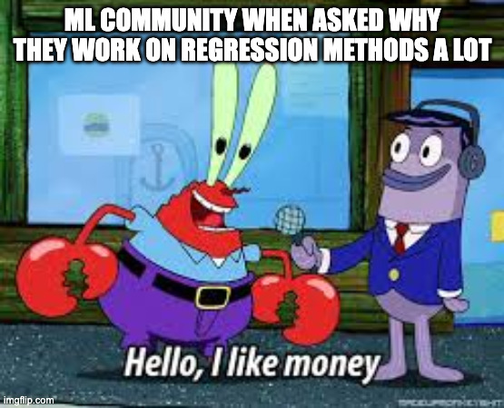

Regression is arguably the most widely used machine learning technique in industry.

- Whenever someone needs to predict a number (a price, a duration, a quantity, a risk score) regression is the starting point.

<div class="two-columns">
<div class="column">

### Finance

- Stock price prediction
- Risk assessment and credit scoring

### Healthcare

- Drug dosage optimization
- Hospital length-of-stay prediction

</div>
<div class="column">

### Engineering

- Energy consumption forecasting
- Quality control and yield prediction

### Everyday Life

- Weather temperature forecasts
- Delivery time estimates

</div>
</div>

---

# Linear Basis Function Models

A powerful generalization of linear regression goes beyond the simple straight line.

- Instead of writing $y = w_0 + w_1 x$, we apply **basis functions** $\phi_j(\mathbf{x})$ to the input first, then take a linear combination of the results:

$$y(\mathbf{x}, \mathbf{w}) = \sum_{j=0}^{M-1} w_j \phi_j(\mathbf{x}) = \mathbf{w}^T \boldsymbol{\phi}(\mathbf{x})$$

where

- $\mathbf{w} = (w_0, w_1, \ldots, w_{M-1})^T$ is the weight vector
- $\boldsymbol{\phi}(\mathbf{x}) = (\phi_0(\mathbf{x}), \phi_1(\mathbf{x}), \ldots, \phi_{M-1}(\mathbf{x}))^T$ is the vector of basis functions
- $\phi_0(\mathbf{x}) = 1$ for the bias term

> **Why the transpose?** Both $\mathbf{w}$ and $\boldsymbol{\phi}$ are column vectors ($M \times 1$). Multiplying two column vectors is undefined. Transposing $\mathbf{w}$ makes it a row vector ($1 \times M$), so $\mathbf{w}^T \boldsymbol{\phi}$ is $(1 \times M)(M \times 1)$ becomes scalar; which is exactly $\sum_j w_j \phi_j(\mathbf{x})$.

The model is **linear in the parameters** $\mathbf{w}$, even though the basis functions $\phi_j(\mathbf{x})$ can be nonlinear transformations of $\mathbf{x}$.

- This means polynomial regression ($\phi_j(x) = x^j$), Gaussian basis functions, and even sigmoid basis functions are all _linear models_ in this framework because the optimization problem (finding $\mathbf{w}$) remains the same.

---

# Simple Linear Regression

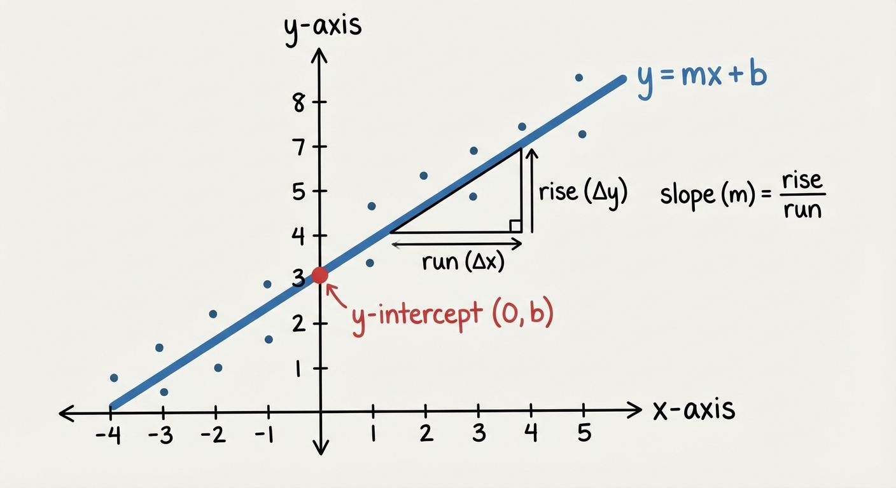

<!-- _footer: Generated by Nano Banana -->

---

# Why Start with Linear Regression?

Linear regression might seem too simple; after all, it is just fitting a line to data. But it is far more important than it appears.

- Every advanced technique (logistic regression, neural networks, SVMs, regularization) builds directly on the ideas we develop here.

<div class="two-columns">
<div class="column">

### Practical Advantages

- **Interpretable** - each coefficient has a clear meaning: "if $x$ increases by 1, $y$ changes by $w$"
- **Computationally efficient** - closed-form solution exists, runs in milliseconds
- **Strong baseline** - surprisingly hard to beat on many real-world problems

</div>
<div class="column">

### Theoretical Importance

- **Foundation of gradient descent** - the optimization technique that powers all of deep learning
- **Building block of neural networks** - each neuron computes a linear function followed by a nonlinearity
- **Gateway to regularization** - Ridge and Lasso extend linear regression directly

</div>
</div>

> _"If you can't explain it with a linear model, you probably don't understand the problem yet."_

---

# Simple Linear Regression

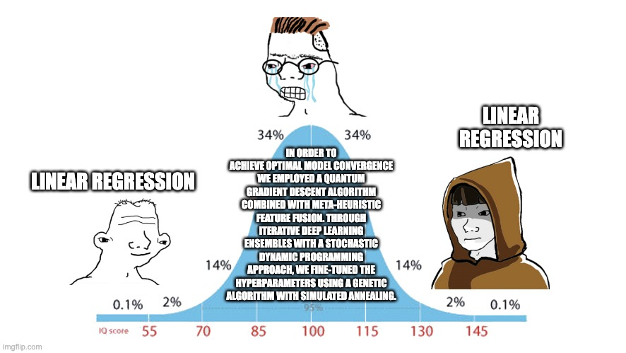

The simplest possible regression model predicts the output using a **single input variable** and a straight line:

$$y = w_0 + w_1 x$$

This equation has two **unknown parameters** that we do not know in advance - they must be **learned from data**. The whole goal of this lecture is to find the best values of these two numbers:

- **$w_0$ (Intercept)** - The predicted value of $y$ when $x = 0$. Geometrically, where the line crosses the $y$-axis. Think of it as the "baseline" - how much of $y$ is explained even before $x$ contributes anything.

- **$w_1$ (Slope)** - How much $y$ changes for each one-unit increase in $x$. If $w_1 = 15000$, then every extra square meter adds 15,000 to the price prediction. The sign tells direction: positive means $y$ goes up with $x$, negative means it goes down.

---

# Geometric Interpretation

### Slope ($w_1$) Interpretation

| Condition       | Effect                                                        |
| --------------- | ------------------------------------------------------------- |
| $w_1 > 0$       | Positive relationship ($x \uparrow \rightarrow y \uparrow$)   |
| $w_1 < 0$       | Negative relationship ($x \uparrow \rightarrow y \downarrow$) |
| $w_1 = 0$       | No relationship (horizontal line)                             |
| $\|w_1\|$ large | Strong effect (steep slope)                                   |
| $\|w_1\|$ small | Weak effect (shallow slope)                                   |

### Intercept ($w_0$) Interpretation

- The predicted value of $y$ when $x = 0$ - the "starting point" of the line
- **May not have physical meaning** when $x = 0$ is outside the observed data range. For example, if predicting house prices from size and your data ranges from 50–500 m², the intercept is the price at 0 m² - a physically impossible input. In that case, the intercept is a mathematical artefact needed to position the line, not a meaningful quantity.
- **Never extrapolate far beyond your training data range** - the line may be accurate within the data, but can produce nonsensical predictions outside it.

---

# Example - House Price Prediction

**Problem:** Predict the price ($y$) when the square meters ($x$) of a house is known

$$\text{Price} = w_0 + w_1 \times \text{SquareMeters}$$

### Example Values

- $w_0 = 50000$ USD (fixed cost)
- $w_1 = 15000$ USD/m²

### Calculation

- 100 m² house: $50000 + 15000 \times 100 = 1,550,000$ USD
- 150 m² house: $50000 + 15000 \times 150 = 2,300,000$ USD

> **Interpretation:** For each additional m², the price increases by ~15,000 USD

---

# The Statistical Model Behind Linear Regression

Linear regression is not just curve-fitting, it is a **statistical model** with explicit assumptions.

- Every data point equals the true linear signal **plus random noise**:

$$y_i = \underbrace{\mathbf{w}^T\mathbf{x}_i}_{\text{true signal}} + \underbrace{\epsilon_i}_{\text{noise}}, \qquad \epsilon_i \sim \mathcal{N}(0, \sigma^2)$$

The $\epsilon_i \sim \mathcal{N}(0, \sigma^2)$ part says: noise is drawn from a bell curve centered at zero, errors are random, not systematic.

This leads to four assumptions

---

# The Statistical Model Behind Linear Regression

| Assumption           | Explanation                                                                  | What breaks if violated                                                                           |
| -------------------- | ---------------------------------------------------------------------------- | ------------------------------------------------------------------------------------------------- |
| **Linearity**        | The true relationship really is a line                                       | Predictions are systematically wrong even with infinite data; residuals curve                     |
| **Independence**     | One data point's error doesn't help predict another's                        | Standard errors become too small - you appear more confident than you are (common in time-series) |
| **Homoscedasticity** | The _spread_ of errors is the same everywhere, not wider for large $\hat{y}$ | The model is still correct on average, but efficiency drops and confidence intervals mislead      |
| **Normality**        | Error terms follow a Gaussian distribution                                   | Hypothesis tests and confidence intervals are invalid                                             |

> **The Gauss-Markov theorem** says: if assumptions 1–3 hold, ordniary least squares (OLS) gives the **Best Linear Unbiased Estimator** (BLUE); meaning no other linear estimator has smaller variance. Assumption 4 is only additionally needed for $p$-values and confidence intervals.

---

# From $N$ Equations to One Matrix Equation

The model for each of the $N$ observations written out individually is:

$$y_1 = w_0 + w_1 x_1^{(1)} + \cdots + w_d x_1^{(d)} + \epsilon_1$$
$$y_2 = w_0 + w_1 x_2^{(1)} + \cdots + w_d x_2^{(d)} + \epsilon_2$$
$$\vdots$$
$$y_N = w_0 + w_1 x_N^{(1)} + \cdots + w_d x_N^{(d)} + \epsilon_N$$

This is $N$ coupled equations in $d+1$ unknowns. The matrix form collapses all of them into:

$$\mathbf{y} = \mathbf{X}\mathbf{w} + \boldsymbol{\epsilon}$$

This is not just notational convenience, it lets us apply every matrix tool - transpose, inverse, matrix derivatives - to derive the optimal $\mathbf{w}$ in **a single closed-form formula**. Writing it out equation by equation would make the derivation completely unmanageable.

---

# Residuals - The Signal of Model Quality

For each training point, the **predicted value** is $\hat{y}_i = \mathbf{w}^T\mathbf{x}_i$ and the **residual** is:

$$e_i = y_i - \hat{y}_i$$

<div class="two-columns">
<div class="column">

### Sign Interpretation

| $e_i$     | Meaning                                          |
| --------- | ------------------------------------------------ |
| $e_i > 0$ | Model **underestimates** - prediction is too low |
| $e_i < 0$ | Model **overestimates** - prediction is too high |
| $e_i = 0$ | Perfect prediction                               |

</div>
<div class="column">

### What Residuals Tell Us

Residuals are estimates of the true noise $\epsilon_i$.

- If the model is correct, the residuals should **look like random noise**; no pattern, no trend, no funnel shape.

Any systematic pattern in the residuals is evidence that:

- the functional form is wrong
- a relevant variable is missing
- the noise is not constant

The residual is the **only** part of the data the model failed to explain. Studying it tells you exactly what to fix.

</div>
</div>

---

# Residual Visualization

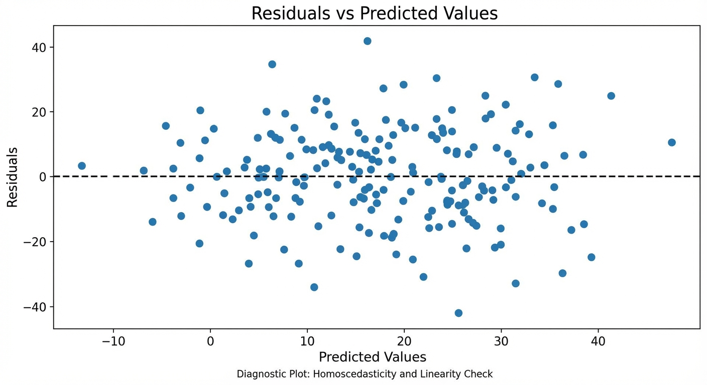

<!-- _footer: Generated by Nano Banana -->

---

# Understanding Residual Plots

A **residual plot** shows $e_i = y_i - \hat{y}_i$ (y-axis) against $\hat{y}_i$ (x-axis).

- It is the single most important diagnostic tool for regression and plot inspection can reveal structural problems.

**What to look for:**

| Pattern                    | Diagnosis                         | Fix                                    |
| -------------------------- | --------------------------------- | -------------------------------------- |
| Random scatter around 0    | Model is correct                  | -                                      |
| Curved pattern (U or arch) | Nonlinear relationship            | Add $x^2$, $x^3$ terms                 |
| Funnel shape (widening)    | Heteroscedasticity                | Log-transform $y$; weighted regression |
| Funnel shape (narrowing)   | Variance decreases with $\hat{y}$ | Box-Cox transformation                 |
| Clusters / gaps            | Missing categorical variable      | Add group indicator                    |
| Outlier band               | Influential point                 | Investigate; consider Huber loss       |

---

# What is a Cost Function?

We need to turn _how well does the model fit?_ into a **single number** that we can minimize. That number is the cost function $J(\mathbf{w})$.

$$J(\mathbf{w}) = \frac{1}{N}\sum_{i=1}^{N}(y_i - \hat{y}_i)^2 = \frac{1}{N}\|\mathbf{y} - \mathbf{X}\mathbf{w}\|_2^2$$

Three reasons this specific form (MSE) is the right choice:

**1. Geometric:** $J(\mathbf{w})$ is the squared $L_2$ distance between the target vector $\mathbf{y}$ and the model's prediction vector $\mathbf{X}\mathbf{w}$. Minimizing it means finding the point in the column space of $\mathbf{X}$ closest to $\mathbf{y}$.

**2. Algebraic:** MSE is a **quadratic function** of $\mathbf{w}$. Setting its gradient to zero gives a linear system with an exact closed-form solution.

**3. Probabilistic:** If $\epsilon_i \sim \mathcal{N}(0, \sigma^2)$, then maximizing the likelihood of the data with respect to $\mathbf{w}$ is **mathematically identical** to minimizing MSE. Squared error is not an arbitrary choice; it is the statistically correct objective under Gaussian noise.

> The cost function defines the optimization problem. Every solution method (Normal Equations, gradient descent, SGD) is just a different algorithm for solving the same underlying minimization.

---

# Geometric Interpretation of MSE

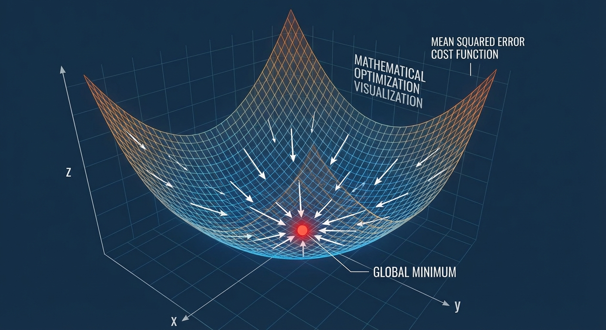

<!-- _footer: Generated by Nano Banana -->

---

# The Cost Landscape

### What is the Hessian?

For a function of one variable, the second derivative $f''(x)$ tells you the curvature, whether the function curves up (bowl) or down (hill).

- The **Hessian** $\mathbf{H}$ is the matrix of second derivatives for a function of multiple variables.

Its $(i,j)$ entry is $\frac{\partial^2 J}{\partial w_i \partial w_j}$ which shows how the slope in the $w_i$ direction changes as you move in the $w_j$ direction.

- If $\mathbf{H}$ is **positive definite** at a point, the function curves upward in every direction there - like the inside of a bowl. A zero gradient at such a point must be a **minimum**.

- If $\mathbf{H}$ is **indefinite** (curves up in some directions, down in others), a zero-gradient point is a saddle **not a minimum**.

---

# The Cost Landscape

For MSE, the Hessian is:

$$\mathbf{H} = \nabla^2_\mathbf{w} J = \frac{2}{N}\mathbf{X}^T\mathbf{X}$$

$\mathbf{X}^T\mathbf{X}$ is positive semi-definite by construction (positive definite when $\mathbf{X}$ has full column rank), so $\mathbf{H}$ is positive definite **everywhere** - not just at one point, but across the entire parameter space.

This property gives us three consequences:

1. **Unique global minimum** - no local minima, no saddle points anywhere on the surface
2. **Gradient descent always converges** to the global optimum from any starting point
3. **The eigenvalues of $\mathbf{H}$** control the ellipse shape in the contour plot. If features are unscaled, eigenvalues differ greatly, producing elongated ellipses that slow gradient descent

> **Contrast with neural networks:** their Hessians are indefinite at most points; saddles and local minima are everywhere. Linear regression's positive definite Hessian is a special structural property of the MSE + linear model combination.

---

# RMSE (Root Mean Squared Error)

$$\text{RMSE} = \sqrt{\text{MSE}} = \sqrt{\frac{1}{N} \sum_{i=1}^{N} (y_i - \hat{y}_i)^2}$$

**Why take the square root?** MSE squares the errors, so its unit is the square of the target's unit.

- If predicting house prices in USD, MSE is in USD²; meaningless to a human. RMSE restores the original unit, making it directly interpretable.

**When to use RMSE vs MAE for reporting?**

- **RMSE** is preferred when large errors matter more (e.g., a 500 USD error is more than 5x as bad as a 100 USD error)
- **MAE** is preferred when you want a typical-case error regardless of outliers

---

# MAE (Mean Absolute Error)

$$\text{MAE} = \frac{1}{N} \sum_{i=1}^{N} |y_i - \hat{y}_i|$$

MAE is literally the average of the absolute errors; intuitive and in the original units. But it has a critical mathematical limitation; _it is not differentiable at zero_

**Why non-differentiability at zero blocks a closed-form solution:**

For MAE, the gradient of $|e|$ with respect to $w$ is:

$$\frac{\partial |e|}{\partial w} = \begin{cases} +1 \cdot (-x) & \text{if } e > 0 \\ -1 \cdot (-x) & \text{if } e < 0 \\ \text{undefined} & \text{if } e = 0 \end{cases}$$

At the optimum, some residuals will be exactly zero (perfect predictions). At those points the gradient simply does not exist. There is a sharp corner in the loss surface, not a smooth curve.

- You cannot set an undefined expression to zero and solve for $\mathbf{w}$. The _equation_ you would need to solve is not a linear system but a **piecewise sign condition**, which requires a different algorithm (Linear Programming or subgradient methods).

---

# Huber Loss

### Combination of MSE and MAE

$$
L_\delta(y, \hat{y})=
\begin{cases}
\frac{1}{2}(y - \hat{y})^2 & \text{if } |y - \hat{y}| \leq \delta \\
\delta |y - \hat{y}| - \frac{1}{2}\delta^2 & \text{otherwise}
\end{cases}
$$

- For small errors ($|e| \leq \delta$): behaves like MSE - smooth, quadratic, gradient-friendly
- For large errors ($|e| > \delta$): behaves like MAE - linear penalty, outlier-robust
- The two pieces join continuously and differentiably at $|e| = \delta$

### Choosing $\delta$

$\delta$ should match the **expected scale of legitimate noise**, not outliers. A common heuristic: set $\delta$ to the 90th percentile of $|e_i|$ from an initial MSE fit, then refit with Huber loss.

> Huber loss has no closed-form Normal Equations - it requires iterative optimization (gradient descent or IRLS). Use `HuberRegressor` in scikit-learn.

---

# Basic Implementation with Scikit-Learn

```python
from sklearn.linear_model import LinearRegression
import numpy as np

# Data preparation
X = np.array([[1], [2], [3], [4], [5]])  # 2D array required
y = np.array([2, 4, 5, 4, 10])

# Create and train model
model = LinearRegression()
model.fit(X, y)

# Get parameters
print(f"Intercept (w0): {model.intercept_:.2f}")
print(f"Slope (w1): {model.coef_[0]:.2f}")

# Make predictions
y_pred = model.predict(X)
```

---

# Multiple Linear Regression

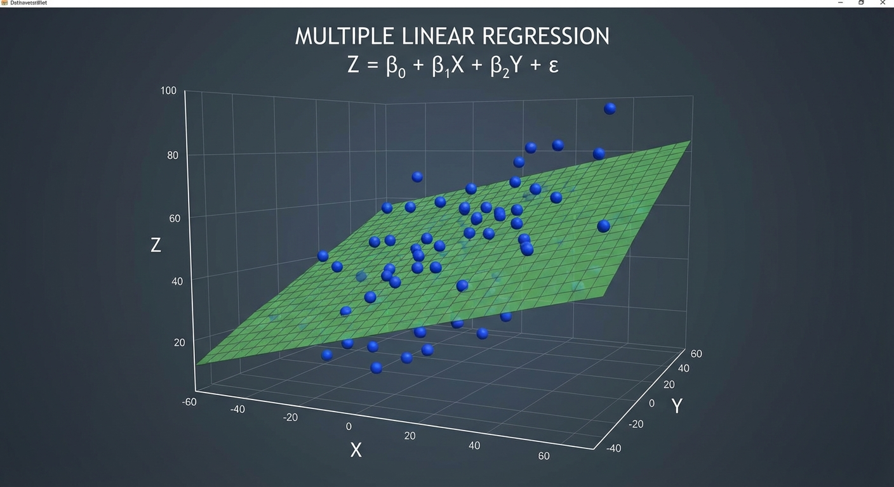

<!-- _footer: Generated by Nano Banana -->

---

# From One Variable to Many

In practice, the output almost always depends on more than one input variable. **Multiple linear regression** extends the simple model to $d$ features:

$$y = w_0 + w_1 x_1 + w_2 x_2 + \cdots + w_d x_d = \mathbf{w}^T\mathbf{x}$$

where $\mathbf{w} = (w_0, w_1, \ldots, w_d)^T$ is the weight vector and $\mathbf{x} = (1, x_1, \ldots, x_d)^T$ includes a leading 1 for the bias term.

Each weight $w_j$ has a clear interpretation:

- The expected change in $y$ when $x_j$ increases by one unit, **holding all other features constant**.

* This makes multiple regression one of the most interpretable models in machine learning.

---

# Why Multiple Variables?

With only one feature, the coefficient absorbs **all** effects correlated with that feature. Consider predicting exam scores from study hours alone:

$$\hat{y} = w_0 + w_1 x_{\text{study}}$$

Students who study more also sleep better, attend more tutorials, and have lower stress. The coefficient $w_1$ conflates all of those effects, it is **confounded**. Adding features isolates each effect:

$$\hat{y} = w_0 + w_1 x_{\text{study}} + w_2 x_{\text{sleep}} + w_3 x_{\text{attendance}}$$

Now $w_1$ measures the effect of study hours **holding sleep and attendance constant**. This is the **ceteris paribus** (all-else-equal) interpretation.

> **Warning:** Adding features that are highly correlated with each other (**multicollinearity**) makes individual coefficients unstable, even if overall predictions are fine. $\mathbf{X}^T\mathbf{X}$ becomes near-singular and small data changes cause wild coefficient swings.

---

# Matrix Formulation

$N$ observations, $d$ features:

$$
\mathbf{X} =
\begin{bmatrix}
1 & x_{11} & x_{12} & \cdots & x_{1d} \\
1 & x_{21} & x_{22} & \cdots & x_{2d} \\
\vdots & \vdots & \vdots & \ddots & \vdots \\
1 & x_{N1} & x_{N2} & \cdots & x_{Nd}
\end{bmatrix}_{N \times (d+1)}
$$

### Dimensions

- $\mathbf{X}$: $N \times (d+1)$
- $\mathbf{w}$: $(d+1) \times 1$
- $\mathbf{y}$: $N \times 1$

---

# Deriving the Normal Equations

The cleanest way to find the optimal weights is to write the cost function in matrix form, take the gradient, set it to zero, and solve.

- This gives us a **closed-form solution** which does not require any iteration.

The cost function in matrix notation:

$$J(\mathbf{w}) = (\mathbf{y} - \mathbf{X}\mathbf{w})^T(\mathbf{y} - \mathbf{X}\mathbf{w})$$

Setting $\nabla_\mathbf{w} J = \mathbf{0}$ and solving yields the **Normal Equation**:

$$\boxed{\mathbf{w}^* = (\mathbf{X}^T\mathbf{X})^{-1}\mathbf{X}^T\mathbf{y}}$$

To find the optimal weights, multiply the pseudo-inverse of $\mathbf{X}$ by the target vector $\mathbf{y}$.

---

# Deriving the Normal Equations

### Step 1: Expand $J(\mathbf{w}) = (\mathbf{y} - \mathbf{X}\mathbf{w})^T(\mathbf{y} - \mathbf{X}\mathbf{w})$

Using $(a - b)^T(a - b) = a^Ta - 2b^Ta + b^Tb$ with $a = \mathbf{y}$, $b = \mathbf{X}\mathbf{w}$:

$$J(\mathbf{w}) = \mathbf{y}^T\mathbf{y} - 2\mathbf{w}^T\mathbf{X}^T\mathbf{y} + \mathbf{w}^T\mathbf{X}^T\mathbf{X}\mathbf{w}$$

### Step 2: Differentiate with respect to $\mathbf{w}$

Using matrix calculus rules: $\frac{\partial}{\partial \mathbf{w}}(\mathbf{w}^T\mathbf{a}) = \mathbf{a}$ and $\frac{\partial}{\partial \mathbf{w}}(\mathbf{w}^T\mathbf{A}\mathbf{w}) = 2\mathbf{A}\mathbf{w}$ for symmetric $\mathbf{A}$:

$$\nabla_\mathbf{w} J = -2\mathbf{X}^T\mathbf{y} + 2\mathbf{X}^T\mathbf{X}\mathbf{w} = \mathbf{0}$$

### Step 3: Set to zero and solve the linear system

$$\mathbf{X}^T\mathbf{X}\mathbf{w} = \mathbf{X}^T\mathbf{y} \quad \Longrightarrow \quad \mathbf{w}^* = (\mathbf{X}^T\mathbf{X})^{-1}\mathbf{X}^T\mathbf{y}$$

This is a **linear system** $\mathbf{A}\mathbf{w} = \mathbf{b}$ with $\mathbf{A} = \mathbf{X}^T\mathbf{X}$ and $\mathbf{b} = \mathbf{X}^T\mathbf{y}$. It is solvable in one step.

---

# Normal Equation

### Disadvantages

1. **Matrix inversion computation: $O(d^3)$**
   - $d$ = number of features
   - Very slow for $d > 10000$

2. **Memory usage**
   - $\mathbf{X}^T\mathbf{X}$: $(d+1) \times (d+1)$ matrix

3. **Numerical instability**
   - $\mathbf{X}^T\mathbf{X}$ may be singular
   - Multicollinearity problem

4. **Does not support online learning**
   - All data required

---

# Python Implementation

```python
import numpy as np

def normal_equation(X, y):
    """
    Linear regression solution using normal equation
    X: (N, d) feature matrix (bias column not included)
    y: (N,) target vector
    """
    # Add bias column
    X_b = np.c_[np.ones((X.shape[0], 1)), X]

    # Normal equation
    w = np.linalg.inv(X_b.T @ X_b) @ X_b.T @ y

    return w

# Usage
X = np.array([[1], [2], [3], [4], [5]])
y = np.array([2, 4, 5, 4, 10])
w = normal_equation(X, y)
print(f"w = {w}")  # [0.2, 1.6]
```

---

# Gradient Descent

When the Normal Equation is too expensive ($d > 10000$ features), we find $\mathbf{w}^*$ iteratively - by repeatedly taking small steps downhill on the cost surface:

$$\mathbf{w}^{(t+1)} = \mathbf{w}^{(t)} - \alpha \underbrace{\nabla J(\mathbf{w}^{(t)})}_{\text{direction of steepest ascent}}$$

The gradient $\nabla J$ points in the direction of steepest _increase_ of $J$. Subtracting it moves in the opposite direction, steepest _decrease_. So each step reduces the cost (as long as $\alpha$ is small enough).

- $\mathbf{w}^{(t)}$: current parameter values at step $t$
- $\alpha$ (**learning rate**): how large each step is - too small and it's slow, too large and it overshoots
- $\nabla J(\mathbf{w}^{(t)})$: the gradient evaluated at the current position - tells us which direction is "uphill" at this point

---

# Gradient Descent Visualization

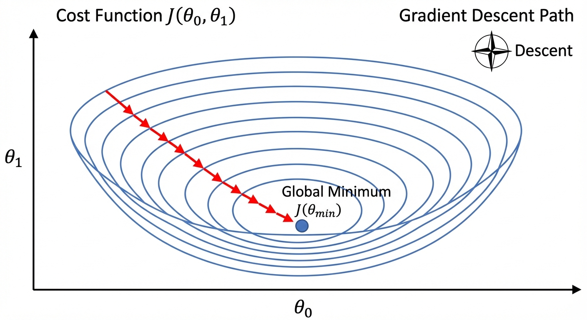

<!-- _footer: Generated by Nano Banana -->

---

# Reading the Contour Plot

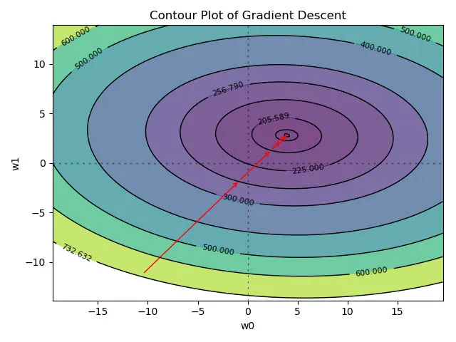

The contour plot shows the cost function from above, like a topographic map of a mountain.

- Each contour line connects points with equal cost.
- The center (darkest region) is the minimum.
- The arrows show the path that gradient descent takes from a random starting point toward the minimum.

Notice that the path does not go straight to the center, it follows the steepest descent direction at each step.

- If the contours are elongated ellipses, the path zigzags.
- If the contours are circular, the path goes nearly straight to the minimum.

---

# MSE Gradient

To run gradient descent, we need to compute $\nabla_\mathbf{w} J$ at each step. Starting from the cost :

$$J(\mathbf{w}) = \frac{1}{2N} \sum_{i=1}^{N} (y_i - \mathbf{w}^T\mathbf{x}_i)^2$$

Differentiating each term via chain rule - the outer derivative gives $2 \cdot (\cdot)$, inner gives $-\mathbf{x}_i$, the $\frac{1}{2}$ cancels:

$$\nabla_\mathbf{w} J = \frac{1}{N} \sum_{i=1}^{N} \underbrace{(\mathbf{w}^T\mathbf{x}_i - y_i)}_{\text{prediction error}} \cdot \underbrace{\mathbf{x}_i}_{\text{input}}$$

**Intuition:** Each training point contributes to the gradient proportionally to its **error** and its **input magnitude**.

- Points with large errors or large feature values pull the gradient harder.

Stacking all $N$ samples into matrix form:

$$\nabla_\mathbf{w} J = \frac{1}{N} \mathbf{X}^T\underbrace{(\mathbf{X}\mathbf{w} - \mathbf{y})}_{\text{prediction errors vector}}$$

This one-line formula replaces the entire sum, one matrix multiply computes all $N$ error contributions at once.

---

# Batch Gradient Descent

## Update with All Data

```python
def batch_gradient_descent(X, y, alpha=0.01, n_iter=1000):
    # Add bias column
    X_b = np.c_[np.ones((X.shape[0], 1)), X]
    N = X_b.shape[0]

    # Random initialization
    w = np.random.randn(X_b.shape[1])

    for i in range(n_iter):
        # Calculate gradient
        gradient = (1/N) * X_b.T @ (X_b @ w - y)

        # Update
        w = w - alpha * gradient

    return w
```

---

# Learning Rate ($\alpha$)

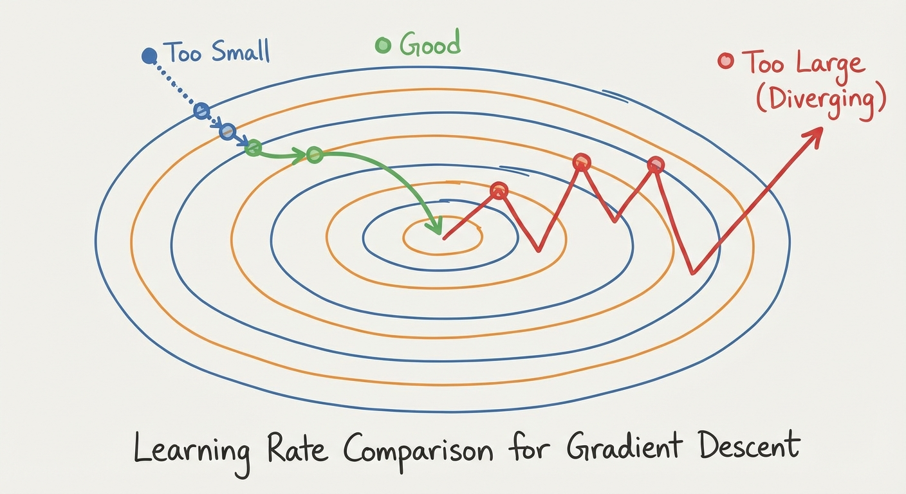

<!-- _footer: Generated by Nano Banana -->

---

# Choosing the Learning Rate


The learning rate $\alpha$ is the most important hyperparameter in gradient descent. It controls how big each step is and getting it right is the difference between an algorithm that converges in seconds and one that never converges at all.

**Practical tip:** Start with $\alpha = 0.01$ and adjust. If the cost oscillates or increases, reduce $\alpha$ by a factor of 10. If convergence is too slow, increase it. Always plot the cost vs. iteration number it should decrease smoothly.

---

# Convergence Criteria

How do you know when to stop gradient descent?

<div class="two-columns">

<div class="column">

### 1. Maximum Iterations - a safety cap

```python
if iteration >= max_iter:
    break
```

Always use this as a fallback. If the learning rate is poorly chosen, the other criteria may never trigger and the loop runs forever.

### 2. Gradient Norm - the mathematically principled criterion

```python
if np.linalg.norm(gradient) < epsilon:
    break  # epsilon = 1e-6
```

When the gradient is near zero, you are at (or very close to) a flat region. For convex functions this means you are at the minimum. **This is the theoretically correct stopping condition.**

</div>

<div class="column">

### 3. Cost Change - a practical plateau detector

```python
if abs(cost_new - cost_old) < epsilon:
    break
```

If the cost barely moves between iterations, further improvement is negligible. This is faster to check than the gradient norm and sufficient in practice.

</div>
</div>

---

# Feature Scaling

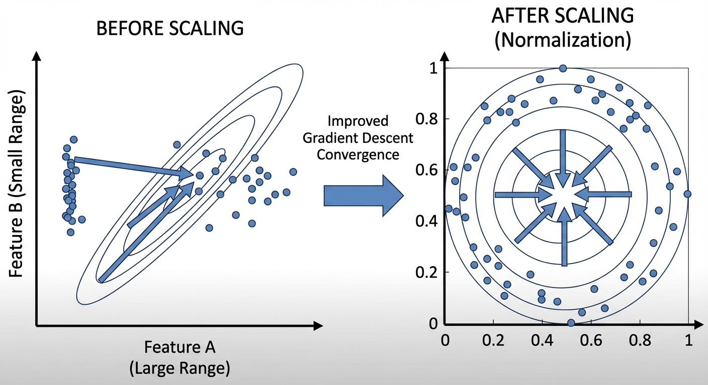

<!-- _footer: Generated by Nano Banana -->

---

# The Feature Scaling Problem

The contour shape is controlled by the Hessian $\mathbf{H} = \frac{2}{N}\mathbf{X}^T\mathbf{X}$.

- If features have different scales, the diagonal entries of $\mathbf{X}^T\mathbf{X}$ differ by orders of magnitude , producing a matrix with very different eigenvalues.
- The **condition number** $\kappa(\mathbf{H}) = \lambda_{\max}/\lambda_{\min}$ measures how different the contour ellipses are:

| Condition                         | Contour Shape     | Gradient Descent Behavior                      |
| --------------------------------- | ----------------- | ---------------------------------------------- |
| $\kappa \approx 1$ (equal scales) | Circular          | Converges in a few steps                       |
| $\kappa \gg 1$ (unequal scales)   | Elongated ellipse | Zigzags; needs $\kappa \times$ more iterations |

**Example:** If $x_1 \in [1, 1000]$ and $x_2 \in [0, 1]$, then $\mathbf{X}^T\mathbf{X}$ has diagonal entries differing by $\sim 10^6$, giving $\kappa \approx 10^6$. Standardizing both features to mean 0, std 1 brings $\kappa$ close to 1.

> The Normal Equation does not need scaling to find the correct answer but scaling improves its numerical stability too.

---

# Normalization Methods

### 1. Min-Max Scaling

$$x' = \frac{x - x_{min}}{x_{max} - x_{min}}$$

- Result: in $[0, 1]$ range
- Sensitive to outliers

### 2. Standardization (Z-score)

$$x' = \frac{x - \mu}{\sigma}$$

- Result: Mean=0, Std=1
- More robust

---

# Standardization Example

```python
from sklearn.preprocessing import StandardScaler
import numpy as np

# Example data
X = np.array([[100, 2], [150, 3], [200, 4], [250, 5]])

# Standardize
scaler = StandardScaler()
X_scaled = scaler.fit_transform(X)

print("Original:")
print(X)
print("\nStandardized:")
print(X_scaled)
print(f"\nMean: {X_scaled.mean(axis=0)}")  # ~[0, 0]
print(f"Std: {X_scaled.std(axis=0)}")      # ~[1, 1]
```

---

# Important Warnings

### 1. Train/Test Separation

```python
# CORRECT: Learn only from train
scaler.fit(X_train)
X_train_scaled = scaler.transform(X_train)
X_test_scaled = scaler.transform(X_test)  # With same parameters

# WRONG: Don't fit on test
# scaler.fit_transform(X_test)
```

### 2. Target Variable

- Usually not scaled
- Except in some cases (neural networks)

### 3. Coefficient Interpretation

- Scaled coefficients have different meaning
- Interpret in original scale

---

# Polynomial Regression

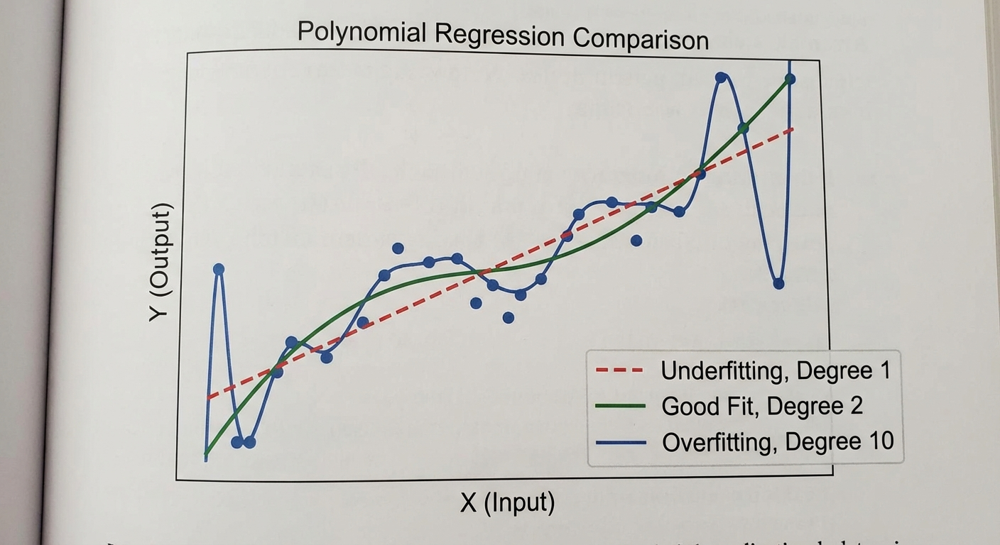

<!-- _footer: Generated by Nano Banana -->

---

# Polynomial Basis Functions

Real-world data is rarely a straight line.

- Consider temperature vs ice cream sales: the relationship curves.
- If we fit a line, we consistently under-predict in summer and over-predict in spring.

* The model is structurally wrong, no matter how much data we add, a line cannot capture a curve.

**We do not need to give up linear regression**. Instead, we _create new features_ by applying transformations to $x$ first:

$$y = w_0 + w_1 x + w_2 x^2 + w_3 x^3 + \cdots + w_M x^M$$

**Why is this still a _linear model_?** The word _linear_ refers to how $\mathbf{w}$ appears in the equation - each weight $w_j$ is multiplied by a feature and then summed. There are no $w_j^2$ terms, no $w_1 \cdot w_2$ cross-terms, nothing like that. The features themselves ($x$, $x^2$, $x^3$) are nonlinear, but the model is linear _in the parameters_.

**Why does this matter?** Because every derivation we did - cost function, Normal Equations, gradient descent - assumed linearity in $\mathbf{w}$, not in $\mathbf{x}$. So all of that machinery works unchanged. We simply feed in the transformed features instead of the raw ones:

$$\underbrace{[1,\ x,\ x^2,\ x^3]}_{\boldsymbol{\phi}(x) \text{ - new feature vector}} \quad \text{instead of} \quad \underbrace{[1,\ x]}_{\text{original features}}$$

The optimization problem is _identical_ to plain linear regression. The only difference is what we put in the **design matrix**.

---

# Polynomial Feature Expansion

For a single input $x$, a degree-$M$ expansion turns each scalar into a row vector of $M+1$ features:

$$x = 3 \quad\longrightarrow\quad \boldsymbol{\phi}(3) = \begin{bmatrix} 1 & 3 & 9 & 27 & \cdots & 3^M \end{bmatrix}$$

Doing this for all $N$ training samples stacks them into the **design matrix** $\mathbf{\Phi}$ (called a Vandermonde matrix):

$$\mathbf{\Phi} = \begin{bmatrix} 1 & x_1 & x_1^2 & \cdots & x_1^M \\ 1 & x_2 & x_2^2 & \cdots & x_2^M \\ \vdots & \vdots & \vdots & \ddots & \vdots \\ 1 & x_N & x_N^2 & \cdots & x_N^M \end{bmatrix}_{N \times (M+1)}$$

Each row is one data point, expanded into $M+1$ features. The Normal Equations then become:

$$\mathbf{w}^* = (\mathbf{\Phi}^T\mathbf{\Phi})^{-1}\mathbf{\Phi}^T\mathbf{y}$$

This is **byte-for-byte identical** to the plain linear regression formula $(\mathbf{X}^T\mathbf{X})^{-1}\mathbf{X}^T\mathbf{y}$ - we just renamed $\mathbf{X}$ to $\mathbf{\Phi}$.

---

# Polynomial Feature Expansion

```python
from sklearn.preprocessing import PolynomialFeatures
Phi = PolynomialFeatures(degree=3).fit_transform(X)  # replaces X
w = np.linalg.lstsq(Phi, y, rcond=None)[0]           # same as before
```

> **Scaling warning:** Polynomial features grow explosively. If $x = 10$, degree 8 gives $10^8 = 100{,}000{,}000$. When columns of $\mathbf{\Phi}$ differ in scale by factors of $10^8$, the matrix $\mathbf{\Phi}^T\mathbf{\Phi}$ becomes nearly singular - tiny floating-point rounding errors produce wildly wrong inverses. **Always standardize $x$ to $[-1, 1]$ or $[0, 1]$ before polynomial expansion.**

---

# Polynomial Regression - Python

```python
from sklearn.preprocessing import PolynomialFeatures
from sklearn.linear_model import LinearRegression
from sklearn.pipeline import Pipeline

# Create pipeline
model = Pipeline([
    ('poly', PolynomialFeatures(degree=3)),
    ('linear', LinearRegression())
])

# Train
X = np.array([[1], [2], [3], [4], [5]])
y = np.array([1, 4, 9, 16, 25])  # y = x²

model.fit(X, y)
print(model.predict([[6]]))  # ~36
```

---

# $R^2$ (Coefficient of Determination)

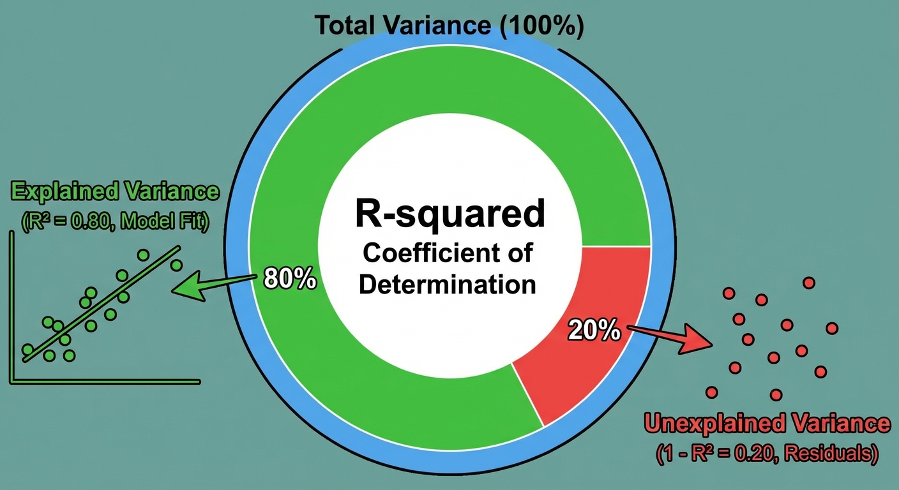

<!-- _footer: Generated by Nano Banana -->

---

# Understanding $R^2$

$R^2$ answers: **how much better is our model than the dumbest possible baseline** (always predicting $\bar{y}$)?

$$R^2 = 1 - \frac{\overbrace{\sum(y_i - \hat{y}_i)^2}^{SS_{res}\ \text{(our model's error)}}}{\underbrace{\sum(y_i - \bar{y})^2}_{SS_{tot}\ \text{(baseline error)}}}$$

The fraction $SS_{res}/SS_{tot}$ is the proportion of variance our model _failed_ to explain. Subtracting from 1 gives the proportion it _did_ explain.

| Value        | Meaning                                                                                                                                                        |
| ------------ | -------------------------------------------------------------------------------------------------------------------------------------------------------------- |
| $R^2 = 1$    | Perfect fit - every prediction is exact                                                                                                                        |
| $R^2 = 0.85$ | Model explains 85% of the variance; the remaining 15% is noise or missing features                                                                             |
| $R^2 = 0$    | Model is no better than always predicting $\bar{y}$ - it learned nothing                                                                                       |
| $R^2 < 0$    | Model is **worse** than predicting the mean. This happens when you evaluate on test data with a very different distribution, or forgot to include an intercept |

---

# Adjusted R²

$$R^2_{adj} = 1 - (1 - R^2) \frac{N - 1}{N - d - 1}$$

**Why is this needed?** Adding any new feature (even a column of random numbers) will never decrease $R^2$ on training data.

- The model just absorbs the noise.

Adjusted $R^2$ penalizes this by shrinking $R^2$ every time you add a feature, unless that feature earns its keep.

---

# Example - California Housing Dataset


To see linear regression in action, we use the **California Housing** dataset.

- The goal is to predict the **median house value** for each block.

### Features

| Feature    | Description                    | Range       |
| ---------- | ------------------------------ | ----------- |
| MedInc     | Median income                  | 0.5 – 15    |
| HouseAge   | Median house age               | 1 – 52      |
| AveRooms   | Average rooms per household    | 1 – 141     |
| AveBedrms  | Average bedrooms per household | 0.3 – 34    |
| Population | Block population               | 3 – 35,682  |
| AveOccup   | Average occupancy              | 1 – 1,243   |
| Latitude   | Block latitude                 | 32.5 – 41.9 |
| Longitude  | Block longitude                | -124 – -114 |

---

# Solution - California Housing Datasete

Putting it all together: data loading, preprocessing, training, and evaluation in a single scikit-learn pipeline.

```python
from sklearn.pipeline import Pipeline
from sklearn.preprocessing import StandardScaler
from sklearn.linear_model import LinearRegression
from sklearn.model_selection import train_test_split
from sklearn.datasets import fetch_california_housing

# Load data
X, y = fetch_california_housing(return_X_y=True)

# Train/test split
X_train, X_test, y_train, y_test = train_test_split(
    X, y, test_size=0.2, random_state=42)

# Pipeline: scaling + regression in one object
pipeline = Pipeline([
    ('scaler', StandardScaler()),
    ('regressor', LinearRegression())
])
```

---

# Model Training and Evaluation

```python
from sklearn.metrics import mean_squared_error, r2_score
import numpy as np

# Train
pipeline.fit(X_train, y_train)

# Predict
y_pred = pipeline.predict(X_test)

# Evaluate
mse = mean_squared_error(y_test, y_pred)
rmse = np.sqrt(mse)
r2 = r2_score(y_test, y_pred)

print(f"RMSE: {rmse:.2f}")
print(f"R²: {r2:.3f}")

# Coefficients
coef = pipeline.named_steps['regressor'].coef_
```

---

# Cross-Validation

```python
from sklearn.model_selection import cross_val_score

# 5-fold cross-validation
cv_scores = cross_val_score(
    pipeline, X, y,
    cv=5,
    scoring='neg_mean_squared_error'
)

rmse_scores = np.sqrt(-cv_scores)
print(f"RMSE scores: {rmse_scores}")
print(f"Mean RMSE: {rmse_scores.mean():.2f} (+/- {rmse_scores.std():.2f})")
```

### Example Output

```
RMSE scores: [3.56, 4.12, 3.89, 4.45, 3.78]
Mean RMSE: 3.96 (+/- 0.32)
```

---

# Feature Importance

After fitting, we can examine the learned coefficients to understand which features matter most.

- Since we standardized the features, the coefficient magnitudes are directly comparable.

```python
import pandas as pd
from sklearn.datasets import fetch_california_housing

# Get feature names
data = fetch_california_housing()
feature_names = data.feature_names

# Standardized coefficients
coef = pipeline.named_steps['regressor'].coef_

# Create DataFrame sorted by absolute importance
importance = pd.DataFrame({
    'feature': feature_names,
    'coefficient': coef
}).sort_values('coefficient', key=abs, ascending=False)

print(importance)
```

---

# Visualization

```python
import matplotlib.pyplot as plt

fig, axes = plt.subplots(1, 2, figsize=(13, 5))

# Left: Actual vs Predicted
axes[0].scatter(y_test, y_pred, alpha=0.3, s=10)
lim = [y.min(), y.max()]
axes[0].plot(lim, lim, 'r--', lw=1.8, label='Perfect fit')
axes[0].set_xlabel('Actual Value ($100k)')
axes[0].set_ylabel('Predicted Value ($100k)')
axes[0].set_title('Actual vs Predicted')
axes[0].legend()

# Right: Residual plot
residuals = y_test - y_pred
axes[1].scatter(y_pred, residuals, alpha=0.3, s=10)
axes[1].axhline(0, color='r', lw=1.8, linestyle='--')
axes[1].set_xlabel('Predicted Value ($100k)')
axes[1].set_ylabel('Residual')
axes[1].set_title('Residual Plot')

plt.tight_layout()
plt.savefig('assets/ca_combined_diagnostic.png', dpi=150)
```

---

# Diagnostic Plots

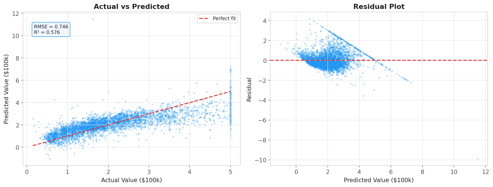

---

# Reading - Actual vs Predicted

Points on the dashed red line are perfect predictions. The closer the cloud to the diagonal, the better the fit.

- **RMSE = 0.746** → average prediction error is ~\$74,600. The target ranges from \$15k to \$500k, so this is reasonable for a linear model with only 8 features.
- **$R^2 = 0.576$** → the model explains 57.6% of price variance. The remaining 42.4% comes from unmeasured factors (school quality, crime rate, proximity to work) or nonlinear interactions we have not modelled.
- The cloud **fans out at higher values** - the model increasingly underpredicts expensive homes. This is a classic sign of **heteroscedasticity**: error variance grows with price. A log-transform on $y$ would likely help.

---

# Reading - Residual Plot

A well-specified model should show residuals scattered **randomly around zero** with no visible pattern.

- The slight **curved pattern** (residuals drift positive at low predictions, negative in the middle, then positive again at high values) signals a **missing nonlinear term** - the relationship between income and price is not purely linear.
- Residuals **widen at higher predicted values** - confirming the heteroscedasticity from the previous plot.
- These two patterns together suggest: (1) adding polynomial features for `MedInc`, and (2) log-transforming the target, would meaningfully improve the model.

---

# California Housing - Residual Distribution

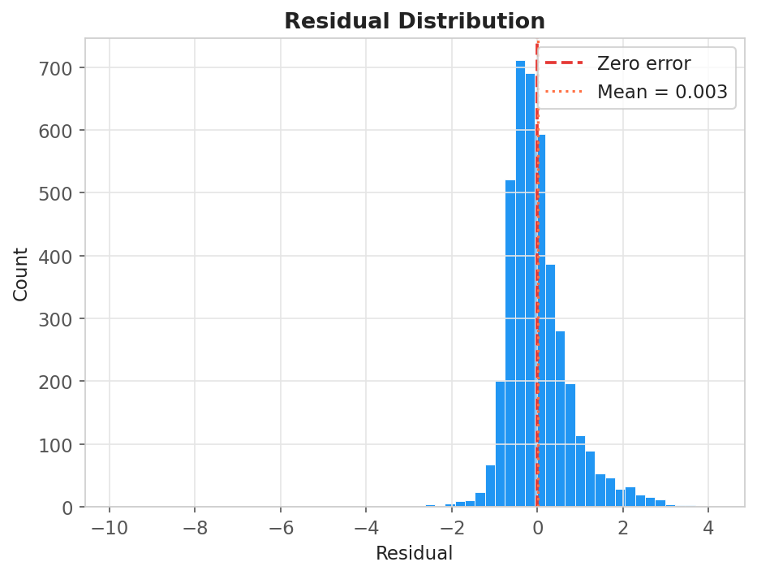

---

# Reading - Residual Distribution

If the normality assumption holds, residuals should form a **symmetric bell curve centred at zero**.

- The distribution is approximately symmetric and centred near zero - the normality assumption broadly holds.
- The **right tail is slightly heavier** than the left, consistent with underprediction of expensive homes seen in the residual plot.
- The mean residual is very close to zero - the model has no systematic overall bias (it is not consistently over or underestimating).

---

# California Housing: Feature Importance

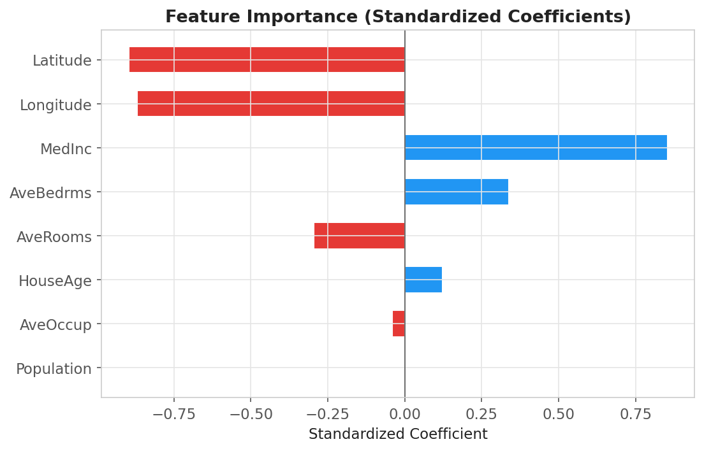

---

# Reading - Feature Importance

Because features were standardised before fitting, coefficient magnitudes are directly comparable - a larger absolute value means a stronger marginal effect.

- **`MedInc`** (median income) has by far the largest positive coefficient. Income is the dominant predictor - this matches economic intuition: wealthier neighbourhoods have higher house prices.
- **`Latitude`** is strongly negative. More northerly California blocks tend to be cheaper than coastal/southern areas.
- **`AveRooms`** is positive but modest - more rooms per household predicts higher price, but less strongly than income.
- **`AveOccup`** (average occupancy) is negative - overcrowded blocks predict lower prices.
- `HouseAge`, `AveBedrms`, `Population`, `Longitude` all have small coefficients - they add little once income and location are accounted for.

---

# California Housing - Cross-Validation

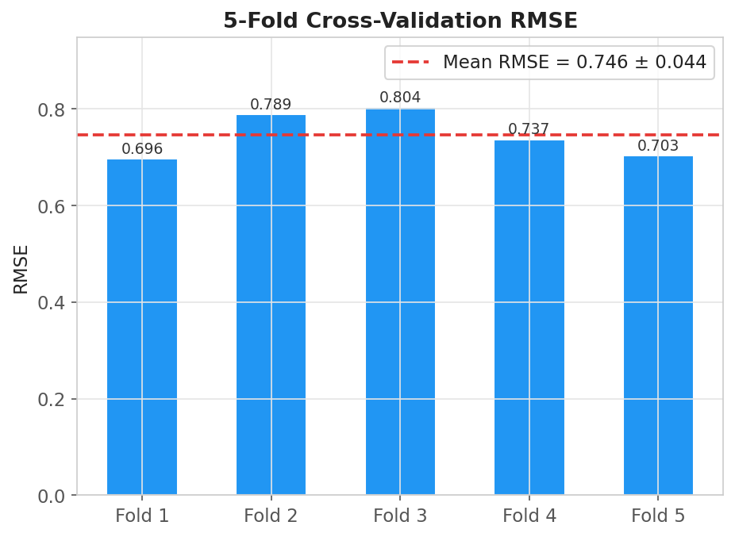

---

# Reading - Cross-Validation

A single train/test split can be lucky or unlucky. **5-fold cross-validation** splits the data 5 different ways and averages the results - giving a more reliable estimate of real-world performance.

- All 5 folds give RMSE between **0.714 and 0.782** - a tight, consistent range.
- **Mean RMSE = 0.746 ± 0.044** confirms the model generalises stably - there is no fold where it dramatically fails.
- The small standard deviation (0.044) relative to the mean (0.746) means performance is not sensitive to which particular data points end up in the test set.
- This cross-validated RMSE is the number to report - not the single test-set RMSE - because it uses all data for both training and evaluation and gives an honest estimate of out-of-sample error.

---

<!-- _header: "" -->
<!-- _footer: "" -->
<!-- _paginate: false -->

<!-- _class: lead -->

# Thank You!

## Contact Information

- **Email:** ekrem.cetinkaya@yildiz.edu.tr
- **Office Hours:** Wednesday 13:30-15:30 - Room C-120
- **Book a slot before coming:** [Booking Link](https://calendar.app.google/fog6DPBGJH2QpHVw8)
- **Course Repository:** [GitHub](https://github.com/ekremcet/yzm2011-introduction-to-machine-learning)
