# YZM2011

## Introduction to Machine Learning

### Week 5: Logistic Regression and Classification

**Instructor:** Ekrem Çetinkaya
**Date:** 24.03.2026

---

# Today's Agenda

<div class="two-columns">
<div class="column">

## Classification Fundamentals

- Classification vs regression differences
- Binary classification problem definition
- Probabilistic approach to classification

## The Logistic Model

- Sigmoid function and its properties
- Logistic regression model formulation
- Cross-entropy loss derivation

</div>
<div class="column">

## Training and Evaluation

- Gradient descent for logistic regression
- Decision boundaries and their interpretation
- Multi-class classification with softmax

</div>
</div>

---

# From Continuous Predictions to Discrete Decisions

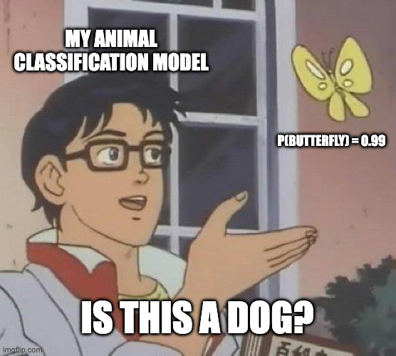

In our previous weeks, we focused on **regression problems** where we predict **continuous numerical values**.

- This week, we transition to **classification problems** where our goal is to assign inputs to discrete categories or classes.

This shift from continuous to discrete outputs requires fundamentally different mathematical machinery.

- While regression uses squared loss and direct numerical outputs
- Classification demands probability distributions and specialized loss functions that respect the categorical nature of the target variable.

The key insight is that classification is essentially **probability estimation**

- Instead of predicting a class directly, we estimate the **probability** that an input belongs to each possible class, then make decisions based on these probabilities.

---

# Regression Recap

Regression problems deal with **continuous target variables** where the output space is infinite and ordered. The fundamental characteristic is that we can measure meaningful distances between predictions and targets.

In regression problems, the **output is continuous**:

$$y \in \mathbb{R}$$

**Examples:**

- House price prediction: $500,000, $750,000, ...
- Temperature prediction: 23.5°C, 18.2°C, ...
- Stock price: $150.25, $148.30, ...
- Age prediction: 25.3, 42.7, ...

**Model output:**
$$\hat{y} = \mathbf{w}^T\mathbf{x} + b$$

The output can be **any real number**, and we measure success using distance-based metrics like mean squared error.

---

# Classification

Classification problems involve **discrete target variables** where the output space is finite and typically unordered.

- Instead of predicting a number, we're predicting membership in a category.

In classification problems, the **output is discrete categories**:

$$y \in \{C_1, C_2, ..., C_K\}$$

**Examples:**

- Email classification: Spam / Not Spam
- Disease diagnosis: Positive / Negative
- Image recognition: Cat / Dog / Bird
- Handwritten digit recognition: 0, 1, 2, ..., 9

**Goal:**
Assign data to the **correct category** based on input features.

- Unlike regression, the _distance_ between categories (e.g., Cat vs Dog) is typically not meaningful.

---

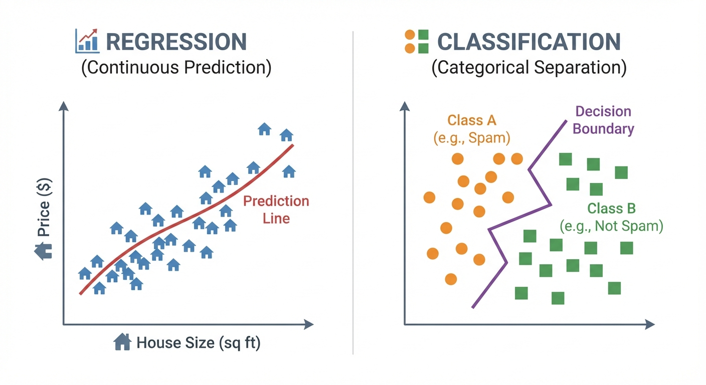

<!-- _footer: Generated by Nano Banana -->

---

# Key Differences Between Regression and Classification

The distinction between regression and classification fundamentally changes how we approach the learning problem. The output space structure determines everything: loss functions, optimization objectives, evaluation metrics, and interpretation of results.

| Feature        | Regression        | Classification       |
| -------------- | ----------------- | -------------------- |
| **Output**     | Continuous        | Discrete             |
| **Value**      | Real number       | Category             |
| **Example**    | Price             | Label                |
| **Loss**       | MSE               | Cross-Entropy        |
| **Goal**       | Minimize distance | Maximize probability |
| **Evaluation** | RMSE, MAE         | Accuracy, F1-score   |

---

# Why Linear Regression Fails for Classification

The fundamental issue with applying linear regression to classification is a **mismatch between the model's assumptions and the problem structure**.

- Linear regression assumes the output can vary continuously and that errors should be minimized in a squared-distance sense.

If we try linear regression for classification:

$$\hat{y} = \mathbf{w}^T\mathbf{x} + b$$

**Problems:**

1. **Unbounded output:** $\hat{y}$ can be any value (from -∞ to +∞), but probabilities must be in [0,1]
2. **Inappropriate loss:** Squared loss penalizes _too correct_ predictions (e.g., predicting 2 for class 1)
3. **Outlier sensitivity:** Extreme values disproportionately influence the decision boundary
4. **No probabilistic interpretation:** Cannot assess prediction confidence

**What we need:**

- Output in **[0, 1]** range that can be interpreted as probability
- **Monotonic** transformation that preserves ordering
- **Differentiable** function for gradient-based optimization

---

# The Probabilistic Framework for Classification

The key here is to model classification as **probability estimation** rather than direct category prediction.

- Probabilistic approach provides a natural way to express uncertainty and enables principled decision-making under different cost scenarios.

**Dataset:**
$$\mathcal{D} = \{(\mathbf{x}_1, y_1), (\mathbf{x}_2, y_2), ..., (\mathbf{x}_N, y_N)\}$$

**Input:** $\mathbf{x}_n \in \mathbb{R}^D$ (D-dimensional feature vector)

**Output:** $y_n \in \{0, 1\}$ (for binary classification)

**Goal:**
Find a function $f$ such that:
$$f(\mathbf{x}) = P(y = 1 | \mathbf{x})$$

That is, estimate the **conditional probability** that $y = 1$ given the input features $\mathbf{x}$.

- This probability can then be thresholded to make discrete predictions.

---

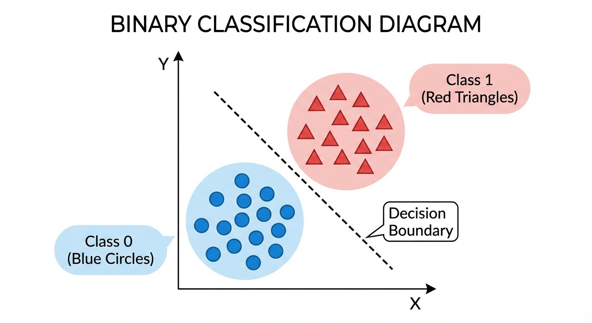

<!-- _footer: Generated by Nano Banana -->

---

# Binary Classification

Binary classification is the simplest form of classification where we distinguish between exactly two classes.

- Despite its apparent simplicity, binary classification serves as the foundation for more complex classification schemes and appears in countless real-world applications.

## Definition

Deciding between two classes:
$$y \in \{0, 1\}$$

or alternatively:

$$y \in \{-1, +1\}$$

**Terminology:**

- **Positive class (1):** The condition we want to detect (often the minority or interesting class)
- **Negative class (0):** The baseline or reference condition

The choice of which class to call _positive_ is arbitrary but usually represents the condition of interest (disease presence, spam detection, fraud, etc.).

---

# Probabilistic Predictions

Rather than forcing the model to make hard decisions, we can estimate the **probability** that an input belongs to each class.

- Probabilistic approach provides much richer information than deterministic classification and enables more sophisticated decision-making.

Instead of deterministic prediction, we predict **probability**:

$$P(y = 1 | \mathbf{x}) = ?$$

**Advantages:**

1. **Uncertainty quantification:** We know how _confident_ the prediction is
2. **Flexible threshold setting:** Adjust decision boundaries based on costs
3. **Risk-sensitive decisions:** Balance different types of errors optimally
4. **Ranking and scoring:** Order instances by likelihood

**Example:**

- $P(\text{spam}|\mathbf{x}) = 0.95$ -> Strong confidence, act immediately
- $P(\text{spam}|\mathbf{x}) = 0.51$ -> Weak signal, maybe flag for human review
- $P(\text{spam}|\mathbf{x}) = 0.05$ -> Likely legitimate, allow through

---

# Probabilities to Decisions

Once we have probability estimates, we need a **decision rule** to convert probabilities into discrete predictions. The choice of threshold reflects our tolerance for different types of errors and the relative costs of false positives versus false negatives.

From probability estimate to class decision:

$$\hat{y} = \begin{cases} 1 & \text{if } P(y=1|\mathbf{x}) \geq \theta \\ 0 & \text{if } P(y=1|\mathbf{x}) < \theta \end{cases}$$

**Default threshold:** $\theta = 0.5$ (maximum likelihood decision)

**Strategic threshold adjustment:**

- **High $\theta$ (conservative):** Fewer positive predictions -> precision ↑, recall ↓
- **Low $\theta$ (liberal):** More positive predictions -> precision ↓, recall ↑

Threshold is an important **hyperparameter** that should be tuned based on the specific costs and requirements of your application.

---

# The Sigmoid Function

The sigmoid function transforms unlimited linear combinations into bounded probabilities.

- It's the key component that makes logistic regression work, providing a smooth, differentiable way to map any real number to the interval (0,1).

$$\sigma(z) = \frac{1}{1 + e^{-z}}$$

**Alternative notation:**
$$\sigma(z) = \frac{e^z}{1 + e^z}$$

**Essential Properties:**

- **Domain:** $z \in \mathbb{R}$ (accepts any real number)
- **Range:** $\sigma(z) \in (0, 1)$
- **Monotonically increasing:** Preserves ordering from input
- **Symmetric around 0.5:** $\sigma(0) = 0.5$, $\sigma(-z) = 1 - \sigma(z)$

---

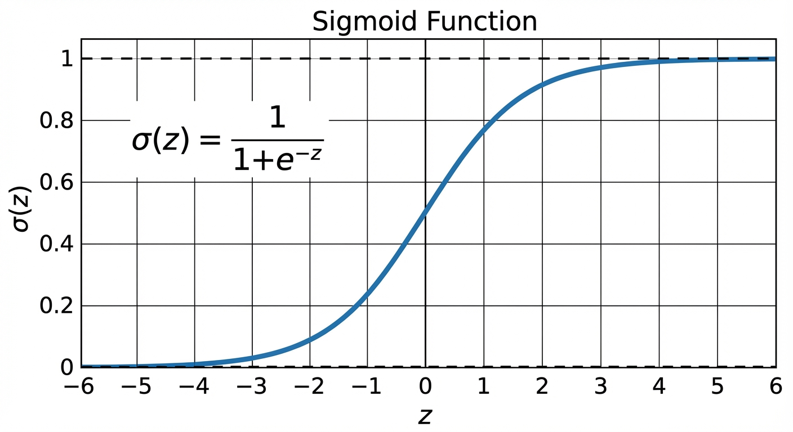

<!-- _footer: Generated by Nano Banana -->

---

# Understanding the Sigmoid Curve

The sigmoid's characteristic S-shape is the transition from _definitely not_ to _definitely yes_ through a smooth, continuous curve; making it suitable for modeling probability as a function of evidence strength.

**Critical points:**

- $\sigma(0) = 0.5$ (neutral point)
- $\lim_{z \to +\infty} \sigma(z) = 1$ (approaches certainty for positive evidence)
- $\lim_{z \to -\infty} \sigma(z) = 0$ (approaches certainty for negative evidence)

**Key geometric properties:**

- **Symmetric around (0, 0.5):** The function is point-symmetric about the origin
- **Smooth transition:** No sharp boundaries, unlike step functions
- **Differentiable everywhere:** Enables gradient-based optimization
- **Bounded:** Always produces valid probabilities

---

# Python - Sigmoid Function

The sigmoid function is easy to implement, but requires numerical stability.

- `np.clip` prevents overflow when $z$ is very large or very small.

```python
import numpy as np

def sigmoid(z):
    """Numerically stable sigmoid function."""
    return 1 / (1 + np.exp(-np.clip(z, -500, 500)))

# Evaluate at specific points
z = np.array([-5, -2, 0, 2, 5])
print(f"z:    {z}")
print(f"sigmoid(z): {np.round(sigmoid(z), 4)}")
# z:    [-5 -2  0  2  5]
# sigmoid(z): [0.0067 0.1192 0.5    0.8808 0.9933]

# Verify the symmetry property: sigmoid(z) + sigmoid(-z) = 1
print(f"sigmoid(z) + sigmoid(-z) = {np.round(sigmoid(z) + sigmoid(-z), 4)}")
# [1. 1. 1. 1. 1.]
```

---

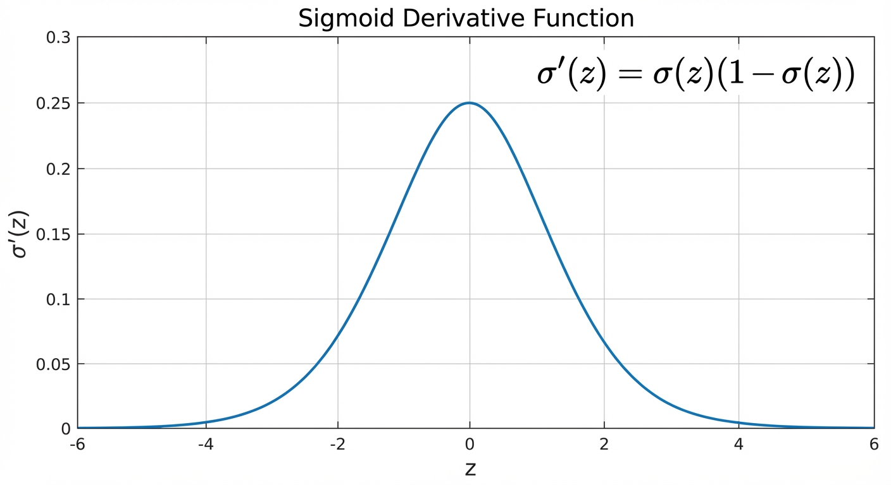

<!-- _footer: Generated by Nano Banana -->

---

# Sigmoid Derivative Behavior

The derivative tells us how sensitive the sigmoid function is to changes in its input.

- This sensitivity pattern has important implications for training logistic regression and understanding convergence behavior.

**Maximum sensitivity:**
$$z = 0 \text{ where } \sigma'(0) = 0.25$$

**Diminishing sensitivity:**
$$\lim_{z \to \pm\infty} \sigma'(z) = 0$$

**Flat gradient regions:**
When $|z|$ is large, the derivative approaches zero, making learning extremely slow.

- This is why very confident wrong predictions can be difficult to correct.
- The gradient signal becomes too weak to drive meaningful parameter updates.

---

---

# Why Choose Sigmoid for Classification?

The sigmoid function isn't the only way to map real numbers to probabilities, but it has a unique combination of mathematical and computational properties that make it particularly well-suited for binary classification.

<div class="two-columns">
<div class="column">

### Advantages

1. **Perfect probability output:** Maps to (0, 1) range
2. **Smooth differentiability:** No discontinuities
3. **Monotonic:** Preserves input ordering

</div>
<div class="column">

### Disadvantages

1. **Gradient vanishing:** Learning slows at extremes
2. **Exponential computation:** More expensive than linear
3. **Not zero-centered:** Can bias gradient updates
4. **Saturation regions:** Very flat for large |z|

</div>
</div>

Despite its limitations, sigmoid remains the standard choice for binary classification due to its mathematical elegance and the fact that many alternatives (tanh, ReLU) don't **naturally produce probabilities**.

---

# Building the Logistic Regression Model

Logistic regression combines the linear model we know from regression with the sigmoid function to create a probabilistic classifier.

Logistic regression applies the sigmoid function to a linear combination of features:

$$P(y = 1 | \mathbf{x}) = \sigma(\mathbf{w}^T\mathbf{x} + b)$$

$$= \frac{1}{1 + e^{-(\mathbf{w}^T\mathbf{x} + b)}}$$

**Model Components:**

- $\mathbf{x} \in \mathbb{R}^D$: Input feature vector
- $\mathbf{w} \in \mathbb{R}^D$: Learned weight vector (captures feature importance)
- $b \in \mathbb{R}$: Bias term (shifts the decision boundary)
- $\sigma$: Sigmoid activation function

---

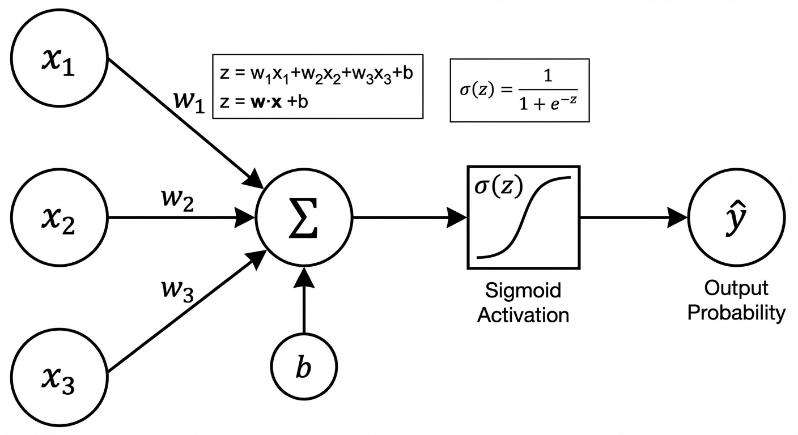

<!-- _footer: Generated by Nano Banana -->

---

# The Logistic Regression Computation Pipeline

Logistic regression is a simple model.

- A linear model followed by a nonlinear transformation.
- This two-stage process separates feature combination from probability calibration.

## Computation Flow

1. **Linear combination:**
   $$z = \mathbf{w}^T\mathbf{x} + b$$

2. **Probability via sigmoid:**
   $$\hat{y} = \sigma(z)$$

3. **Classification decision:**
   $$\text{class} = \begin{cases} 1 & \hat{y} \geq 0.5 \\ 0 & \hat{y} < 0.5 \end{cases}$$

The first step combines features linearly (just like linear regression), while the second step maps this unlimited score to a bounded probability.

---

# The Complete Probability Model

Logistic regression provides a complete probabilistic model for binary outcomes.

- Since probabilities must sum to 1, once we know $P(y=1|\mathbf{x})$, we automatically know $P(y=0|\mathbf{x})$.

### Two-Class Probability Model

Positive class probability:
$$P(y = 1 | \mathbf{x}; \mathbf{w}) = \sigma(\mathbf{w}^T\mathbf{x})$$

Negative class probability:
$$P(y = 0 | \mathbf{x}; \mathbf{w}) = 1 - \sigma(\mathbf{w}^T\mathbf{x}) = \sigma(-\mathbf{w}^T\mathbf{x})$$

**Compact Bernoulli form:**
$$P(y | \mathbf{x}; \mathbf{w}) = \sigma(\mathbf{w}^T\mathbf{x})^y \cdot (1 - \sigma(\mathbf{w}^T\mathbf{x}))^{1-y}$$

This form automatically selects the correct probability based on the observed label $y \in \{0,1\}$.

---

# Example - 2D Logistic Regression

With two features, we can visualize the model's predictions as regions in 2D space.

- Consider a university admissions scenario where the input features are scores from two exams, and the target is accepted (1) or rejected (0).

* The model learns a linear boundary: $P(\text{accepted}|\mathbf{x}) = \sigma(w_1 x_1 + w_2 x_2 + b)$.

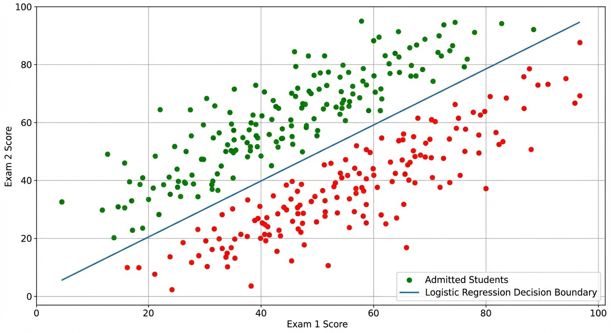

<!-- _footer: Generated by Nano Banana -->

---

# Why Mean Squared Error Fails for Classification

Before deriving the correct loss function, let's understand why MSE from regression would not work for classification problems.

If we use MSE for classification:

$$\mathcal{L}_{MSE} = \frac{1}{N}\sum_{n=1}^{N}(y_n - \hat{y}_n)^2$$

**Critical problems:**

1. **Non-convex optimization:** With sigmoid, MSE creates local minima that trap optimization
2. **Vanishing gradients:** When predictions are very wrong, gradients become tiny
3. **Inappropriate penalty:** Punishes _too confident_ correct predictions
4. **No probabilistic interpretation:** Doesn't align with likelihood maximization

We need a loss function designed specifically for **probability estimation**.

---

# Maximum Likelihood - The Principled Approach

Rather than arbitrarily choosing a loss function, we can derive the optimal loss by asking: _What parameters make our observed data most likely?_

- This **maximum likelihood estimation** approach provides a principled foundation for learning.

**The Likelihood Function**

The likelihood represents the probability of observing our training data given a particular set of parameters:

$$\mathcal{L}(\mathbf{w}) = P(\mathbf{y} | \mathbf{X}; \mathbf{w}) = \prod_{n=1}^{N} P(y_n | \mathbf{x}_n; \mathbf{w})$$

Assuming independence between samples:

$$= \prod_{n=1}^{N} \hat{y}_n^{y_n} (1-\hat{y}_n)^{1-y_n}$$

where $\hat{y}_n = \sigma(\mathbf{w}^T\mathbf{x}_n)$ is our model's probability prediction.

---

# Maximum Likelihood Estimation (MLE)

**Likelihood Function:**
For a dataset $\mathbf{t} = \{t_1, ..., t_N\}$ where $t_n \in \{0, 1\}$, and model predictions $y_n = \sigma(\mathbf{w}^T\mathbf{x}_n)$:

$$p(\mathbf{t}|\mathbf{w}) = \prod_{n=1}^{N} y_n^{t_n} (1-y_n)^{1-t_n}$$

**Negative Log-Likelihood (Error Function):**
Taking the negative logarithm gives the cross-entropy error:

$$E(\mathbf{w}) = -\ln p(\mathbf{t}|\mathbf{w}) = -\sum_{n=1}^{N} \{ t_n \ln y_n + (1-t_n) \ln(1-y_n) \}$$

**Gradient Derivation:**
Using $\frac{d\sigma}{da} = \sigma(1-\sigma)$:
$$\nabla E(\mathbf{w}) = \sum_{n=1}^{N} (y_n - t_n) \mathbf{x}_n$$

This confirms our intuition: **Error = Sum of (Prediction - Target) x Feature**.

---

# From Likelihood to Loss

Products are computationally problematic (underflow) and analytically difficult (chain rule complexity).

- Taking logarithms converts products to sums while preserving the optimization objective since log is monotonic.

Taking the logarithm of the likelihood:

$$\log \mathcal{L}(\mathbf{w}) = \sum_{n=1}^{N} \left[ y_n \log \hat{y}_n + (1-y_n) \log(1-\hat{y}_n) \right]$$

**Maximum Likelihood Estimation:** We want to **maximize** the log-likelihood.

**Equivalent Loss Minimization:** We **minimize** the negative log-likelihood:

$$\mathcal{L}(\mathbf{w}) = -\frac{1}{N}\sum_{n=1}^{N} \left[ y_n \log \hat{y}_n + (1-y_n) \log(1-\hat{y}_n) \right]$$

This is the **Binary Cross-Entropy (BCE)** loss

---

# Binary Cross-Entropy Loss

$$\mathcal{L}_{BCE}(\mathbf{w}) = -\frac{1}{N}\sum_{n=1}^{N} \left[ y_n \log(\hat{y}_n) + (1-y_n) \log(1-\hat{y}_n) \right]$$

**For a single sample:**
$$\ell(y, \hat{y}) = -y \log(\hat{y}) - (1-y) \log(1-\hat{y})$$

**Explanation:**

- If $y = 1$: $\ell = -\log(\hat{y})$ -> Wants $\hat{y}$ to be close to 1
- If $y = 0$: $\ell = -\log(1-\hat{y})$ -> Wants $\hat{y}$ to be close to 0

---

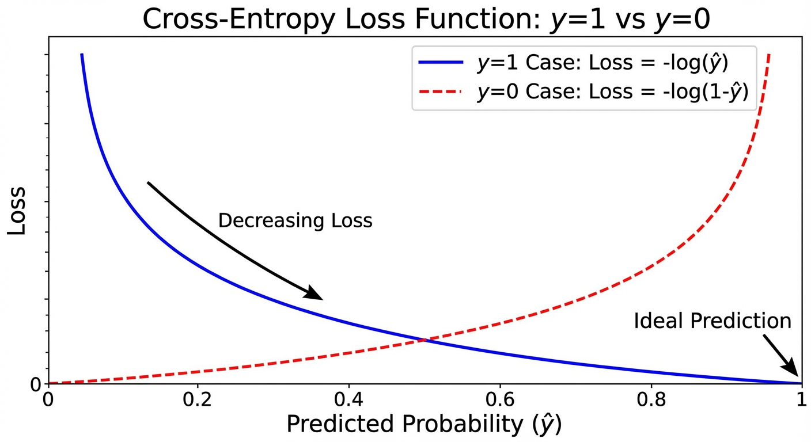

<!-- _footer: Generated by Nano Banana -->

---

# Understanding Cross-Entropy Behavior

Cross-entropy loss heavily penalizes confident wrong predictions while giving diminishing returns for increasingly confident correct predictions.

- This asymmetric penalty structure drives the model toward well-calibrated probabilities.

**When true label $y = 1$ (positive class):**

- $\hat{y} = 0.99$ -> loss ≈ 0.01 (small penalty for correct high confidence)
- $\hat{y} = 0.5$ -> loss ≈ 0.69 (moderate penalty for uncertainty)
- $\hat{y} = 0.01$ -> loss ≈ 4.6 (huge penalty for confident wrong prediction)

**When true label $y = 0$ (negative class):**

- $\hat{y} = 0.01$ -> loss ≈ 0.01 (small penalty for correct high confidence)
- $\hat{y} = 0.5$ -> loss ≈ 0.69 (moderate penalty for uncertainty)
- $\hat{y} = 0.99$ -> loss ≈ 4.6 (huge penalty for confident wrong prediction)

---

# Python - Binary Cross-Entropy Loss

The implementation requires handling of edge cases - `np.log(0)` returns `-inf`, which would break training.

- We use `np.clip` to keep predictions in a safe range.

```python
def binary_cross_entropy(y_true, y_pred):
    """Compute binary cross-entropy loss with numerical stability."""
    epsilon = 1e-15  # Prevent log(0)
    y_pred = np.clip(y_pred, epsilon, 1 - epsilon)
    return -np.mean(y_true * np.log(y_pred) + (1 - y_true) * np.log(1 - y_pred))

# Compare good vs bad predictions
y_true = np.array([1, 1, 0, 0])

y_pred_good = np.array([0.95, 0.85, 0.1, 0.05])
y_pred_bad  = np.array([0.3, 0.4, 0.6, 0.7])

print(f"Good predictions loss: {binary_cross_entropy(y_true, y_pred_good):.4f}")
print(f"Bad predictions loss:  {binary_cross_entropy(y_true, y_pred_bad):.4f}")
# Good predictions loss: 0.1096
# Bad predictions loss:  0.9868
```

> **In practice:** Use `torch.nn.BCELoss()` or `sklearn.metrics.log_loss()` as they handle numerical stability internally.

---

# Properties of Cross-Entropy

A good loss function must be mathematically tractable and must produce learning signals that are useful in practice. Cross-entropy satisfies both requirements.

<div class="two-columns">
<div class="column">

### Mathematical Properties

- **Convex:** Only one global minimum - gradient descent is guaranteed to find the optimal solution with no risk of getting stuck in local minima.
- **Differentiable everywhere:** Gradients exist at all points, enabling smooth optimization.
- **Symmetric:** $\ell(1, p) = \ell(0, 1-p)$ - the model is penalized equally for being wrong in either direction.
- **Zero lower bound:** $\ell \geq 0$ - loss is 0 only for a perfect prediction ($\hat{y} = y$).

</div>
<div class="column">

### Practical Advantages

- **Strong gradients for wrong predictions:** When the model is confidently wrong, the loss is large and gradients are steep - learning accelerates exactly when it is most needed.
- **Principled derivation from MLE:** Not an arbitrary design choice - it is the theoretically optimal loss for probability estimation.
- **Standard across ML:** Used identically in logistic regression, neural networks, and transformers.

</div>
</div>

---

# Entropy Concept (Information Theory)

Originating from Information Theory, **entropy** measures the inherent unpredictability, _surprise_, or average information content of a random variable.

**Definition:**
$$H(p) = -\sum_{i} p_i \log p_i$$

**In binary case (e.g., coin flip):**
$$H(p) = -p \log p - (1-p) \log(1-p)$$

**Intuitive Properties:**

- $H(0.5) = 1$ bit (Maximum uncertainty: a fair coin flip gives 1 full bit of surprise)
- $H(0) = H(1) = 0$ (Absolute certainty: a rigged coin gives 0 surprise)

---

# Cross-Entropy Definition

If entropy is the true information content, **Cross-Entropy** is the actual cost (in bits) of encoding the true distribution $p$ using an imperfect model distribution $q$.

**Formula:**
$$H(p, q) = -\sum_{i} p_i \log q_i$$

**In binary classification ($p=y, q=\hat{y}$):**
$$H(y, \hat{y}) = -y \log \hat{y} - (1-y) \log(1-\hat{y})$$

**Kullback-Leibler (KL) Divergence:** Measures the exact difference between distributions.
$$D_{KL}(p || q) = H(p, q) - H(p)$$

> Since the true data entropy $H(p)$ is fixed, **minimizing cross-entropy is mathematically identical to minimizing KL divergence**. We are forcing our model's predictions ($q$) to match the true labels ($p$).

---

# Training Logistic Regression

Unlike linear regression, logistic regression doesn't have a **closed-form solution due to the nonlinear sigmoid function**.

- This means we must use iterative optimization methods, with gradient descent being the most fundamental approach.

### The Optimization Objective

Find parameters that minimize cross-entropy loss:

$$\mathbf{w}^* = \arg\min_{\mathbf{w}} \mathcal{L}(\mathbf{w})$$

$$
= \arg\min_{\mathbf{w}}
\left[
-\frac{1}{N}\sum_{n=1}^{N}
\left(
y_n \log \sigma(\mathbf{w}^T\mathbf{x}_n)
+ (1-y_n)\log(1-\sigma(\mathbf{w}^T\mathbf{x}_n))
\right)
\right]
$$

---

# Applying Gradient Descent to Logistic Regression

- In linear regression the gradient was $\frac{1}{N}\mathbf{X}^T(\mathbf{X}\mathbf{w} - \mathbf{y})$

* In logistic regression it is $\frac{1}{N}\mathbf{X}^T(\hat{\mathbf{y}} - \mathbf{y})$ where $\hat{\mathbf{y}} = \sigma(\mathbf{X}\mathbf{w})$.

The update rule is identical:

$$\mathbf{w}^{(t+1)} = \mathbf{w}^{(t)} - \alpha \cdot \frac{1}{N}\mathbf{X}^T(\hat{\mathbf{y}} - \mathbf{y})$$

| Property             | Linear Regression                                        | Logistic Regression                                      |
| -------------------- | -------------------------------------------------------- | -------------------------------------------------------- |
| Prediction           | $\hat{\mathbf{y}} = \mathbf{X}\mathbf{w}$                | $\hat{\mathbf{y}} = \sigma(\mathbf{X}\mathbf{w})$        |
| Loss                 | MSE                                                      | Binary Cross-Entropy                                     |
| Gradient             | $\frac{1}{N}\mathbf{X}^T(\hat{\mathbf{y}} - \mathbf{y})$ | $\frac{1}{N}\mathbf{X}^T(\hat{\mathbf{y}} - \mathbf{y})$ |
| Closed-form solution | Yes (Normal Equations)                                   | No, must use iterative methods                           |

> The gradient has the _same form_ in both cases. The difference is hidden inside $\hat{\mathbf{y}}$. This symmetry arises because both models use maximum likelihood with distributions from the exponential family.

---

# Convexity of Logistic Regression

The cross-entropy loss for logistic regression is **convex** with respect to $\mathbf{w}$.

- This means there is a single global minimum (no local minima, no saddle points to get trapped in).

* Gradient descent is guaranteed to find the optimal solution (given a small enough learning rate).

The proof relies on showing that the **Hessian matrix** $\mathbf{H} = \mathbf{X}^T\mathbf{R}\mathbf{X}$ is positive semi-definite, where $\mathbf{R}$ is a diagonal matrix with $R_{nn} = \hat{y}_n(1-\hat{y}_n) > 0$. Since $\mathbf{R}$ has strictly positive diagonal entries, $\mathbf{H}$ is positive semi-definite, confirming convexity.

---

# Logistic Regression with NumPy

```python
import numpy as np

def sigmoid(z):
    return 1 / (1 + np.exp(-np.clip(z, -500, 500)))

def logistic_regression(X, y, lr=0.01, epochs=1000, lambda_reg=0.01):
    N, D = X.shape
    X = np.c_[np.ones(N), X]  # Prepend column of 1s to absorb the bias term into w
    w = np.zeros(D + 1)       # Initialize all weights (including bias) to zero

    for _ in range(epochs):
        z = X @ w              # Step 1: Linear combination z = Xw
        y_hat = sigmoid(z)     # Step 2: Map to probabilities via sigmoid
        gradient = (X.T @ (y_hat - y)) / N + lambda_reg * w  # Step 3: Regularized gradient
        w -= lr * gradient     # Step 4: Gradient descent update

    return w
```

> **Note:** `lambda_reg * w` regularizes all weights including the bias. In practice, the bias weight (`w[0]`) should be excluded from regularization - see the earlier implementation for the corrected version.

---

# Logistic Regression with Scikit-Learn

- The key parameter `C` is the **inverse** of regularization strength ($C = 1/\lambda$)

* Larger C means less regularization.

```python
from sklearn.linear_model import LogisticRegression
from sklearn.model_selection import train_test_split
from sklearn.preprocessing import StandardScaler
from sklearn.metrics import accuracy_score

# Data preparation
X_train, X_test, y_train, y_test = train_test_split(X, y, test_size=0.2)
scaler = StandardScaler()
X_train_s = scaler.fit_transform(X_train)
X_test_s = scaler.transform(X_test)

# Train model (C=1/λ, so C=1.0 means moderate regularization)
model = LogisticRegression(C=1.0, max_iter=1000)
model.fit(X_train_s, y_train)

# Predictions: both class labels and probabilities
y_pred = model.predict(X_test_s)
y_prob = model.predict_proba(X_test_s)[:, 1]  # P(y=1)

print(f"Accuracy: {accuracy_score(y_test, y_pred):.4f}")
print(f"Weights: {model.coef_[0]}, Bias: {model.intercept_[0]:.4f}")
```

---

# Decision Boundaries

The decision boundary is where our probabilistic model makes geometric sense.

- It's the set of points where the model is maximally uncertain.

Understanding decision boundaries helps us interpret what our model has learned.

### Mathematical Definition

**Decision boundary:** The hyperplane where the model assigns equal probability to both classes:

$$\mathbf{w}^T\mathbf{x} + b = 0$$

This equation emerges from the condition of maximum uncertainty:

$$P(y=1|\mathbf{x}) = 0.5 \Leftrightarrow \sigma(\mathbf{w}^T\mathbf{x} + b) = 0.5 \Leftrightarrow \mathbf{w}^T\mathbf{x} + b = 0$$

The decision boundary is always a **hyperplane** (line in 2D, plane in 3D, etc.) regardless of the data distribution.

---

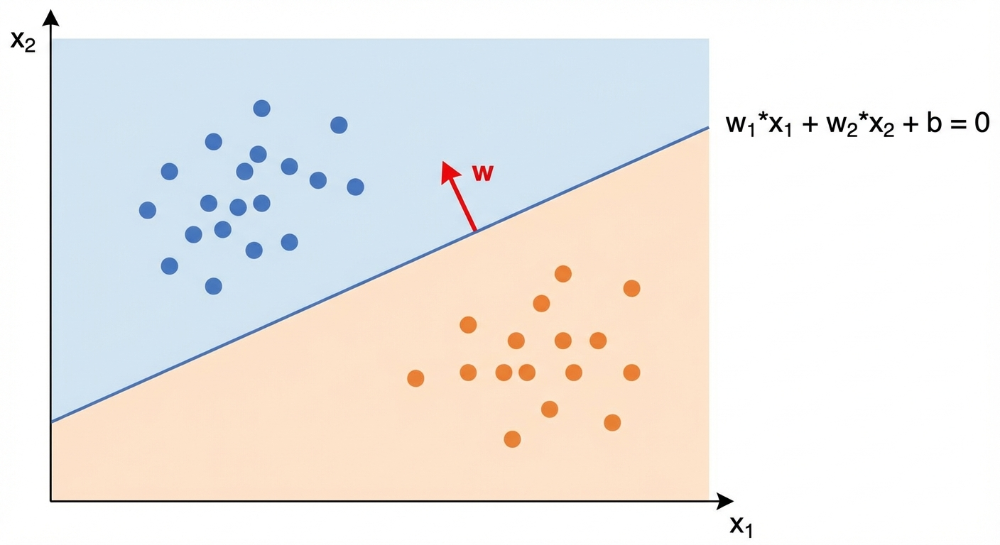

<!-- _footer: Generated by Nano Banana -->

---

# Interpreting 2D Decision Boundaries

In two dimensions, the decision boundary is always a straight line, regardless of how complex the data distribution might be.

Model: $z = w_1x_1 + w_2x_2 + b$

**Decision boundary equation:**
$$w_1x_1 + w_2x_2 + b = 0$$

**Rearranged as line equation:**
$$x_2 = -\frac{w_1}{w_2}x_1 - \frac{b}{w_2}$$

- **Slope:** $-w_1/w_2$ (ratio of feature weights)
- **Intercept:** $-b/w_2$ (bias effect)
- **Normal vector:** $(w_1, w_2)$ points toward positive class

---

# Interpretation of Decision Boundary

The learned weight vector $\mathbf{w}$ doesn't just define the boundary, it encodes the full geometry of the model.

**The weight vector is the normal to the boundary:** $\mathbf{w}$ points perpendicularly away from the boundary in the direction of increasing $P(y=1|\mathbf{x})$. Flipping the sign of $\mathbf{w}$ flips which side is classified as positive.

**Distance of the boundary from the origin:**
$$d = \frac{|b|}{||\mathbf{w}||}$$
The bias $b$ shifts the boundary away from the origin. Without it, the boundary would always pass through the origin.

**Signed distance of any point $\mathbf{x}$ from the boundary:**
$$d(\mathbf{x}) = \frac{\mathbf{w}^T\mathbf{x} + b}{||\mathbf{w}||}$$
A positive value means $\mathbf{x}$ is on the positive side (classified as 1); a negative value means the negative side (classified as 0). The magnitude tells us how far from the boundary and therefore how **confident** the model is.

---

# Linear Separability

Logistic regression can only learn a **linear** decision boundary (a straight line in 2D, a plane in 3D, a hyperplane in higher dimensions).

- This works well when the classes are **linearly separable**.

* When they are not, logistic regression fails.

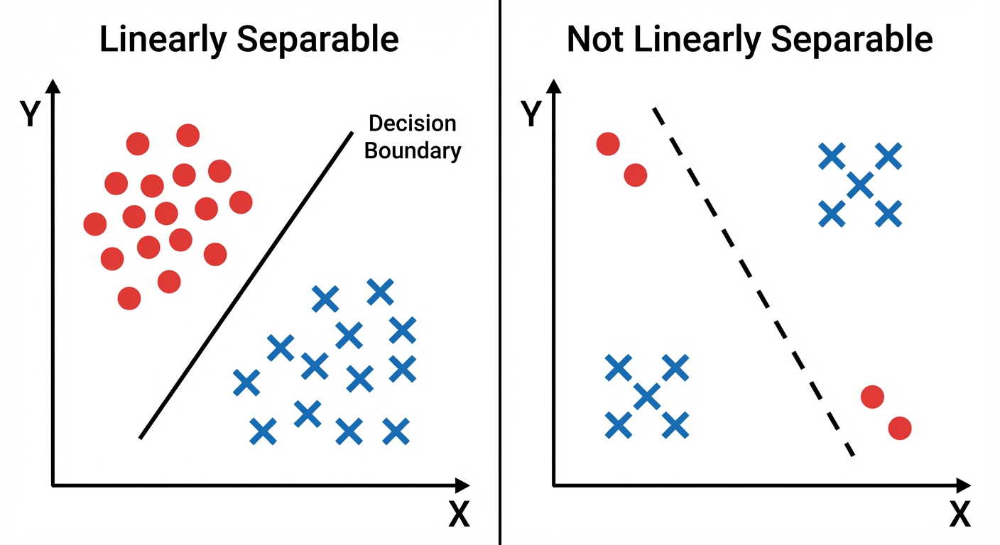

<!-- _footer: Generated by Nano Banana -->

---

# Probability Map

The probability map shows how confident the model is across the entire feature space.

- Points far from the decision boundary have probabilities close to 0 or 1 (high confidence)
- Points near the boundary have probabilities close to 0.5 (maximum uncertainty).

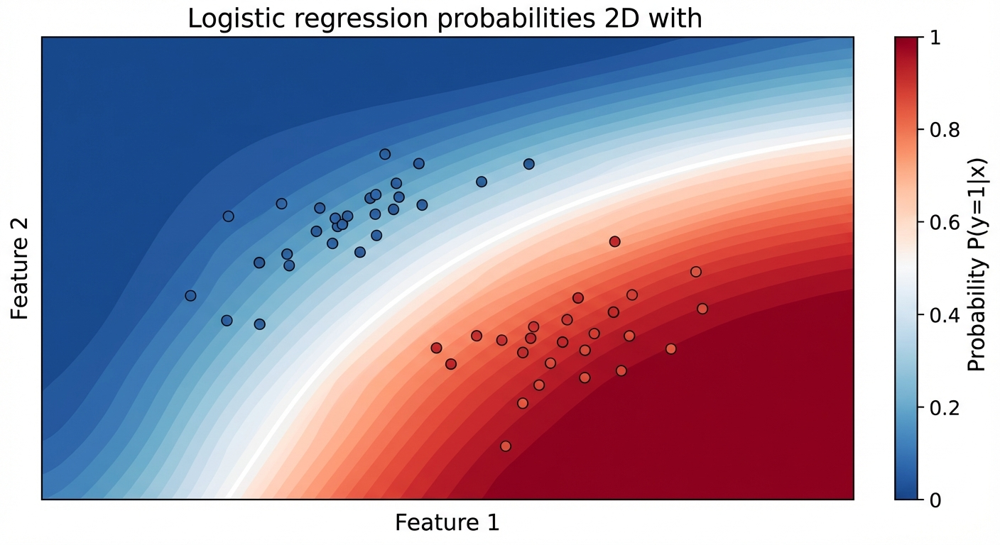

<!-- _footer: Generated by Nano Banana -->

---

# Example - Iris Dataset

The Iris dataset has 3 flower species.

- We turn it into a binary problem: **Setosa (1) vs all others (0)**.
- Using only 2 features (sepal length and width) keeps the data visualizable in 2D.

The probability contour shows the full output of the model not just the class boundary but the model's confidence.

```python
from sklearn.datasets import load_iris
import matplotlib.pyplot as plt

iris = load_iris()
X = iris.data[:, :2]            # Only sepal length & width - enables 2D visualization
y = (iris.target == 0).astype(int)  # Convert to binary: Setosa=1, others=0

model = LogisticRegression()
model.fit(X, y)

# Create a fine grid covering the entire feature space
xx, yy = np.meshgrid(np.linspace(4, 8, 100), np.linspace(1.5, 4.5, 100))

# Predict P(y=1) for every point on the grid, then reshape to a 2D surface
Z = model.predict_proba(np.c_[xx.ravel(), yy.ravel()])[:, 1]
plt.contourf(xx, yy, Z.reshape(xx.shape), cmap='RdBu', alpha=0.8)
plt.scatter(X[:, 0], X[:, 1], c=y, cmap='RdBu', edgecolor='k')
```

---

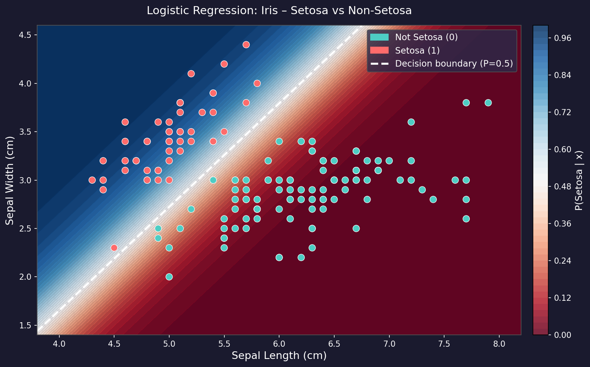

---

# Multi-class Classification

Most real problems have more than two classes. The binary framework we built extends in three different ways each with different trade-offs between simplicity, scalability, and probabilistic rigor.

**Problem:**
$$y \in \{1, 2, ..., K\}$$

**Examples:**

- Digit recognition: 0–9 (K=10)
- Image classification: Cat, Dog, Bird, ... (K=1000+)
- Language detection: English, Turkish, German, ...

**Three approaches:**

| Approach               | Idea                                | Models needed |
| ---------------------- | ----------------------------------- | ------------- |
| **One-vs-Rest (OvR)**  | K binary classifiers, one per class | K             |
| **One-vs-One (OvO)**   | One classifier per class pair       | $K(K-1)/2$    |
| **Softmax Regression** | One unified model with K outputs    | 1             |

---

# One-vs-Rest (OvR)

The simplest approach to multi-class classification with binary classifiers: train **K separate models**, each distinguishing one class from all others. For digit recognition (K=10), you train 10 models: "is it a 0?", "is it a 1?", etc. The class with the highest probability wins.

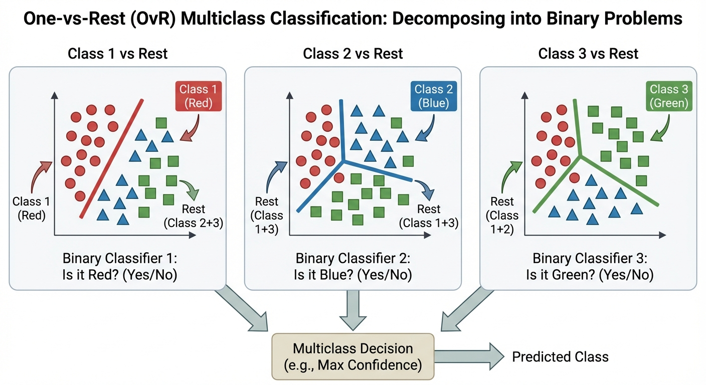

<!-- _footer: Generated by Nano Banana -->

---

# One-vs-One (OvO)

Instead of each classifier competing against all other classes at once, OvO trains one binary classifier for **every possible pair** of classes.

- Total models: $\binom{K}{2} = \frac{K(K-1)}{2}$
- For K=10 (digit recognition), this means **45 binary models**.

**Prediction by majority voting:** Each classifier _votes_ for one of its two classes. The class that wins the most head-to-head matchups is the final prediction.

Each individual classifier sees a much smaller, balanced training set, which can benefit algorithms sensitive to class imbalance (e.g., SVMs). Training each model is faster even if you train more of them.

**Disadvantages:**

- Inference requires running too many models at prediction time.
- Voting can result in ties or ambiguous outcomes in some configurations.
- Does not produce a well-calibrated probability distribution over all K classes.

---

# Softmax Function

The softmax function solves a fundamental problem: how do we convert K unconstrained real-valued scores into a valid probability distribution over K classes?

$$P(y = k | \mathbf{x}) = \frac{e^{z_k}}{\sum_{j=1}^{K} e^{z_j}} \quad \text{where } z_k = \mathbf{w}_k^T\mathbf{x}$$

- The exponential $e^{z_k}$ makes all values positive.
- Dividing by the sum normalizes them to sum to 1.
- The result is always a valid probability distribution.

**Key properties:**

- $\sum_{k=1}^{K} P(y=k|\mathbf{x}) = 1$ - outputs form a proper probability distribution
- $P(y=k|\mathbf{x}) > 0$ for all $k$ - every class always receives some probability mass
- **Reduces to sigmoid when K=2:** $\frac{e^{z_1}}{e^{z_1}+e^{z_2}} = \frac{1}{1+e^{z_2-z_1}} = \sigma(z_1 - z_2)$

> Softmax doesn't just normalize scores, it _sharpens_ the distribution. The class with the highest score gets a disproportionately large probability due to the exponential, making predictions more decisive.

---

# Softmax Visualization

The softmax function converts raw scores into a valid probability distribution.

- Consider three classes with scores $z_1 = 2.0$, $z_2 = 1.0$, $z_3 = 0.5$.
- After applying softmax, the outputs are $P(y=1) = 0.659$, $P(y=2) = 0.242$, $P(y=3) = 0.099$ and they sum to 1 and are all positive.
- The largest score gets the highest probability, but the relative differences between scores are preserved through the exponential.

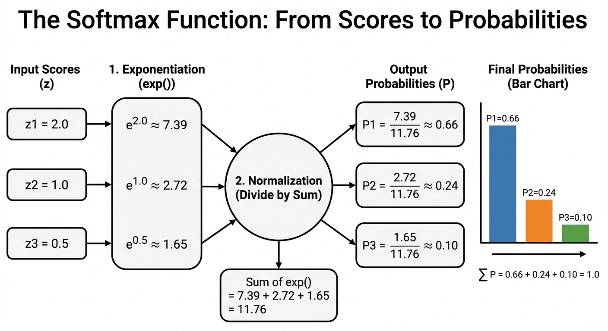

<!-- _footer: Generated by Nano Banana -->

---

# Softmax Regression Model

Softmax regression (also called _Multinomial Logistic Regression_) is a direct generalization of logistic regression.

- Instead of a single weight vector $\mathbf{w}$, we learn one weight vector **per class**.

**Weight matrix** - one column per class:
$$\mathbf{W} = [\mathbf{w}_1, \mathbf{w}_2, ..., \mathbf{w}_K] \in \mathbb{R}^{D \times K}$$

**Step 1 - Compute K logit scores** (one per class) with a single matrix multiplication:
$$\mathbf{z} = \mathbf{W}^T\mathbf{x} \in \mathbb{R}^K$$

**Step 2 - Convert to a probability distribution** via softmax:
$$P(y=k|\mathbf{x}) = \text{softmax}(\mathbf{z})_k = \frac{e^{z_k}}{\sum_j e^{z_j}}$$

**Step 3 - Predict** the class with the highest probability:
$$\hat{y} = \arg\max_k P(y=k|\mathbf{x})$$

The computation is identical to logistic regression, we just replace the single weight vector with a weight matrix and sigmoid with softmax.

---

# Loss Function for Softmax

**Categorical Cross-Entropy** is the natural extension of binary cross-entropy to K classes. It is derived from the same maximum likelihood principle.

Labels are represented as **one-hot vectors**: $\mathbf{y}_n = [0, ..., 1, ..., 0]^T$ with a 1 only at the correct class position $c_n$.

**General form (sum over all K classes):**
$$\mathcal{L} = -\frac{1}{N}\sum_{n=1}^{N}\sum_{k=1}^{K} y_{nk} \log(\hat{y}_{nk})$$

Because $y_{nk} = 0$ for all incorrect classes, only the term for the **true class** $c_n$ survives:

$$\mathcal{L} = -\frac{1}{N}\sum_{n=1}^{N} \log(\hat{y}_{n, c_n})$$

> The loss is simply the negative log-probability assigned to the correct class. If the model predicts $\hat{y}_{n,c_n} = 0.9$ (confident and correct), loss ≈ 0.1. If it predicts $\hat{y}_{n,c_n} = 0.05$ (confident and wrong), loss ≈ 3.0. The model is maximally penalized for assigning low probability to the right answer.

---

# Softmax Gradient

Despite the added complexity of K classes, the gradient of the categorical cross-entropy loss has the same structure as binary cross-entropy.

**Gradient for the weight vector of class $k$:**
$$\frac{\partial \mathcal{L}}{\partial \mathbf{w}_k} = \frac{1}{N}\sum_{n=1}^{N} \underbrace{(\hat{y}_{nk} - y_{nk})}_{\text{prediction error for class }k} \mathbf{x}_n$$

**In matrix form (updating the full weight matrix $\mathbf{W}$ at once):**
$$\nabla_{\mathbf{W}} \mathcal{L} = \frac{1}{N} \mathbf{X}^T \underbrace{(\hat{\mathbf{Y}} - \mathbf{Y})}_{\in \mathbb{R}^{N \times K}}$$

where $\hat{\mathbf{Y}}$ contains softmax probabilities and $\mathbf{Y}$ contains one-hot labels.

> The gradient is _identical in form_ to the binary gradient, just with a matrix of errors instead of a vector. It is the same MLE derivation applied to K classes instead of 2.

---

# Softmax - Numerical Stability

When logit scores are large, $e^{z_k}$ overflows to `inf` and the computation breaks silently.

```python
>>> np.exp(1000) # -> inf
```

**We fix it by subtracting the maximum score before exponentiating.** This is mathematically equivalent because the constant cancels out in the division:

$$\text{softmax}(z_k) = \frac{e^{z_k - \max(\mathbf{z})}}{\sum_j e^{z_j - \max(\mathbf{z})}}$$

- After shifting, the largest exponent is always $e^0 = 1$, so overflow is impossible.

- The minimum exponent is $\leq 0$, so underflow to zero is graceful (a class with zero probability is just not selected).

```python
def stable_softmax(z):
    z_shifted = z - np.max(z)   # Shift so max score becomes 0
    exp_z = np.exp(z_shifted)   # Largest value is now exp(0) = 1
    return exp_z / np.sum(exp_z)
```

> Try to use `torch.nn.CrossEntropyLoss()` or `tf.nn.softmax_cross_entropy_with_logits()` as they fuse the softmax and log together using the numerically stable log-sum-exp trick, which is even more robust than this approach.

---

# Multi-class with Scikit-Learn

Scikit-learn handles multi-class classification automatically. Setting `multi_class='multinomial'` forces it to use a single softmax model rather than the default OvR decomposition.

```python
from sklearn.linear_model import LogisticRegression
from sklearn.datasets import load_digits
from sklearn.model_selection import train_test_split
from sklearn.preprocessing import StandardScaler

digits = load_digits()
X, y = digits.data, digits.target   # X: (1797, 64), y: 0-9

X_train, X_test, y_train, y_test = train_test_split(X, y, test_size=0.2)
scaler = StandardScaler()
X_train_s = scaler.fit_transform(X_train)
X_test_s  = scaler.transform(X_test)

# multi_class='multinomial': uses softmax (one joint model for all K=10 classes)
model = LogisticRegression(multi_class='multinomial', max_iter=1000)
model.fit(X_train_s, y_train)

y_pred = model.predict(X_test_s)
probs  = model.predict_proba(X_test_s)   # Shape: (N_test, 10) - probabilities for all 10 classes
print(f"Test accuracy: {(y_pred == y_test).mean():.4f}")
```

---

# Three Approaches to Classification

Before wrapping up, it is worth stepping back to see where logistic regression fits in the bigger picture.

- Classification can be organized into three approaches

| Approach                   | What It Models                                                                               | Example(s)               |
| -------------------------- | -------------------------------------------------------------------------------------------- | ------------------------ |
| **Discriminant Functions** | Decision boundary directly: $y(\mathbf{x}) = \mathbf{w}^T\mathbf{x} + w_0$                   | Fisher's LDA, Perceptron |
| **Generative Models**      | Class-conditional densities $p(\mathbf{x}\mid C_k)$ and priors $p(C_k)$, then Bayes' theorem | Naive Bayes, GDA         |
| **Discriminative Models**  | Posterior $p(C_k \mid \mathbf{x})$ directly                                                  | Logistic Regression      |

**This week** we focused on the discriminative approach by modeling $p(C_k|\mathbf{x})$ directly using sigmoid/softmax.

- We will cover discriminant functions and generative models later on.

- Generative models can handle missing data and detect outliers, but make stronger assumptions about data distribution.
- Discriminative models make fewer assumptions and often achieve better classification accuracy, but cannot generate new samples.

---

<!-- _header: "" -->
<!-- _footer: "" -->
<!-- _paginate: false -->

<!-- _class: lead -->

# Thank You!

## Contact Information

- **Email:** ekrem.cetinkaya@yildiz.edu.tr
- **Office Hours:** Wednesday 13:30-15:30 - Room C-120
- **Book a slot before coming:** [Booking Link](https://calendar.app.google/fog6DPBGJH2QpHVw8)
- **Course Repository:** [GitHub](https://github.com/ekremcet/yzm2011-introduction-to-machine-learning)
