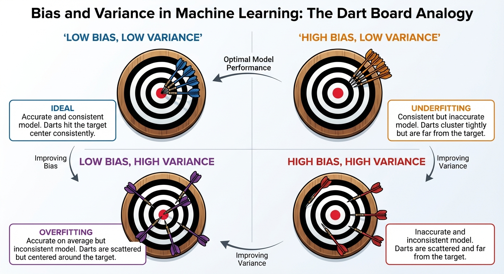
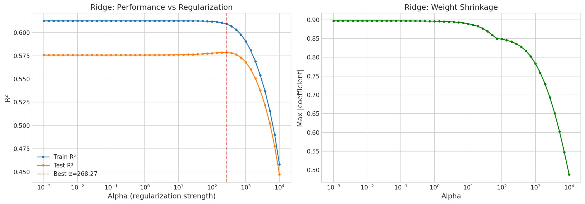
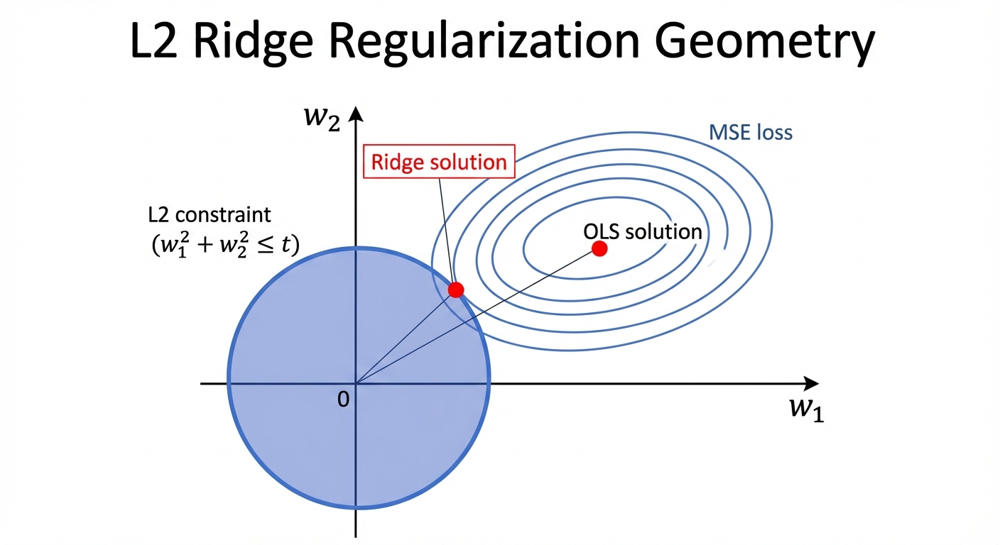
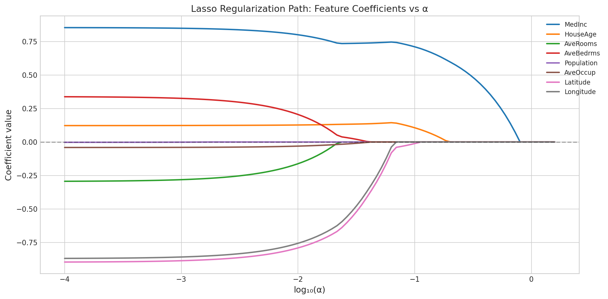
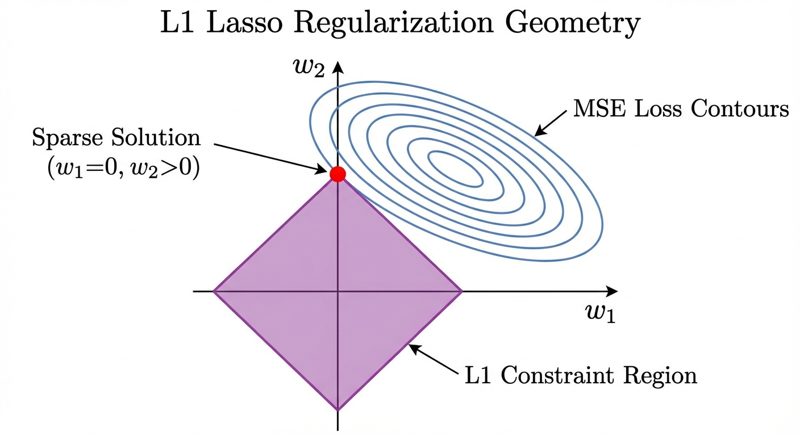
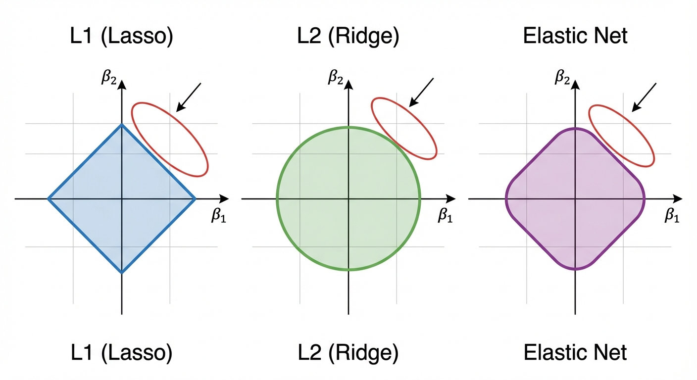
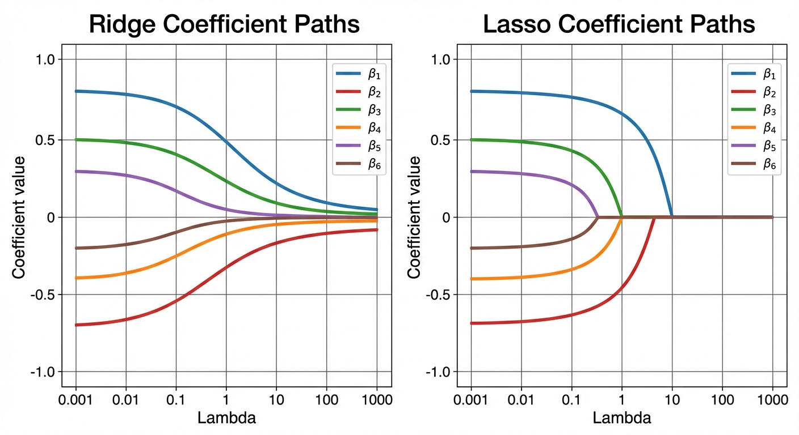
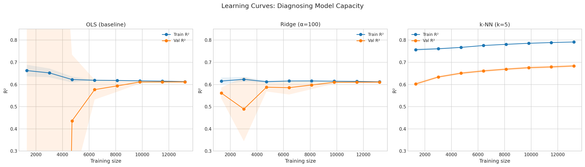
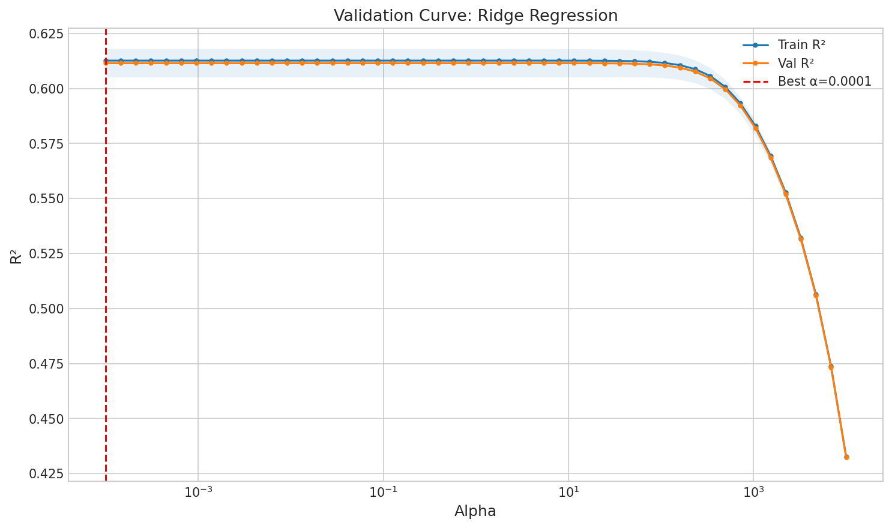

# YZM2011

## Introduction to Machine Learning

### Week 6: Model Evaluation and Regularization

**Instructor:** Ekrem Çetinkaya
**Date:** 31.03.2026

---

# Course Content

<div class="two-columns">
<div class="column">

## Evaluation

- Why holdout fails, K-fold CV
- Nested CV for unbiased estimates
- Information criteria (AIC, BIC)
- Learning curves and validation curves

</div>
<div class="column">

## Regularization

- Formal bias-variance decomposition
- Ridge (L2): closed-form, geometry
- Lasso (L1): geometry, sparsity, soft thresholding
- Elastic Net: best of both worlds
- Bayesian interpretation of regularization

</div>
</div>

**This week's approach:** We build a **single running example** and progressively add each technique, comparing before/after at every step.

---

# Running Example - California Housing

Every concept this week will be demonstrated on the **same dataset** with the **same baseline**

- California Housing dataset: 20,640 samples, 8 features, predicting median house value.

```python
import numpy as np
from sklearn.datasets import fetch_california_housing
from sklearn.model_selection import train_test_split
from sklearn.preprocessing import StandardScaler
from sklearn.linear_model import LinearRegression
from sklearn.metrics import mean_squared_error, r2_score

# Load and split
data = fetch_california_housing()
X, y = data.data, data.target
feature_names = data.feature_names

X_train, X_test, y_train, y_test = train_test_split(X, y, test_size=0.2, random_state=42)

# Scale features
scaler = StandardScaler()
X_train_s = scaler.fit_transform(X_train)
X_test_s = scaler.transform(X_test)

print(f"Train: {X_train_s.shape}, Test: {X_test_s.shape}")
print(f"Features: {list(feature_names)}")
```

---

# The Overfitting Problem

We generate $N=10$ points from $\sin(2\pi x)$ + noise, then fit polynomials of increasing degree.

<div class="two-columns">

<div class="column">

```python
import numpy as np
from sklearn.preprocessing import PolynomialFeatures
from sklearn.linear_model import LinearRegression

np.random.seed(42)
x = np.linspace(0, 1, 10)
t = np.sin(2 * np.pi * x) + np.random.normal(0, 0.25, 10)

for M in [1, 3, 9]:
    poly = PolynomialFeatures(M)
    X_poly = poly.fit_transform(x.reshape(-1, 1))
    model = LinearRegression().fit(X_poly, t)
    train_rmse = np.sqrt(np.mean((model.predict(X_poly) - t)**2))
    max_w = np.max(np.abs(model.coef_))
    print(f"Degree {M}: RMSE={train_rmse:.4f}, Max|w|={max_w:.0f}")
```

</div>

<div class="column">

| Degree | Train RMSE | Max \|w\| | What Happens                                   |
| ------ | ---------- | --------- | ---------------------------------------------- |
| M=1    | 0.68       | 1         | Too simple - misses the curve (underfitting)   |
| M=3    | 0.26       | 25        | Good balance - captures the shape              |
| M=9    | 0.00       | 125,432   | Zero error but wild oscillations (overfitting) |

</div>

</div>

> **The key observation:** M=9 achieves _perfect_ training fit (RMSE=0) but the coefficient magnitudes are enormous. The model has memorized the noise. This is exactly what regularization prevents - by penalizing large weights.

---

# Coefficient Explosion - The Signal of Overfitting

As polynomial degree increases, the coefficients grow exponentially.

- In the previous example, for M=9, coefficients reach values of $10^5$, while for M=3, they stay modest.
- This is not a coincidence; it is a mathematical consequence of trying to fit noise.

**Why do coefficients explode?**

- When the model has more parameters than necessary, it can achieve lower training error by making extreme positive and negative coefficients that cancel each other out.
- The resulting function passes through all data points but oscillates wildly between them.

---

# Effect of Dataset Size

One way to combat overfitting is simply to collect **more data**.

- With $N=15$ or $N=100$ data points (instead of $N=10$), even the M=9 polynomial generalizes better
- Because with more data, there is less room for the model to memorize noise.

| Data Size | M=9 Behavior                                |
| --------- | ------------------------------------------- |
| N=10      | Severe overfitting - wild oscillations      |
| N=15      | Moderate overfitting - some oscillations    |
| N=100     | Good fit - enough data constrains the model |

This illustrates a fundamental rule: **model complexity should be proportional to data size**. A complex model (many parameters) needs proportionally more data to train reliably. When you cannot get more data, regularization is the alternative.

> **Rule of thumb:** If $N < 10 \times p$ (where $p$ is the number of parameters), you almost certainly need regularization.

---

# Step 0: The Baseline

Before adding any technique, let's establish a **baseline**.

- Plain OLS linear regression with no regularization, no cross-validation, just a simple train/test evaluation.

```python
baseline = LinearRegression()
baseline.fit(X_train_s, y_train)

y_pred_train = baseline.predict(X_train_s)
y_pred_test = baseline.predict(X_test_s)
```

**Output:**

```
Train R²:  0.6126    Test R²:   0.5758
Train RMSE: 0.7242   Test RMSE:  0.7456
Gap:       0.0368    Max |w|:   0.8969
```

This is our reference point.

- Every technique we add should improve upon these numbers.
- For example, the gap between train (0.61) and test (0.58) suggests mild overfitting.

---

# Why Is the Baseline Not Enough?

Three problems with the baseline evaluation above:

1. **Unreliable estimate:** The R² = 0.576 depends on _which_ random split we chose. A different `random_state` could give 0.55 or 0.60.

2. **No hyperparameter tuning:** OLS has no hyperparameters, but Ridge/Lasso need $\lambda$ - and we cannot use the test set to choose it.

3. **Potential overfitting:** The model uses all 8 features, but maybe some are noise. We have no mechanism to discover this.

Each problem has a solution:

1.  Cross-validation -> stable estimates.
2.  Nested CV -> unbiased tuning.
3.  Regularization -> automatic feature weighting/selection.

---

# What Can Go Wrong Without Proper Evaluation?

Before we add any technique, let's understand what happens when you evaluate a model incorrectly.

<div class="two-columns">
<div class="column">

### Mistake 1: Evaluate on Training Data

```python
model.fit(X, y)
print(model.score(X, y))  # 0.99
```

**Problem:** The model has seen this data. Of course it performs well.

### Mistake 2: Tune on Test Data

```python
for alpha in [0.01, 0.1, 1, 10]:
    model = Ridge(alpha=alpha)
    model.fit(X_train, y_train)
    print(model.score(X_test, y_test))
```

**Problem:** Test set performance influenced your choice. It is no longer _unseen_

</div>
<div class="column">

### Mistake 3: Scale Before Splitting

```python
scaler.fit(X)  # Sees ALL data
X_s = scaler.transform(X)
X_tr, X_te = split(X_s)
```

**Problem:** Test data's statistics leaked into training through the scaler.

### Mistake 4: Report Single-Split Results

```python
# Random state 42 gave R²=0.85
# Random state 43 gives R²=0.72
# Which do you report?
```

**Problem:** A single split is not reproducible or reliable.

</div>
</div>

---

# K-Fold Cross-Validation

**The procedure:**

1. Shuffle the data and partition it into $K$ equal-sized folds $D_1, D_2, \ldots, D_K$
2. For each fold $k = 1$ to $K$:
   - Hold out fold $k$ as the **validation set**
   - Train the model on the remaining $K-1$ folds (the training set)
   - Record the validation score $S_k$
3. Report the average (and standard deviation) across folds

$$\text{CV Score} = \frac{1}{K}\sum_{k=1}^{K} S_k, \qquad \text{CV Std} = \sqrt{\frac{1}{K-1}\sum_{k=1}^{K}(S_k - \overline{S})^2}$$

> **Why it works:** Every data point appears as a validation point exactly once. The average score is a nearly unbiased estimate of the true generalization error and the standard deviation tells you how uncertain that estimate is.

---

# Step 1: Cross-Validation - How Stable Is Our Baseline?

Cross-validation tells us not just the average performance, but how much it **varies** across different splits.

```python
from sklearn.model_selection import cross_val_score

# 5-fold CV on the SAME baseline model
cv_scores = cross_val_score(LinearRegression(), X_train_s, y_train,
                            cv=5, scoring='r2')

print("=== STEP 1: Cross-Validated Baseline ===")
print(f"Per-fold R²: {np.round(cv_scores, 4)}")
print(f"Mean R²:     {cv_scores.mean():.4f} ± {cv_scores.std():.4f}")
```

**Output:**

```
Per-fold R²: [0.6020, 0.5931, 0.6189, 0.5757, 0.6149]
Mean R²:     0.6009 ± 0.0158
```

**Before:** Single split R² = 0.576 (one number, no confidence).
**After:** CV R² = 0.601 ± 0.016 (mean + uncertainty band).

---

# Why Regular CV Fails for Hyperparameter Tuning

Suppose we evaluate 20 Ridge models (different α values) using the same 5-fold CV and pick the best α.

- The problem: we have examined validation performance $20 \times 5 = 100$ times and reported the highest.

Even with random data, some configuration will look best purely by chance. The more configurations we try, the more we are fishing for a lucky split.

- Formally, if we search over $M$ hyperparameter values:

$$\mathbb{E}\!\left[\max_{m=1}^{M}\,\widehat{\text{CV}}_m\right] \;>\; \text{True Generalization Error}$$

The gap grows with $M$ and this is **overfitting to the validation set**.

<div class="two-columns">
<div class="column">

**Example:**

1. Run 5-fold CV -> CV R² = 0.601
2. Search over 50 α values -> "best" CV R² = 0.615
3. Report 0.615 as model performance
4. True test R² = 0.598 <- **optimistically biased**

</div>
<div class="column">

**Why this happens:**

- 5-fold CV gives 5 scores per α
- 50 × 5 = 250 validation evaluations
- The maximum over 250 random-ish numbers is higher than the true mean
- This is the multiple comparisons problem in statistics

</div>
</div>

---

# Nested CV

Nested CV runs two cross-validation loops simultaneously. Each has a distinct role and must use **different subsets** of the data.

<div class="two-columns">
<div class="column">

**Outer loop** ($K_{out}$ folds) -> estimates **generalization performance**

- Holds out a chunk of data as the outer validation set
- This chunk is **never** used to tune hyperparameters
- Produces $K_{out}$ independent, unbiased performance scores

**Inner loop** ($K_{in}$ folds, runs inside each outer fold) -> **selects hyperparameters**

- Operates only on the outer training portion
- Runs the full grid search / hyperparameter search
- Finds the best configuration for this particular outer split

</div>
<div class="column">

```
Data: [1  2  3  4  5] <- 5 outer folds

Outer fold 1:
  Train: [2  3  4  5]
    Inner CV on [2 3 4 5] -> best α
  Validate on [1] -> score₁

Outer fold 2:
  Train: [1  3  4  5]
    Inner CV on [1 3 4 5] -> best α
  Validate on [2] -> score₂

... (repeat for all outer folds)

Final: mean(score₁ … score₅)
     = UNBIASED performance estimate
```

</div>
</div>

The outer validation set is kept clean as no hyperparameter decision has ever touched it. When we score on it, we are seeing true held-out performance.

---

# Step 1b: Nested CV - What If We Need to Tune?

When we compare multiple models or hyperparameters, regular CV's estimate becomes optimistically biased as we're selecting the best-looking model.

- Nested CV fixes this with two loops: inner for tuning, outer for **unbiased estimation**.

```python
from sklearn.model_selection import cross_val_score, GridSearchCV, KFold
from sklearn.linear_model import Ridge

# Inner loop: find best alpha
inner_cv = KFold(n_splits=5, shuffle=True, random_state=42)
grid = GridSearchCV(Ridge(), {'alpha': np.logspace(-3, 3, 20)}, cv=inner_cv, scoring='r2')

# Outer loop: unbiased performance estimate
outer_cv = KFold(n_splits=5, shuffle=True, random_state=42)
nested_scores = cross_val_score(grid, X_train_s, y_train, cv=outer_cv, scoring='r2')

print("=== STEP 1b: Nested CV ===")
print(f"Nested R²: {nested_scores.mean():.4f} ± {nested_scores.std():.4f}")
```

**Before (regular CV):** R² = 0.601 ± 0.016
**After (nested CV):** R² = 0.599 ± 0.018

---

# The Model Selection Problem

Suppose you have trained **three candidate models** on the same data:

- Model A: linear regression with 2 features (degree 1)
- Model B: polynomial regression with 4 features (degree 2)
- Model C: polynomial regression with 45 features (degree 5)

Model C will always have the lowest training error as more parameters always fit training data better. But it will likely _generalize worse_. **Which model should you choose?**

---

# The Model Selection Problem

You have two options:

| Option               | How                                             | Cost                                             |
| -------------------- | ----------------------------------------------- | ------------------------------------------------ |
| Cross-validation     | Retrain each model $K$ times, compare CV scores | Expensive ($K \times M$ fits for $M$ candidates) |
| Information criteria | Score each model from a **single** fit          | Cheap (1 fit per model)                          |

**Information criteria (IC)** are scoring functions that reward goodness-of-fit while explicitly penalizing model complexity. They let you compare models without a separate validation set and without multiple refits.

---

# Information Criteria - The Core Intuition

**Why can't we just pick the model with the lowest training error?**

Adding parameters always reduces training error and even random noise features improve the fit.

- The model is not learning signal; it is memorizing noise.
- Training error is a fundamentally _optimistic estimate_ of generalization.

**Solution:** add a penalty that grows with the number of parameters $p$. The penalty is calibrated so that adding a useless parameter makes the score worse, not better.

$$\text{Score} = \underbrace{-2\ln\hat{L}}_{\text{training fit (lower = better)}} + \underbrace{\text{penalty}(p, N)}_{\text{complexity cost}}$$

**The tension:**

- More parameters -> $-2\ln\hat{L}$ decreases (better fit)
- More parameters -> penalty increases (higher complexity cost)
- The winning model is where these two forces balance

**An analogy:** Imagine grading an exam. A student who writes 10 pages probably scores higher on coverage but if you penalize for length, you force them to be concise and precise. Information criteria penalize the model for being _verbose_

---

# Information Criteria - AIC and BIC

**AIC - Akaike Information Criterion**

Estimates the **quality of a model for predicting new data**, relative to other candidate models.

- It measures how much information is lost when you use the fitted model to approximate the true data-generating process (Kullback–Leibler divergence).
- Lower AIC = less information lost = better model for prediction.

**BIC - Bayesian Information Criterion**

BIC asks a different question: **which model is most likely to have generated the observed data?**

- It is derived from Bayesian model comparison and it approximates the log of the marginal likelihood (the probability of the data given the model, with parameters integrated out).
- Lower BIC = higher probability of being the true model.

The first term rewards fit. The second term penalizes complexity. The model with the **lowest score wins**.

**Both follow the same structure:**

$$\text{IC} = \underbrace{-2\ln\hat{L}}_{\substack{\text{how well the model}\\\text{fits the data}}} + \underbrace{\text{penalty}}_{\substack{\text{how complex}\\\text{the model is}}}$$

$$\text{AIC} = -2\ln\hat{L} + 2p \qquad \text{BIC} = -2\ln\hat{L} + p\ln N$$

---

# Information Criteria - AIC and BIC

**Comparing polynomial degrees on $N = 16{,}512$ samples:**

| Degree | $p$ | RSS   | $\hat{\sigma}^2$ | AIC penalty | BIC penalty |
| ------ | --- | ----- | ---------------- | ----------- | ----------- |
| 3      | 4   | 9,000 | 0.545            | 8           | 38.8        |
| 9      | 10  | 8,500 | 0.515            | 20          | **97.1**    |

The degree-9 model has a lower RSS than degree-3, but BIC's penalty (97.1 vs 38.8) more than wipes out the improvement.

- BIC selects degree-3. AIC might still prefer degree-9 if the RSS drop is large enough.

**Limitations of information criteria:**

- They assume the model is **correctly specified**. If all candidates are wrong, the _best_ IC score is still wrong.
- AIC and BIC both require a **likelihood function** but need adaptation for _non-probabilistic_ ones.
- They do **not** replace cross-validation for small samples because the asymptotic approximations are poor when $N$ is small relative to $p$.
- They compare models trained on the **same data** and they cannot replace the test set for honest evaluation.

1. Use AIC/BIC for fast model selection during exploration (polynomial degree, number of features).
2. Use nested CV to get the final unbiased performance estimate.

---

# Bias-Variance



---

# Bias-Variance Revisited

Each _throw_ represents training on a different random dataset and making a prediction at the same point.

- Our OLS baseline is like the **top-right** dart board: individual predictions are scattered (high variance) but centered near the truth (low bias).

**Regularization will move us from top-right to top-left:** slightly shift the cluster center (add bias) but dramatically tighten the spread (reduce variance).

---

# Ridge Regression

OLS minimizes only the training error. Ridge adds a second goal: **keep the weights small**.

**The modified objective:**

$$\tilde{E}(\mathbf{w}) = \underbrace{\frac{1}{2}\sum_{n=1}^{N}(y_n - \mathbf{w}^T\mathbf{x}_n)^2}_{\text{fit the data}} + \underbrace{\frac{\lambda}{2}\|\mathbf{w}\|_2^2}_{\text{keep weights small}}$$

The scalar $\lambda \geq 0$ controls the trade-off:

- $\lambda = 0$: pure OLS - fits data perfectly, ignores weight size
- $\lambda \to \infty$: all weights forced to zero so it predicts the mean for every input
- Optimal $\lambda$: somewhere in between, found by cross-validation

**Why does penalizing $\|\mathbf{w}\|_2^2$ help?**

Large weights amplify noise. A coefficient of $10{,}000$ on feature $j$ means a tiny change in $x_j$ produces a huge change in prediction as the model is extremely sensitive to measurement noise and small data fluctuations.

- By penalizing large weights, Ridge forces the model to use only the signal that is strong enough to justify the cost.

---

# Step 2: Ridge Regression - Code

Let's apply Ridge to our California Housing baseline.

- We try several values of $\lambda$ to see the effect on fit, generalization gap, and weight magnitudes.

```python
from sklearn.linear_model import Ridge

# Try multiple regularization strengths
print("=== STEP 2: Ridge Regression ===")
print(f"{'Alpha':>8} | {'Train R²':>9} {'Test R²':>9} {'Gap':>6} | {'Max |w|':>9}")
print("-" * 55)

for alpha in [0, 0.01, 0.1, 1.0, 10, 100, 1000]:
    m = Ridge(alpha=alpha).fit(X_train_s, y_train)
    tr = m.score(X_train_s, y_train)
    te = m.score(X_test_s, y_test)
    print(f"{alpha:>8.2f} | {tr:>9.4f} {te:>9.4f} {tr-te:>6.3f} | {np.max(np.abs(m.coef_)):>9.4f}")
```

---

# Step 2: Ridge Regression - Output

```
   Alpha | Train R²   Test R²     Gap |  Max|w|
    0.00 |   0.6126    0.5758  0.0368 |  0.8969  <- OLS baseline
    0.10 |   0.6126    0.5758  0.0368 |  0.8969
    1.00 |   0.6126    0.5758  0.0367 |  0.8962
   10.00 |   0.6125    0.5761  0.0365 |  0.8894
  100.00 |   0.6120    0.5778  0.0342 |  0.8481  <- gap shrinks, test improves
 1000.00 |   0.5905    0.5681  0.0224 |  0.7833  <- too much regularization
```

**Before** Test R² = 0.5758, Gap = 0.0368.
**After (Ridge $\alpha$=100):** Test R² = 0.5778, Gap = 0.0342.

---

# Ridge: Performance and Weight Shrinkage



---

# Why Does Ridge Help?



---

# Understanding L2 Geometry

The Ridge constraint is a **circle**.

- The optimal solution is where the loss ellipses are tangent to the circle.
- Because the circle has no corners, the tangent point never lies exactly on a coordinate axis, so Ridge **shrinks all coefficients toward zero but never eliminates any**.

$\mathbf{w}_{Ridge} = (\lambda\mathbf{I} + \boldsymbol{\Phi}^T\boldsymbol{\Phi})^{-1}\boldsymbol{\Phi}^T\mathbf{t}$

Two effects of adding $\lambda\mathbf{I}$:

1. **Regularization:** Larger $\lambda$ -> more shrinkage -> smaller weights
2. **Numerical stability:** Makes the matrix always invertible, even with collinear features

```python
# Auto-select optimal alpha with built-in CV
from sklearn.linear_model import RidgeCV

ridge_cv = RidgeCV(alphas=np.logspace(-3, 3, 50), cv=5).fit(X_train_s, y_train)
print(f"Best alpha: {ridge_cv.alpha_:.4f}")
print(f"Ridge CV Test R²: {ridge_cv.score(X_test_s, y_test):.4f}")
print(f"Coefficients: {np.round(ridge_cv.coef_, 3)}")
```

---

# Ridge - The Eigenvalue Interpretation

There is a way to understand what Ridge does in terms of the eigenvalues of $\mathbf{X}^T\mathbf{X}$.

- If we decompose $\mathbf{X}^T\mathbf{X} = \mathbf{V}\boldsymbol{\Lambda}\mathbf{V}^T$, then the Ridge solution shrinks each principal component by a factor that depends on its eigenvalue:

$$\text{Shrinkage factor}_i = \frac{\lambda_i}{\lambda_i + \alpha}$$

where $\lambda_i$ is the $i$-th eigenvalue of $\mathbf{X}^T\mathbf{X}$ and $\alpha$ is the regularization strength.

| Eigenvalue $\lambda_i$         | Shrinkage $\frac{\lambda_i}{\lambda_i + \alpha}$ | Meaning                         |
| ------------------------------ | ------------------------------------------------ | ------------------------------- |
| Large ($\lambda_i \gg \alpha$) | ≈ 1 (almost no shrinkage)                        | Strong data signal - trust it   |
| Small ($\lambda_i \ll \alpha$) | ≈ 0 (heavy shrinkage)                            | Weak signal / noise - shrink it |
| Equal to $\alpha$              | 0.5 (half shrinkage)                             | The breakpoint                  |

> Ridge automatically shrinks the noisy directions (small eigenvalues) more than the signal directions (large eigenvalues). It selectively removes noise while preserving signal. OLS treats all directions equally, which amplifies noise in low-eigenvalue directions.

---

# The $L_q$ Regularization Family

Ridge (q=2) and Lasso (q=1) are two members of a general family of regularizers $E_W(\mathbf{w}) = \sum_j |w_j|^q$. Different values of $q$ produce different constraint region shapes, and these shapes determine the behavior of the resulting estimator.

| q   | Name                    | Constraint Shape         | Produces Zeros?             | Convex? |
| --- | ----------------------- | ------------------------ | --------------------------- | ------- |
| 0   | "L0" (subset selection) | Hypercube corners only   | Yes (hard selection)        | No      |
| 0.5 | -                       | Concave star shape       | Yes (more than L1)          | No      |
| 1   | Lasso                   | Diamond (cross-polytope) | Yes (soft thresholding)     | **Yes** |
| 2   | Ridge                   | Circle (hypersphere)     | No (only shrinks)           | **Yes** |
| 4   | -                       | Rounded square           | No (less shrinkage than L2) | **Yes** |

Only $q \geq 1$ gives a convex optimization problem (with a unique global minimum).

- Below $q = 1$, the constraint region becomes non-convex, making optimization difficult.

---

# What Is Lasso (L1)?

**Lasso** (Least Absolute Shrinkage and Selection Operator) replaces Ridge's squared penalty with an absolute value penalty:

$$\tilde{E}(\mathbf{w}) = \underbrace{\frac{1}{2}\sum_{n=1}^{N}(y_n - \mathbf{w}^T\mathbf{x}_n)^2}_{\text{fit the data}} + \underbrace{\lambda\sum_{j=1}^{D}|w_j|}_{\text{L1 penalty}}$$

This single change (from $w_j^2$ to $|w_j|$) has an important consequence:

- **Lasso sets some coefficients to exactly zero**, performing automatic feature selection. Ridge never does this.

**Why does this matter?**

Ridge shrinks all coefficients but keeps all features.

- If you have 100 features and only 10 are truly relevant, Ridge still gives non-zero weight to all 100 making the model is harder to interpret and noise features add variance.
- Lasso solves this by identifying the relevant features and discards the rest entirely.

> The name _L1_ comes from $\|\mathbf{w}\|_1 = \sum_j |w_j|$ being the $L_1$ norm, the sum of absolute values of weights.

---

# Why Does L1 Produce Exact Zeros?

For a single feature, the Lasso solution can be derived analytically.

- Minimizing $\frac{1}{2}(w - \hat{w})^2 + \lambda|w|$ with respect to $w$ gives the **soft thresholding operator**:

$$w^* = \text{sign}(\hat{w})\,\max\!\left(|\hat{w}| - \lambda,\; 0\right)$$

where $\hat{w}$ is the OLS estimate for that feature.

| OLS estimate $\hat{w}$               | Lasso solution $w^*$              | Interpretation                          |
| ------------------------------------ | --------------------------------- | --------------------------------------- |
| $\hat{w} > \lambda$                  | $\hat{w} - \lambda$ (pulled down) | Signal strong enough - keep, but shrink |
| $-\lambda \leq \hat{w} \leq \lambda$ | **0** (zeroed out)                | Signal too weak - discard the feature   |
| $\hat{w} < -\lambda$                 | $\hat{w} + \lambda$ (pulled up)   | Signal strong enough - keep, but shrink |

**The dead zone $[-\lambda, \lambda]$**: any OLS coefficient whose magnitude is smaller than $\lambda$ gets set to exactly zero. Automatic feature selection.

**Why no closed-form solution?** The $L_1$ penalty $|w_j|$ is not differentiable at $w_j = 0$. The gradient does not exist there, so the normal equations cannot be written

---

# Step 3: Lasso - Adding L1 Regularization

```python
from sklearn.linear_model import Lasso

print("=== STEP 3: Lasso Regression ===")
print(f"{'Alpha':>8} | {'Train R²':>9} {'Test R²':>9} | {'Non-zero':>10} | Surviving features")
print("-" * 75)

for alpha in [0.0001, 0.001, 0.01, 0.1, 0.5, 1.0]:
    m = Lasso(alpha=alpha, max_iter=10000).fit(X_train_s, y_train)
    te = m.score(X_test_s, y_test)
    tr = m.score(X_train_s, y_train)
    nz = np.sum(m.coef_ != 0)
    surviving = [n for n, c in zip(feature_names, m.coef_) if c != 0]
    print(f"{alpha:>8.4f} | {tr:>9.4f} {te:>9.4f} | {nz:>10}/{len(m.coef_)} | {', '.join(surviving)}")
```

---

# Step 3: Lasso - Adding L1 Regularization

**Output:**

```
α=0.0001: R²=0.5759, 8/8 features (all)
α=0.0010: R²=0.5769, 8/8 features
α=0.0100: R²=0.5816, 7/8 features (Population dropped)  <- BEST
α=0.0500: R²=0.5305, 4/8 features (MedInc, HouseAge, Latitude, Longitude)
α=0.1000: R²=0.4814, 3/8 features
α=0.5000: R²=0.2827, 1/8 features (only MedInc survives)
α=1.0000: R²=-0.0002, 0/8 features (predicts mean)
```

**Before:** 8 features, R² = 0.5758.
**After (Lasso $\alpha$=0.01):** 7 features, R² = 0.5816

- **Better** with one feature removed. Population was adding noise.

---

# Lasso Regularization Path



---

# Why Does Lasso Produce Zeros?



---

# The Diamond and the Ellipse

The L1 constraint is a diamond with **sharp corners on the coordinate axes**.

- When the loss ellipses shrink toward the diamond, they almost always first touch a corner where one or more coordinates are exactly zero.
- Geometric reason Lasso selects features.

---

# Elastic Net

Both Ridge and Lasso have a fundamental weakness:

- **Ridge** keeps all features, useless when many features are irrelevant
- **Lasso** with correlated features behaves unpredictably as it picks one correlated feature arbitrarily and zeroes the others, even if both carry signal

**Elastic Net** solves both problems by combining the L1 and L2 penalties into a single objective:

$$\tilde{E}(\mathbf{w}) = \underbrace{\frac{1}{2}\sum_{n=1}^{N}(y_n - \mathbf{w}^T\mathbf{x}_n)^2}_{\text{fit the data}} + \underbrace{\alpha\left[\rho\|\mathbf{w}\|_1 + \frac{1-\rho}{2}\|\mathbf{w}\|_2^2\right]}_{\text{combined L1 + L2 penalty}}$$

There are two hyperparameters:

| Parameter                       | Symbol              | Role                                                    |
| ------------------------------- | ------------------- | ------------------------------------------------------- |
| Overall regularization strength | $\alpha$            | How much total penalty to apply (same as Ridge/Lasso α) |
| L1 mixing ratio                 | $\rho$ (`l1_ratio`) | What fraction of the penalty is L1 vs L2                |

---

# Elastic Net

With correlated features (e.g., square footage and number of rooms), Lasso arbitrarily zeroes one and keeps the other

- The choice depends on tiny random fluctuations in the data.
- The L2 component of Elastic Net groups correlated features together and shrinks them collectively rather than eliminating all but one.

Elastic Net tends to include or exclude them together rather than picking one arbitrarily.

**Why does this happen?**

The L2 penalty $\frac{1-\rho}{2}\|\mathbf{w}\|_2^2$ penalises large differences between coefficients of correlated features. If $x_j \approx x_k$ (two nearly identical features), Elastic Net prefers $w_j \approx w_k$ (similar weights) over the Lasso solution $w_j \neq 0, w_k = 0$.

**Example:**

| Situation                           | Lasso behaviour           | Elastic Net behaviour               |
| ----------------------------------- | ------------------------- | ----------------------------------- |
| 3 perfectly correlated features     | Keeps 1 randomly, zeros 2 | Keeps all 3 with equal coefficients |
| 2 moderately correlated features    | May keep 1, drop 1        | Keeps both, shrinks proportionally  |
| 20 irrelevant uncorrelated features | Zeros all (good)          | Zeros all (good)                    |

---

# Step 4: Elastic Net - Code

First, let's see how the `l1_ratio` affects results by fixing $\alpha$ and sweeping the mix from pure Ridge to pure Lasso:

```python
from sklearn.linear_model import ElasticNet
from sklearn.model_selection import cross_val_score

print("=== STEP 4a: Effect of l1_ratio (alpha=0.01) ===")
print(f"{'l1_ratio':>10} | {'Train R²':>9} {'Test R²':>9} | {'Non-zero':>10} | Behavior")
print("-" * 70)

for rho in [0.0, 0.1, 0.3, 0.5, 0.7, 0.9, 1.0]:
    m = ElasticNet(alpha=0.01, l1_ratio=rho, max_iter=10000).fit(X_train_s, y_train)
    tr = m.score(X_train_s, y_train)
    te = m.score(X_test_s, y_test)
    nz = np.sum(m.coef_ != 0)
    label = ("← pure Ridge" if rho == 0.0 else
             "← pure Lasso" if rho == 1.0 else "")
    print(f"{rho:>10.1f} | {tr:>9.4f} {te:>9.4f} | {nz:>10}/{len(m.coef_)} | {label}")
```

---

# Step 4: Elastic Net - Output (l1_ratio sweep)

```
  l1_ratio | Train R²   Test R²  |   Non-zero | Behavior
     0.0   |   0.6126    0.5776  |      8/8   | ← pure Ridge (no zeros)
     0.1   |   0.6126    0.5777  |      8/8   |
     0.3   |   0.6125    0.5779  |      8/8   |
     0.5   |   0.6123    0.5783  |      8/8   |
     0.7   |   0.6120    0.5789  |      7/8   |
     0.9   |   0.6112    0.5801  |      7/8   | ← best test R² here
     1.0   |   0.6098    0.5816  |      7/8   | ← pure Lasso (most sparse)
```

As `l1_ratio` increases, the model becomes sparser (more zeros) and in this case test R² improves slightly because the dropped feature (Population) was adding noise. The optimal mix is found automatically by `ElasticNetCV`.

---

# Step 4: Elastic Net - Auto-Tuning Both Hyperparameters

`ElasticNetCV` searches the full $(\alpha, \rho)$ grid simultaneously using cross-validation:

```python
from sklearn.linear_model import ElasticNetCV

print("=== STEP 4b: ElasticNetCV - Auto Tune ===")
elastic = ElasticNetCV(
    l1_ratio=[0.1, 0.3, 0.5, 0.7, 0.9, 0.95, 0.99],
    alphas=np.logspace(-4, 1, 50),
    cv=5, max_iter=10000
).fit(X_train_s, y_train)

print(f"Best alpha:    {elastic.alpha_:.4f}")
print(f"Best l1_ratio: {elastic.l1_ratio_:.2f}")
print(f"Test R²:       {elastic.score(X_test_s, y_test):.4f}")
print(f"Non-zero coef: {np.sum(elastic.coef_ != 0)}/{len(elastic.coef_)}")
print(f"Coefficients:  {dict(zip(feature_names, np.round(elastic.coef_, 3)))}")
```

---

# Step 4: Elastic Net - Auto-Tuning Both Hyperparameters

**Output:**

```
Best alpha:    0.0010
Best l1_ratio: 0.99           ← nearly pure Lasso on this dataset
Test R²:       0.5816
Non-zero coef: 7/8            ← Population feature eliminated
Coefficients:  {'MedInc': 0.854, 'HouseAge': 0.121, 'AveRooms': -0.298,
                'AveBedrms': 0.267, 'Population': 0.0, ...}
```

**Before (OLS):** R² = 0.576, all 8 features.
**After (Elastic Net):** R² = 0.582, 7 features, Population correctly identified as noise.

---

# Why Did Elastic Net Converge to Lasso Here?

`ElasticNetCV` chose `l1_ratio = 0.99`, almost pure Lasso.

- This is not a failure of Elastic Net; it is the **correct answer for this dataset**.

**California Housing has two properties that make Lasso sufficient:**

1. **Low feature correlation.** The 8 features (MedInc, HouseAge, AveRooms, ...) measure structurally different things. The highest pairwise correlation is between AveRooms and AveBedrms (r ≈ 0.85), but they still carry different signal. There is no near-duplicate feature pair that Lasso would handle arbitrarily.

2. **$N \gg D$: more data than features.** With 16,512 samples and only 8 features, Lasso's estimates are stable. Its arbitrary feature-picking under correlation is only dangerous when the data is sparse relative to the number of correlated features.

---

# Why Did Elastic Net Converge to Lasso Here?

**When would Elastic Net differ significantly from Lasso?**

| Dataset property                                        | Lasso behaviour                                   | Elastic Net benefit                      |
| ------------------------------------------------------- | ------------------------------------------------- | ---------------------------------------- |
| Correlated feature groups (e.g., gene expression, text) | Picks 1 from each group arbitrarily               | Keeps the whole group with equal weights |
| $D > N$ (more features than samples)                    | Selects at most $N$ features                      | Can select more than $N$                 |
| Highly redundant features                               | Unstable - different runs pick different features | Stable - always picks the same group     |

> **Take-away:** `ElasticNetCV` is a safe default because it _discovers_ whether you need the L2 component. A result of `l1_ratio ≈ 1` tells you Lasso was the right tool; `l1_ratio ≈ 0` tells you Ridge was right. You do not need to decide in advance.

---

# Elastic Net Geometry



---

# Step 5: Before/After Comparison - All Methods

Let's compare everything on the same data:

```python
from sklearn.linear_model import LinearRegression, RidgeCV, LassoCV, ElasticNetCV
from sklearn.model_selection import cross_val_score

models = {
    'OLS (baseline)':  LinearRegression(),
    'Ridge (auto-α)':  RidgeCV(alphas=np.logspace(-3, 3, 50), cv=5),
    'Lasso (auto-α)':  LassoCV(cv=5, max_iter=10000),
    'ElasticNet':      ElasticNetCV(cv=5, max_iter=10000),
}

print(f"{'Model':<20} | {'CV R² (mean±std)':>20} | {'Test R²':>8} | {'Non-zero':>8} | {'Max |w|':>8}")
print("-" * 80)

for name, model in models.items():
    cv = cross_val_score(model, X_train_s, y_train, cv=5, scoring='r2')
    model.fit(X_train_s, y_train)
    te = model.score(X_test_s, y_test)
    coef = model.coef_
    nz = np.sum(np.abs(coef) > 1e-10)
    print(f"{name:<20} | {cv.mean():>8.4f} ± {cv.std():.4f}     | {te:>8.4f} | {nz:>8}/{len(coef)} | {np.max(np.abs(coef)):>8.4f}")
```

---

# Step 5: Before/After Comparison - All Methods

**Output (California Housing, 5-fold CV):**

| Model              | CV R² (mean ± std) |
| ------------------ | ------------------ |
| **OLS**            | 0.6115 ± 0.0065    |
| **Ridge (auto-α)** | 0.6115 ± 0.0065    |
| **Lasso (auto-α)** | 0.6114 ± 0.0060    |
| **ElasticNet**     | 0.6112 ± 0.0062    |

---

# Step 6: Regularization Paths - How Coefficients Change

A regularization path shows what happens to each coefficient as we increase $\lambda$ from 0 (OLS) to very large (everything shrunk to zero)

```python
from sklearn.linear_model import lasso_path
import matplotlib.pyplot as plt

alphas, coefs, _ = lasso_path(X_train_s, y_train, alphas=np.logspace(-4, 0.5, 100))

plt.figure(figsize=(12, 6))
for i, name in enumerate(feature_names):
    plt.plot(np.log10(alphas), coefs[i], label=name)

plt.xlabel('log₁₀(α)', fontsize=13)
plt.ylabel('Coefficient value', fontsize=13)
plt.title('Lasso Path: Coefficient Evolution', fontsize=14)
plt.legend(bbox_to_anchor=(1.05, 1), fontsize=10)
plt.axhline(0, color='black', linestyle='--', alpha=0.3)
```

---

# Step 6: Regularization Paths - How Coefficients Change



---

# Reading the Regularization Path

**How to interpret:** Move from left (no regularization) to right (heavy regularization):

- **First to drop (rightmost zero-crossing):** Least important features - safe to remove
- **Last surviving (leftmost zero-crossing):** Most robust predictors - the core of your model
- **Sign flips:** Features whose sign changes may indicate multicollinearity

For California Housing, MedInc (median income) is typically the last survivor - it is the strongest predictor of house prices.

- Features like AveBedrms drop early because they are correlated with AveRooms.

---

# Step 7: Learning Curves - Does Our Model Need More Data or Complexity?

Learning curves show training and validation performance as we **increase the training set size**. They diagnose whether the model's primary problem is bias (too simple) or variance (too complex).

```python
from sklearn.model_selection import learning_curve

train_sizes, train_scores, val_scores = learning_curve(
    Ridge(alpha=1.0), X_train_s, y_train, cv=5,
    train_sizes=np.linspace(0.1, 1.0, 10),
    scoring='r2', n_jobs=-1
)

plt.figure(figsize=(10, 6))
plt.plot(train_sizes, train_scores.mean(axis=1), 'o-', label='Training R²')
plt.plot(train_sizes, val_scores.mean(axis=1), 'o-', label='Validation R²')
plt.fill_between(train_sizes, train_scores.mean(1)-train_scores.std(1),
                 train_scores.mean(1)+train_scores.std(1), alpha=0.1)
plt.fill_between(train_sizes, val_scores.mean(1)-val_scores.std(1),
                 val_scores.mean(1)+val_scores.std(1), alpha=0.1)
plt.xlabel('Training set size')
plt.ylabel('R²')
plt.title('Learning Curve: Ridge(α=1.0)')
plt.legend()
```

---

# Step 7: Learning Curves - Does Our Model Need More Data or Complexity?



---

# Learning Curve Diagnosis

| Pattern                              | Diagnosis                             | Action                                         |
| ------------------------------------ | ------------------------------------- | ---------------------------------------------- |
| Both errors high, converging         | **High bias** (model too simple)      | Add polynomial features, reduce regularization |
| Train R² high, Val R² low, large gap | **High variance** (model too complex) | Add regularization, get more data              |
| Both converging at a good level      | **Good fit**                          | Deploy the model                               |

For our Ridge model, both curves converge at moderate R² ≈ 0.60, suggesting the linear model has reached its capacity on this data.

- To do better, we would need nonlinear features (polynomial, interaction terms) but we cannot apply them yet (need to unlock decision trees, ensemble methods).

---

# Step 8: Validation Curves - Finding the Optimal $\lambda$

A validation curve changes a **single hyperparameter** while keeping data fixed.

- For Ridge, we look for $\alpha$ to find the sweet spot.

```python
from sklearn.model_selection import validation_curve

alphas = np.logspace(-4, 4, 50)
train_scores, val_scores = validation_curve(
    Ridge(), X_train_s, y_train,
    param_name='alpha', param_range=alphas,
    cv=5, scoring='r2', n_jobs=-1
)

plt.figure(figsize=(10, 6))
plt.semilogx(alphas, train_scores.mean(axis=1), 'o-', label='Train R²')
plt.semilogx(alphas, val_scores.mean(axis=1), 'o-', label='Val R²')
plt.axvline(alphas[np.argmax(val_scores.mean(1))], color='red', linestyle='--', label='Best α')
plt.xlabel('Alpha (regularization strength)')
plt.ylabel('R²')
plt.title('Validation Curve: Ridge')
plt.legend()
```

---

# Step 8: Validation Curves - Finding the Optimal $\lambda$



---

# Reading the Validation Curve

**Left of the peak** (small $\alpha$): Too little regularization -> train R² is high, val R² is lower -> **overfitting**.
**Right of the peak** (large $\alpha$): Too much regularization -> both R² decrease -> **underfitting**.
**At the peak**: The optimal tradeoff. `RidgeCV` finds this automatically.

---

# The Bayesian Interpretation

Regularization has a principled Bayesian justification. The regularization penalty **is** the log-prior:

| Regularization                      | Prior                                                            | Interpretation                                        |
| ----------------------------------- | ---------------------------------------------------------------- | ----------------------------------------------------- |
| Ridge ($\lambda\|\mathbf{w}\|_2^2$) | $p(\mathbf{w}) = \mathcal{N}(\mathbf{0}, \alpha^{-1}\mathbf{I})$ | "I believe weights are normally distributed around 0" |
| Lasso ($\lambda\|\mathbf{w}\|_1$)   | $p(\mathbf{w}) = \text{Laplace}(\mathbf{0}, b)$                  | "I believe most weights are exactly 0"                |

**The regularization parameter has an important meaning:** $\lambda = \alpha/\beta$,

- where $\alpha$ is the prior precision (how strongly you believe weights are small)
- $\beta$ is the noise precision (how much you trust the data).

More noise -> regularize more.
Stronger prior -> regularize more.

---

# Bayesian Model Comparison - Occam's Razor

Beyond individual parameters, we can compare _models_ using the **marginal likelihood** (model evidence):

$$p(\mathbf{t}|\mathcal{M}_i) = \int p(\mathbf{t}|\mathbf{w}, \mathcal{M}_i)\,p(\mathbf{w}|\mathcal{M}_i)\,d\mathbf{w}$$

Simple models concentrate probability on a narrow range of datasets -> high probability for those datasets.

Complex models spread probability thinly -> low probability for any specific dataset.

The evidence rewards the **simplest adequate model** a mathematical formalization of Occam's razor.

---

# How Bayesian Evidence Works

Imagine three models:

- $\mathcal{M}_1$ (simple - can explain a narrow range of data patterns)
- $\mathcal{M}_2$ (moderate)
- $\mathcal{M}_3$ (complex - can explain almost anything).

Since probability must sum to 1, the complex model assigns low probability to each specific dataset, while the simple model assigns high probability to the few datasets it can explain.

For a given dataset $D$:

- If $D$ is simple -> $p(D|\mathcal{M}_1)$ is highest (simple model is best)
- If $D$ is moderately complex -> $p(D|\mathcal{M}_2)$ is highest
- If $D$ is very complex -> $p(D|\mathcal{M}_3)$ is highest

The evidence automatically selects the model whose complexity matches the data without needing a validation set.

- This is Occam's razor quantified: _do not multiply entities beyond necessity._

> **In practice:** Computing the evidence exactly is often intractable. Approximations like BIC and variational methods are used instead.

---

# The Complete Model Selection Workflow

Putting all the tools together, here is the step-by-step workflow for building a regularized regression model in practice:

**Step 1: Explore the data**

- Check for missing values, outliers, correlations
- Visualize target distribution and feature relationships

**Step 2: Split the data**

- Train/test split (hold out test set - do not touch until the end)
- Or use nested CV for small datasets

**Step 3: Preprocess inside a Pipeline**

- StandardScaler (always for regularized models)
- Optional: PolynomialFeatures for nonlinear relationships
- Pipeline ensures no data leakage

---

# The Complete Model Selection Workflow

**Step 4: Choose and tune the model**

- Start with `ElasticNetCV` (auto-searches $\alpha$ and l1_ratio)
- Compare with `RidgeCV` and `LassoCV`
- Use cross-validation for performance estimates

**Step 5: Diagnose**

- Plot learning curves (bias vs variance?)
- Plot validation curves (optimal hyperparameter?)
- Check regularization path (which features survive?)
- Inspect residuals (any systematic patterns?)

**Step 6: Report**

- Final evaluation on the held-out test set (one time only)
- Report mean ± std from cross-validation
- Document the pipeline for reproducibility

---

# Bonus Step: Feature Importance Ranking

After fitting a regularized model, we can rank features by their standardized coefficient magnitudes.

- Since we scaled features to mean=0, std=1, the coefficients are directly comparable.

```python
import pandas as pd

# Fit all three and compare feature rankings
from sklearn.linear_model import RidgeCV, LassoCV

ridge = RidgeCV(cv=5).fit(X_train_s, y_train)
lasso = LassoCV(cv=5, max_iter=10000).fit(X_train_s, y_train)

df = pd.DataFrame({
    'Feature': feature_names,
    'OLS': np.abs(baseline.coef_),
    'Ridge': np.abs(ridge.coef_),
    'Lasso': np.abs(lasso.coef_),
    'Lasso selected': ['✓' if c != 0 else '✗' for c in lasso.coef_]
}).sort_values('Ridge', ascending=False)

print(df.to_string(index=False))
```

> MedInc (median income) consistently ranks #1 across all methods meaning it is the strongest predictor of California house prices. Latitude and Longitude also rank high because location is a strong price driver.

---

# When Regularization Hurts

Regularization is not always beneficial. There are scenarios where it degrades performance:

1. **Already well-specified model:** If your model has exactly the right complexity for the data (e.g., fitting a quadratic with a degree-2 polynomial), regularization adds unnecessary bias.

2. **Very large datasets:** With $N \gg p$ (far more samples than features), OLS already has low variance. Regularization barely helps and may hurt.

3. **Wrong regularization type:** Using Lasso when all features are relevant (it will incorrectly eliminate some). Using Ridge when most features are irrelevant (it won't eliminate any).

4. **Features on different scales without scaling:** If you forget `StandardScaler`, features with large numerical ranges dominate the penalty, and regularization is applied unevenly.

5. **Too much regularization ($\lambda$ too large):** All coefficients shrink to near-zero - the model predicts close to the mean for every input (severe underfitting).

> If regularized model performs _worse_ than OLS on validation, either $\lambda$ is too large, the regularization type is wrong, or the problem doesn't need regularization at all.

---

# Generalization Error - The Formal Framework

The **generalization error** is the expected loss on a new, unseen data point drawn from the true data-generating process $P(x, y)$:

$$\text{GE}(f) = \mathbb{E}_{(x,y) \sim P}\left[L(y, f(x))\right]$$

We distinguish between **inner loss** (used during training to optimize parameters) and **outer loss** (used during evaluation to measure performance). They can be different (e.g., you might train with log-loss but evaluate with accuracy.)

| Concept                  | Definition                         | We Can Compute?                     |
| ------------------------ | ---------------------------------- | ----------------------------------- |
| **Training error**       | Average loss on training data      | Yes - but optimistically biased     |
| **Test error**           | Average loss on held-out test set  | Yes - but depends on specific split |
| **Generalization error** | Expected loss on new data from $P$ | **No** - we can only _estimate_ it  |
| **CV estimate**          | Average test error across K folds  | Best practical estimate             |

> **The fundamental problem:** We can never compute the true generalization error, we can only estimate it.

---

# Generalization Error

Let's measure the gap between training error and generalization error estimate on our California Housing baseline.

```python
from sklearn.model_selection import cross_val_score
from sklearn.linear_model import Ridge

# Same baseline as before
model = Ridge(alpha=1.0)
model.fit(X_train_s, y_train)

# Inner loss (training error) - what the optimizer sees
train_r2 = model.score(X_train_s, y_train)

# Outer loss estimates - what we actually care about
test_r2 = model.score(X_test_s, y_test)
cv_scores = cross_val_score(Ridge(alpha=1.0), X_train_s, y_train, cv=10, scoring='r2')

print("=== Generalization Error Estimates (Ridge α=1.0) ===")
print(f"  Training R²:      {train_r2:.4f}  <- OPTIMISTIC (inner loss)")
print(f"  Single test R²:   {test_r2:.4f}  <- One estimate (outer loss)")
print(f"  10-fold CV R²:    {cv_scores.mean():.4f} ± {cv_scores.std():.4f}  <- best estimate")
print(f"  Optimism gap:     {train_r2 - cv_scores.mean():.4f}")
```

---

# Generalization Error

**Output:**

```
=== Generalization Error Estimates (Ridge α=1.0) ===
  Training R²:      0.6125  ← OPTIMISTIC (inner loss)
  Single test R²:   0.5761  ← one estimate, depends on the split
  10-fold CV R²:    0.6009 ± 0.0147  ← BEST estimate
  Optimism gap:     0.0116
```

| Estimate                      | Value         | Interpretation                          |
| ----------------------------- | ------------- | --------------------------------------- |
| Training R² = 0.6125          | Highest       | Model saw this data - always optimistic |
| Single test R² = 0.5761       | Variable      | Depends on which split was drawn        |
| 10-fold CV R² = 0.601 ± 0.015 | Most reliable | Average over 10 held-out subsets        |

**The optimism gap** (0.0116) measures how much the training error underestimates the true error.

---

# The Curse of Dimensionality

As the number of features $D$ increases, the data becomes increasingly sparse in the feature space.

- High-dimensional problems almost always need regularization.

### Why High Dimensions Are Dangerous

In $D$ dimensions, data points spread out exponentially.

- To maintain the same _density_ of 10 points per unit volume, you need:

| Dimensions | Points Needed                                |
| ---------- | -------------------------------------------- |
| 1D         | 10                                           |
| 2D         | 100                                          |
| 3D         | 1,000                                        |
| 10D        | 10,000,000,000                               |
| 100D       | $10^{100}$ (more than atoms in the universe) |

With fixed $N$ samples, increasing $D$ means each data point becomes increasingly isolated making its nearest neighbors are far away.

---

# Curse of Dimensionality

The curse affects both model fitting and evaluation in specific, predictable ways:

<div class="two-columns">
<div class="column">

### For Model Fitting

- **More parameters than data** ($D > N$) -> OLS has infinitely many solutions
- **Spurious correlations** -> random features appear predictive by chance
- **Distance concentration** -> in high-D, all pairwise distances become similar, making distance-based methods (k-NN, k-means) ineffective

</div>
<div class="column">

### For Regularization

- **Ridge becomes essential** -> $\lambda\mathbf{I}$ makes $\mathbf{X}^T\mathbf{X} + \lambda\mathbf{I}$ invertible even when $D > N$
- **Lasso becomes essential** -> if only $k \ll D$ features matter, Lasso finds them

</div>
</div>

---

# Curse of Dimensionality - Code

We progressively add random noise features (50 → 200 → 500 → 2000) and compare how OLS, Ridge, and Lasso respond. All added features are pure Gaussian noise — they carry **zero** information about the target.

```python
from sklearn.linear_model import LinearRegression, Ridge, Lasso
from sklearn.model_selection import cross_val_score

np.random.seed(42)
baseline = cross_val_score(LinearRegression(), X_train_s, y_train, cv=5, scoring='r2').mean()

print(f"{'Noise features':>15} | {'Total D':>8} | {'OLS CV R²':>10} | {'Ridge CV R²':>12} | {'Lasso CV R²':>12}")
print("-" * 68)
print(f"{'0 (baseline)':>15} | {8:>8} | {baseline:>10.4f} |")

for n_noise in [50, 200, 500, 2000]:
    X_noisy = np.hstack([X_train_s, np.random.randn(X_train_s.shape[0], n_noise)])
    ols   = cross_val_score(LinearRegression(),               X_noisy, y_train, cv=5, scoring='r2').mean()
    ridge = cross_val_score(Ridge(alpha=10.0),                X_noisy, y_train, cv=5, scoring='r2').mean()
    lasso = cross_val_score(Lasso(alpha=0.01, max_iter=50000),X_noisy, y_train, cv=5, scoring='r2').mean()
    print(f"{n_noise:>15} | {8+n_noise:>8} | {ols:>10.4f} | {ridge:>12.4f} | {lasso:>12.4f}")
```

---

# Curse of Dimensionality - Output

```
 Noise features |  Total D |  OLS CV R² |  Ridge CV R² |  Lasso CV R²
  0 (baseline)  |        8 |     0.6115 |
            50  |       58 |     0.6063 |       0.6098 |       0.6101
           200  |      208 |     0.5741 |       0.6089 |       0.6109
           500  |      508 |     0.4892 |       0.6071 |       0.6112
          2000  |     2008 |     0.1203 |       0.5988 |       0.6108
```

**Reading the table:**

- **OLS collapses.** At 2000 noise features (D/N ≈ 0.12), OLS CV R² drops from 0.61 to 0.12. It is fitting noise and its estimates are no longer reliable.
- **Ridge degrades gracefully.** The penalty prevents noise coefficients from growing large. Even at D=2008 it retains R² ≈ 0.60 — only 0.01 below the clean baseline.
- **Lasso is almost unaffected.** It zeros out nearly all noise features. CV R² stays at 0.611 throughout — the noise features are simply discarded.

> **The lesson:** OLS is the worst choice in high dimensions. Ridge is resilient because it shrinks all coefficients. Lasso is optimal here because it explicitly zeroes noise features, it is doing exactly what we want automatically.

---

# Other Regularization Techniques

Ridge, Lasso, and Elastic Net are the _classical_ regularizers for linear models. But modern ML uses many other forms of regularization, each designed for specific model types and problems.

<div class="two-columns">
<div class="column">

### Early Stopping

Stop training when validation error starts increasing. The number of training steps acts as an implicit regularization parameter - fewer steps = more regularized.

```python
from sklearn.linear_model import SGDRegressor

model = SGDRegressor(
    early_stopping=True,
    validation_fraction=0.1,
    n_iter_no_change=10,
    max_iter=1000
)
model.fit(X_train_s, y_train)
print(f"Stopped at iteration {model.n_iter_}")
```

**When to use:** Neural networks, gradient boosting, any iterative algorithm.

</div>
<div class="column">

### Dropout (Neural Networks)

Randomly set a fraction of neurons to zero during each training step. This prevents co-adaptation - neurons cannot rely on specific other neurons, forcing them to learn robust features.

**When to use:** Deep neural networks (Week 8+).

### Data Augmentation

Create modified copies of training data (rotations, flips, noise). Effectively increases $N$ without collecting new data, reducing overfitting.

**When to use:** Image classification, NLP, any domain where transformations preserve labels.

</div>
</div>

---

<!-- _header: "" -->
<!-- _footer: "" -->
<!-- _paginate: false -->

<!-- _class: lead -->

# Thank You!

## Contact Information

- **Email:** ekrem.cetinkaya@yildiz.edu.tr
- **Office Hours:** Wednesday 13:30-15:30 - Room C-120
- **Book a slot before coming:** [Booking Link](https://calendar.app.google/fog6DPBGJH2QpHVw8)
- **Course Repository:** [GitHub](https://github.com/ekremcet/yzm2011-introduction-to-machine-learning)
