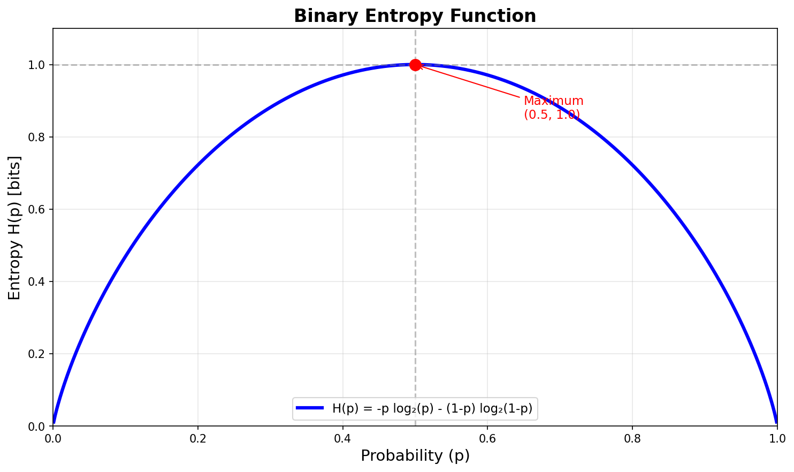
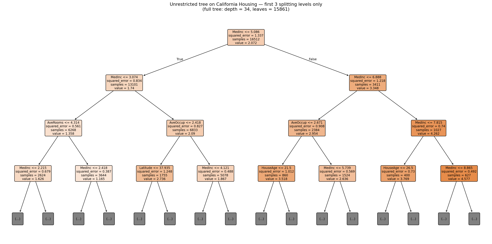
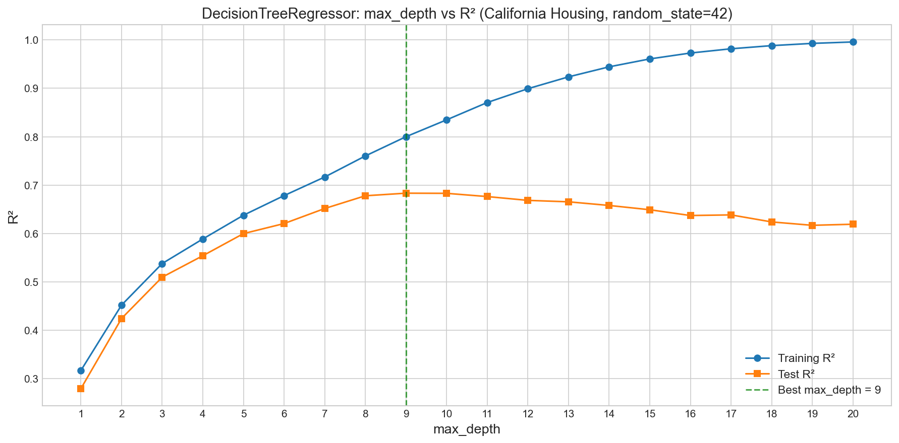
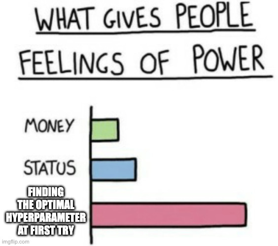
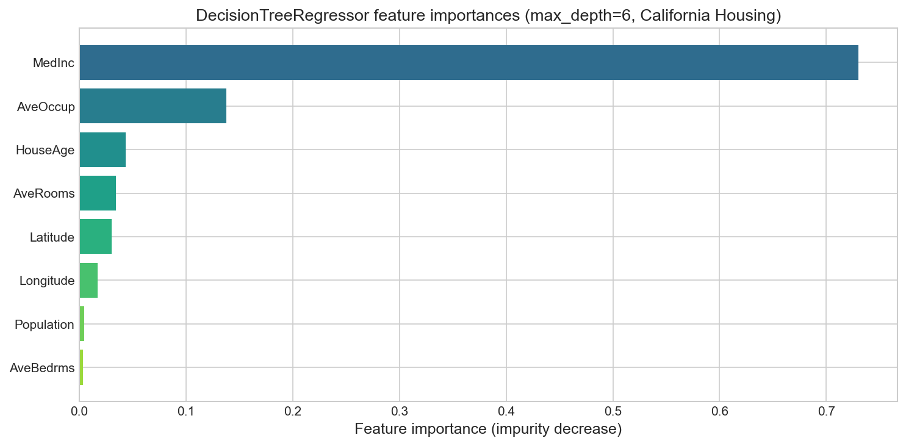

# YZM2011

## Introduction to Machine Learning

### Week 7: Decision Trees and Information Theory

**Instructor:** Ekrem Çetinkaya
**Date:** 07.04.2026

---

# Today's Agenda

<div class="two-columns">
<div class="column">

## Information Theory

- Self-information and Shannon entropy
- Binary entropy function
- Conditional entropy and mutual information
- KL divergence and maximum entropy principle
- Information gain as splitting criterion

</div>
<div class="column">

## Decision Trees

- ID3, C4.5, and CART algorithms
- Splitting criteria: entropy vs Gini impurity
- Handling categorical and continuous features
- Overfitting and pruning strategies
- Regression trees and feature importance

</div>
</div>

---

# From Linear to Trees

Today we'll continue with the California Housing dataset from Week 6, but instead of linear models, we'll build decision trees that can capture non-linear patterns.

- We'll start with the fundamental question: **how do we measure uncertainty and information?**
- This mathematical foundation from information theory will lead us to powerful tree-based algorithms that can outperform linear models on complex datasets.

```python
from sklearn.datasets import fetch_california_housing
from sklearn.model_selection import train_test_split
from sklearn.preprocessing import StandardScaler

data = fetch_california_housing()
X, y = data.data, data.target
feature_names = list(data.feature_names)
X_train, X_test, y_train, y_test = train_test_split(X, y, test_size=0.2, random_state=42)
```

---

# Week 6 Recap - Best Linear Model

Last week, we found that **Ridge** regression gave us our best linear model on the California Housing dataset. But linear models have fundamental limitations as they assume relationships are linear combinations of features.

- What if the housing market has more complex patterns?
- What if location matters differently in different price ranges?

```python
from sklearn.linear_model import Ridge
from sklearn.metrics import r2_score

ridge = Ridge(alpha=1.0)
ridge.fit(X_train, y_train)
y_pred = ridge.predict(X_test)
ridge_r2 = r2_score(y_test, y_pred)
print(f"Ridge R² = {ridge_r2:.3f}")  # ≈ 0.580
```

**Ridge R² ≈ 0.580** - Can we do better with decision trees?

---

# Information Theory


Information theory provides the mathematical foundation for decision trees by answering a fundamental question:

- Given a dataset, what's the best way to _split it to gain maximum information about the target variable?_

Consider this intuitive example:

- If you're trying to guess someone's income and can ask one question, would you rather know their education level or their shoe size?

Information theory tells us exactly how to quantify which question reduces uncertainty the most.

---

# Self-Information - The Surprise Factor

The information content of an event is inversely related to its probability, meaning **rare events carry more information** than common ones.

- If someone tells you _the sun rose this morning_, you learn almost nothing. But **I won the lottery** carries enormous information precisely because it's so unlikely.
- Formally, Information should be
  - Zero for a certain event ($P=1$)
  - Increase as probability decreases
  - Be additive for independent events

**Definition:** The self-information of an event $x$ with probability $P(x)$:

$$I(x) = -\log_2 P(x) \text{ bits}$$

**Why log base 2?** It gives us _bits_, the natural unit of binary information.

- An event with probability $\frac{1}{2^k}$ carries exactly $k$ bits, matching the $k$ binary questions you'd need to locate it.

**Examples:**

- Fair coin heads: $I = -\log_2(0.5) = 1$ bit - one binary question suffices
- Rolling a 6 on a fair die: $I = -\log_2(1/6) \approx 2.58$ bits - more surprising, more informative
- Biased coin (90% heads): $I_{heads} = -\log_2(0.9) = 0.15$ bits, $I_{tails} = -\log_2(0.1) = 3.32$ bits

---

# Shannon Entropy - Average Uncertainty

While self-information measures the information in a specific outcome, entropy measures the **expected (average) self-information** across all possible outcomes - a single number summarising the overall unpredictability of a distribution.

- It answers: _"On average, how many bits do I need to encode outcomes from this distribution?"_
- The higher the entropy, the more unpredictable the distribution and the more bits an optimal encoder must use.
- Entropy is also a lower bound on compression:
  - No lossless scheme can compress a source below its entropy rate.

**Shannon Entropy:**
$$H(X) = \mathbb{E}[I(X)] = -\sum_{i=1}^{n} P(x_i) \log_2 P(x_i) \text{ bits}$$

**Key Properties:**

- $H(X) \geq 0$ (uncertainty is never negative; $0 \log 0$ is defined as $0$)
- $H(X) = 0$ when one outcome has probability 1 (complete certainty - no questions needed)
- $H(X)$ is maximized when all outcomes are equally likely (uniform distribution is the hardest to predict)
- For $n$ outcomes: $0 \leq H(X) \leq \log_2 n$

---

# Binary Entropy Function



---

# Binary Entropy Calculation

For a binary variable with probability $p$ for one class and $(1-p)$ for the other, entropy has a closed form that is central to decision tree splitting criteria. It directly measures how _mixed_ a node's class labels are.

**Binary Entropy:**
$$H(p) = -p \log_2(p) - (1-p) \log_2(1-p)$$

**Important Values:**

- $H(0) = H(1) = 0$ - pure node, all labels identical, no split needed
- $H(0.5) = 1$ - maximally impure node, labels are 50/50
- Symmetric around $p = 0.5$ - it doesn't matter which class is "positive"

---

# Maximum Entropy Principle

The maximum entropy principle states that among all probability distributions that satisfy given constraints, **the one with maximum entropy is the most unbiased** choice - it makes no assumptions beyond what the data tells us.

- Intuitively, it is the statistical version of _Occam's Razor_: choose the distribution that encodes the known constraints but otherwise stays as uncommitted as possible.
- This principle appears in uniform priors in Bayesian methods, Gaussian distributions for continuous variables, Boltzmann distributions in statistical physics, and the preference for balanced splits in decision trees.

**Connection to decision trees:** A dataset node at maximum entropy ($p \approx 0.5$) is telling us it currently knows _nothing_ about the correct label.

- Every split we make aims to reduce entropy in child nodes, moving from ignorance toward certainty.
- The best split is the one that causes the largest total entropy reduction, what _Information Gain_ measures.

---

# Conditional Entropy and Dependencies

Conditional entropy measures the remaining uncertainty about variable $Y$ after observing variable $X$.

- It's the starting point of information gain as knowing one variable can only reduce (never increase) our uncertainty about another.
- Perfect correlation gives zero conditional entropy as independence gives conditional entropy equal to marginal entropy.

**Conditional Entropy:**
$$H(Y|X) = \sum_{x} P(x) \cdot H(Y|X=x) = -\sum_{x,y} P(x,y) \log_2 P(y|x)$$

**Key Properties:**

- $H(Y|X) \leq H(Y)$ (knowing $X$ can only reduce uncertainty)
- $H(Y|X) = H(Y)$ when $X$ and $Y$ are independent
- $H(Y|X) = 0$ when $X$ completely determines $Y$

---

# Information Gain - The Decision Tree Foundation

Information gain is simply the reduction in entropy achieved by conditioning on a feature.

- It measures how much knowing the value of feature $X$ reduces our uncertainty about the target $Y$.
- This is exactly what we want for decision tree splits: choose the feature that tells us the most about the target variable.

**Information Gain:**
$$IG(Y,X) = H(Y) - H(Y|X)$$

**Interpretation:** Number of bits saved on average when encoding $Y$ if we know $X$

**Decision Rule:** Choose the feature with maximum information gain for splitting

---

# KL Divergence and Mutual Information

KL divergence measures how different two probability distributions are, providing the mathematical bridge between information theory and maximum likelihood estimation.

- Mutual information quantifies the amount of information shared between two variables
- Equal to information gain in decision trees.

**KL Divergence:**
$$KL(p||q) = -\int p(x) \ln \frac{q(x)}{p(x)} dx$$

**Mutual Information:**
$$I[X,Y] = KL(p(x,y)||p(x)p(y)) = H[Y] - H[Y|X]$$

**Key Insight:** Information Gain = Mutual Information = $I[Y;X]$

---

# Gini Impurity - An Alternative Measure

While entropy measures uncertainty through information theory, Gini impurity takes a more direct approach

- It measures the probability of **misclassifying** a randomly chosen element.
- Both metrics achieve the same goal but Gini is computationally faster since it avoids logarithms.

**Gini Impurity:**
$$Gini(S) = 1 - \sum_{i=1}^{c} p_i^2$$

where $p_i$ is the proportion of class $i$ in set $S$

**Properties:**

- $Gini(S) = 0$ for pure nodes (all examples same class)
- $Gini(S) = 0.5$ for binary classification with equal split
- Generally produces similar trees to entropy-based splitting

---

# Simple Tennis Example

Let's work through a concrete example to see information gain in action.

- The dataset shows how decision trees choose splits by calculating information gain for each feature and selecting the one that reduces entropy the most.

**Dataset:** 14 examples, binary target (Play Tennis: Yes/No)

| Outlook  | Temp | Humidity | Windy | Play |
| -------- | ---- | -------- | ----- | ---- |
| Sunny    | Hot  | High     | False | No   |
| Sunny    | Hot  | High     | True  | No   |
| Overcast | Hot  | High     | False | Yes  |
| Rain     | Mild | High     | False | Yes  |
| ...      | ...  | ...      | ...   | ...  |

**Goal:** Calculate $IG(Play, Outlook)$ step by step

---

# Tennis Example - Entropy Calculation

We start by calculating the entropy of our target variable.

- With 9 "Yes" and 5 "No" examples out of 14 total, we can compute the baseline uncertainty that any split must improve upon.

**Step 1: Calculate $H(Play)$**

- $P(Yes) = 9/14$, $P(No) = 5/14$
- $H(Play) = -(9/14)\log_2(9/14) - (5/14)\log_2(5/14)$
- $H(Play) = 0.940$ bits

**Step 2: Calculate $H(Play|Outlook)$ for each outlook value:**

- Sunny: 2 Yes, 3 No -> $H = 0.971$
- Overcast: 4 Yes, 0 No -> $H = 0$
- Rain: 3 Yes, 2 No -> $H = 0.971$

---

# Tennis Example - Information Gain

Now we can compute the weighted average conditional entropy and subtract it from the original entropy to get information gain and to find how many bits of uncertainty we eliminate by knowing the Outlook.

**Step 3: Weighted conditional entropy**
$$H(Play|Outlook) = \frac{5}{14}(0.971) + \frac{4}{14}(0) + \frac{5}{14}(0.971) = 0.693$$

**Step 4: Information gain**
$$IG(Play, Outlook) = H(Play) - H(Play|Outlook) = 0.940 - 0.693 = 0.247 \text{ bits}$$

**Interpretation:** Knowing the Outlook reduces our uncertainty about playing tennis by 0.247 bits on average.

- We compare this to other features to find the best split

---

# From One Split to a Full Tree

The tennis example answered a _local_ question: “If we split on **Outlook**, how much does uncertainty about **Play** drop?”

Building a **decision tree** repeats that same idea at **every** level of the hierarchy.

- **One feature at a time:** Information gain picks the best split _among features still available_ for the examples that reached the current node.
- **Many nodes:** After we split (e.g. on Outlook), each child subset becomes smaller.
  - We compute entropy and information gain **again** on that subset, using **remaining** features
  - We do not reuse a feature we already used on the path from the root.
- **End result:** A nested sequence of questions: “Outlook?” -> “Humidity?” -> … until we are confident enough to output **Yes** or **No** at a leaf.

**Information gain is the local rule; the tree is the global structure built by applying that rule recursively.**

---

# Decision Trees

A **decision tree** is a model that represents a prediction rule as a **tree of tests** on input features.

- It is easy to read as a chain of _if–then_ rules and matches how people often reason about cases.

- **Partitioning:** Each internal node sends examples down different branches according to a feature’s value. Geometrically (for discrete features), this **carves** the training set into purer and purer subsets until we stop at leaves.
- **Greedy local choices:** At each node we only ask “_which single split helps **now**?_”
  - We do not search all possible full trees which keeps training tractable but means the tree is **not guaranteed** globally optimal.
- **Supervised:** The target (class or number) is used to compute impurity (entropy, Gini, etc.) and thus to score candidate splits.

Trees provide a strong baseline, handles mixed feature types with the right split rules, and the learned policy is often **interpretable** (you can trace why one example was classified a certain way).

---

# Structure of a Decision Tree


Think of the tree as a **flowchart** from inputs to a prediction.

- **Root node:** The first question asked for **every** new example.
  - In _ID3-style_ (spoiler alert) algorithms it is the feature with **highest information gain** on the **full** training set (subject to available features).
- **Internal nodes:** Each holds one feature test. The examples that reached this node are split by that feature’s value.
  - Each outgoing edge is one possible value (or bin for discretized/threshold splits).
- **Branches:** Labeled by the outcome of the test (e.g. Sunny / Overcast / Rain). Following a path is like answering a sequence of questions in order.
- **Leaf nodes:** Nodes with no further split.
  - Here we output a **prediction**.

**Depth:** Long paths mean many tests; shallow trees are simpler but may underfit if they stop too early.

---

# How to Train a Decision Tree

Training is **growing** the tree from the data.

- We need to decide which question to ask at each node and what prediction to store at each leaf.
- No separate weight updates like in gradient descent is needed as the tree **is** the model.

**Inputs:** Labeled examples $(x_i, y_i)$, a set of candidate features, and a **splitting criterion** (e.g., **information gain** from entropy).

**Procedure:**

1. **Start** with all training examples at the **root**.
2. **Score splits:** For each allowed feature, measure how much the criterion improves if we split the current node’s examples by that feature’s values (e.g. weighted drop in entropy).
3. **Choose** the feature with the **best** score and create one **child** per distinct value.
4. **Partition** examples where each child receives only the rows that match its branch.
5. **Recurse** on each child with the **remaining** features (try not to reuse the same feature on the same root-to-leaf path).
6. **Stop** splitting a node when it is **pure** (one class only), when **no features** are left (then use **majority** class at a leaf), or when other **limits** apply (max depth, min samples, etc.).

---

# Making a Prediction

Inference is a **single root-to-leaf walk** as we do not need a iterative optimization at test time.

1. Start at the **root** with your example’s feature vector.
2. Read the feature named at the current node; follow the **branch** that matches this example’s value for that feature.
3. Repeat at the next node until you reach a **leaf**.
4. Return that leaf’s prediction (e.g. majority class among training examples that landed there, or the stored label).

**Same complexity as tree depth:** Prediction cost is $O(\text{depth})$, which is attractive for large datasets when the tree is not huge.

---

# How This Ties Back to Information Gain

At the root we compared $IG(\text{Play}, \text{Outlook})$, $IG(\text{Play}, \text{Temp})$, … and would pick the feature with largest gain. That feature becomes the **root test**.

- Under each branch, the class distribution changes and we recompute **entropy of the target** on that subset and information gain for **other** features not yet used on this path.
- If a subset is **pure** (all same class), we stop splitting and make a leaf.
- If we run out of features but the subset is still mixed, we typically predict the **majority class** (or a distribution) at a leaf.

---

# ID3 Algorithm - The Foundation

ID3 (Iterative Dichotomiser 3), introduced by Ross Quinlan in 1986, was among the first widely used algorithms that turned information gain into a concrete tree-learning procedure.

- It grows the tree **top-down** (from root to leaves): at each new node it only looks at the data and features relevant to that node.

**Core ideas:**

- **Splitting criterion:** Maximize **information gain** (equivalently minimize weighted conditional entropy after the split).
- **Greedy:** Choose the **best next split** at each step; do not backtrack to rearrange earlier nodes.
- **Recursive:** After splitting on feature $A$, run the same procedure independently on each subset of examples with a fixed value of $A$, with $A$ removed from the feature set for descendants.

**Limitations**

- Categorical features and discrete splits as stated
- No built-in handling of missing values
- **No pruning**, trees can grow until pure leaves and **overfit** noisy data.

---

# ID3 Step-by-Step

Given a set of labeled examples and a list of candidate features:

1. **Base case - pure node:** If every example in the current set has the **same** class, return a leaf predicting that class.
2. **Base case - no features left:** If no features remain but the set is still mixed, return a leaf with the **majority** class (or a default).
3. **Otherwise:** Compute **information gain** for each remaining feature with respect to the target on the **current** set of examples.
4. Choose the feature with **maximum** information gain as the split for this node.
5. For **each** value of that feature, collect the subset of examples with that value; **recursively** build a subtree for that subset, passing the **remaining** features (excluding the one just used).
6. Attach each subtree to the corresponding branch and return the node.

**Output:** A tree where every internal node is a feature test and every leaf is a class prediction (or majority vote).

---

# ID3 Implementation Steps

```python
def ID3(examples, features, target_attr):
    # Base cases
    if all_same_class(examples):
        return majority_class(examples)
    if not features:
        return majority_class(examples)

    # Find best feature
    gains = [information_gain(examples, f, target_attr) for f in features]
    best_feature = features[np.argmax(gains)]

    # Create tree
    tree = {best_feature: {}}
    for value in feature_values(best_feature):
        subset = examples[examples[best_feature] == value]
        remaining_features = [f for f in features if f != best_feature]
        tree[best_feature][value] = ID3(subset, remaining_features, target_attr)

    return tree
```

---

# C4.5 - Improving on ID3

By the early 1990s, practitioners had discovered a fundamental flaw in ID3's splitting criterion:

- **Information gain has an inherent bias toward features with many values**.
  - This creates a serious problem in real-world datasets where some features naturally have high cardinality.
  - **Example:** Imagine a feature like _CustomerID_ which is unique for each record.
    - If you split on this feature, every example gets its own branch or leaf, resulting in zero entropy (perfectly pure leaves), which maximizes information gain.
    - However, the tree is just memorizing the data, not learning general patterns, leading to extreme overfitting.
    - In contrast, a more meaningful and general feature (like _Region_ with a few categories) might be skipped by the algorithm, even if it truly relates to the target, because it can't create as many pure splits.

---

# C4.5 - Improving on ID3

C4.5, also by Quinlan (1993), addressed this critical limitation while maintaining the algorithmic strength that made ID3 so powerful.

The core insight is that a feature like _CustomerID_ will always achieve perfect information gain but such a tree learns nothing generalizable about the underlying patterns.

- C4.5 solves this by normalizing information gain with the feature's **intrinsic information**, which measures how much the feature **wants** to split the data regardless of the target variable.

**Gain Ratio Formula:**
$$GainRatio(S,A) = \frac{IG(S,A)}{SplitInfo(S,A)}$$

where the **split information** _penalizes_ features that create many small subsets:
$$SplitInfo(S,A) = -\sum_{i=1}^{v} \frac{|S_i|}{|S|} \log_2 \frac{|S_i|}{|S|}$$

Split information is simply the **entropy of the data distribution across the feature's values**, treating the feature itself as if it were the target.

- A feature that splits the data into many small pieces has high split information and thus gets penalized in the gain ratio calculation.

---

# Gain Ratio vs Information Gain

Consider predicting whether someone will buy a house, and you have two features: **"Season"** (Spring, Summer, Fall, Winter) and **"Day of Year"** (1, 2, ..., 365).

Imagine we have 1000 examples uniformly distributed across the year.

- Information gain will heavily favor **Day of Year** because with 1000 examples spread across 365 days, most days have only 2-3 examples, creating very pure (often single-class) subsets.
- Even if season is the truly relevant feature for house buying decisions, information gain might choose _Day 237_ as the root split simply because it creates smaller, purer subsets.

---

# Gain Ratio vs Information Gain

For **Season** with 4 values:

- $SplitInfo_{Season} = -4 \times \frac{250}{1000} \log_2 \frac{250}{1000} = 2.0$ bits

For **Day of Year** with 365 values:

- $SplitInfo_{Day} \approx 8.5$ bits (much higher)

If both features achieve similar information gain (say, 0.3 bits), their gain ratios become:

- $GainRatio_{Season} = \frac{0.3}{2.0} = 0.15$
- $GainRatio_{Day} = \frac{0.3}{8.5} = 0.035$

Now **Season** correctly wins the comparison, as it should. Gain ratio prevents the algorithm from choosing overly specific features that split the data into many tiny, unreliable subsets.

---

# CART - Classification and Regression Trees

While ID3 and C4.5 create multi-way splits (one branch per feature value), CART takes a fundamentally different approach by restricting every internal node to exactly **two** branches.

- This design choice, introduced by Breiman et al. (1984), brings several advantages that make CART the foundation for most modern decision tree implementations.

**Why Binary Splits?**

Multi-way splits can fragment the data too quickly, especially for categorical features with many values.

- Consider a feature _Country_ with 50 possible values. A 50-way split at the root would create 50 child nodes, each with only 2% of the original data.
- Binary splits force a more balanced partitioning by grouping feature values into two meaningful subsets.

For **continuous features**, this binary approach is natural:

- $x \leq threshold$ versus $x > threshold$.

---

# CART - Classification and Regression Trees

For **categorical features**, CART finds the optimal way to partition values into two groups by testing all possible binary divisions.

**Gini Impurity** replaces entropy as the splitting criterion.

- While entropy measures uncertainty through information theory, Gini has a more direct interpretation:
- It's the probability of **misclassifying** a randomly chosen sample if we predict its class by randomly picking from the class distribution in the current node.

$$Gini(S) = 1 - \sum_{i=1}^{c} p_i^2 = \sum_{i=1}^{c} p_i(1-p_i)$$

This second form shows that Gini measures the expected error rate of a random classifier.

- For binary classification with probability $p$ for class 1, we get $Gini = 2p(1-p)$, which peaks at $p = 0.5$ (maximum uncertainty) and reaches zero for pure nodes.

---

# CART Algorithm Features

**Surrogate Splits:** When the primary splitting feature has missing values, CART automatically finds backup features that create similar data partitions.

- For example, if we split on _Income > 50K_ but income is missing for some samples, CART might use _Education = College_ as a surrogate that tends to correlate with high income. This allows prediction even when key features are missing.

**Cost-Complexity Pruning:** Instead of arbitrary stopping criteria, CART uses a principled approach that balances prediction accuracy against tree size.

- The algorithm builds a full tree, then systematically removes branches based on a complexity parameter $\alpha$.
- Cross-validation determines the optimal $\alpha$ value, giving us the tree that generalizes best rather than just fits best.

**Unified Framework:** CART handles both classification and regression with the same algorithmic structure.

- For classification, it minimizes Gini impurity
- For regression, it minimizes mean squared error (MSE).

**Daily Life:** These features make CART the algorithm underlying scikit-learn's `DecisionTreeClassifier` and `DecisionTreeRegressor`.

- When you import these classes, you're using descendants of Breiman's original CART ideas from 1984.

---

# Algorithm Comparison Table

**Historically**

- ID3 established the **foundation** with information gain
- C4.5 fixed the **bias problems** and added practical features
- CART introduced the **binary-split paradigm** that dominates modern implementations.

| Feature                 | ID3              | C4.5       | CART            |
| ----------------------- | ---------------- | ---------- | --------------- |
| **Splitting criterion** | Information Gain | Gain Ratio | Gini Index      |
| **Split type**          | Multi-way        | Multi-way  | Binary          |
| **Continuous features** | No               | Yes        | Yes             |
| **Missing values**      | No               | Yes        | Yes             |
| **Pruning**             | No               | Yes        | Yes             |
| **Regression**          | No               | No         | Yes             |
| **Implementation**      | Historical       | Historical | sklearn default |

---

# Our First Decision Tree

Now it's time to see decision trees in action on our California Housing dataset.

- Unlike linear regression, which assumes housing prices change smoothly with each feature, decision trees can capture **non-linear relationships** and **feature interactions** automatically.
- For instance, perhaps the effect of median income on housing prices differs dramatically between coastal and inland areas. A tree can learn this without us explicitly engineering interaction features.

Housing markets are inherently non-linear: there might be **price tiers** where a small increase in income leads to dramatically different housing options, or **geographic thresholds** where crossing certain latitude/longitude boundaries changes the price dynamics entirely.

- Decision trees are designed to find exactly these kinds of conditional rules.

---

# Our First Decision Tree

Let's start with a completely unrestricted tree and see what happens.

```python
from sklearn.tree import DecisionTreeRegressor

# Basic decision tree (no restrictions!)
tree = DecisionTreeRegressor(random_state=42)
tree.fit(X_train, y_train)

y_pred_tree = tree.predict(X_test)
tree_r2 = r2_score(y_test, y_pred_tree)

print(f"Ridge R² = {ridge_r2:.3f}")  # Our best linear model
print(f"Tree R²  = {tree_r2:.3f}")   # Unrestricted tree
# Ridge R² = 0.580
# Tree R²  = 0.624

# Let's peek at what the tree learned
print(f"Tree depth: {tree.get_depth()}")
print(f"Number of leaves: {tree.get_n_leaves()}")
# Tree depth: 38 (very deep!)
# Number of leaves: 4184 (one for every few examples!)
```

---

# Our First Decision Tree - What it looks like



---

# Our First Decision Tree - What it looks like

The full fitted tree has far too many nodes to draw legibly. We can still visualize the **same** model by limiting depth to show only the first few splitting levels (root plus three layers of splits).

- Node color reflects the predicted value in each region
- Labels show the split rule, MSE (`squared_error`), sample count `n`, and leaf value.

```python
import matplotlib.pyplot as plt
from sklearn.tree import plot_tree

# `tree` is the unrestricted DecisionTreeRegressor fitted above;
# `feature_names` comes from California Housing (list of column names).
fig, ax = plt.subplots(figsize=(20, 10))
plot_tree(
    tree,
    max_depth=3,
    feature_names=feature_names,
    filled=True,
    rounded=True,
    fontsize=9,
    ax=ax,
)
plt.tight_layout()
plt.show()  # or: plt.savefig("first-decision-tree-top-levels.png", dpi=150, bbox_inches="tight")
```

---

# The Overfitting Problem

Even with this simple approach, the tree outperforms our carefully tuned Ridge regression.

- The tree found patterns in the California Housing data that linear models simply cannot capture.
- But notice the tree's structure it's extremely deep with thousands of leaves. This suggests we might be **overfitting**.

An unrestricted decision tree can grow until it has one leaf per training example, achieving perfect memorization of the training set.

- This is fundamentally different from linear models, which are **constrained** by their functional form and cannot overfit as dramatically.

**The Mathematical Problem:** With 16,512 training examples and 8 features, a tree of depth 38 can create $2^{38}$ possible leaves, far more than our sample size.

- In the extreme case, the tree creates a unique **leaf for every training example**, storing the exact target value.
- This gives the tree more **free parameters** than data points, guaranteeing perfect training fit but poor generalization.

Instead of learning that "_houses in areas with median income above $5k tend to cost more,_" the tree might learn that "_the house at coordinates (34.12, -118.3) with income 5.1k costs exactly $3.2M._" The first rule generalizes; the second is pure memorization.

---

# The Overfitting Problem

```python
# The truth about training performance
train_pred = tree.predict(X_train)
train_r2 = r2_score(y_train, train_pred)

print(f"Training R²: {train_r2:.3f}")  # 1.000 - Perfect!
print(f"Test R²:     {tree_r2:.3f}")   # 0.624 - Good but not perfect

# Tree structure reveals the problem
print(f"Tree depth: {tree.get_depth()}")        # 38 levels deep
print(f"Number of leaves: {tree.get_n_leaves()}") # 4,184 leaves
print(f"Training samples: {len(X_train)}")       # 16,512 samples
print(f"Samples per leaf: {len(X_train) / tree.get_n_leaves():.1f}")  # ~4 samples per leaf
```

Perfect training performance (R² = 1.000) with decent but not perfect test performance indicates classic overfitting.

- The tree has learned the training data literally, rather than finding generalizable patterns.
- With only ~4 training samples per leaf on average, most leaves represent tiny, unreliable patterns that don't generalize to new data.

---

# Pruning - Controlling Tree Growth


Decision tree pruning comes in two different approaches: **pre-pruning** (early stopping) and **post-pruning** (retrospective removal).

- Both aim to find the sweet spot between **underfitting** (tree too simple to capture patterns) and **overfitting** (tree too complex to generalize).

---

# Pruning - Controlling Tree Growth


**Pre-pruning** sets rules that halt tree growth during construction. Think of these as _stopping criteria_ that prevent the algorithm from creating overly specific splits:

- `max_depth=6`: Stop growing after 6 levels. Simple but crude - some branches might need depth 3 while others need depth 10.
- `min_samples_split=20`: "Don't split a node unless it has at least 20 examples." This prevents splits based on tiny, unreliable sample sizes.
- `min_samples_leaf=5`: "If a proposed split would create a leaf with fewer than 5 examples, refuse the split." Those 5 examples are too few to represent a reliable pattern.
- `min_impurity_decrease=0.01`: "Only split if you can reduce impurity by at least 0.01." This prevents the tree from making splits that provide minimal information gain.

---

# Pruning - Controlling Tree Growth


**Post-pruning** builds the full tree first, then systematically removes branches that don't improve generalization.

- This can find globally better solutions because it sees the whole tree structure before deciding what to remove, but it's computationally more expensive since we must grow the full tree first.

---

# Finding the Right Tree Complexity

We can use **empirical validation** to find the optimal complexity.

- Systematically test different maximum depths and observe where test performance peaks.
- Hyperparameter tuning.

We're looking for the **Goldilocks depth**

- Not too shallow (underfitting), not too deep (overfitting), but just right for capturing the true patterns in data.
- This optimal depth will typically show **plateau behavior** in training accuracy while **test accuracy peaks** and then begins to decline.

---

# Finding the Right Tree Complexity

```python
import numpy as np
import matplotlib.pyplot as plt
from sklearn.tree import DecisionTreeRegressor

depths = range(1, 21)
train_scores, test_scores = [], []

for depth in depths:
    tree = DecisionTreeRegressor(max_depth=depth, random_state=42)
    tree.fit(X_train, y_train)

    train_scores.append(tree.score(X_train, y_train))
    test_scores.append(tree.score(X_test, y_test))

plt.plot(depths, train_scores, "o-", label="Training")
plt.plot(depths, test_scores, "s-", label="Test")
plt.xlabel("Max Depth")
plt.ylabel("R² Score")
plt.legend()

# Find the optimal depth
optimal_depth = list(depths)[np.argmax(test_scores)]
best_test_score = max(test_scores)
print(f"Optimal depth: {optimal_depth}")  # Often in a mid-depth band (e.g. ~6–10)
print(f"Best test R²: {best_test_score:.3f}")
```

---

# Finding the Right Tree Complexity



---

# Finding the Right Tree Complexity

Training R² rises as `max_depth` increases (deeper trees fit the training set better).

- Test R² climbs to a **peak** then **drops**, overfitting past the sweet spot.
- The **vertical gap** between the curves is how much the tree has specialized to training data instead of learning patterns that generalize.
- The dashed line marks the `max_depth` with best test R² for this split (exact value can shift slightly with sklearn / dataset version).

---

# Optimal Tree Performance



**Depth-limited trees significantly outperform both unlimited trees and linear models**.

- More complex models aren't always better models.
- The optimal tree represents the sweet spot where we've captured the important non-linear patterns in California housing data without overfitting to training noise.

```python
# Optimal tree (depth=6 gives best test performance)
tree_opt = DecisionTreeRegressor(max_depth=6, random_state=42)
tree_opt.fit(X_train, y_train)

train_r2 = tree_opt.score(X_train, y_train)
test_r2 = tree_opt.score(X_test, y_test)

print("=== MODEL COMPARISON ===")
print(f"Ridge R² (test):     {ridge_r2:.3f}")  # Our best linear model
print(f"Tree R² (train):     {train_r2:.3f}")  # Reasonable gap (not overfitting)
print(f"Tree R² (test):      {test_r2:.3f}")   # Best test performance!
# Ridge R² (test):     0.580
# Tree R² (train):     0.673
# Tree R² (test):      0.659
```

---

# Feature Importance Analysis

One of decision trees' advantages over linear models is **built-in feature importance analysis**.

- While Ridge regression gives us coefficients that are difficult to interpret (especially after regularization), trees directly tell us which features contribute most to their decisions.
- This reflects how much each feature actually **improves prediction accuracy** when used in splits.

**How Tree Feature Importance Works:** Each time a feature is used to split a node, we record how much that split reduces impurity (MSE for regression).

- Features that create large impurity reductions across many splits get high importance scores.
- Features that never get selected for splits get zero importance.
- This is a measure of **predictive utility**, not just statistical correlation.

---

# Feature Importance Analysis

```python
# Feature importance from the optimized tree
feature_importance = tree_opt.feature_importances_
feature_names = ['MedInc', 'HouseAge', 'AveRooms', 'AveBedrms',
                'Population', 'AveOccup', 'Latitude', 'Longitude']

print("=== FEATURE IMPORTANCE ANALYSIS ===")
importance_pairs = list(zip(feature_names, feature_importance))
importance_pairs.sort(key=lambda x: x[1], reverse=True)

for i, (name, importance) in enumerate(importance_pairs):
    stars = "★" * int(importance * 20)  # Visual representation
    print(f"{i+1:2d}. {name:12}: {importance:.3f} {stars}")
```

**Sample output** (California Housing, `tree_opt` with `max_depth=6`, `random_state=42`):

```
=== FEATURE IMPORTANCE ANALYSIS ===
 1. MedInc      : 0.730 ★★★★★★★★★★★★★★
 2. AveOccup    : 0.138 ★★
 3. HouseAge    : 0.044
 4. AveRooms    : 0.034
 5. Latitude    : 0.030
 6. Longitude   : 0.017
 7. Population  : 0.004
 8. AveBedrms   : 0.003
```

---

# Feature Importance Visualization



---

# Feature Importance Analysis

**Results interpretation:**

1. **MedInc (~0.73):** Median income dominates impurity reduction—most informative splits use income thresholds, which matches how housing markets price neighborhoods. (similar to what we found last week)
2. **AveOccup (~0.14):** Average occupancy shows up strongly at this depth; it often acts as a proxy for **unit size / household density** and correlates with property type.
3. **HouseAge, AveRooms, Latitude, Longitude (each a few percent):** Smaller but non-zero contributions. Structure and geography still matter, but this shallow tree leans heavily on income and occupancy first.

**Key insight:** The top three features account for **roughly 90%** of the normalized importance mass here, so the story is still **economic + housing-usage signals first**, with geography and building attributes playing supporting roles—for a deeper or differently regularized tree, the ranking can change.

---

# Visualizing Tree Decisions

Each path from root to leaf represents a concrete rule like "_If median income ≤ 5.04k AND income ≤ 3.54k AND latitude ≤ 34.03, then predict house value = $121k_."

- This interpretability makes decision trees invaluable for domains where you need to **explain your predictions**

```python
from sklearn.tree import export_text

# Export tree rules as text (showing first 3 levels for readability)
tree_rules = export_text(tree_opt, feature_names=feature_names, max_depth=3)
print("=== TREE DECISION RULES (First 3 Levels) ===")
print(tree_rules)
```

**Sample output:**

```
|--- MedInc <= 5.04                     # Root split: Income threshold
|   |--- MedInc <= 3.54                 # Low-income subdivision
|   |   |--- Latitude <= 34.03: 1.21    # Northern low-income areas
|   |   |--- Latitude >  34.03: 1.50    # Southern low-income areas (higher)
|   |--- MedInc >  3.54: 2.15           # Mid-low income areas
|--- MedInc >  5.04                     # Root split: Higher income
|   |--- MedInc <= 7.74: 3.42           # Upper-middle income
|   |--- MedInc >  7.74: 4.98           # High income (luxury market)
```

---

# Regression vs Classification Trees

While we've focused on **regression trees** for predicting continuous house prices, the same algorithmic framework applies to **classification problems** with only minor modifications.

The core tree-growing algorithm (recursive splitting) remains identical - only the **purity measure** and **leaf predictions** change between variants.

**Classification Trees:**

- **Purity measure:** Gini impurity or entropy (discrete class distributions)
- **Splitting goal:** Find features that separate different classes most cleanly
- **Leaf prediction:** Majority class among training examples that reach this leaf
- **Example:** Predict "Apartment" vs "House" vs "Condo" based on location and price features

**Regression Trees:**

- **Purity measure:** Mean Squared Error (continuous target variance)
- **Splitting goal:** Find features that minimize within-group variance of the target
- **Leaf prediction:** Mean (or median) of target values for training examples in this leaf
- **Example:** Predict continuous house price (what we've been doing with California Housing)

---

# Advanced Pruning - Cost-Complexity

Cost-complexity pruning (CCP) represents a more sophisticated approach to controlling tree complexity than simple early stopping rules.

- Instead of making local decisions during tree growth, CCP takes a **global perspective**
- Build the full tree first, then systematically prune it to find the optimal balance between accuracy and simplicity.

The key insight is that we can parameterize this tradeoff with a **complexity parameter $\alpha$** that controls how much we penalize tree size.

- Small $\alpha$ values favor complex trees (accuracy-focused)
- Large $\alpha$ values favor simple trees (simplicity-focused).

By varying $\alpha$, we generate a **sequence of nested trees** from most complex to simplest.

---

# Advanced Pruning - Cost-Complexity

**Cost-Complexity Objective:**
$$R_\alpha(T) = R(T) + \alpha |T|$$

where $R(T)$ is the prediction error (MSE for regression) and $|T|$ is the number of leaves. This formulation directly trades off **prediction accuracy** against **model complexity**.

**The Algorithm:**

1. **Build full tree** with $\alpha$ = 0 (no complexity penalty)
2. **Increase α gradually** - at each step, prune branches that don't justify their complexity cost
3. **Cross-validation** determines the optimal $\alpha$ value that minimizes out-of-sample error
4. **Retrain** final tree with chosen $\alpha$ on full training set

This approach finds **globally optimal pruning** rather than the locally optimal choices made by early stopping rules.

---

# Cost-Complexity Pruning

```python
# Generate the cost-complexity pruning path
full_tree = DecisionTreeRegressor(random_state=42)
full_tree.fit(X_train, y_train)
path = full_tree.cost_complexity_pruning_path(X_train, y_train)
ccp_alphas = path.ccp_alphas

print(f"Found {len(ccp_alphas)} different complexity levels")
print(f"Alpha range: {ccp_alphas[0]:.6f} to {ccp_alphas[-2]:.6f}")

# Evaluate each alpha level
train_scores, test_scores, n_leaves = [], [], []
for alpha in ccp_alphas[:-1]:  # Exclude trivial single-node tree
    tree_ccp = DecisionTreeRegressor(ccp_alpha=alpha, random_state=42)
    tree_ccp.fit(X_train, y_train)

    train_scores.append(tree_ccp.score(X_train, y_train))
    test_scores.append(tree_ccp.score(X_test, y_test))
    n_leaves.append(tree_ccp.get_n_leaves())

# Find optimal alpha
optimal_idx = np.argmax(test_scores)
best_alpha = ccp_alphas[optimal_idx]
best_test_score = test_scores[optimal_idx]
optimal_leaves = n_leaves[optimal_idx]

print(f"\nOptimal alpha: {best_alpha:.6f}")
print(f"Best test R²: {best_test_score:.3f}")
print(f"Optimal tree size: {optimal_leaves} leaves")
```

---

# Handling Continuous Features

The evolution from ID3 to C4.5 and CART included solving one of the most practical challenges in decision tree learning: how to handle **continuous features** like income, age, or geographic coordinates.

- The key insight was that for any continuous feature, we only need to consider **binary splits** using thresholds between adjacent values in the training data.

**Why Only Adjacent Thresholds?** Consider feature values [1.2, 1.8, 2.1, 3.5]. A threshold of 1.5 splits the data into {1.2} versus {1.8, 2.1, 3.5}. A threshold of 1.4 would create the same split!

- Any threshold between 1.2 and 1.8 gives identical data partitions.
- Therefore, we only need to test thresholds **halfway between consecutive values**.

**Threshold Selection Algorithm:**

1. **Sort** all feature values: $v_1 \leq v_2 \leq ... \leq v_n$
2. **Generate candidates**: $t_i = \frac{v_i + v_{i+1}}{2}$ for $i = 1, ..., n-1$
3. **Evaluate** each threshold: compute information gain for split $feature \leq t_i$
4. **Select** threshold with maximum information gain

**California Housing Example:** For MedInc feature with 16,512 unique values, we test at most 16,511 possible thresholds, each creating a binary split. The algorithm automatically finds that MedInc ≤ 5.04 provides the best first split for our dataset.

---

# Categorical vs Continuous Splits

One of decision trees' important characteristics is their ability to handle **mixed data types** naturally without preprocessing.

- This contrasts with linear models, which require careful feature encoding and scaling.

**Categorical Features:**

- **ID3/C4.5**: Natural multi-way splits creating one branch per category
  - Example: "Weather" -> {Sunny, Cloudy, Rainy} creates 3 branches
- **CART**: Binary splits grouping categories optimally
  - Example: "Weather" -> {Sunny, Cloudy} vs {Rainy} if this split maximizes information gain
- **No preprocessing needed**: Categories can be strings, integers, or any discrete values

**Continuous Features:**

- **Binary threshold splits**: $x \leq t$ vs $x > t$ for optimal threshold $t$
- **No scaling required**: Unlike linear models, trees are invariant to monotonic transformations
  - Tree splits on "Income ≤ 50k" work the same whether income is in dollars, thousands, or log scale
- **Automatic discretization**: Trees effectively convert continuous variables into categorical rules

**Mixed Data Advantage:** A single tree can split on "Age ≤ 25" (continuous), then "Gender = Female" (categorical), then "Salary ≤ 60k" (continuous) without any feature engineering.

---

# Missing Value Strategies

Real-world datasets contain missing values, and decision trees have strategies to handle them without losing information.

- Unlike many algorithms that require complete data, trees can work directly with missing values through **probabilistic distribution** and **surrogate splits**.

**Naive Approaches:**

- **Exclude samples**: Delete any row with missing values (loses potentially valuable data)
- **Simple imputation**: Replace missing values with mean/mode/median (loses the information that values were missing)

**C4.5's Probabilistic Approach:**
When a feature has missing values, **distribute each incomplete example proportionally** across branches during training.

- If 60% of complete cases go left and 40% go right, send 60% of each incomplete example's "weight" left and 40% right. During prediction, follow the same proportional rule.

**CART's Surrogate Splits:**
For each split, identify **backup features** that create similar data partitions. If the primary split is "_Income ≤ 50k_" but income is missing, use surrogate splits like "_Education = College_" or "_Age ≤ 35_" that correlate with income levels. This allows prediction even when key features are missing.

**Modern Practice:** scikit-learn's trees require complete data for training but can use surrogate-like strategies during inference, making missing value handling a preprocessing decision rather than an algorithmic feature.

---

# Tree Advantages and Limitations

**Advantages:**

- **Interpretability:** Unlike black-box models, we can trace every prediction through human-readable rules
- **No preprocessing:** Trees handle mixed data types, missing values, and different scales without feature engineering
- **Non-linear patterns:** Automatically discovers interactions and threshold effects that linear models miss
- **Computational efficiency:** Fast training and very fast prediction (O(log n) for balanced trees)
- **Built-in feature selection:** Unimportant features simply don't get selected for splits
- **Robust to outliers:** Splits based on ranks rather than exact values, so extreme outliers don't dominate

---

# Tree Limitations and Solutions

**Limitations:**

- **High variance:** Small changes in training data can produce completely different trees with similar performance but different structure
- **Instability:** The greedy splitting algorithm is sensitive to data ordering and can find different locally optimal solutions
- **Overfitting tendency:** Without careful regularization, trees memorize training examples rather than learning generalizable patterns
- **Axis-parallel bias:** Can only split along feature axes, struggling with diagonal decision boundaries (e.g., "x + y > 5" requires many axis-parallel splits)
- **Linear relationship bias:** Trees approximate smooth relationships with step functions, requiring many splits for simple linear patterns
- **Feature interaction complexity:** While trees can capture interactions, they may require exponentially deep trees for complex multi-way interactions

**Solution Preview:**

- **Random Forest**: Reduces variance by averaging multiple trees trained on different data subsets
- **Gradient Boosting**: Reduces bias by sequentially building trees that correct previous errors
- **Ensemble combinations:** Combine trees with linear models to get benefits of both approaches

---

# When to Use Decision Trees

**Use Decision Trees When:**

- **Interpretability is a must:** Medical diagnosis, legal decisions, loan approvals where you must explain the reasoning
- **Mixed data types:** Datasets with both categorical and continuous features without wanting to engineer features
- **Non-linear patterns expected:** When you suspect threshold effects, interaction effects, or step-wise relationships
- **Quick baseline needed:** Trees train fast and provide reasonable performance with minimal tuning
- **Feature interactions likely:** When features combine in complex ways that linear models can't capture
- **Outlier-robust behavior wanted:** Tree splits are based on ordering, not exact values

**Avoid Trees When:**

- **Maximum accuracy is critical:** Single trees rarely achieve state-of-the-art performance
- **Primarily linear relationships:** If relationships are mostly additive and monotonic, linear/logistic regression will be more efficient and stable
- **Very high-dimensional data:** Trees don't scale well to thousands of features (curse of dimensionality in splitting)
- **Small datasets:** With limited data, trees are prone to overfitting (consider regularized linear models)
- **Smooth decision boundaries needed:** Trees create rectangular regions; if true boundaries are diagonal or curved, other methods may be more natural

---

# Comparing All Our Models

```python
from sklearn.linear_model import LinearRegression, Ridge
from sklearn.preprocessing import StandardScaler

# Linear models benefit from scaling; trees split on thresholds and use raw X
scaler = StandardScaler()
X_train_s = scaler.fit_transform(X_train)
X_test_s = scaler.transform(X_test)

models = {
    "Linear": LinearRegression(),
    "Ridge": Ridge(alpha=1.0),
    "Tree": DecisionTreeRegressor(max_depth=6, random_state=42),
}

print("=== COMPREHENSIVE MODEL COMPARISON ===")
results = {}
for name, model in models.items():
    if name == "Tree":
        model.fit(X_train, y_train)
        train_r2 = model.score(X_train, y_train)
        test_r2 = model.score(X_test, y_test)
    else:
        model.fit(X_train_s, y_train)
        train_r2 = model.score(X_train_s, y_train)
        test_r2 = model.score(X_test_s, y_test)
    gap = train_r2 - test_r2
    results[name] = (train_r2, test_r2, gap)
    print(f"{name:8}: Train R²={train_r2:.3f}, Test R²={test_r2:.3f}, Gap={gap:.3f}")
```

---

# Model Performance Comparison

```
Linear  : Train R²=0.613, Test R²=0.576, Gap=0.037
Ridge   : Train R²=0.613, Test R²=0.576, Gap=0.037
Tree    : Train R²=0.678, Test R²=0.621, Gap=0.058
```

**Critical insights:**

- **Highest test R² here is the tree** (~0.62 vs ~0.58 for OLS/Ridge on scaled features).
- **Train–test gap** is **smaller** for linear models (~0.04) than for this tree (~0.06): the tree fits training noise a bit more, but still **generalizes better on test** in this example.

**Algorithm selection lesson:** When relationships involve **thresholds**, **interactions**, or **nonlinear effects**, trees can beat a linear baseline on test error but you should **check the numbers** (and preprocessing) each time.

- Linear models can still win if the signal is mostly linear or if the tree is poorly tuned.

---

# Building Intuition - What Trees Learn

**Linear Model Philosophy:** $price = w_1 \times income + w_2 \times latitude + ... + w_8 \times longitude$

- **Global linearity:** Each feature has the same effect everywhere (income always increases price by $w_1$ per unit)
- **Monotonic relationships:** If income coefficient is positive, more income always means higher prices
- **Additive effects:** Features contribute independently (no interactions)
- **Smooth boundaries:** Small changes in features cause small changes in predictions

**Decision Tree Philosophy:** If-then rules like:

- "If income > 5.0k AND latitude < 34.0 then price = 280k"
- "If income ≤ 3.5k then price = 120k (regardless of other features)"

This creates **localized, conditional patterns**:

- **Non-monotonic:** More rooms might increase price in expensive areas but decrease it in cheap areas (overcrowding signal)
- **Interactive:** Income matters more in certain geographic regions
- **Threshold-based:** There may be discrete "market tiers" where crossing $50k income unlocks entirely different housing options

**California Housing Insight:** Our tree's performance suggests housing markets have these threshold and interaction effects that linear models fundamentally cannot capture.

---

# Tree Decision Boundaries

While we can't visualize 8-dimensional decision boundaries directly, we can understand that decision trees create **rectangular partitions** of feature space.

**Tree Geometry:**

- **Rectangular partitions:** Each sequence of splits creates axis-aligned rectangles in feature space
- **Constant predictions:** Within each rectangle (leaf), the prediction is constant (mean of training examples in that region)
- **Hierarchical structure:** Splits are nested - finer rectangles are subdivisions of coarser ones
- **Axis-parallel constraints:** Trees can only split along feature axes, never diagonally

**Practical Implications:**

- **Excellent for step-wise relationships:** Natural fit for "if income < 50k then..." patterns
- **Struggles with diagonal boundaries:** A simple rule like "x + y > 5" requires many axis-parallel splits to approximate
- **Handles feature interactions naturally:** Can learn "income matters differently by location" through nested splits
- **Approximation power:** With sufficient depth, trees can approximate any decision boundary, but may need exponentially many splits for smooth boundaries

**California Housing Example:** Tree creates regions like "low income + northern CA" and "high income + coastal CA" - natural market segments that rectangular partitioning captures well.

---

# Hyperparameter Tuning for Trees

Systematic hyperparameter tuning is especially important for decision trees because of their high variance.

- Small changes in regularization can dramatically affect both performance and tree structure.
- Unlike linear models where regularization mainly affects coefficient magnitude, tree regularization changes the entire learned structure.

```python
from sklearn.model_selection import GridSearchCV

# Comprehensive hyperparameter grid
param_grid = {
    'max_depth': [3, 5, 7, 10, 15],
    'min_samples_split': [2, 5, 10, 20],
    'min_samples_leaf': [1, 2, 5, 10],
    'ccp_alpha': [0.0, 0.01, 0.02, 0.05]
}

tree_cv = GridSearchCV(
    DecisionTreeRegressor(random_state=42),
    param_grid,
    cv=5,
    scoring='r2',
    n_jobs=-1  # Parallel processing
)

tree_cv.fit(X_train, y_train)
print(f"Best parameters: {tree_cv.best_params_}")
```

---

# Cross-Validation with Trees

Cross-validation is **especially critical** for decision trees due to their **high variance** property.

- The same tree algorithm applied to slightly different training sets can produce dramatically different tree structures, even when final performance is similar.

```python
from sklearn.model_selection import cross_val_score

# 5-fold cross-validation to assess tree stability
cv_scores = cross_val_score(
    DecisionTreeRegressor(max_depth=6, random_state=42),
    X_train, y_train, cv=5, scoring='r2'
)

print("=== CROSS-VALIDATION ANALYSIS ===")
print(f"CV scores: {cv_scores}")
print(f"CV mean: {cv_scores.mean():.3f} (+/- {cv_scores.std() * 2:.3f})")
```

---

# Information Theory Applications

The information theory concepts we've learned extend far beyond decision trees and represent fundamental tools throughout machine learning, computer science, and data science.

**Broader Applications:**

- **Feature selection:** Mutual information between features and targets identifies the most informative features for any ML algorithm
- **Neural networks:** Cross-entropy loss functions are directly derived from information theory principles we've covered
- **Bayesian methods:** KL divergence appears in variational inference, measuring how well approximate distributions match true posteriors
- **Data compression:** Huffman coding and other compression algorithms use entropy to determine optimal bit allocations
- **Communication systems:** Channel capacity and error-correcting codes rely on information theory foundations
- **Anomaly detection:** Outliers have high self-information (low probability), making information content a natural anomaly score

Information theory provides the mathematical language for talking about **uncertainty**, **learning**, and **optimization**.

---

<!-- _header: "" -->
<!-- _footer: "" -->
<!-- _paginate: false -->

<!-- _class: lead -->

# Thank You!

## Contact Information

- **Email:** ekrem.cetinkaya@yildiz.edu.tr
- **Office Hours:** Wednesday 13:30-15:30 - Room C-120
- **Book a slot before coming:** [Booking Link](https://calendar.app.google/fog6DPBGJH2QpHVw8)
- **Course Repository:** [GitHub](https://github.com/ekremcet/yzm2011-introduction-to-machine-learning)
