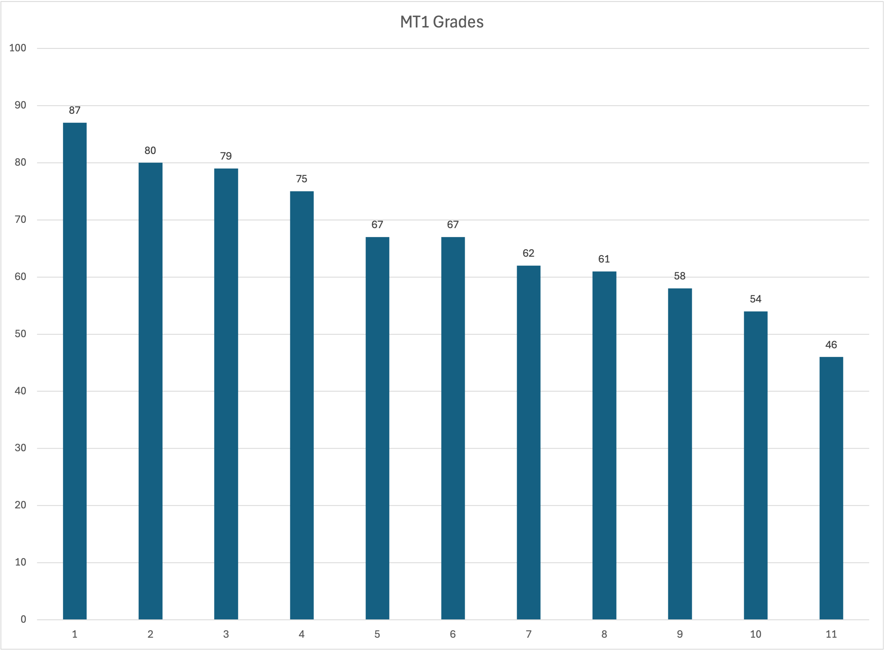
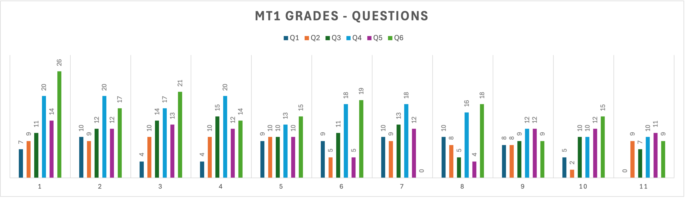
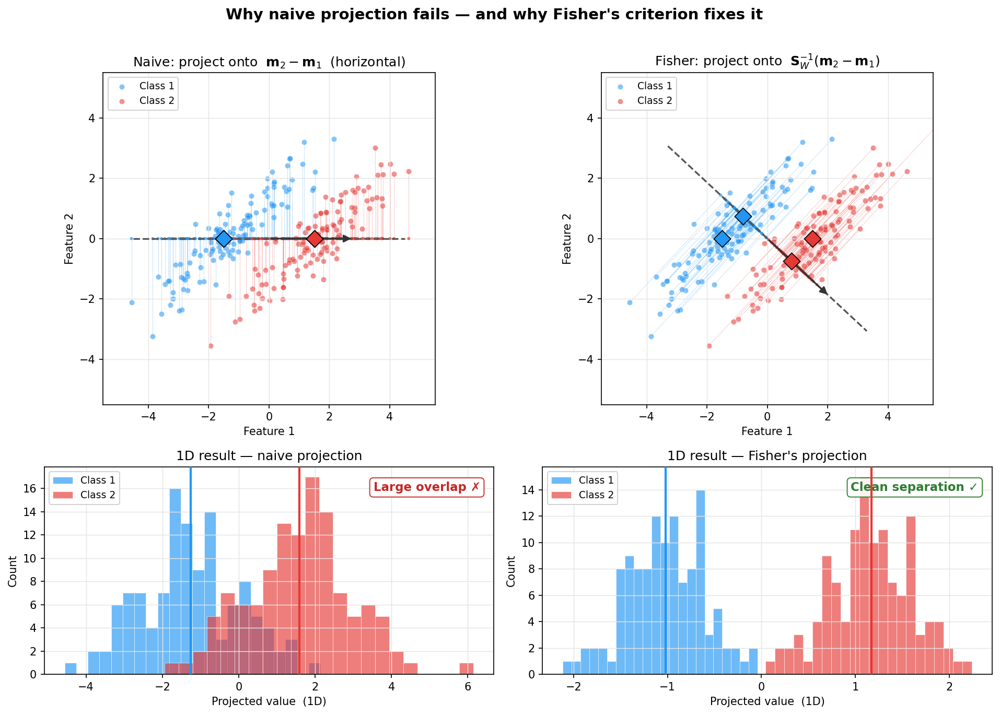
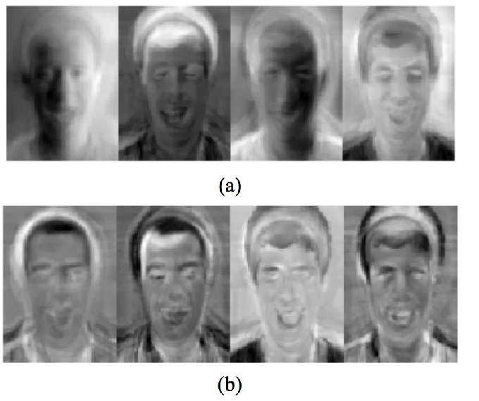
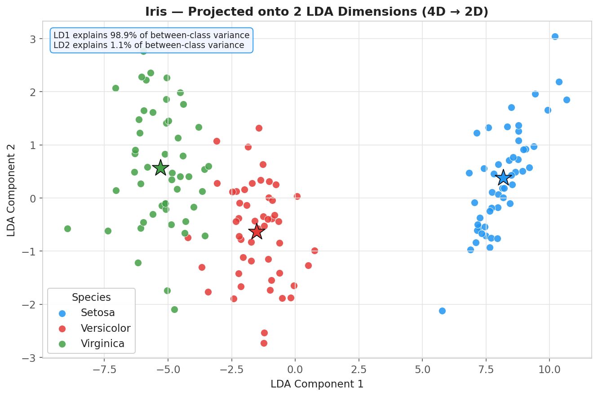
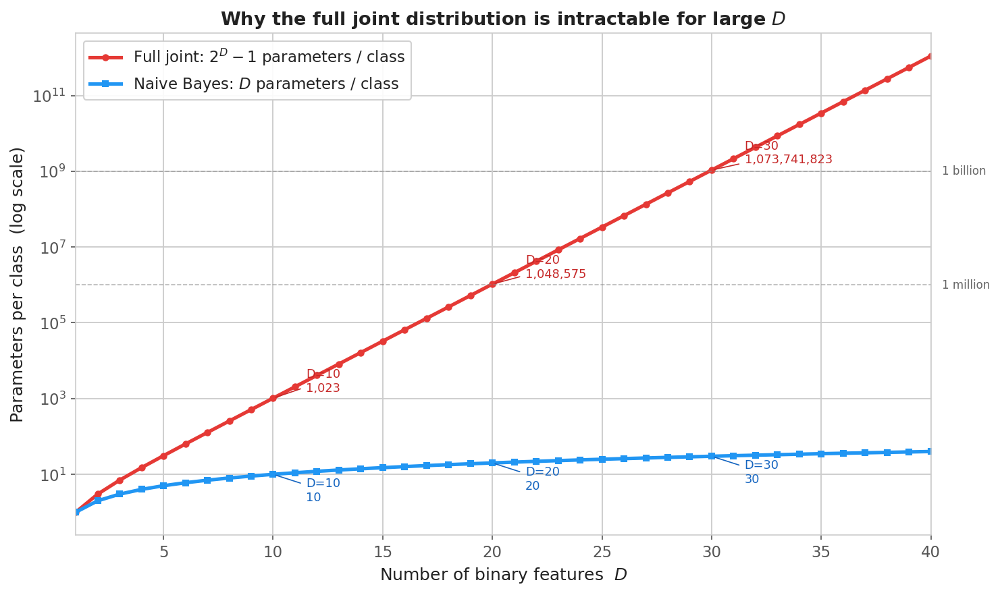
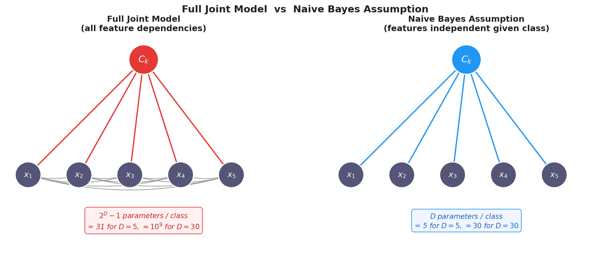
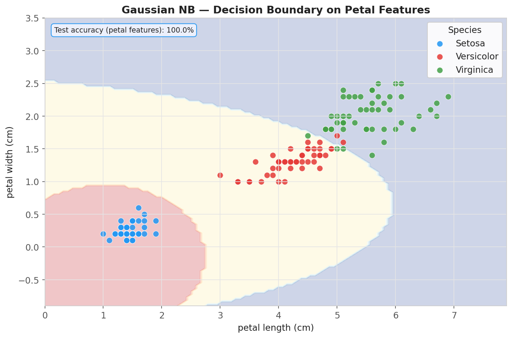

# YZM2011

## Introduction to Machine Learning

### Week 9: LDA and Naive Bayes

**Instructor:** Ekrem Çetinkaya
**Date:** 21.04.2026

---

# Midterm Grades Are Out

### Average: 67

### Maximum: 87

### Average Points per Question

- Q1: 6,9 / 10
- Q2: 8,1 / 10
- Q3: 10,6 / 15
- Q4: 15,8 / 20
- Q5: 10,6 / 15
- Q6: 14,8 / 30

---

<!-- _footer: "" -->
<!-- _header: "" -->
<!-- _paginate: false -->
<style scoped>
p {text-align: center; font-size: 24px; font-style: italic}
</style>



---

<!-- _footer: "" -->
<!-- _header: "" -->
<!-- _paginate: false -->

<style scoped>
p {text-align: center; font-size: 24px; font-style: italic}
</style>



---

# Halfway Done

So far we have covered the **discriminative** side of supervised learning:

- **Week 4:** Linear regression - predict a continuous output directly
- **Week 5:** Logistic regression - learn a linear decision boundary directly
- **Week 6:** Regularization - prevent overfitting
- **Week 7:** Decision trees - non-linear, non-parametric classifiers

Today we switch perspective entirely.

Instead of learning the boundary directly, we ask: _what does each class look like?_ Then we use **Bayes' theorem** to classify. This is the **generative** approach.

As Vapnik famously put it: _"To recognize spoken English, you don't need to learn to speak English."_ Discriminative models follow that principle.

Today we ignore it on purpose and we'll see exactly when that turns out to be the right call.

---

# Today's Agenda

<div class="two-columns">
<div class="column">

## Linear Discriminant Analysis

- Generative vs discriminative models
- Fisher's linear discriminant
- Scatter matrices: $\mathbf{S}_W$ and $\mathbf{S}_B$
- Bayes' theorem → sigmoid → softmax
- Probabilistic interpretation (Gaussian LDA)
- Why quadratic terms cancel
- MLE parameter estimation
- QDA: when covariances differ
- Small sample size & regularized LDA
- Multi-class LDA: projecting to $K{-}1$ dimensions
- LDA vs PCA

</div>
<div class="column">

## Naive Bayes

- Parameter count: $O(2^D)$ vs $O(D)$
- The conditional independence assumption
- NB is a linear classifier
- Gaussian NB for continuous features
- Multinomial NB for count/text data
- Bernoulli NB for binary features
- Laplace smoothing
- Exponential family unification
- Generative vs discriminative: training size
- Final model comparison on Iris

</div>
</div>

---

# Running Example - Iris Dataset

Every concept today will be demonstrated on the same dataset so you can see each method on identical data.

The **Iris dataset** is the classical classification benchmark: 150 flowers from 3 species (_setosa_, _versicolor_, _virginica_), each described by 4 measurements (sepal length, sepal width, petal length, petal width).

```python
from sklearn.datasets import load_iris
from sklearn.model_selection import train_test_split

iris = load_iris()
X, y = iris.data, iris.target
feature_names = iris.feature_names
class_names   = iris.target_names   # ['setosa', 'versicolor', 'virginica']

X_train, X_test, y_train, y_test = train_test_split(
    X, y, test_size=0.3, random_state=42
)
print(f"Training: {X_train.shape}, Test: {X_test.shape}")
# Training: (105, 4), Test: (45, 4)
```

---

# Generative vs Discriminative Models

A **discriminative model** (logistic regression, SVM) learns the conditional distribution $p(C_k | \mathbf{x})$ directly - it draws a boundary between classes without caring what the data within each class looks like.

A **generative model** (LDA, Naive Bayes, GMM) takes the longer route:

1. Model how each class _generates_ its data: $p(\mathbf{x} | C_k)$
2. Estimate the class prior: $p(C_k)$
3. Apply Bayes' theorem to get the posterior: $p(C_k | \mathbf{x}) \propto p(\mathbf{x} | C_k) \, p(C_k)$

**Why bother with the longer route?**

- Generative models can _synthesize new data_ because they model the data distribution
- They tend to converge faster with small training sets (fewer effective parameters once the class density is specified)
- They let you ask natural questions like "given what class $k$ looks like, how likely is this new point?"
- They degrade gracefully when a feature is missing

The tradeoff: if the assumed density form is wrong, the discriminative model will usually win on large datasets.

---

# Fisher's Linear Discriminant — The Core Idea

LDA frames classification as a **dimensionality reduction problem**: instead of drawing a boundary directly in the original $D$-dimensional space, we first find a single direction $\mathbf{w}$, project every training point onto it, and then classify the resulting 1D values by a threshold.

$$y = \mathbf{w}^T \mathbf{x}$$

The projection collapses the entire feature vector into one scalar. Classification is then trivial which is just comparing $y$ to a learned cutoff. The challenge is entirely in choosing $\mathbf{w}$ wisely.

**The naive answer:** point $\mathbf{w}$ toward the difference of class means, $\mathbf{m}_2 - \mathbf{m}_1$. This maximises how far apart the two projected means are, which seems like exactly what we want for separation.

**The problem:** a large gap between projected means is only useful if each class's own distribution is also narrow after projection. If $\mathbf{w}$ happens to align with a direction where both classes are spread out, the two distributions will smear across the 1D axis and overlap, even if the classes were perfectly separable in the original space.

Fisher's key insight is that we must simultaneously **maximise separation** and **minimise within-class spread**, not just one or the other.

---

# Naive vs Fisher - Why the Direction Matters



Both panels show the **same two classes** with the same correlated covariance. The dashed line is the projection direction; connectors show where each point lands on it.

**Top-left (naive projection):** The direction $\mathbf{m}_2 - \mathbf{m}_1$ is horizontal. Because both classes are elongated diagonally, projecting horizontally cuts right through the long axis of both clouds. Each class spreads widely and the two 1D distributions end up heavily overlapping.

**Top-right (Fisher's projection):** Fisher's direction tilts to cut _across_ the elongation rather than through it. Each class now casts a compact shadow on the axis, and the two shadows land in distinct, well-separated regions (bottom-right). A single threshold separates them cleanly.

The two classes are **just as separable** in both panels as the data did not change. Only the choice of projection direction changed.

---

# Fisher's Criterion

Fisher formalised the trade-off as a single ratio to maximise:

$$J(\mathbf{w}) = \frac{(m_2 - m_1)^2}{s_1^2 + s_2^2}$$

where $m_k = \mathbf{w}^T \mathbf{m}_k$ is the projected class mean and $s_k^2 = \sum_{n \in C_k}(y_n - m_k)^2$ is the projected within-class scatter. The numerator measures how far apart the projected means are; the denominator measures how much each class spreads around its own mean after projection.

A large $J$ means wide separation _and_ compact classes, perfect for seperation. The naive approach maximises only the numerator; Fisher's criterion controls both.

**Optimising $J$ with respect to $\mathbf{w}$** leads to a clean closed-form solution:

$$\mathbf{w} \propto \mathbf{S}_W^{-1}(\mathbf{m}_2 - \mathbf{m}_1)$$

This is known as **Fisher's linear discriminant**. The matrix $\mathbf{S}_W^{-1}$ acts as a corrective transformation: it stretches the mean-difference direction to account for how much each class spreads in each dimension. Where the classes are tightly clustered, the correction amplifies the separation; where they are noisy and spread out, it down-weights that direction.

---

# Fisher's Discriminant = Least Squares

Fisher's discriminant direction can be obtained by solving a **least-squares regression problem** with a special target encoding.

Encode the targets as:
$$t_n = \begin{cases} N/N_1 & \text{if } \mathbf{x}_n \in C_1 \\ -N/N_2 & \text{if } \mathbf{x}_n \in C_2 \end{cases}$$

Minimizing the standard sum-of-squares error $E = \frac{1}{2}\sum_n (y_n - t_n)^2 = \frac{1}{2}\sum_n (\mathbf{w}^T\mathbf{x}_n + w_0 - t_n)^2$ leads to the normal equations:

$$\left(\mathbf{S}_W + \frac{N_1 N_2}{N}\mathbf{S}_B\right)\mathbf{w} = N(\mathbf{m}_1 - \mathbf{m}_2)$$

Since $\mathbf{S}_B \mathbf{w}$ is parallel to $(\mathbf{m}_2 - \mathbf{m}_1)$, this reduces to:

$$\mathbf{w} \propto \mathbf{S}_W^{-1}(\mathbf{m}_2 - \mathbf{m}_1)$$

**The same direction as Fisher's criterion.** Three derivations - Fisher's criterion, least-squares with special targets, and the Gaussian generative model - all converge to the same linear boundary.

---

# Two-Class LDA - Step by Step

```python
import numpy as np

def fisher_lda_two_class(X, y):
    """Compute Fisher's linear discriminant for two classes (labels 0 and 1)."""
    X0, X1 = X[y == 0], X[y == 1]
    m0, m1 = X0.mean(axis=0), X1.mean(axis=0)

    # Within-class scatter matrices
    S0 = (X0 - m0).T @ (X0 - m0)
    S1 = (X1 - m1).T @ (X1 - m1)
    S_W = S0 + S1

    # Fisher's direction: solve S_W w = (m1 - m0)
    w = np.linalg.solve(S_W, m1 - m0)
    w /= np.linalg.norm(w)   # normalize to unit length
    return w, m0, m1

# Use setosa (0) vs versicolor (1) for the two-class demo
mask = (y_train == 0) | (y_train == 1)
w, m0, m1 = fisher_lda_two_class(X_train[mask], y_train[mask])

proj = X_train[mask] @ w
print(f"Projection direction: {w.round(3)}")
print(f"Projected mean (setosa):    {(X_train[y_train==0] @ w).mean():.3f}")
print(f"Projected mean (versicolor):{(X_train[y_train==1] @ w).mean():.3f}")
```

---

# Applying LDA with scikit-learn

```python
from sklearn.discriminant_analysis import LinearDiscriminantAnalysis
from sklearn.metrics import accuracy_score

# Two-class: setosa vs versicolor
mask_train = (y_train <= 1)
mask_test  = (y_test  <= 1)

lda2 = LinearDiscriminantAnalysis()
lda2.fit(X_train[mask_train], y_train[mask_train])

acc = accuracy_score(y_test[mask_test], lda2.predict(X_test[mask_test]))
print(f"LDA two-class accuracy: {acc:.2%}")  # typically ~100% for setosa vs versicolor

# Full three-class
lda = LinearDiscriminantAnalysis()
lda.fit(X_train, y_train)
print(f"LDA three-class accuracy: {accuracy_score(y_test, lda.predict(X_test)):.2%}")
```

For the two-class case, LDA projects to 1D and classifies by thresholding. For the three-class Iris problem, it projects to 2D ($K{-}1 = 2$) and assigns each test point to the nearest projected class mean.

---

# Classification with LDA

After projecting all examples onto $\mathbf{w}$, classification in the 1D space is straightforward: pick a threshold $y_0$ and assign class based on which side the projected point falls.

**Choosing $y_0$:**

- **Midpoint of projected means:** $y_0 = \frac{1}{2}(m_1 + m_2)$ - simple and works when classes have equal size and variance
- **Optimal Gaussian threshold:** accounts for class priors and within-class variances; derived from the posterior probability being $\frac{1}{2}$
- **Cross-validation:** treat $y_0$ as a hyperparameter and select it by validation performance

The decision rule then becomes:

$$\hat{C} = \begin{cases} C_1 & \text{if } \mathbf{w}^T \mathbf{x} < y_0 \\ C_2 & \text{if } \mathbf{w}^T \mathbf{x} \geq y_0 \end{cases}$$

This is still a **linear** classifier in the original feature space - the decision boundary is the hyperplane $\mathbf{w}^T \mathbf{x} = y_0$. LDA's projection step is really a way of deriving the right linear boundary from distributional assumptions rather than from a discriminative loss.

---

# Where Does the Sigmoid Come From?

We used logistic regression by directly assuming $p(C_1|\mathbf{x}) = \sigma(\mathbf{w}^T\mathbf{x} + w_0)$. That choice was motivated empirically but there is a deeper reason the sigmoid appears everywhere in classification.

The logistic sigmoid is a direct algebraic consequence of Bayes' theorem. For any two-class problem, define the **log-odds** the log-ratio of the unnormalised class posteriors:

$$a = \ln \frac{p(\mathbf{x}|C_1)\,p(C_1)}{p(\mathbf{x}|C_2)\,p(C_2)}$$

Expanding the normalised posterior and rearranging gives:

$$p(C_1|\mathbf{x}) = \frac{p(\mathbf{x}|C_1)p(C_1)}{p(\mathbf{x}|C_1)p(C_1) + p(\mathbf{x}|C_2)p(C_2)} = \frac{1}{1+e^{-a}} = \sigma(a)$$

The sigmoid is not a modelling choice, it is a mathematical identity that holds for every two-class generative model regardless of what distribution we assume for $p(\mathbf{x}|C_k)$. All the modelling goes into determining the form of $a$:

- Gaussian class-conditionals with **shared** covariance → $a$ is linear in $\mathbf{x}$ → **LDA**
- Gaussian with **per-class** covariances → $a$ is quadratic in $\mathbf{x}$ → **QDA**
- Bernoulli Naive Bayes → $a$ is also linear in $\mathbf{x}$ → same boundary shape as logistic regression

---

# Softmax for $K$ Classes

The two-class result generalises. For $K$ classes, Bayes' theorem gives each class a score $a_k = \ln p(\mathbf{x}|C_k) + \ln p(C_k)$, the log of its unnormalised posterior and the normalised posterior is:

$$p(C_k|\mathbf{x}) = \frac{p(\mathbf{x}|C_k)\,p(C_k)}{\displaystyle\sum_{j=1}^K p(\mathbf{x}|C_j)\,p(C_j)} = \frac{e^{a_k}}{\displaystyle\sum_{j=1}^K e^{a_j}} = \text{softmax}(a_1, \ldots, a_K)_k$$

Just as the sigmoid emerged from Bayes' theorem for two classes, the softmax emerges for $K$ classes.

In logistic regression we _assumed_ the softmax form and learned its weights by minimising cross-entropy. Here, in LDA, the same softmax form is _derived_ from Gaussian class-conditional densities: the assumption lies in choosing $p(\mathbf{x}|C_k)$, and the softmax is a consequence.

Both paths arrive at the same prediction function, but obtain its parameters differently:

- **Generative (LDA):** weights are computed analytically from estimated class means and shared covariance
- **Discriminative (Logistic Regression):** weights are found by gradient descent on the conditional log-likelihood

---

# Gaussian Class-Conditionals to The LDA Parameters

We now specialise to the assumption that each class generates data from a Gaussian with a class-specific mean $\boldsymbol{\mu}_k$ and a **shared covariance** $\boldsymbol{\Sigma}$ common to all classes:

$$p(\mathbf{x} | C_k) = \mathcal{N}(\mathbf{x} \mid \boldsymbol{\mu}_k, \boldsymbol{\Sigma})$$

Substituting into the log-odds and expanding both Gaussian densities, the quadratic term $-\frac{1}{2}\mathbf{x}^T\boldsymbol{\Sigma}^{-1}\mathbf{x}$ appears identically in both log-densities and cancels out. What remains is linear in $\mathbf{x}$:

$$a = \underbrace{(\boldsymbol{\mu}_1 - \boldsymbol{\mu}_2)^T\boldsymbol{\Sigma}^{-1}}_{\mathbf{w}^T}\mathbf{x} \;+\; \underbrace{-\tfrac{1}{2}\boldsymbol{\mu}_1^T\boldsymbol{\Sigma}^{-1}\boldsymbol{\mu}_1 + \tfrac{1}{2}\boldsymbol{\mu}_2^T\boldsymbol{\Sigma}^{-1}\boldsymbol{\mu}_2 + \ln\frac{p(C_1)}{p(C_2)}}_{w_0}$$

The posterior is $p(C_1|\mathbf{x}) = \sigma(\mathbf{w}^T\mathbf{x} + w_0)$, where $\mathbf{w} = \boldsymbol{\Sigma}^{-1}(\boldsymbol{\mu}_1 - \boldsymbol{\mu}_2)$ encodes the covariance-weighted direction between class means, and $w_0$ accounts for the prior class probabilities and the squared Mahalanobis distances of each class mean from the origin.

**The convergence of three derivations:** Fisher's geometric criterion gives $\mathbf{w} \propto \mathbf{S}_W^{-1}(\mathbf{m}_2 - \mathbf{m}_1)$. Least-squares with a special target encoding gives the same direction. The Gaussian generative model gives $\mathbf{w} = \boldsymbol{\Sigma}^{-1}(\boldsymbol{\mu}_1 - \boldsymbol{\mu}_2)$ — identical in direction when $\boldsymbol{\Sigma} \approx \mathbf{S}_W/N$. Three entirely different starting points, one answer.

---

# K-Class LDA - Why the Boundary Stays Linear

Gaussian generative model with shared $\boldsymbol{\Sigma}$ assigns each class its own linear discriminant score:

$$a_k(\mathbf{x}) = \mathbf{w}_k^T\mathbf{x} + w_{k0}$$

where $\mathbf{w}_k = \boldsymbol{\Sigma}^{-1}\boldsymbol{\mu}_k$ is the covariance-whitened class mean, and $w_{k0} = -\frac{1}{2}\boldsymbol{\mu}_k^T\boldsymbol{\Sigma}^{-1}\boldsymbol{\mu}_k + \ln p(C_k)$ accumulates the class-mean self-similarity and the log-prior.

Classification assigns the input to the class with the highest score, and the softmax over all scores gives calibrated posterior probabilities.

**Why does the boundary stay linear?** The Gaussian log-density of class $k$ contains the term $-\frac{1}{2}\mathbf{x}^T\boldsymbol{\Sigma}^{-1}\mathbf{x}$, which is quadratic in $\mathbf{x}$. Because $\boldsymbol{\Sigma}$ is shared across all classes, this quadratic term is _identical_ in every $a_k$.

When we find the boundary between class $k$ and class $j$ by solving $a_k(\mathbf{x}) = a_j(\mathbf{x})$, the quadratic terms cancel exactly and only linear and constant terms survive. The boundary is therefore a hyperplane, a linear equation in $\mathbf{x}$.

This cancellation is precisely what the shared-covariance assumption buys us. If each class had its own $\boldsymbol{\Sigma}_k$, the quadratic terms would differ and would not cancel, leaving a quadratic equation in $\mathbf{x}$, the curved boundary of **QDA**.

---

# MLE Parameter Estimation for LDA

Since we've assumed a generative model, the parameters have intuitive closed-form maximum likelihood estimates and they do not require gradient descent.

The joint likelihood over all training examples factorizes into three independent estimation problems:

**Prior probability** (class fraction in training data):
$$\hat{\pi}_k = \hat{p}(C_k) = \frac{N_k}{N}$$

**Class means** (sample mean per class):
$$\hat{\boldsymbol{\mu}}_k = \frac{1}{N_k} \sum_{n \in C_k} \mathbf{x}_n$$

**Shared covariance** (pooled within-class covariance):
$$\hat{\boldsymbol{\Sigma}} = \frac{1}{N-K}\sum_{k=1}^{K} \sum_{n \in C_k} (\mathbf{x}_n - \hat{\boldsymbol{\mu}}_k)(\mathbf{x}_n - \hat{\boldsymbol{\mu}}_k)^T = \sum_{k=1}^{K}\frac{N_k - 1}{N-K}\hat{\boldsymbol{\Sigma}}_k$$

This is the **pooled covariance**: a weighted average of per-class covariances.

It uses all $N$ training examples to estimate a single $D\times D$ matrix.

---

# QDA - Quadratic Discriminant Analysis

The shared-covariance assumption gives us a clean linear boundary. But, what if that assumption is wrong? If each class genuinely has a different covariance, we should let each class have its own:

$$p(\mathbf{x} | C_k) = \mathcal{N}(\mathbf{x} \mid \boldsymbol{\mu}_k, \boldsymbol{\Sigma}_k)$$

Now the quadratic terms in $\mathbf{x}$ no longer cancel when we compare $a_k$ to $a_j$. The log-posterior ratio becomes a quadratic function of $\mathbf{x}$, giving a **curved decision boundary** a.k.a. Quadratic Discriminant Analysis (QDA).

The log-posterior for each class is:
$$a_k(\mathbf{x}) = -\frac{1}{2}\ln|\boldsymbol{\Sigma}_k| - \frac{1}{2}(\mathbf{x}-\boldsymbol{\mu}_k)^T\boldsymbol{\Sigma}_k^{-1}(\mathbf{x}-\boldsymbol{\mu}_k) + \ln p(C_k)$$

| Property              | LDA                             | QDA                                    |
| --------------------- | ------------------------------- | -------------------------------------- |
| Covariance assumption | Shared $\boldsymbol{\Sigma}$    | Per-class $\boldsymbol{\Sigma}_k$      |
| Decision boundary     | Linear hyperplane               | Quadratic surface                      |
| Parameters            | $K \cdot D + \frac{D(D+1)}{2}$  | $K \cdot D + K \cdot \frac{D(D+1)}{2}$ |
| Bias-variance         | Lower variance, possibly biased | More flexible, needs more data         |

---

# LDA vs QDA in Practice

```python
from sklearn.discriminant_analysis import (
    LinearDiscriminantAnalysis, QuadraticDiscriminantAnalysis
)

lda = LinearDiscriminantAnalysis()
qda = QuadraticDiscriminantAnalysis()

lda.fit(X_train, y_train)
qda.fit(X_train, y_train)

print(f"LDA accuracy: {accuracy_score(y_test, lda.predict(X_test)):.2%}")   # ~97.8%
print(f"QDA accuracy: {accuracy_score(y_test, qda.predict(X_test)):.2%}")   # ~97.8% on Iris
```

On Iris both models perform similarly because the three classes have reasonably similar covariance structures and the shared-covariance assumption of LDA is approximately satisfied.

**Rule of thumb:** start with LDA. Switch to QDA if:

- Class-specific scatter plots show clearly different shapes
- You have roughly $D^2$ examples per class or more (for Iris: $4^2 = 16$ per class - easily satisfied; for $D=100$ you need $\sim 10{,}000$ per class)
- LDA's accuracy is noticeably lower on a held-out validation set

---

# Small Sample Size Problem in LDA



LDA requires inverting $\mathbf{S}_W$, a $D \times D$ matrix. When the number of training examples $N$ is smaller than the number of features $D$, then $\mathbf{S}_W$ is **rank-deficient** (singular) and cannot be inverted.

**Why this happens:** $\mathbf{S}_W$ is a sum of $N$ rank-1 outer products. If $N < D$, the matrix can have at most rank $N < D$, leaving a null space.

---

# Small Sample Size Problem in LDA


**Solutions:**

1. **PCA pre-processing:** First reduce $D$ to $M < N$ with PCA, then apply LDA on the $M$-dimensional representation. This is the Eigenfaces to Fisherfaces pipeline in face recognition. (a = eigenface, b = fisherface)

2. **Regularized LDA (RDA):** Replace $\mathbf{S}_W$ with a regularized version:
   $$\mathbf{S}_W^{\text{reg}} = (1-\gamma)\,\mathbf{S}_W + \gamma\,\mathbf{I}$$
   where $\gamma \in [0,1]$ is chosen by cross-validation. At $\gamma=0$ we get standard LDA; at $\gamma=1$ we project onto the class-mean difference direction (ignoring within-class structure entirely).

3. **Pseudoinverse:** Replace $\mathbf{S}_W^{-1}$ with the Moore-Penrose pseudoinverse $\mathbf{S}_W^+$.

```python
lda_reg = LinearDiscriminantAnalysis(solver='lsqr', shrinkage='auto')  # Ledoit-Wolf
```

---

# Multi-Class LDA - K > 2 Classes

For $K$ classes, the two-class projection $y = \mathbf{w}^T \mathbf{x}$ (1D) generalizes to a matrix projection:

$$\mathbf{y} = \mathbf{W}^T \mathbf{x}$$

where $\mathbf{W}$ is $D \times D'$ and $D' \leq K - 1$. The rank constraint comes directly from $\mathbf{S}_B$: with $K$ class means, they span at most a $(K-1)$-dimensional subspace, so $\mathbf{S}_B$ has rank at most $K-1$ and only $K-1$ nonzero eigenvalues.

**Iris has 3 classes so we can project to 2 dimensions.**. We go from 4 features to exactly 2, and the result is directly plottable.

The scatter matrices generalize naturally:

$$\mathbf{S}_W = \sum_{k=1}^{K} \sum_{n \in C_k} (\mathbf{x}_n - \mathbf{m}_k)(\mathbf{x}_n - \mathbf{m}_k)^T$$

$$\mathbf{S}_B = \sum_{k=1}^{K} N_k (\mathbf{m}_k - \mathbf{m})(\mathbf{m}_k - \mathbf{m})^T, \quad \mathbf{m} = \frac{1}{N}\sum_n \mathbf{x}_n \text{ (global mean)}$$

The identity $\mathbf{S}_T = \mathbf{S}_W + \mathbf{S}_B$ still holds, where $\mathbf{S}_T$ is the total scatter matrix.

---

# Multi-Class LDA - Solution and Iris Example

The multi-class Fisher criterion maximizes the trace of the ratio in the projected space:
$$J(\mathbf{W}) = \text{tr}\!\left[\left(\mathbf{W}^T \mathbf{S}_W \mathbf{W}\right)^{-1}\left(\mathbf{W}^T \mathbf{S}_B \mathbf{W}\right)\right]$$

The optimal projection matrix $\mathbf{W}$ consists of the $D'$ eigenvectors of $\mathbf{S}_W^{-1} \mathbf{S}_B$ with the largest eigenvalues (generalized eigenvalue problem: $\mathbf{S}_B \mathbf{w} = \lambda \mathbf{S}_W \mathbf{w}$).

```python
# LDA projects Iris from 4D to 2D (K-1 = 2)
lda = LinearDiscriminantAnalysis(n_components=2)
lda.fit(X_train, y_train)

X_train_lda = lda.transform(X_train)
X_test_lda  = lda.transform(X_test)

print(f"Original shape:  {X_train.shape}")      # (105, 4)
print(f"Projected shape: {X_train_lda.shape}")  # (105, 2)

print(f"Explained variance ratios: {lda.explained_variance_ratio_.round(3)}")
# Typically: [0.991 0.009] -- first LDA component captures ~99% of between-class variance
```

Nearly all the _class-discriminative_ information in the 4D Iris space lives in a single direction. The second LDA component captures just the residual separation. This is why LDA is powerful as a **supervised** dimensionality reduction tool.

---

# Iris Projected onto 2 LDA Dimensions



---

# LDA vs PCA - Two Philosophies of Projection

Both LDA and PCA project data to a lower-dimensional space, but they optimize for completely different things.

**PCA (unsupervised)** maximizes the total variance of the projected data:
$$J_{\text{PCA}} = \mathbf{w}^T \mathbf{S}_T \mathbf{w}$$

It has no notion of class labels. Directions with large total spread are preserved; directions with small spread are discarded, regardless of whether that spread is useful for classification.

**LDA (supervised)** maximizes the ratio of between-class to within-class scatter:
$$J_{\text{LDA}} = \frac{\mathbf{w}^T \mathbf{S}_B \mathbf{w}}{\mathbf{w}^T \mathbf{S}_W \mathbf{w}}$$

It uses class labels to define what "useful" means. Directions where classes overlap heavily get penalized; directions where classes are compact and far apart get rewarded.

**Practical implication on Iris:** PCA might choose a direction that captures a lot of total variance but blends the _versicolor_ and _virginica_ classes if their shared spread happens to dominate. LDA will always keep classes as separated as possible, even if the absolute variance along that direction is modest.

---

# Naive Bayes - The Parameter Problem

LDA models the class-conditional density $p(\mathbf{x}|C_k)$ as a Gaussian, which requires estimating a $D \times D$ covariance matrix. For $D = 10{,}000$ features that is 50 million parameters for a single matrix.

The situation is even worse if we try to learn the full joint distribution $p(\mathbf{x}|C_k)$ directly for discrete features. With $D$ binary features, every possible combination of feature values is a distinct outcome, and the joint distribution requires $2^D - 1$ free parameters per class:

| Features $D$ | Full joint parameters | Naive Bayes parameters |
| ------------ | --------------------- | ---------------------- |
| 10           | 1,023                 | 10                     |
| 20           | 1,048,575             | 20                     |
| 30           | $\approx$ 1 billion   | 30                     |
| 10,000       | astronomical          | 10,000                 |

The gap grows exponentially. No dataset on Earth can estimate a billion parameters reliably, yet 30-feature problems are routine in practice.

---

# The Parameter Explosion



---

# The Independence Assumption

Naive Bayes resolves the parameter explosion with a single structural assumption: **features are conditionally independent given the class label**.



---

# The Independence Assumption

In a full joint model, knowing one feature tells you something about every other feature.

In Naive Bayes, once you know the class, the features carry no information about each other:

$$p(\mathbf{x}|C_k) = \prod_{i=1}^{D} p(x_i|C_k)$$

The joint density factorises into $D$ independent 1D densities. Instead of one giant $2^D$-entry table per class, you estimate $D$ separate univariate distributions, one per feature. The parameter count drops from exponential to linear in $D$.

The word _naive_ acknowledges that this assumption is almost always false in real data (e.g., words in an email are not independent of each other, and the measurements of a patient's organs are correlated). Yet Naive Bayes consistently outperforms this pessimistic assessment. Two reasons:

1. **Rankings are enough for classification.** You need to know which class has the highest posterior, not the exact probability values. A misspecified model that produces the wrong probabilities can still get the ranking right.

2. **The independence assumption is a massive regulariser.** Dropping from $O(2^D)$ to $O(D)$ parameters is the same as imposing an extremely strong prior. The resulting estimator has high bias but very low variance.

---

# The Naive Bayes Formula

Given the independence assumption, applying Bayes' theorem gives:

$$p(C_k | \mathbf{x}) \propto p(C_k) \prod_{i=1}^{D} p(x_i | C_k)$$

The class prior $p(C_k)$ is estimated as the fraction of training examples in class $k$. Each factor $p(x_i|C_k)$ is estimated independently from that feature's values in class $k$, no joint estimation, no covariance required.

In practice we work in log space to avoid underflow — multiplying hundreds of small probabilities quickly produces zeros in floating point:

$$\hat{C} = \arg\max_k \left[ \underbrace{\log p(C_k)}_{\text{log prior}} + \sum_{i=1}^{D} \underbrace{\log p(x_i | C_k)}_{\text{log feature likelihood}} \right]$$

---

# The Naive Bayes Formula

The three standard variants differ only in the distributional family assumed for $p(x_i|C_k)$:

| Variant            | Feature type                   | Distribution                                      |
| ------------------ | ------------------------------ | ------------------------------------------------- |
| **Gaussian NB**    | Continuous measurements        | Normal $\mathcal{N}(\mu_{ik}, \sigma_{ik}^2)$     |
| **Multinomial NB** | Counts (e.g. word frequencies) | Multinomial with word probabilities $\theta_{ki}$ |
| **Bernoulli NB**   | Binary presence/absence        | Bernoulli with probability $p_{ki}$               |

The prior, the log-sum prediction rule, and MLE parameter estimation are identical across all three — only the likelihood term changes.

---

# Naive Bayes is a Linear Classifier

It may seem that Naive Bayes, being based on a product of distributions rather than a single hyperplane, would produce a non-linear boundary. In fact the opposite is true: for standard feature distributions, the Naive Bayes decision boundary is linear in the feature space.

To see why, consider binary features with Bernoulli class-conditionals $p(x_i|C_k) = \mu_{ki}^{x_i}(1-\mu_{ki})^{1-x_i}$. The log-posterior for class $k$ expands to:

$$a_k(\mathbf{x}) = \ln p(C_k) + \sum_{i=1}^{D}\ln(1-\mu_{ki}) + \sum_{i=1}^D x_i \underbrace{\ln\frac{\mu_{ki}}{1-\mu_{ki}}}_{\text{weight for feature } i}$$

The last sum is a weighted linear combination of the features $x_i$, exactly the form $\mathbf{w}_k^T\mathbf{x} + w_{k0}$. The decision boundary $a_k(\mathbf{x}) = a_j(\mathbf{x})$ is therefore a hyperplane, the same boundary type as LDA and logistic regression.

This linearity holds across all standard Naive Bayes variants: Gaussian NB (where the per-feature Gaussians cancel to leave a linear form), Multinomial NB, and Bernoulli NB. **Naive Bayes is a linear classifier in every standard form**.

What distinguishes it from LDA and logistic regression is not the boundary shape but how the boundary parameters are estimated: from independent per-feature distributions rather than from a shared covariance or a discriminative loss.

---

# Gaussian Naive Bayes

For continuous features, the natural choice for $p(x_i|C_k)$ is a Gaussian. One per feature per class, fitted independently.

Each feature is modelled as if it were the only feature in the world:

$$p(x_i | C_k) = \mathcal{N}(x_i \mid \mu_{ik}, \sigma_{ik}^2)$$

The parameters $\mu_{ik}$ (class-specific mean of feature $i$) and $\sigma_{ik}^2$ (class-specific variance of feature $i$) are estimated by the sample mean and variance of each feature within each class. A single pass over the training data, no matrix inversion needed:

$$\hat{\mu}_{ik} = \frac{1}{N_k} \sum_{n \in C_k} x_{ni}, \qquad \hat{\sigma}_{ik}^2 = \frac{1}{N_k} \sum_{n \in C_k} (x_{ni} - \hat{\mu}_{ik})^2$$

**Relationship to LDA:** Gaussian NB is LDA with a diagonal covariance. LDA models feature correlations through its shared $\boldsymbol{\Sigma}$; Gaussian NB assumes those correlations are zero, replacing $\boldsymbol{\Sigma}$ with $K$ separate diagonal matrices. The parameter savings are dramatic at scale:

| Model               | Parameters                                |
| ------------------- | ----------------------------------------- |
| Full covariance LDA | $K \cdot D + D(D+1)/2$                    |
| Gaussian NB         | $2 \times D \times K$ (means + variances) |

For $D = 1000$, $K = 3$: LDA needs ~500,000 parameters; Gaussian NB needs 6,000.

---

# Gaussian NB on Iris

After fitting, the model has learned three independent Gaussian distributions per feature. We can inspect these parameters directly to understand what the classifier has captured about each species.

```python
from sklearn.naive_bayes import GaussianNB

gnb = GaussianNB()
gnb.fit(X_train, y_train)

print(f"Accuracy: {accuracy_score(y_test, gnb.predict(X_test)):.2%}")  # ~95.6%

# gnb.theta_  → class means  (K × D)
# gnb.var_    → class variances (K × D)  — independent per feature
print("\nClass means per feature:")
for k, name in enumerate(class_names):
    print(f"  {name}: {gnb.theta_[k].round(2)}")

print("\nClass variances per feature:")
for k, name in enumerate(class_names):
    print(f"  {name}: {gnb.var_[k].round(3)}")

# Posterior probabilities — how confident is the model?
proba = gnb.predict_proba(X_test[:4])
print("\nPosterior probabilities for first 4 test examples:")
for i, (row, true_class) in enumerate(zip(proba, y_test[:4])):
    print(f"  Ex {i}: {row.round(3)}  →  pred={class_names[row.argmax()]},  true={class_names[true_class]}")
```

---

# Gaussian NB Decision Boundary



---

# Gaussian NB Decision Boundary

The figure uses only the two petal features to make the boundary visible in 2D. Each coloured region is where the model assigns the majority class; the shaded boundaries show where two class posteriors are equal.

**Why axis-aligned regions?** The independence assumption forces each class to be modelled as an axis-aligned ellipse. It's covariance matrix has no off-diagonal entries, so the class density contours align with the coordinate axes. Boundaries between two such ellipses are curves where two axis-aligned Gaussians have equal density, which are generally smooth but not necessarily straight lines.

**Setosa (left region) is trivially separated.** Setosa petals are distinctively small; both their length and width fall well below the other two species. The independence assumption causes no harm here because the two petal features happen to give consistent, independent evidence in the same direction.

**The versicolor/virginica boundary is where the independence assumption costs us.** In reality, petal length and petal width are strongly correlated within each species — knowing one tells you a lot about the other. A full covariance model (LDA) captures this and draws a tighter, better-calibrated boundary. Gaussian NB ignores the correlation and compensates with a slightly different boundary position, which is why it achieves ~96% accuracy compared to LDA's ~98% on this dataset.

---

# Gaussian NB vs LDA

The 2% accuracy gap between Gaussian NB and LDA on Iris is not noise, it is a direct consequence of a structural difference in what each model is allowed to represent. Petal length and petal width are strongly correlated within each species; they measure related aspects of the same flower.

LDA's shared covariance matrix captures this correlation and exploits it when drawing the boundary.

Gaussian NB's diagonal assumption discards the correlation entirely, treating the two measurements as if they were independent after conditioning on the class.

- **Gaussian NB** accepts high model bias (the independence assumption is wrong) in exchange for very low variance as it estimates $2 \times D \times K$ parameters rather than a full $D \times D$ matrix, so each parameter estimate is more stable.
- **LDA** has lower bias (it models the actual correlation structure) but uses more parameters, each estimated from the same training data.

With 105 training examples and only 4 features, Iris has far more data than LDA needs to estimate its 22 parameters reliably, so LDA wins.

Flip the ratio: with 10,000 vocabulary features and a few hundred training emails, Gaussian NB would win easily because LDA's covariance matrix would be singular and unestimable.

---

# Multinomial Naive Bayes

Gaussian NB models each feature as a real-valued measurement. But many classification problems produce **counts** like the number of times a word appears in a document, the frequency of a particular token in a sequence. Counts are non-negative integers, and fitting a Gaussian to them is a mismatch that often hurts performance.

The model for count data is the multinomial distribution. Each class $k$ is characterised by a probability $\theta_{ki}$ for each feature $i$, representing how likely that feature is to appear in a document of class $k$. These probabilities must sum to one across all features: $\sum_i \theta_{ki} = 1$.

The class-conditional likelihood for a document $\mathbf{x}$ (a vector of feature counts) is:

$$p(\mathbf{x} | C_k) = \frac{\left(\sum_i x_i\right)!}{\prod_i x_i!} \prod_{i=1}^{D} \theta_{ki}^{x_i}$$

Estimating the $\theta_{ki}$ parameters is intuitive: count how many times feature $i$ appears across all class-$k$ training documents, and divide by the total count of all features in class $k$:

$$\hat{\theta}_{ki} = \frac{N_{ki}}{\sum_j N_{kj}}$$

where $N_{ki}$ is the total count of feature $i$ in all class-$k$ documents. No matrix operations, no covariance estimation just counting. The log-likelihood becomes a weighted sum of log word probabilities, making classification extremely fast even with vocabularies of 100,000 words.

---

# Laplace Smoothing


The MLE estimator $\hat{\theta}_{ki} = N_{ki}/\sum_j N_{kj}$ has a critical failure mode: if a word never appeared in any class-$k$ training document, then $\hat{\theta}_{ki} = 0$. The moment that word appears in a test document, the entire product $\prod_i \theta_{ki}^{x_i}$ becomes zero and the model becomes completely certain that the document cannot belong to class $k$, regardless of every other word in the document.

A single unseen word silences all other evidence.

---

# Laplace Smoothing


This is the **zero-frequency problem**, and it is solved by **Laplace smoothing** (add-$\alpha$ smoothing): add a small pseudocount $\alpha$ to every feature count before normalising.

$$\hat{\theta}_{ki} = \frac{N_{ki} + \alpha}{N_k + \alpha D}$$

The numerator adds $\alpha$ to every feature count, so no feature ever receives a zero probability. The denominator adjusts the normalisation accordingly. With $\alpha = 1$ (the default, known as Laplace smoothing), every unseen feature gets a small but nonzero probability and the model stays uncertain rather than collapsing to certainty.

The choice of $\alpha$ is a regularisation decision. Setting $\alpha = 1$ gives equal pseudocounts to all features; setting $\alpha \to 0$ recovers the MLE and re-introduces the zero-frequency problem; smaller values give softer regularisation.

From a Bayesian perspective, adding $\alpha$ pseudocounts is equivalent to placing a symmetric Dirichlet prior $\text{Dir}(\alpha, \ldots, \alpha)$ over the word probabilities, a prior that says "_before seeing any data, I believe all words are roughly equally likely_."

---

# Bernoulli Naive Bayes

When features indicate _presence_ rather than _frequency_ (does the email contain "free"? yes/no), we use Bernoulli NB:

$$p(\mathbf{x} | C_k) = \prod_{i=1}^{D} p_{ki}^{x_i} (1 - p_{ki})^{1-x_i}$$

where $p_{ki}$ is the probability that feature $i$ is present (1) in class $k$, and $x_i \in \{0, 1\}$.

**The critical difference from Multinomial NB:** Bernoulli NB explicitly models _absent_ features. The term $(1 - p_{ki})^{1-x_i}$ contributes to the likelihood even when $x_i = 0$. If a spam-associated word is missing, that is mild evidence against spam.

| Property         | Multinomial NB         | Bernoulli NB              |
| ---------------- | ---------------------- | ------------------------- |
| Input            | Word counts            | Word presence (0/1)       |
| Absent words     | Ignored                | Contribute $(1 - p_{ki})$ |
| Long documents   | Rewards frequent words | Neutral                   |
| Vocabulary match | Uses raw counts        | Uses binary indicators    |

For short messages (tweets, subject lines), Bernoulli NB often matches or beats Multinomial NB because frequency information is sparse and absence is meaningful. For longer documents with rich frequency information, Multinomial NB tends to win.

---

# Bernoulli NB

Suppose our spam filter has learned these word probabilities:

| Word      | $p_{spam}$ | $p_{ham}$ |
| --------- | ---------- | --------- |
| "free"    | 0.80       | 0.10      |
| "meeting" | 0.10       | 0.70      |
| "urgent"  | 0.60       | 0.30      |

For email: _"free urgent"_ → `free=1, meeting=0, urgent=1`

$$\log p(\text{spam}|\mathbf{x}) \propto \log(0.5) + \log(0.80) + \log(1-0.10) + \log(0.60)$$
$$= -0.693 + (-0.223) + (-0.105) + (-0.511) = -1.532$$

$$\log p(\text{ham}|\mathbf{x}) \propto \log(0.5) + \log(0.10) + \log(1-0.70) + \log(0.30)$$
$$= -0.693 + (-2.303) + (-1.204) + (-1.204) = -5.404$$

Since $-1.532 > -5.404$, we predict **spam** - and notice that `meeting=0` (an absent ham-word) contributed to pushing the ham score lower, which Multinomial NB would have ignored entirely.

---

# Exponential Family Unification

**Any** class-conditional density from the exponential family with a shared dispersion parameter leads to a linear decision boundary.

The exponential family covers Gaussian (continuous), Bernoulli (binary), Multinomial (count), Poisson (event counts), and many others. If each class density has the form $p(\mathbf{x}|C_k) \propto h(\mathbf{x})\exp(\boldsymbol{\lambda}_k^T\boldsymbol{\phi}(\mathbf{x}))$ with shared scale, then the log-posterior ratio becomes:

$$a(\mathbf{x}) = (\boldsymbol{\lambda}_1 - \boldsymbol{\lambda}_2)^T\boldsymbol{\phi}(\mathbf{x}) + \text{const}$$

**This is linear in the sufficient statistics $\boldsymbol{\phi}(\mathbf{x})$.**

The unifying picture:

| Density                                      | Features   | Boundary        |
| -------------------------------------------- | ---------- | --------------- |
| Gaussian (shared $\boldsymbol{\Sigma}$)      | Continuous | Linear (LDA)    |
| Bernoulli (Naive Bayes)                      | Binary     | Linear          |
| Multinomial (Naive Bayes)                    | Counts     | Linear          |
| Gaussian (per-class $\boldsymbol{\Sigma}_k$) | Continuous | Quadratic (QDA) |

The sigmoid/softmax is not a modeling choice, it is a mathematical consequence of Bayes' theorem applied to exponential family densities.

---

# Generative vs Discriminative - Training Size Effect

Generative models (LDA, Naive Bayes) converge to their asymptotic error rate faster than discriminative models (logistic regression), but discriminative models achieve a _lower_ asymptotic error rate when the generative model's distributional assumption is violated.

```python
from sklearn.linear_model import LogisticRegression
import numpy as np

train_sizes = [10, 20, 50, 100, 150, 300, 500, 1000]
lda_scores, lr_scores = [], []

# Generate data with slight non-Gaussian structure
np.random.seed(42)
X_big, y_big = make_classification(n_samples=5000, n_features=10, random_state=42)
X_te, y_te = X_big[:1000], y_big[:1000]
X_pool, y_pool = X_big[1000:], y_big[1000:]

for n in train_sizes:
    idx = np.random.choice(len(X_pool), n, replace=False)
    Xtr, ytr = X_pool[idx], y_pool[idx]
    lda_scores.append(LinearDiscriminantAnalysis().fit(Xtr,ytr).score(X_te,y_te))
    lr_scores.append(LogisticRegression(max_iter=1000).fit(Xtr,ytr).score(X_te,y_te))
```

With small $n$: LDA often wins because its distributional assumptions substitute for missing data. With large $n$: logistic regression catches up and may surpass LDA if the Gaussian assumption is violated.

---

# Model Comparison on Iris

Let's put all three approaches head to head on the same Iris test set.

```python
from sklearn.linear_model import LogisticRegression
from sklearn.discriminant_analysis import (
    LinearDiscriminantAnalysis, QuadraticDiscriminantAnalysis
)
from sklearn.naive_bayes import GaussianNB
from sklearn.preprocessing import StandardScaler

scaler = StandardScaler()
X_train_s = scaler.fit_transform(X_train)
X_test_s  = scaler.transform(X_test)

models = {
    "Logistic Regression (Week 5)": LogisticRegression(max_iter=1000),
    "LDA":                          LinearDiscriminantAnalysis(),
    "QDA":                          QuadraticDiscriminantAnalysis(),
    "Gaussian NB":                  GaussianNB(),
}

print("=== MODEL COMPARISON ON IRIS ===")
for name, model in models.items():
    Xtr = X_train_s if "Logistic" in name else X_train
    Xte = X_test_s  if "Logistic" in name else X_test
    model.fit(Xtr, y_train)
    acc = accuracy_score(y_test, model.predict(Xte))
    print(f"{name:38}: {acc:.2%}")
```

---

# Model Comparison - Results and Insights

```
=== MODEL COMPARISON ON IRIS ===
Logistic Regression (Week 5)          : 97.78%
LDA                                   : 97.78%
QDA                                   : 97.78%
Gaussian NB                           : 95.56%
```

All four models perform similarly as Iris is a well-structured dataset and all these models are appropriate for it. The key lessons are in _why_ they differ and when they would diverge:

- **Logistic Regression** (discriminative) and **LDA** (generative) reach the same accuracy here. When the Gaussian class-conditional assumption is correct, they produce the same linear boundary; the difference is that LDA estimates fewer "effective" parameters by anchoring the form of the distribution.
- **QDA** matches LDA on Iris because class covariances are similar. On a dataset with clearly different class shapes, QDA would pull ahead.
- **Gaussian NB** is slightly lower because Iris features are correlated (petal length and width are nearly redundant). Once features become genuinely independent, or when $D \gg N$, Naive Bayes is the method to reach for first.

---

# When to Use Which

**Use LDA when:**

- Features are continuous and approximately Gaussian
- You need interpretability: the projection directions $\mathbf{w}$ explain which feature combinations discriminate the classes
- You also want dimensionality reduction (supervised, unlike PCA)
- Training data is limited relative to $D$ - LDA's shared covariance is a strong regularizer
- Class covariances are approximately equal (otherwise consider QDA or RDA)

**Use Naive Bayes when:**

- Features are high-dimensional (text, images with binary descriptors)
- Training data is small - very low variance thanks to minimal parameterization
- You need fast online updates (each new example just updates per-feature counts)
- Features are approximately independent given the class
- Real-time prediction is required (prediction is $O(K \cdot D)$, very fast)

**Use Logistic Regression instead when:**

- You want calibrated probabilities and LDA's Gaussian assumption is clearly violated
- The dataset is large enough to benefit from the discriminative approach

---

# Summary: LDA

LDA is a generative classifier built on Gaussian class-conditional densities with a shared covariance.

- **Fisher's criterion:** maximize between-class scatter relative to within-class scatter - $J(\mathbf{w}) = \frac{\mathbf{w}^T \mathbf{S}_B \mathbf{w}}{\mathbf{w}^T \mathbf{S}_W \mathbf{w}}$
- **Two-class solution:** $\mathbf{w} \propto \mathbf{S}_W^{-1}(\mathbf{m}_2 - \mathbf{m}_1)$ - the same direction emerges from Fisher's criterion, least-squares with special targets, and the Gaussian generative model (three derivations, one answer)
- **Why sigmoid/softmax:** Bayes' theorem applied to generative models naturally produces $\sigma(a)$ (two-class) and softmax$(a_1,\ldots,a_K)$ (multi-class)
- **Why linear boundary:** shared $\boldsymbol{\Sigma}$ means the quadratic terms in $\mathbf{x}$ are identical for all classes and cancel when comparing posteriors
- **Multi-class:** project to at most $K-1$ dimensions; columns of $\mathbf{W}$ are eigenvectors of $\mathbf{S}_W^{-1}\mathbf{S}_B$
- **QDA:** relax the shared-covariance assumption → quadratic decision boundary, more parameters
- **Small sample size:** use PCA pre-processing or regularized LDA when $N < D$
- **vs PCA:** both project data, but LDA uses class labels to maximize separation while PCA maximizes total variance

---

# Summary: Naive Bayes

Naive Bayes is a generative classifier that assumes features are conditionally independent given the class.

- **Core assumption:** $p(\mathbf{x} | C_k) = \prod_{i=1}^D p(x_i | C_k)$ - reduces parameter count from $O(2^D)$ to $O(D)$
- **Classification:** $\hat{C} = \arg\max_k \left[\log p(C_k) + \sum_i \log p(x_i | C_k)\right]$
- **NB is a linear classifier:** for binary, Gaussian, and multinomial features, the discriminant function $a_k(\mathbf{x})$ is linear in $\mathbf{x}$ - same boundary type as LDA, different derivation
- **Gaussian NB:** each feature is Gaussian per class; equivalent to LDA with diagonal covariance; good for continuous features
- **Multinomial NB:** each feature is a count; used heavily for text; parameters are word probabilities per class
- **Bernoulli NB:** each feature is binary; absent features contribute evidence; better for short texts where absence is informative
- **Laplace smoothing:** add $\alpha$ pseudocounts to prevent zero-probability unseen features - equivalent to a Dirichlet prior
- **Exponential family:** any exponential family density with shared dispersion parameter gives a linear boundary via Bayes' theorem
- **Why it works:** the independence assumption is almost always wrong, but the classification _ranking_ is often still correct and the low parameter count provides strong implicit regularization

---

<!-- _header: "" -->
<!-- _footer: "" -->
<!-- _paginate: false -->

# Thank You!

## Contact Information

- **Email:** ekrem.cetinkaya@yildiz.edu.tr
- **Office Hours:** Wednesday 13:30-15:30 - Room C-120
- **Book a slot before coming:** [Booking Link](https://calendar.app.google/fog6DPBGJH2QpHVw8)
- **Course Repository:** [GitHub](https://github.com/ekremcet/yzm2011-introduction-to-machine-learning)
